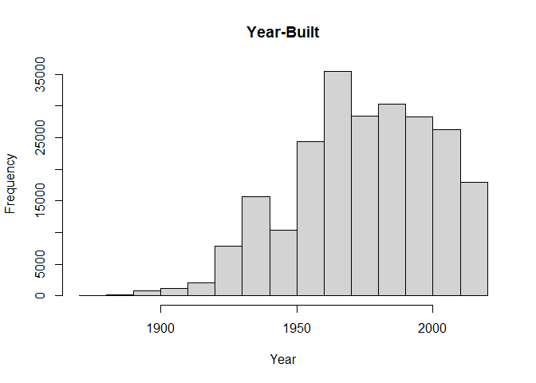
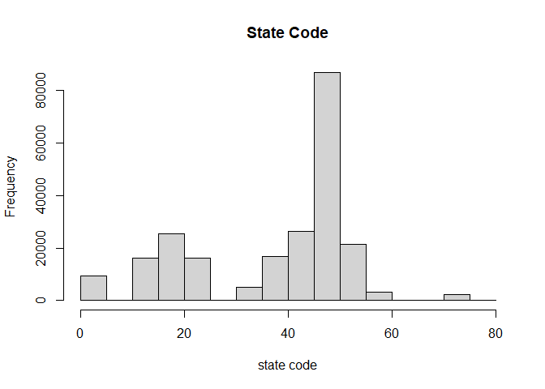
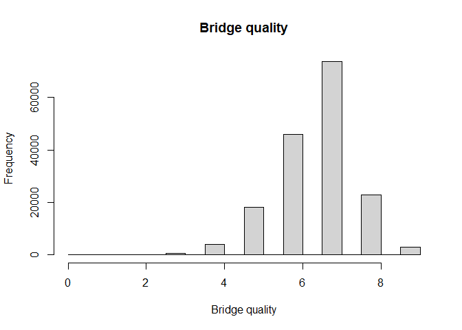

HW2
================
Huailin Tang
9/23/2021

## Problem 1

``` r
library(dplyr)
```

    ## 
    ## Attaching package: 'dplyr'

    ## The following objects are masked from 'package:stats':
    ## 
    ##     filter, lag

    ## The following objects are masked from 'package:base':
    ## 
    ##     intersect, setdiff, setequal, union

``` r
bridges_data <- read.csv("bridges_data.txt", header=TRUE, sep=",", dec=".")

bridge <- bridges_data[c("STRUCTURE_NUMBER_008", "STATE_CODE_001", "YEAR_BUILT_027", "DECK_COND_058", "SUPERSTRUCTURE_COND_059", "CHANNEL_COND_061")]

bridge = bridge[bridge$YEAR_BUILT_027 > 1870, ]
hist(bridge$YEAR_BUILT_027, main="Year-Built", xlab="Year")
```

<!-- -->

``` r
hist(as.integer(bridge$STATE_CODE_001), main="State Code", xlab="state code")
```

<!-- -->

``` r
bridge = bridge[bridge$DECK_COND_058 != "N",]
hist(as.integer(bridge$DECK_COND_058), main="Bridge quality", xlab="Bridge quality")
```

<!-- -->

## Problem 2

``` r
require(rvest)
```

    ## Loading required package: rvest

``` r
site = read_html("https://guide.wisc.edu/faculty/")
text = html_text(html_nodes(site, "p"))
text = text[3:3791]
```
