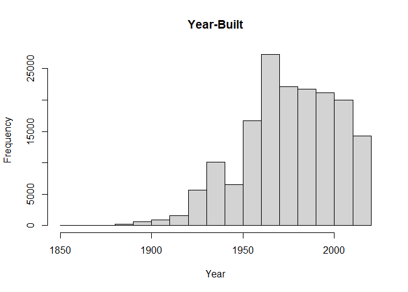

HW2
================
Huailin Tang
9/23/2021

## Problem 1

``` r
bridges_data <- read.csv("bridges_data.txt", header=TRUE, sep=",", dec=".")

bridge <- bridges_data[c("STRUCTURE_NUMBER_008", "STATE_CODE_001", "YEAR_BUILT_027", "DECK_COND_058", "SUPERSTRUCTURE_COND_059", "CHANNEL_COND_061")]

# remove NA
bridge <- bridge[complete.cases(bridge), ] 

# convert string value to int
bridge$STATE_CODE_001 <- as.integer(bridge$STATE_CODE_001)
bridge$DECK_COND_058 <- as.integer(bridge$DECK_COND_058)
bridge$SUPERSTRUCTURE_COND_059 <- as.integer(bridge$SUPERSTRUCTURE_COND_059)
bridge$CHANNEL_COND_061 <- as.integer(bridge$CHANNEL_COND_061)

# remove false input or outliers
bridge <- bridge[bridge$YEAR_BUILT_027 > 1850 & bridge$DECK_COND_058 != "N" & bridge$STATE_CODE_001 < 80 , ]  

# histogram
hist(bridge$YEAR_BUILT_027, main="Year-Built", xlab="Year")
```

<!-- -->

``` r
hist(bridge$STATE_CODE_001, main="State Code", xlab="state code")
```

<!-- -->

``` r
hist(bridge$DECK_COND_058, main="Deck quality", xlab="Deck quality")
```

<!-- -->

``` r
hist(bridge$SUPERSTRUCTURE_COND_059, main="Structure quality", xlab="Structure quality")
```

<!-- -->

``` r
hist(bridge$CHANNEL_COND_061, main="Channel quality", xlab="Channel quality")
```

<!-- -->

``` r
# scatterplot
plot(bridge$YEAR_BUILT_027, as.integer(bridge$DECK_COND_058), main="Deck quality vs. Year-Built",
   xlab="Year-Built ", ylab="Deck quality ", pch=19)
```

<!-- -->

## Problem 2

``` r
require(rvest)
```

    ## Loading required package: rvest

``` r
site = read_html("https://guide.wisc.edu/faculty/")
text = html_text(html_nodes(site, "p"))
text = text[3:3791]
print(text)
```

    ##    [1] "ABBOTT,DAVID H.ProfessorObstetrics & GynecologyPHD 1979 University of Edinburgh"                                
    ##    [2] "ABD-ELSAYED,ALAA AAssoc Professor (Chs)AnesthesiologyMD 2000 University of Assiut"                              
    ##    [3] "ABDUALLAH,FAISALProfessorArtPHD 2012 Royal College of Art"                                                      
    ##    [4] "ABRAHAM,OLUFUNMILOLAAssistant ProfessorPharmacyPHD 2013 Univ of Wisconsin-Madison"                              
    ##    [5] "ABRAMS,SAMANTHAAssoc LecturerInformation SchoolMA 2017 Univ of Wisconsin-Madison"                               
    ##    [6] "ABRAMSON,LYNProfessorPsychologyPHD 1978 University of Pennsylvania"                                             
    ##    [7] "ACKER,LINDSAYLecturerAccting & Info SysMACC 2005 Univ of Wisconsin-Madison"                                     
    ##    [8] "ACKERMAN,STEVENProfessorAtmospheric & Oceanic SciencesPHD 1987 Colorado State University"                       
    ##    [9] "ADAMCZYK,PETER GABRIELAssistant ProfessorMechanical EngineeringPHD 2008 Univ of Michigan at Ann Arbor"          
    ##   [10] "ADAMES-CORRALIZA,ANGELAssistant ProfessorAtmospheric & Oceanic SciencesPHD 2018 University of Washington"       
    ##   [11] "ADAMS,AERONClinical Asst ProfNursingDNP 2017 Univ of Wisconsin-Madison"                                         
    ##   [12] "ADAMS,MEGANAsst Faculty AssocInformation SchoolMA  University of South Florida"                                 
    ##   [13] "ADCOCK,SARAHAssistant ProfessorAnimal And Dairy SciencesPHD 2020 Univ of California Davis"                      
    ##   [14] "ADDINGTON,REBECCA LYNNSenior LecturerPsychologyPHD 1998 Univ of Wisconsin-Madison"                              
    ##   [15] "ADDO,FENABAAssociate ProfessorSchool Of Human EcologyPHD 2012 Ithaca College"                                   
    ##   [16] "ADELL,SANDRAProfessorAfro-American StudiesPHD 1989 Univ of Wisconsin-Madison"                                   
    ##   [17] "AFFI,ABOUDClinical Adjunct ProfessorVolunteer StaffMD 1989 University Of Aleppo"                                
    ##   [18] "AGARWAL,PRIYANKAAssistant ProfessorCurriculum And InstructionPHD 2019 Univ of California Irvine"                
    ##   [19] "AGASIE,ROBERTInstrmt Innovator/InsEngineering Research CenterMS 1997 Univ of Wisconsin-Madison"                 
    ##   [20] "AGOKE,ADEOLAAsst Faculty AssocAfrican Cultural StudiesPHD 2019 Univ of Wisconsin-Madison"                       
    ##   [21] "AHLQUIST,PAUL GERALDProfessorPlant PathologyPHD 1981 Univ of Wisconsin-Madison"                                 
    ##   [22] "AHMAD,JAMEELSenior LecturerSouth Asian Sum Lang Instit"                                                         
    ##   [23] "AHMAD,NIHALProfessorDermatologyPHD 1989 University of Lucknow"                                                  
    ##   [24] "AHMED,AZAM SYEDAssoc Professor (Chs)Neurological SurgeryMD 2003 Loyola University of Chicago"                   
    ##   [25] "AHN,JAERINAssoc Faculty AssocAsian Languages & CulturesMA 2013 Ewha Womans University"                          
    ##   [26] "AHN,SUEProfessorCivil & Environmental EngrPHD  Univ of California Berkeley"                                     
    ##   [27] "AHN,YEOHYUNAssistant ProfessorArtMFA 2007 Maryland Institute Colg Of Art"                                       
    ##   [28] "AHRENS,SARAH ELIZABETHClinical Assoc ProfMedicineMD 2002 U of California San Francisco"                         
    ##   [29] "AI,ALBERT LVisiting Asst ProfMathematicsPHD 2019 Univ of California Berkeley"                                   
    ##   [30] "AIKEN,JEFFREY PAdjunct InstructorLaw SchoolJD 1972 Marquette University"                                        
    ##   [31] "AIZAWA,NAOKIAssistant ProfessorEconomicsPHD 2014 University of Pennsylvania"                                    
    ##   [32] "AJMANI,VIVEKAssoc Faculty AssocEngr Professional DevelopmentPHD  "                                              
    ##   [33] "AKELLA,ADITYAProfessorComputer SciencesPHD 2005 Carnegie-Mellon University"                                     
    ##   [34] "AL-ADRA,DAVIDAssistant ProfessorSurgeryPHD 2012 University of Alberta"                                          
    ##   [35] "AL-SUBU,AWNI MAsst Professor (Chs)PediatricsMD 2005 Al-Quds University"                                         
    ##   [36] "ALAGOZ,OGUZHANProfessorIndustrial & Systems EngrPHD 2004 University of Pittsburgh"                              
    ##   [37] "ALARID,ELAINEProfessorOncologyPHD 1991 Univ of California Berkeley"                                             
    ##   [38] "ALATOUT,SAMER NAssociate ProfessorCommunity & Environ SociologyPHD 2002 Cornell University"                     
    ##   [39] "ALBARGHOUTHI,AWSAssistant ProfessorComputer SciencesPHD 2014 University of Toronto"                             
    ##   [40] "ALBERS,CRAIGAssociate ProfessorEducational PsychologyPHD 2002 Arizona State University"                         
    ##   [41] "ALBERT,LAURAProfessorIndustrial & Systems EngrPHD 2006 Univ of IL at Urbana-Champaign"                          
    ##   [42] "ALBERTINI,MARK RICHARDProfessorMedicineMD 1984 University of Vermont"                                           
    ##   [43] "ALCALA GALAN,MERCEDESAssociate ProfessorSpanish And PortuguesePHD 1994 Univ Complutense de Madrid"              
    ##   [44] "ALDAG,RAYProfessorManagement & Human ResourcesPHD 1974 Michigan State University"                               
    ##   [45] "ALDER,SIMEON DAVIDFaculty AssociateEconomicsPHD 2009 Univ of California Los Angeles"                            
    ##   [46] "ALESSANDRINO,KAYLAClinical InstructorMedical Sciences"                                                          
    ##   [47] "ALEXANDER,ANDREW LAFAYETTEProfessorMedical PhysicsPHD 1994 University of Arizona"                               
    ##   [48] "ALEXANDER,ANGELAFaculty AssociateEnglishMA 2007 University Of Central Florida"                                  
    ##   [49] "ALEXANDER,LACEY ANNClinical Asst ProfNursingPHD 2018 Univ of Wisconsin-Madison"                                 
    ##   [50] "ALI,SHANTEL DAsst Prof Of Mil SciMilitary ScienceBA 2002 "                                                      
    ##   [51] "ALI,SYED EKHTEYARSenior LecturerSouth Asian Sum Lang InstitPHD  "                                               
    ##   [52] "ALIBALI,MARTHA W.ProfessorPsychologyPHD 1994 University of Chicago"                                             
    ##   [53] "ALISCH,REID SAssistant ProfessorNeurological SurgeryPHD 2003 Univ of Michigan at Ann Arbor"                     
    ##   [54] "ALLEN,CAITILYNProfessorPlant PathologyPHD 1987 VA Polytechnic Inst & State U"                                   
    ##   [55] "ALLEN,DAVIDProfessorPediatricsMD 1980 Duke University"                                                          
    ##   [56] "ALLEN,HEATHERAssociate ProfessorFrench And ItalianPHD 2002 Emory University"                                    
    ##   [57] "ALLEN,MATTProfessorEngineering PhysicsPHD 2005 Georgia Inst of Technology"                                      
    ##   [58] "ALLEWAERT,MONIQUEAssociate ProfessorEnglishPHD 2006 Duke University"                                            
    ##   [59] "ALLIE,MARK CFaculty AssociateElectrical & Computer EngrMS 1983 Univ of Wisconsin-Madison"                       
    ##   [60] "ALONSO,ARACELIDis LecturerGender And Women StudiesPHD 2002 Univ of Wisconsin-Madison"                           
    ##   [61] "ALTINO,SOH-HYUN PARKAssociate ProfessorMead Witter School Of MusicPHD 2002 Cleveland Institute Of Music"        
    ##   [62] "ALTSCHAFL,BETHFaculty AssociateAcademic AffairsPHD 2006 Univ of Wisconsin-Madison"                              
    ##   [63] "ALTSECH,MOSESLecturerMarketingPHD 1996 Pennsylvania State University"                                           
    ##   [64] "ALTWIES,JOYFaculty AssociateEngr Professional DevelopmentPHD 2013 Univ of Wisconsin-Madison"                    
    ##   [65] "ALVAREZ,ELIZABETH EClinical Asst ProfMedical SciencesDVM 2003 Michigan State University"                        
    ##   [66] "ALVAREZ,SAYLINSenior LecturerSpanish And PortuguesePHD  Univ of Wisconsin-Madison"                              
    ##   [67] "AMADOR-NOGUEZ,DANIELAssociate ProfessorBacteriologyPHD 2007 Baylor University"                                  
    ##   [68] "AMANN,KURTAssociate ProfessorIntegrative BiologyPHD 1999 Univ of Wisconsin-Madison"                             
    ##   [69] "AMASINO,RICHARD M.ProfessorBiochemistryPHD 1982 Indiana University"                                             
    ##   [70] "AMATO,FELICE CATHERINELecturerArtPHD 2018 Univ of Wisconsin-Madison"                                            
    ##   [71] "AMINE,LAILAAssociate ProfessorEnglishPHD 2011 Indiana University"                                               
    ##   [72] "AMSBARY,PAULAdjunct Assoc ProfInformation SchoolMS 2007 Georgia Inst of Technology"                             
    ##   [73] "AN,PANDUANVisiting Asst ProfStatisticsPHD 2019 Ohio University"                                                 
    ##   [74] "AN,ZHE GIGIAssistant ProfessorRehab Psychology & Special EdPHD 2018 University of Kansas"                       
    ##   [75] "ANANTHARAMAN,KARTHIKAssistant ProfessorBacteriologyPHD 2014 Univ of Michigan at Ann Arbor"                      
    ##   [76] "ANCOS GARCIA,PABLOAssociate ProfessorSpanish And PortuguesePHD 2004 Univ of Wisconsin-Madison"                  
    ##   [77] "ANDERSEN,CLAUS EAssistant ProfessorGerman, Nordic & SlavicPHD 2015 University of Helsinki"                      
    ##   [78] "ANDERSON,DAVIDProfessorElectrical & Computer EngrPHD 1984 Univ of Wisconsin-Madison"                            
    ##   [79] "ANDERSON,DAVID FProfessorMathematicsPHD 2005 Duke University"                                                   
    ##   [80] "ANDERSON,KATHRYNLecturerCommunity & Environ SociologyPHD 2019 Univ of Wisconsin-Madison"                        
    ##   [81] "ANDERSON,LORIAssistant ProfessorNursingPHD 2006 Univ of Wisconsin-Madison"                                      
    ##   [82] "ANDERSON,MARKAssistant ProfessorMechanical EngineeringPHD 1998 Univ of Wisconsin-Madison"                       
    ##   [83] "ANDERSON,PETERSenior LecturerNutritional SciencesMS 1995 Univ of Wisconsin-Madison"                             
    ##   [84] "ANDERSON,RICHARD A.ProfessorAdministrationPHD 1982 Univ of Minnesota-Twin Cities"                               
    ##   [85] "ANDERSON,ROZALYNAssociate ProfessorMedicinePHD 1999 Univ of Dublin-Trinity College"                             
    ##   [86] "ANDES,DAVID R.ProfessorMedicineMD 1992 Univ of Missouri-Columbia"                                               
    ##   [87] "ANDREAE,SUSAN JAssistant ProfessorKinesiologyPHD 2015 Univ of Alabama at Birmingham"                            
    ##   [88] "ANDRESEN,CHRISTIAN G.Assistant ProfessorGeographyPHD 2014 University Of Texas At El Paso"                       
    ##   [89] "ANDREWS,JOSEPHAssistant ProfessorMechanical EngineeringPHD 2019 Duke University"                                
    ##   [90] "ANDREWS,LISA MAssoc Faculty AssocConsumer ScienceMBA 2004 Univ of Wisconsin-Madison"                            
    ##   [91] "ANDREWS,URIAssociate ProfessorMathematicsPHD 2010 Univ of California Berkeley"                                  
    ##   [92] "ANDRZEJEWSKI,ANNAProfessorArt HistoryPHD 2001 University of Delaware"                                           
    ##   [93] "ANE,CECILEProfessorBotanyPHD 2000 U de Toulouse II (Le Mirail)"                                                 
    ##   [94] "ANE,JEAN-MICHELProfessorBacteriologyPHD 2002 U de Toulouse II (Le Mirail)"                                      
    ##   [95] "ANEX,ROBERTProfessorBiological Systems EngineeringPHD 1995 Univ of California Davis"                            
    ##   [96] "ANGENENT,SIGURD B.ProfessorMathematicsPHD 1986 State Univ Of Leiden"                                            
    ##   [97] "ANGULO BRACHO,HERNAN LIZARDOClinical InstructorMedical SciencesDVM 1999 Univ Ncnl Autonoma de Mexico"           
    ##   [98] "ANGUS,JENNIFERProfessorSchool Of Human EcologyMFA 1991 Sch Of The Art Inst Of Chicago"                          
    ##   [99] "ANIBAS,CALLIAssoc Research SpecAgronomyMS 2020 Univ of Wisconsin-Madison"                                       
    ##  [100] "ANIBAS,MELISSAClinical Asst ProfNursingMSN 2007 Univ of Wisconsin-Eau Claire"                                   
    ##  [101] "ANJUM,UMARResearch SpecialistAsian StudiesM.PHIL  "                                                             
    ##  [102] "ANNA,ERIKAAsst Faculty AssocNutritional SciencesBS 2013 Univ of Wisconsin-Madison"                              
    ##  [103] "ANSARI,ASEEM ZProfessorBiochemistryPHD 1995 Northwestern University"                                            
    ##  [104] "ANTONY,KATHLEENAsst Professor (Chs)Obstetrics & GynecologyMD 2008 University Of Rochester"                      
    ##  [105] "ARCHAMBAULT,JOHNAssistant Dean/LEngineering Student DevelopmntMS 1996 Univ of Wisconsin-Green Bay"              
    ##  [106] "ARCHDEACON,THOMAS J.ProfessorHistoryPHD 1971 Columbia University"                                               
    ##  [107] "ARD,BJAssistant ProfessorLaw SchoolPHD 2017 Yale University"                                                    
    ##  [108] "AREFEVA,ALINAAssistant ProfessorReal Estate & Urgan Land EconPHD  Stanford University"                          
    ##  [109] "ARENDT,LISAAssistant ProfessorComparative BiosciencesPHD 2002 Univ of Wisconsin-Madison"                        
    ##  [110] "ARFA,SANDRAFaculty AssociateEnglishMA 1972 Univ of Wisconsin-Madison"                                           
    ##  [111] "ARINKIN,DIMAProfessorMathematicsPHD  Harvard University"                                                        
    ##  [112] "ARMSTRONG,GRANT WAssociate ProfessorSpanish And PortuguesePHD 2011 Georgetown University"                       
    ##  [113] "ARMSTRONG,JOSHUAAssociate ProfessorFrench And ItalianPHD 2013 University of Virginia"                           
    ##  [114] "ARNDT,KIMBERLY KEGELClinical Adjunct Asst ProfVolunteer StaffMD 2005 Univ of Wisconsin-Madison"                 
    ##  [115] "ARNOLD,MICHAELProfessorMaterials Science&EngineeringPHD 2006 Northwestern University"                           
    ##  [116] "ARNOLDY,COURTNEY JEANNEClinical InstructorSmall Animal IiiDPT 1994 Univ of Wisconsin-Madison"                   
    ##  [117] "ARORA,NEERAJProfessorMarketingPHD 1995 Ohio State University"                                                   
    ##  [118] "ARPACI-DUSSEAU,ANDREA C.ProfessorComputer SciencesPHD 1998 Univ of California Berkeley"                         
    ##  [119] "ARPACI-DUSSEAU,REMZI H.ProfessorComputer SciencesPHD 1998 Univ of California Berkeley"                          
    ##  [120] "ARRIAGA,FRANCISCOAssociate ProfessorSoil SciencePHD 2000 Univ of Wisconsin-Madison"                             
    ##  [121] "ARRIOLA APELO,SEBASTIAN IAssistant ProfessorAnimal And Dairy SciencesPHD 2013 VA Polytechnic Inst & State U"    
    ##  [122] "ARTHUR,EMILYAssociate ProfessorArtMFA 2000 Pennsylvania Acad Of Fine Arts"                                      
    ##  [123] "ASCHENBROICH,SOPHIE ANNClinical Asst ProfPathobiological SciencesPHD 2014 "                                     
    ##  [124] "ASEN,ROBERTProfessorCommunication ArtsPHD 1998 Northwestern University"                                         
    ##  [125] "ASHTON,LYDIA MAGDALENA TEJEDAAssistant ProfessorSchool Of Human EcologyPHD 2014 Univ of California Berkeley"    
    ##  [126] "ASHTON,RANDOLPHAssociate ProfessorBiomedical EngineeringPHD 2007 Rensselaer Polytechnic Inst"                   
    ##  [127] "ASIF,MUHAMMADLecturerAsian Languages & CulturesEDD 2015 University of Leeds"                                    
    ##  [128] "ASMUS,JENNIFER MProfessorEducational PsychologyPHD 1995 University of Iowa"                                     
    ##  [129] "ASSADI-PORTER,FARIBA MASOUMEHAssoc LecturerIntegrative BiologyPHD 1994 Univ of Wisconsin-Madison"               
    ##  [130] "ASTOR,BRAD CProfessorMedicinePHD 2000 Johns Hopkins University"                                                 
    ##  [131] "ASTRELLA,JULIEClinical Assoc ProfNursingMSN 2009 Edgewood College"                                              
    ##  [132] "ATAPATTU,SUMUDUDis Admin Prgm SpecLaw SchoolPHD 1995 University of Cambridge"                                   
    ##  [133] "ATTIE,ALAN DAVIDProfessorBiochemistryPHD 1980 Univ of California San Diego"                                     
    ##  [134] "ATUCHA,AMAYAAssistant ProfessorHorticulturePHD 2012 Cornell University"                                         
    ##  [135] "AUDHYA,ANJONProfessorBiomolecular ChemistryPHD 2002 Univ of California San Diego"                               
    ##  [136] "AUERBACH,EMILY KATEProfessorLiberal Arts & Applied StudiesPHD 1981 University of Washington"                    
    ##  [137] "AUGER,ANTHONYProfessorPsychologyPHD 1998 Univ of Massachusetts Amherst"                                         
    ##  [138] "AUGHENBAUGH,WILLIAMProfessor (Chs)DermatologyMD 1997 Medical College Of Wisconsin"                              
    ##  [139] "AULIK,NICOLE ANNClinical Asst ProfMadison MicrobiologyPHD 2010 Univ of Wisconsin-Madison"                       
    ##  [140] "AUNG,HTET HTETAssoc LecturerInformation SchoolMS 2003 Carnegie-Mellon University"                               
    ##  [141] "AUSDERAU,KARLAAssociate ProfessorKinesiologyPHD 2009 Univ of Southern California"                               
    ##  [142] "AUSTERWEIL,JOEAssistant ProfessorPsychologyPHD 2012 Univ of California Berkeley"                                
    ##  [143] "AVEY,GREGORYAssoc Professor (Chs)RadiologyMD 2005 University of Washington"                                     
    ##  [144] "AVRAMENKO,RICHARDProfessorPolitical SciencePHD 2004 Georgetown University"                                      
    ##  [145] "AYARI BEN HADJ KACEM,MOUNAAssoc Faculty AssocComputer SciencesPHD 2009 Uni Pierre&Marie Curie Paris"            
    ##  [146] "AYD,SHARON WAdjunct Assoc ProfPharmacyPHD  Univ of Illinois at Chicago"                                         
    ##  [147] "AZOCAR,SAMUEL ALEJANDROSenior LecturerEnglishPHD 2011 Univ of Wisconsin-Madison"                                
    ##  [148] "AZODI,JAHANAAsst Faculty AssocTheatre & DramaMFA 2014 University of Cincinnati"                                 
    ##  [149] "BABAL,JESSICAAsst Professor (Chs)PediatricsMD 2012 University of Cincinnati"                                    
    ##  [150] "BABAR,YASHAssistant ProfessorOperations & Information MgmtPHD 2020 Univ of Minnesota-Twin Cities"               
    ##  [151] "BABCOCK,SUEProfessorMaterials Science&EngineeringPHD 1987 Massachusetts Inst Of Tech"                           
    ##  [152] "BACH,ERICProfessorComputer SciencesPHD 1984 Univ of California Berkeley"                                        
    ##  [153] "BACH,JONATHAN F.Clinical Assoc ProfMedical SciencesDVM 2000 Univ Of Minnesota-St Paul"                          
    ##  [154] "BACH,TAIYA RENAEAsst Faculty AssocNutritional SciencesMPH 2008 Tulane University"                               
    ##  [155] "BACK,LARISSA EAssociate ProfessorAtmospheric & Oceanic SciencesPHD 2007 University of Washington"               
    ##  [156] "BAHIA,HUSSAIN U.ProfessorCivil & Environmental EngrPHD 1991 Pennsylvania State University"                      
    ##  [157] "BAI,YANGAssociate ProfessorPhysicsPHD  Yale University"                                                         
    ##  [158] "BAILEY,HANNAH EAssistant Dean/MAdmin:Student Academic AffairsMA 2013 Clg of William & Mary-Virginia"            
    ##  [159] "BAIR,JESSE JONASAdjunct InstructorLaw SchoolJD 2013 "                                                           
    ##  [160] "BAIRD,IANProfessorGeographyPHD 2008 University of British Columbia"                                             
    ##  [161] "BAKER,ANGIEClinical InstructorNursingMS 2009 Univ of Wisconsin-Madison"                                         
    ##  [162] "BAKER,BERNADETTEProfessorCurriculum And InstructionPHD 1997 Univ of Wisconsin-Madison"                          
    ##  [163] "BAKER,TRACYAssociate ProfessorComparative BiosciencesPHD 2001 Univ of Wisconsin-Madison"                        
    ##  [164] "BAKKEN,LORIHonorary Assoc/FellowCivil Society And Comm StudiesPHD 1998 Univ of Wisconsin-Madison"               
    ##  [165] "BAKSHI,VAISHALI PAssociate ProfessorPsychiatryPHD 1998 Univ of California San Diego"                            
    ##  [166] "BAL,AYDINProfessorRehab Psychology & Special EdPHD 2009 Arizona State University"                               
    ##  [167] "BALANTEKIN,A. B.ProfessorPhysicsPHD 1982 Yale University"                                                       
    ##  [168] "BALDACCHINO,JOHNProfessorArtPHD 1994 University of Warwick"                                                     
    ##  [169] "BALDO,BRIAN AAssociate ProfessorPsychiatryPHD 1998 Univ of California San Diego"                                
    ##  [170] "BALDRIDGE,BIANCA J.Associate ProfessorEducational Policy StudiesPHD 2012 Columbia University"                   
    ##  [171] "BALDRIDGE,ELIZABETH MLecturerCounseling PsychologyEDM 2016 Univ of Wisconsin-La Crosse"                         
    ##  [172] "BALDWIN,CODYFaculty AssociateFt Mba Program OfficeMBA 2013 "                                                    
    ##  [173] "BALLESTEROS CHAVEZ,JESUS AAssoc LecturerIntegrative BiologyPHD 2017 George Washington University"               
    ##  [174] "BALSTER,NICKProfessorSoil SciencePHD 1999 University of Idaho"                                                  
    ##  [175] "BANERJEE,MOUAssistant ProfessorHistoryPHD 2018 Harvard University"                                              
    ##  [176] "BANERJEE,SUMANProfessorComputer SciencesPHD 2003 Univ of MD-University College"                                 
    ##  [177] "BANKS,MATTHEW ISAACProfessorAnesthesiologyPHD 1992 Univ of Wisconsin-Madison"                                   
    ##  [178] "BARAK,PHILLIPProfessorSoil SciencePHD 1987 Hebrew University of Jerusalem"                                      
    ##  [179] "BARAK-CUNNINGHAM,JERIProfessorPlant PathologyPHD 2000 Univ of California Davis"                                 
    ##  [180] "BARBATO,ERIN MURPHYClinical Asst ProfLaw SchoolJD 2006 Marquette University"                                    
    ##  [181] "BARCELOS,CHRISAssistant ProfessorGender And Women StudiesPHD 2016 Univ of Massachusetts Amherst"                
    ##  [182] "BARCZI,STEVEProfessor (Chs)MedicineMD 1989 Univ of Illinois at Chicago"                                         
    ##  [183] "BARFORD,CAROL LSenior LecturerSustainability&Global EnvironPHD 1997 Harvard University"                         
    ##  [184] "BARFORD,PAUL RProfessorComputer SciencesPHD 2000 Boston University"                                             
    ##  [185] "BARGER,AMY JOSEPHINEProfessorAstronomyPHD 1997 University of Cambridge"                                         
    ##  [186] "BARGER,VERNONProfessorPhysicsPHD 1963 Pennsylvania State U-Hershey"                                             
    ##  [187] "BARHAM,BRADFORDProfessorAgricultural&Applied EconomicsPHD 1988 Stanford University"                             
    ##  [188] "BARICH,JOSEPHSenior LecturerEngr Professional DevelopmentJD  Boston College"                                    
    ##  [189] "BARLETT,CARLLecturerRisk & InsuranceJD 2009 Univ of Wisconsin-Madison"                                          
    ##  [190] "BARNARD,ERLINDis Faculty AssociateAsian Languages & CulturesPHD 2004 Leeds Metropolitan University"             
    ##  [191] "BARNARD,MARKLecturerFt Mba Program OfficePHD 2002 "                                                             
    ##  [192] "BARNES,JILLAssistant ProfessorKinesiologyPHD 2009 University of Texas at Austin"                                
    ##  [193] "BARNETT,SUSANNEAssoc Professor (Chs)PharmacyPHARMD 2004 Univ of Wisconsin-Madison"                              
    ##  [194] "BARRETT,BRUCE PATRICKProfessorFamily MedicinePHD 1992 Univ of Wisconsin-Madison"                                
    ##  [195] "BARRETT,KEVINAssoc LecturerBotanyPHD 2019 Univ of Wisconsin-Madison"                                            
    ##  [196] "BARRETT,PATRICK STEPHENAssoc Faculty AssocSociologyPHD 1997 Univ of Wisconsin-Madison"                          
    ##  [197] "BARRY,AMY QUANProfessorEnglishMFA 1997 Univ of Michigan at Ann Arbor"                                           
    ##  [198] "BARRY,LYNDAProfessorArtBA 1978 Evergreen State College"                                                         
    ##  [199] "BART,DAVID J.Associate ProfessorPlanning & Landscape ArchPHD 2003 Rutgers State Univ-Newark"                    
    ##  [200] "BARTA,CHERIFaculty AssociateChemistryPHD 2007 University of British Columbia"                                   
    ##  [201] "BARTFELD,JUDITHProfessorSchool Of Human EcologyPHD 1997 Univ of Wisconsin-Madison"                              
    ##  [202] "BARTH,MICHAELAssoc LecturerAccting & Info SysMACC 2020 Univ of Wisconsin-Madison"                               
    ##  [203] "BARTHOLOMAY,LYRIC CProfessorPathobiological SciencesPHD 2004 Univ of Wisconsin-Madison"                         
    ##  [204] "BARTHOLOMEW,KYLEClinical InstructorSurgical SciencesDVM 2017 Univ of Wisconsin-Madison"                         
    ##  [205] "BARTLETT,HEATHER LProfessor (Chs)PediatricsMD 1995 University of Arizona"                                       
    ##  [206] "BARTLETT,LESLEYProfessorEducational Policy StudiesPHD 2001 Univ Of NC At Chapel Hill"                           
    ##  [207] "BARTOL,LAURA JEANAssoc Faculty AssocEngineering PhysicsDS 2013 Univ of Wisconsin-Madison"                       
    ##  [208] "BARZEN,JEBAdjunct Asst ProfPlanning & Landscape ArchMS 1989 University of North Dakota"                         
    ##  [209] "BASHIRULLAH,ARASHAssociate ProfessorPharmacyPHD 1999 California Institute of Tech"                              
    ##  [210] "BASKAYA,MUSTAFA KProfessorNeurological SurgeryMD 1987 Ankara University"                                        
    ##  [211] "BATES,DESIREE M.Inform Process ConsltChemistryPHD 2010 University Of Mississippi"                               
    ##  [212] "BATES,ERIKVisiting Asst ProfMathematicsPHD 2019 Stanford University"                                            
    ##  [213] "BATT,BOBAssociate ProfessorOperations & Information MgmtPHD 2013 University of Pennsylvania"                    
    ##  [214] "BATZLI,JANET MC CRAYDis Faculty AssociateBiology Core CurriculumPHD 1998 Univ of IL at Urbana-Champaign"        
    ##  [215] "BAUER,ADAMAsst Professor (Chs)PediatricsMD 2012 University of Iowa"                                             
    ##  [216] "BAUER,ANNIEAssistant ProfessorGeosciencePHD 2017 Massachusetts Inst Of Tech"                                    
    ##  [217] "BAUER,DANIELProfessorRisk & InsuranceDS 2007 Universitat Ulm"                                                   
    ##  [218] "BAUER-ARMSTRONG,CHERYLFaculty AssociatePlanning & Landscape ArchMA 2003 Harvard University"                     
    ##  [219] "BAUM,DAVIDProfessorBotanyPHD 1991 Washington University"                                                        
    ##  [220] "BAUTISTA MENDOZA,GLORIA ROCIOSenior LecturerStatisticsMS2 2009 "                                                
    ##  [221] "BAUTISTA,LEONELO EAssociate ProfessorPopulation Health SciencesPHD 1993 Johns Hopkins University"               
    ##  [222] "BAVAFA,HESSAMAssistant ProfessorOperations & Information MgmtPHD 2014 University of Pennsylvania"               
    ##  [223] "BAYOUTH,JOHN EProfessorHuman OncologyPHD 1993 Univ of TX Health Sci Center"                                     
    ##  [224] "BAZALAKOVA,MIHAELA HAsst Professor (Chs)NeurologyPHD 2008 Vanderbilt University"                                
    ##  [225] "BEA,MEGAN DOHERTYAssistant ProfessorSchool Of Human EcologyPHD 2019 Cornell University"                         
    ##  [226] "BEACH,JEREMY PAULAssoc Faculty AssocAgricultural&Applied EconomicsMS 2011 Univ of Wisconsin-Madison"            
    ##  [227] "BEAMSLEY,MARK BClinical Assoc ProfFamily MedicineMD 1999 Loyola University of Chicago"                          
    ##  [228] "BEAN,DEREK MERRILLAssoc Faculty AssocStatisticsPHD 2014 Univ of California Berkeley"                            
    ##  [229] "BEARDEN,ELIZABETH BProfessorEnglishPHD 2006 New York University"                                                
    ##  [230] "BEATTIE,ROBERTFaculty AssociateAcademic ProgramsPHD 1998 Massachusetts Inst Of Tech"                            
    ##  [231] "BECHTOL,KEITHAssistant ProfessorPhysicsPHD 2012 Stanford University"                                            
    ##  [232] "BECKER,AMY ELIZABETHFaculty AssociateAcademic AffairsMA  Univ of Wisconsin-Madison"                             
    ##  [233] "BECKER,MELLecturerArtMA  Sch Of The Art Inst Of Chicago"                                                        
    ##  [234] "BECKHAM,SARAHAsst Faculty AssocAsian StudiesPHD 2016 Univ of Wisconsin-Madison"                                 
    ##  [235] "BEDNAREK,SEBASTIAN YORKProfessorBiochemistryPHD 1992 Michigan State University"                                 
    ##  [236] "BEDNARZ,BRYAN PAssociate ProfessorMedical PhysicsPHD 2008 Rensselaer Polytechnic Inst"                          
    ##  [237] "BEEBE,DAVID JProfessorPathology&Laboratory MedicinePHD 1994 Univ of Wisconsin-Madison"                          
    ##  [238] "BEEBE,REBECCASr Student Serv CoordAcademic AffairsMS 2004 Univ of Wisconsin-Whitewater"                         
    ##  [239] "BEGAM,RICHARD J.ProfessorEnglishPHD 1989 University of Virginia"                                                
    ##  [240] "BEHDAD,NADERProfessorElectrical & Computer EngrPHD 2006 Univ of Michigan at Ann Arbor"                          
    ##  [241] "BEHM,JENNA LYNNLecturerCounseling PsychologyPSYD 2014 North Central University"                                 
    ##  [242] "BEHNKE,RACHELAssoc LecturerInformation SchoolMLIS 2016 Univ of Wisconsin-Madison"                               
    ##  [243] "BEIA,SUZANNEArtist-In-ResidenceMead Witter School Of MusicOQUAL  "                                              
    ##  [244] "BEILIN,KATARZYNA OProfessorSpanish And PortuguesePHD 1998 University of Chicago"                                
    ##  [245] "BELL,DAVID RAssociate ProfessorKinesiologyPHD 2010 Univ Of NC At Chapel Hill"                                   
    ##  [246] "BELL,MICHAEL MProfessorCommunity & Environ SociologyPHD 1992 Yale University"                                   
    ##  [247] "BELLING,SHAWN DLecturerEngr Professional DevelopmentMS  "                                                       
    ##  [248] "BELLMORE,AMYProfessorEducational PsychologyPHD 2001 University of Connecticut"                                  
    ##  [249] "BELTRAN PORTALES,DAVIDVisiting Asst ProfMathematicsPHD 2017 University of  Birmingham"                          
    ##  [250] "BEMENT,WILLIAM M.ProfessorIntegrative BiologyPHD 1991 Arizona State University"                                 
    ##  [251] "BENALLY THOMPSON,BRET ROBERTClinical Asst ProfMedicineMD 2004 Univ of Minnesota-Twin Cities"                    
    ##  [252] "BENDLIN,BARBARA BAssociate ProfessorMedicinePHD 2006 University of Arizona"                                     
    ##  [253] "BENEKER,JEFFProfessorClassic & Ancient Near E StdsPHD 2002 Univ Of NC At Chapel Hill"                           
    ##  [254] "BENGSON,JOHN TAssociate ProfessorPhilosophyPHD 2010 University of Texas at Austin"                              
    ##  [255] "BENGURIA DEPASSIER,SOLEDADAsst Faculty AssocMathematicsPHD 2014 Univ of Wisconsin-Madison"                      
    ##  [256] "BENNETT,ALLYSON JProfessorPsychologyPHD 1996 University Of Memphis"                                             
    ##  [257] "BENSKY,ANNE MARYSEAdjunct InstructorLaw SchoolJD 2008 Univ of Wisconsin-Madison"                                
    ##  [258] "BENSON,MARK EAssoc Professor (Chs)MedicineMD 2002 Dartmouth College"                                            
    ##  [259] "BENT,ANDREWProfessorPlant PathologyPHD 1989 Massachusetts Inst Of Tech"                                         
    ##  [260] "BENTLEY,ELLISONClinical ProfessorSurgical SciencesDVM 1993 University of Florida"                               
    ##  [261] "BENTZ,MICHAEL LProfessorSurgeryMD 1984 Temple University"                                                       
    ##  [262] "BERGER,LAWRENCE MProfessorSocial WorkPHD 2002 Columbia University"                                              
    ##  [263] "BERGMANN,UWEProfessorPhysicsPHD 1994 SUNY At Stony Brook"                                                       
    ##  [264] "BERKELMAN,JIMFaculty AssociateForest & Wildlife EcologyPHD 1997 VA Polytechnic Inst & State U"                  
    ##  [265] "BERLAND,LEEMAAssociate ProfessorCurriculum And InstructionPHD 2008 Northwestern University"                     
    ##  [266] "BERLAND,MATTHEWAssociate ProfessorCurriculum And InstructionPHD 2008 Northwestern University"                   
    ##  [267] "BERNARD,KRISTENProfessorPathobiological SciencesPHD 1995 Univ of Wisconsin-Madison"                             
    ##  [268] "BERNARD-DONALS,MICHAELProfessorEnglishPHD 1991 SUNY At Stony Brook"                                             
    ##  [269] "BERNER,COURTNEYAssoc Faculty AssocCooperatives, Univ Center ForMS 2011 Univ of Wisconsin-Madison"               
    ##  [270] "BERNHARDT,DAVID T.Professor (Chs)PediatricsMD 1989 Univ of Wisconsin-Madison"                                   
    ##  [271] "BERRIDGE,CRAIGProfessorPsychologyPHD 1988 University of Florida"                                                
    ##  [272] "BERRY,JOHN FERGUSONProfessorChemistryPHD 2004 Texas A & M University"                                           
    ##  [273] "BERSHADY,MATTHEW A.ProfessorAstronomyPHD 1992 University of Chicago"                                            
    ##  [274] "BERSON,ARGANTHAELLecturerMechanical EngineeringPHD 2007 Ecole Centrale de Lyon"                                 
    ##  [275] "BERSU,EDWARD THORWALDProfessor EmerBiomedical EngineeringPHD 1976 Univ of Wisconsin-Madison"                    
    ##  [276] "BERTELSON,RYAN JOHNLecturerTheatre & DramaBFA  Univ of Wisconsin-Whitewater"                                    
    ##  [277] "BERTRAM,LISAAssociate ProfessorKinesiologyPHD 2007 Yale University"                                             
    ##  [278] "BERTRAM,TIMOTHY H.ProfessorChemistryPHD 2006 Univ of California Berkeley"                                       
    ##  [279] "BERVEN,NORMAN LEEProfessor EmerRehab Psychology & Special EdPHD 1973 Univ of Wisconsin-Madison"                 
    ##  [280] "BESAW,LUKE ANTHONYAdjunct InstructorAmer Ind StBA 2019 Univ of Wisconsin-Madison"                               
    ##  [281] "BEST,KARENSenior LecturerEnglishMA 2009 Univ of Wisconsin-Madison"                                              
    ##  [282] "BETHKE,PAULAssociate ProfessorHorticulturePHD 1995 Univ of California Berkeley"                                 
    ##  [283] "BETZ,NATALIE ANNEFaculty AssociateMs In Biotechnology Degree PrgPHD 1992 Univ of Nebraska Medical Ctr"          
    ##  [284] "BHATTACHARYYA,ANITAAssistant ProfessorCell And Regenerative BiologyPHD 1993 University of Cincinnati"           
    ##  [285] "BHAVNANI,RIKHILAssociate ProfessorPolitical SciencePHD 2010 Stanford University"                                
    ##  [286] "BIER,VICKIProfessorIndustrial & Systems EngrPHD 1983 Massachusetts Inst Of Tech"                                
    ##  [287] "BILBIJA,KSENIJAProfessorSpanish And PortuguesePHD 1990 University of Iowa"                                      
    ##  [288] "BILDER,ANNE ELIZABETHAdjunct InstructorLaw SchoolJD 1993 Univ of Wisconsin-Madison"                             
    ##  [289] "BILEN-ROSAS,GUELAYAsst Professor (Chs)AnesthesiologyMD 1999 Johannes Gutenburg Univ Mainz"                      
    ##  [290] "BINKLEY,JENNIFER L.Clinical Asst ProfLaw SchoolJD 2001 Univ of Wisconsin-Madison"                               
    ##  [291] "BIRD,IAN M.ProfessorObstetrics & GynecologyPHD 1987 University of London"                                       
    ##  [292] "BIRKELAND,LAURA ELIZABETHSr Clin Genetic CounsPediatricsMS 2007 Univ of Wisconsin-Madison"                      
    ##  [293] "BIRN,RASMUSAssociate ProfessorPsychiatryPHD 1999 Medical College Of Wisconsin"                                  
    ##  [294] "BISHOP,LAURENAssistant ProfessorSocial WorkPHD 2015 University of Pittsburgh"                                   
    ##  [295] "BISHOP,MALACHY LIAMProfessorRehab Psychology & Special EdPHD 2000 Univ of Wisconsin-Madison"                    
    ##  [296] "BISHOP,SEANFaculty AssociateEnglishMFA 2010 University Of Houston"                                              
    ##  [297] "BITZAN,AMOSAssistant ProfessorHistoryPHD 2011 Univ of California Berkeley"                                      
    ##  [298] "BIXLER,LITZAAdjunct InstructorDance"                                                                            
    ##  [299] "BJORK,CLAIRELecturerCurriculum And InstructionPHD 2019 Univ of Wisconsin-Madison"                               
    ##  [300] "BJORLING,DALE E.ProfessorSurgical SciencesDVM 1978 Univ of IL at Urbana-Champaign"                              
    ##  [301] "BLACK,KEVINProfessorPhysicsPHD 2005 Boston University"                                                          
    ##  [302] "BLACKWELL,HELEN E.ProfessorChemistryPHD 1999 California Institute of Tech"                                      
    ##  [303] "BLAIR,SETHProfessorIntegrative BiologyPHD 1982 Univ of California Berkeley"                                     
    ##  [304] "BLAKE,JOCELYN MARIEAsst Professor (Chs)AnesthesiologyMD 2006 Univ of Wisconsin-Madison"                         
    ##  [305] "BLANCHARD,DEANNA SClinical InstructorNursingMSN 2010 Edgewood College"                                          
    ##  [306] "BLASIUS,LESLIEProfessorMead Witter School Of MusicPHD 1994 Princeton University"                                
    ##  [307] "BLAZEK,JENNIFER RUTHLecturerCals Academic AffairsMS 2010 Univ of Wisconsin-Madison"                             
    ##  [308] "BLEAM,WILLIAMProfessorSoil SciencePHD 1984 Cornell University"                                                  
    ##  [309] "BLEEDORN,JASONClinical Assoc ProfSurgical SciencesDVM 2005 Univ of IL at Urbana-Champaign"                      
    ##  [310] "BLOCH,BRANDONAssistant ProfessorHistoryPHD 2018 Harvard University"                                             
    ##  [311] "BLOCK,PAULAssociate ProfessorCivil & Environmental EngrPHD 2006 Univ of Colorado at Denver"                     
    ##  [312] "BLOCK,STEPHEN BENJAMINFaculty AssociateChemistryPHD 2012 Univ of Wisconsin-Madison"                             
    ##  [313] "BLOCK,WALLYProfessorBiomedical EngineeringPHD 1998 Stanford University"                                         
    ##  [314] "BLONIEN,NATALIEFaculty AssociateAcademic AffairsDPT  Arcadia University"                                        
    ##  [315] "BLOOM,VICKI DAssoc LecturerInformation SchoolMS 1981 Wayne State University"                                    
    ##  [316] "BLUE,JACOB MICHAELAssoc LecturerPlanning & Landscape ArchMS 2000 Univ of Wisconsin-Madison"                     
    ##  [317] "BLUM,BARAKAssistant ProfessorCell And Regenerative BiologyPHD 2009 Hebrew University of Jerusalem"              
    ##  [318] "BLUM,HANNAH BETHAssistant ProfessorCivil & Environmental EngrPHD  "                                             
    ##  [319] "BLYTHE,VERDAFaculty AssociateMarketingMS 2002 Univ of Wisconsin-Madison"                                        
    ##  [320] "BOADO,JOEL MAGDALESAssoc LecturerCivil & Environmental EngrBS 2000 Univ of Wisconsin-Madison"                   
    ##  [321] "BOCHSLER,PHILIP NClinical ProfessorMadison Pathology/ToxicologyPHD 1989 Cornell University"                     
    ##  [322] "BOCK,ADAM JLecturerManagement & Human ResourcesMBA 1991 Edgewood College"                                       
    ##  [323] "BOCK-SHONKWILER,JULIE ANNAssoc LecturerSocial WorkMSW 1988 Univ of Wisconsin-Madison"                           
    ##  [324] "BOEDER,STEVEFaculty AssociateErdman Ctr For Ops & Tech MgmtMBA 1991 Edgewood College"                           
    ##  [325] "BOEKHOFF-FALK,GRACE ELISABETHAssociate ProfessorCell And Regenerative BiologyPHD 1991 Univ of Wisconsin-Madison"
    ##  [326] "BOELDT,DEREK STEVENAssistant ProfessorObstetrics & GynecologyPHD 2013 Univ of Wisconsin-Madison"                
    ##  [327] "BOERSMA,JOHNAssoc LecturerPolitical SciencePHD 2019 Louisiana State U-Baton Rouge"                              
    ##  [328] "BOGGESS,JACQUELYN LOUISELecturerSocial WorkJD 1982 Univ of Wisconsin-Madison"                                   
    ##  [329] "BOHLIG,AMANDA JANClinical Adjunct Asst ProfVolunteer StaffPHD 2013 Univ of Wisconsin-Madison"                   
    ##  [330] "BOLDYREV,STANISLAVProfessorPhysicsPHD 1999 Princeton University"                                                
    ##  [331] "BOLLING,BRADLEY WARRENAssociate ProfessorFood SciencePHD 2007 Univ of Wisconsin-Madison"                        
    ##  [332] "BOLT,DANIELProfessorEducational PsychologyPHD 1999 Univ of IL at Urbana-Champaign"                              
    ##  [333] "BOLY,MELANIEAssistant ProfessorNeurologyPHD  Universite de l'Etat a Liege"                                      
    ##  [334] "BOMKAMP,TAMMY M.Clinical InstructorNursingMSN 2005 University of Phoenix"                                       
    ##  [335] "BONAMICI,CHLOEAssistant ProfessorGeosciencePHD 2013 Univ of Wisconsin-Madison"                                  
    ##  [336] "BONAZZA,RICCARDOProfessorEngineering PhysicsPHD 1992 California Institute of Tech"                              
    ##  [337] "BONK,NICOLE A.Asst Professor (Chs)Family MedicineMD 2009 Loyola University of Chicago"                          
    ##  [338] "BOOK,EMILY KATEAdjunct Asst ProfEngr Professional DevelopmentPHD 2014 North Carolina State Univ"                
    ##  [339] "BOOSKE,JOHN H.ProfessorElectrical & Computer EngrPHD 1985 Univ of Michigan at Ann Arbor"                        
    ##  [340] "BOOTH,ERICLecturerAcademic ProgramsPHD 2011 Univ of Wisconsin-Madison"                                          
    ##  [341] "BOOTHALINGAM,SRIRAMAssistant ProfessorCommunication Sci & DisordersPHD 2014 Trinity Western University"         
    ##  [342] "BOROWSKI,KRZYSZTOFAssoc LecturerGerman, Nordic & SlavicMA  "                                                    
    ##  [343] "BOSE,TULIKAProfessorPhysicsPHD 2007 Columbia University"                                                        
    ##  [344] "BOSWELL,EDWARDAssoc Faculty AssocSoil SciencePHD 2018 Univ of Wisconsin-Madison"                                
    ##  [345] "BOSWELL,LAIRDProfessorHistoryPHD 1988 Univ of California Berkeley"                                              
    ##  [346] "BOTERO,BEATRIZ LUCIALecturerInteg Liberal StPHD 2012 Univ of Wisconsin-Madison"                                 
    ##  [347] "BOTEZ,DANProfessorElectrical & Computer EngrPHD 1976 Univ of California Berkeley"                               
    ##  [348] "BOTHAM,SARAHFaculty AssociateLife Sciences CommunicationBS 1983 Univ of Wisconsin-Whitewater"                   
    ##  [349] "BOUCHER,JOSEPH WILLIAMSenior LecturerWisconsin School Of BusinessJD 1977 Univ of Wisconsin-Madison"             
    ##  [350] "BOUGHTON,SARAAssoc LecturerSocial WorkMSSW 2005 Univ of Wisconsin-Madison"                                      
    ##  [351] "BOUNDY,TERILecturerGeosciencePHD 1995 Univ of Michigan at Ann Arbor"                                            
    ##  [352] "BOURG HACKER,DOMINIQUE CORINELecturerWisconsin School Of BusinessPHD 2018 Univ of Wisconsin-Madison"            
    ##  [353] "BOUSQUET,GILLESProfessorFrench And ItalianPHD 1983 U de Provence Aix-Marseille I"                               
    ##  [354] "BOUTILIER,JUSTIN J.Assistant ProfessorIndustrial & Systems EngrPHD  University of Toronto"                      
    ##  [355] "BOW,LESLIEProfessorEnglishPHD 1993 Univ of California Santa Cruz"                                               
    ##  [356] "BOWE,SCOTTProfessorForest & Wildlife EcologyPHD 2000 Virginia State University"                                 
    ##  [357] "BOWEN,JEFF J.Adjunct InstructorLaw SchoolJD 2002 Yale University"                                               
    ##  [358] "BOWER,GLENN ROBERTFaculty AssociateMechanical EngineeringPHD 1992 Univ of Wisconsin-Madison"                    
    ##  [359] "BOWERS,BARBARAProfessorNursingPHD 1984 U of California San Francisco"                                           
    ##  [360] "BOWERS,KRISTIClinical InstructorSurgical Sciences"                                                              
    ##  [361] "BOWIE,KATHERINE A.ProfessorAnthropologyPHD 1988 University of Chicago"                                          
    ##  [362] "BOWLING,JOSEPHLecturerEnglishPHD 2018 City University Of New York"                                              
    ##  [363] "BOWMAN,MATTSenior LecturerChemistryPHD 2006 Univ of Wisconsin-Madison"                                          
    ##  [364] "BOYDSTON,AJProfessorChemistryPHD 2007 University of Texas at Austin"                                            
    ##  [365] "BRACE,CHRISAssociate ProfessorRadiologyPHD 2005 Univ of Wisconsin-Madison"                                      
    ##  [366] "BRACHMAN,LAURIESenior LecturerMarketingMA 1990 Marquette University"                                            
    ##  [367] "BRADBURY,ELIZABETHAssoc LecturerBotanyPHD 2014 Univ of Wisconsin-Madison"                                       
    ##  [368] "BRADEN,MAIA NYSTRUMHonorary Assoc/FellowSurgeryMS 2006 Univ of Wisconsin-Madison"                               
    ##  [369] "BRADFIELD,CHRISTOPHERProfessorOncologyPHD 1986 Univ of California Berkeley"                                     
    ##  [370] "BRADLEY,KRISTIN ANNProfessor (Chs)Human OncologyMD 1999 Univ of Wisconsin-Madison"                              
    ##  [371] "BRANCH,KRISTINFaculty AssociateA.C. Nielsen Ctr For Mkt RschMBA 2002 Univ of Wisconsin-Madison"                 
    ##  [372] "BRANCHAW,JANET LYNNAssistant ProfessorKinesiologyPHD 1996 Univ of Wisconsin-Madison"                            
    ##  [373] "BRANDT,CURTIS R.ProfessorOphthalmology&Visual SciencesPHD 1984 Columbia University"                             
    ##  [374] "BRANTLY,SUSANProfessorGerman, Nordic & SlavicPHD 1987 Yale University"                                          
    ##  [375] "BRAR,VICTOR W.Assistant ProfessorPhysicsPHD 2010 Univ of California Berkeley"                                   
    ##  [376] "BRASIER,ALLAN RProfessorMedicineMD 1983 U of California San Francisco"                                          
    ##  [377] "BRATZKE,LISAAssociate ProfessorNursingPHD 2009 Univ of Wisconsin-Madison"                                       
    ##  [378] "BRAUER,MARKUSProfessorPsychologyPHD 1994 Univ of Colorado at Boulder"                                           
    ##  [379] "BRAUNGINN,JENNYAssoc Faculty AssocSocial WorkMSSW 1982 Univ of Wisconsin-Madison"                               
    ##  [380] "BRAUS,MICHAELHonorary Assoc/FellowBotanyPHD 2020 Univ of Wisconsin-Madison"                                     
    ##  [381] "BRAVER,JOSHUAAssistant ProfessorLaw SchoolPHD 2017 Yale University"                                             
    ##  [382] "BRAY,LORA NAssoc LecturerInformation SchoolMLIS 1993 Northern Illinois University"                              
    ##  [383] "BREEDLOVE,TRISTAN SClinical InstructorLaw SchoolJD 2010 "                                                       
    ##  [384] "BREKKE,LINDSAY RAEAssoc LecturerSocial WorkMSW 2012 Univ of Wisconsin-Madison"                                  
    ##  [385] "BRENNAN,MICHAELAdjunct ProfessorReal Estate & Urgan Land EconBS 1979 University of Notre Dame"                  
    ##  [386] "BRENNER,RACHELProfessorCtr For Jewish StPHD 1986 York University"                                               
    ##  [387] "BRESCHAK,JON THOMASFaculty AssociateIntegrative BiologyPHD 2013 Univ of Wisconsin-Madison"                      
    ##  [388] "BRESLOW,ROBERTAssoc Professor (Chs)PharmacyBS 1975 Univ of Wisconsin-Madison"                                   
    ##  [389] "BRESNICK,EMERY H.ProfessorCell And Regenerative BiologyPHD 1989 Univ of Michigan at Ann Arbor"                  
    ##  [390] "BREUER,RYAN MARKClinical Asst ProfMadison AdministrationDMV 2012 Univ of Wisconsin-Madison"                     
    ##  [391] "BRIEL,HALEY ELIZABETHAsst Faculty AssocIntegrative BiologyMS 2018 Univ of Wisconsin-Madison"                    
    ##  [392] "BRIGGS,KATHERINE CHAREKLecturerCounseling PsychologyMA 2012 University of Texas at Austin"                      
    ##  [393] "BRIGHOUSE,HARRYProfessorPhilosophyPHD 1991 Univ of Southern California"                                         
    ##  [394] "BRINSKO,ELEANOR OAssoc LecturerInformation SchoolMLIS 2014 Univ of Wisconsin-Milwaukee"                         
    ##  [395] "BRITLAND,KARENProfessorEnglishPHD 2000 University of Leeds"                                                     
    ##  [396] "BRITO,TONYAProfessorLaw SchoolJD 1989 Harvard University"                                                       
    ##  [397] "BROCKLISS,WILLIAMAssociate ProfessorClassic & Ancient Near E StdsPHD 2012 Yale University"                      
    ##  [398] "BROMAN,KARLProfessorBiostatistics&Med InformaticsPHD 1997 Univ of California Berkeley"                          
    ##  [399] "BRONKHORST,CURT A.ProfessorEngineering PhysicsPHD 1991 Massachusetts Inst Of Tech"                              
    ##  [400] "BROOKE,STEVENAssistant ProfessorPolitical SciencePHD 2015 University of Texas at Austin"                        
    ##  [401] "BROOKS,ERIN GRACEProfessor (Chs)Pathology&Laboratory MedicineMD 2005 Univ of Wisconsin-Madison"                 
    ##  [402] "BROOKS,NATHANIEL PHILLIPSAssoc Professor (Chs)Neurological SurgeryMD 2002 Medical College Of Wisconsin"         
    ##  [403] "BROOKSBY,RICHARDClinical InstructorSurgical SciencesDVM 2011 Kansas State University"                           
    ##  [404] "BROSSARD,DOMINIQUEProfessorLife Sciences CommunicationPHD 2002 Cornell University"                              
    ##  [405] "BROUNTS,SABRINA HELENClinical ProfessorSurgical SciencesDVM 1999 Utrecht University"                            
    ##  [406] "BROW,DAVID A.ProfessorBiomolecular ChemistryPHD 1986 Univ of California San Diego"                              
    ##  [407] "BROWN,BRADFORDProfessorEducational PsychologyPHD 1979 University of Chicago"                                    
    ##  [408] "BROWN,DAVID P.ProfessorFinancePHD 1984 Stanford University"                                                     
    ##  [409] "BROWN,DUSTINAssoc LecturerLaw SchoolJD 2007 New York University"                                                
    ##  [410] "BROWN,HEIDI WENDELLAssistant ProfessorObstetrics & GynecologyMD 2006 Brown University"                          
    ##  [411] "BROWN,JOSHUAClinical Asst ProfKinesiologyPHD 2013 Univ of Southern California"                                  
    ##  [412] "BROWN,LAWRENCE TVisiting Assoc ProfPopulation Health SciencesPHD 2010 Univ of Tennessee, Memphis"               
    ##  [413] "BROWN,MATTHEWAsst Professor (Chs)SurgeryPHD  Univ of Wisconsin-Madison"                                         
    ##  [414] "BROWN,MATTHEWAssistant ProfessorAfrican Cultural StudiesPHD 2014 Univ of Wisconsin-Madison"                     
    ##  [415] "BROWN,RANDALL TODDAssociate ProfessorFamily MedicineMD 1996 University of Washington"                           
    ##  [416] "BRUCE,MICHAEL JOHNAssoc LecturerSocial WorkMSSW 1999 Univ of Wisconsin-Madison"                                 
    ##  [417] "BRUNKARD,JACOB OAssistant ProfessorGeneticsPHD 2015 Univ of California Berkeley"                                
    ##  [418] "BRUNOLD,THOMAS CProfessorChemistryPHD 1997 Universitat Berne"                                                   
    ##  [419] "BRYAN,GINA MARIEClinical ProfessorNursingDNP 2012 Univ of Wisconsin-Madison"                                    
    ##  [420] "BRYAN,TOMAsst Faculty AssocForest & Wildlife EcologyMS 2015 Univ of Wisconsin-Madison"                          
    ##  [421] "BUCCINI,STEFANIAProfessorFrench And ItalianPHD 1988 Brown University"                                           
    ##  [422] "BUCHBERGER JONES,AMANDA RAEAsst Faculty AssocChemistryDS 2018 Univ of Wisconsin-Madison"                        
    ##  [423] "BUCK,DOUGLAS SCOTTAdjunct InstructorLaw SchoolJD 1993 Univ of Wisconsin-Madison"                                
    ##  [424] "BUCKINGHAM,TANYA MICHELLE ANDERSENInstructl Prg Mgr IiiGeographyMA 2016 Alfred Adler Institute"                 
    ##  [425] "BUDGE,STEPHANIEAssociate ProfessorCounseling PsychologyPHD 2011 Univ of Wisconsin-Madison"                      
    ##  [426] "BUGNI,TIM SProfessorPharmacyPHD 2003 University of Utah"                                                        
    ##  [427] "BUHL,TIMLecturerMarketingMBA 2003 Univ of Wisconsin-Madison"                                                    
    ##  [428] "BUHNEMANN,GUDRUNProfessorAsian Languages & CulturesPHD 1980 Universitat Wien"                                   
    ##  [429] "BUHR-LAWLER,MELANIEClinical ProfessorCommunication Sci & DisordersAUD 2006 University of Florida"               
    ##  [430] "BUISCH,DERRICKProfessorArtMFA 1996 Univ of Minnesota-Twin Cities"                                               
    ##  [431] "BULLER,ANDREW RAssistant ProfessorChemistryPHD 2013 Johns Hopkins University"                                   
    ##  [432] "BULLOCK,ERIKA CAssistant ProfessorCurriculum And InstructionPHD 2013 Georgia State University"                  
    ##  [433] "BULLTAIL,GRACE A.Assistant ProfessorAcademic ProgramsPHD 2017 Cornell University"                               
    ##  [434] "BUNN,HENRY T.ProfessorAnthropologyPHD 1982 Univ of California Berkeley"                                         
    ##  [435] "BURDEN,BARRYProfessorPolitical SciencePHD 1998 Ohio State University"                                           
    ##  [436] "BURGER,CORINNAAssociate ProfessorNeurologyPHD 1994 Univ of Colorado at Denver"                                  
    ##  [437] "BURGESS,RICHARDProfessor EmerOncologyPHD 1969 Harvard University"                                               
    ##  [438] "BURGOYNE,JOSEPHAssoc LecturerAccting & Info SysMACC 2020 Univ of Wisconsin-Madison"                             
    ##  [439] "BURIVALOVA,ZUZANAAssistant ProfessorForest & Wildlife EcologyPHD 2015 Eidgenossische Tec Hoch Zurich"           
    ##  [440] "BURK,LINNEAClinical Assoc ProfPsychologyPHD 1998 Auburn University"                                             
    ##  [441] "BURKARD,MARK EDWARDProfessorMedicinePHD 2001 University Of Rochester"                                           
    ##  [442] "BURKHOLDER,KRISTYFaculty AssociateHuman Development&Family StudyPHD 2003 Univ of Wisconsin-Madison"             
    ##  [443] "BURKI,KRISTIN ANNEAsst Faculty AssocSocial WorkMSW 2004 Univ of Wisconsin-Madison"                              
    ##  [444] "BURLINGHAM,WILLIAM J.ProfessorSurgeryPHD 1979 Syracuse University"                                              
    ##  [445] "BURNS,ERIKAssoc Faculty AssocPharmacyEDD 2014 St Marys Univ of Minnesota"                                       
    ##  [446] "BURNS,MARGUERITE ELIZABETHAssociate ProfessorPopulation Health SciencesPHD 2008 Univ of Wisconsin-Madison"      
    ##  [447] "BURSTYN,JUDITH N.ProfessorChemistryPHD 1986 Univ of California Los Angeles"                                     
    ##  [448] "BURT,BRIAN A.Assistant ProfessorEd Leadership&Policy AnalysisPHD 2014 University of MI"                         
    ##  [449] "BURTON,ALEXANDRA JANEClinical Asst ProfMedical SciencesPHD 2014 University of Georgia"                          
    ##  [450] "BURTON,BRIANAAssociate ProfessorBacteriologyPHD 2003 Massachusetts Inst Of Tech"                                
    ##  [451] "BURTON,ROBERT JAssoc LecturerPolitical SciencePHD 2020 University of Notre Dame"                                
    ##  [452] "BURTON,SKYLAR TREEVisiting Asst ProfMathematicsPHD 2020 Univ of Tennessee, Knoxville"                           
    ##  [453] "BUSH,LIZAssistant ProfessorFamily MedicineMS  "                                                                 
    ##  [454] "BUSSE,WILLIAM W.ProfessorMedicineMD 1966 Univ of Wisconsin-Madison"                                             
    ##  [455] "BUTCHER,KACIE LUCCHINIAdjunct Asst ProfHistoryMA 2019 Univ of Minnesota-Twin Cities"                            
    ##  [456] "BUTCHER,SAMUEL E.ProfessorBiochemistryPHD 1995 University of Vermont"                                           
    ##  [457] "BUTLER,JEFFREY DAVIDLecturerArtBS 2018 Univ of Wisconsin-Madison"                                               
    ##  [458] "BUTLER,MARGARETAssociate ProfessorMead Witter School Of MusicPHD 2000 Ohio State University"                    
    ##  [459] "BYKHOVSKAYA,ANNAAssoc LecturerEconomicsPHD 2019 Yale University"                                                
    ##  [460] "BYKOVSKYI,ANDREAAssistant ProfessorNursingPHD 2014 Univ of Wisconsin-Madison"                                   
    ##  [461] "BYKOWSKI,ERIN F.LecturerConsumer ScienceMA  "                                                                   
    ##  [462] "BYRD-MCPHEE,MICHELEAdjunct InstructorDanceMS 2009 Drexel University"                                            
    ##  [463] "CABRERA,VICTOR EProfessorAnimal And Dairy SciencesPHD 2004 University of Florida"                               
    ##  [464] "CAHILL,MICHAEL EDWARDAssistant ProfessorComparative BiosciencesPHD 2011 Northwestern University"                
    ##  [465] "CAHILL,NICKProfessorArt HistoryPHD 1991 Univ of California Berkeley"                                            
    ##  [466] "CAI,JIN-YIProfessorComputer SciencesPHD 1986 Cornell University"                                                
    ##  [467] "CAI,WEIBOProfessorRadiologyPHD 2004 Univ of California San Diego"                                               
    ##  [468] "CALDARARU,ANDREIProfessorMathematicsPHD 2000 Cornell University"                                                
    ##  [469] "CALDERON,CLAUDIA IRENEAssoc Faculty AssocHorticulturePHD 2010 Univ of Wisconsin-Madison"                        
    ##  [470] "CALDERON,JAVIERProfessorMead Witter School Of MusicMM 1975 Univ Of NC At Greensboro"                            
    ##  [471] "CALDWELL,MICHAEL F.Senior LecturerPsychologyPHD 1988 University of Denver"                                      
    ##  [472] "CALHOUN,JOSHUAAssociate ProfessorEnglishPHD 2012 University of Delaware"                                        
    ##  [473] "CALLACI,EMILYAssociate ProfessorHistoryPHD 2012 Northwestern University"                                        
    ##  [474] "CALOMINO,SALVATOREAssociate ProfessorGerman, Nordic & SlavicPHD 1982 Harvard University"                        
    ##  [475] "CAMAL,JEROME SEBASTIENAssociate ProfessorAnthropologyPHD 2011 Washington University"                            
    ##  [476] "CAMARA,NJAMEH MARIALecturerTheatre & DramaMFA  Univ of California San Diego"                                    
    ##  [477] "CAMERON,KENNETHProfessorBotanyPHD 1996 Univ Of NC At Chapel Hill"                                               
    ##  [478] "CAMERON,STARRClinical Asst ProfMedical SciencesBVM 2009 University of London"                                   
    ##  [479] "CAMP,BILLSenior LecturerReal Estate & Urgan Land EconMBA 1992 Washington University"                            
    ##  [480] "CAMPAGNOLA,PAULProfessorBiomedical EngineeringPHD 1992 Yale University"                                         
    ##  [481] "CAMPBELL,ANNAAssociate ProfessorGender And Women StudiesMFA 2006 Univ of Wisconsin-Madison"                     
    ##  [482] "CAMPBELL,JEFFERY LInstructor Of Mil SciMilitary ScienceBS 2021 Excelsior College"                               
    ##  [483] "CANON,DAVIDProfessorPolitical SciencePHD 1987 Univ of Minnesota-Twin Cities"                                    
    ##  [484] "CANTOR,JASON R.Assistant ProfessorBiochemistryPHD 2010 University of Texas at Austin"                           
    ##  [485] "CANTWELL,TONYAssoc LecturerAccting & Info SysMACC 2020 Univ of Wisconsin-Madison"                               
    ##  [486] "CAPITINI,CHRISTIANAssociate ProfessorPediatricsMD 2002 University Of Rochester"                                 
    ##  [487] "CAPTAIN,AMANDA KAsst Faculty AssocComputer SciencesMS 2015 Edgewood College"                                    
    ##  [488] "CARAYON,PASCALEProfessorIndustrial & Systems EngrPHD 1988 Univ of Wisconsin-Madison"                            
    ##  [489] "CARAZA-HARTER,TYLER RAYAsst Faculty AssocComputer SciencesPHD 2016 Univ of Wisconsin-Madison"                   
    ##  [490] "CARCHMAN,EVIEAssistant ProfessorSurgeryMD 2006 Virginia Commonwealth Univ"                                      
    ##  [491] "CARDA,RONNIE DEANFaculty AssociateKinesiologyPHD 1990 Univ of Wisconsin-Madison"                                
    ##  [492] "CARDIFF,MICHAELAssociate ProfessorGeosciencePHD 2010 Stanford University"                                       
    ##  [493] "CAREY,HANNAH V.ProfessorComparative BiosciencesPHD 1983 Univ of California Davis"                               
    ##  [494] "CARL,BRADLEY RLecturerEd Leadership&Policy AnalysisPHD 2004 Michigan State University"                          
    ##  [495] "CARLSMITH,DUNCANProfessorPhysicsPHD 1984 University of Chicago"                                                 
    ##  [496] "CARLSON,JANEAdjunct ProfessorCivil & Environmental EngrMS 1988 "                                                
    ##  [497] "CARLSON,MARCYProfessorSociologyPHD 1999 Univ of Michigan at Ann Arbor"                                          
    ##  [498] "CARLSSON,CYNTHIA MCDONNELLProfessorMedicineMD 1995 Univ of Michigan at Ann Arbor"                               
    ##  [499] "CARLSSON,ERICLecturerHistoryPHD 2006 Univ of Wisconsin-Madison"                                                 
    ##  [500] "CARNE,DANIELLE LAdjunct InstructorLaw SchoolJD 2002 University of Iowa"                                         
    ##  [501] "CARR,SUSANClinical InstructorMedical SciencesMS 2018 "                                                          
    ##  [502] "CARROLL,ALAN ROBERTProfessorGeosciencePHD 1991 Stanford University"                                             
    ##  [503] "CARROLL,RACHELLecturerArtPHD 2018 Univ of Wisconsin-Madison"                                                    
    ##  [504] "CARSTENSEN,PETERProfessor EmerLaw SchoolMA 1968 Yale University"                                                
    ##  [505] "CARTER,SARAH ANNEVisiting ProfessorCentersPHD 2010 Harvard University"                                          
    ##  [506] "CASCIO,CHRISTOPHERAssistant ProfessorJournalism&Mass CommunicationPHD 2017 University of Pennsylvania"          
    ##  [507] "CASID,JILLProfessorArt HistoryPHD 1999 Harvard University"                                                      
    ##  [508] "CASIMIR,DAVID ALANAdjunct InstructorLaw SchoolJD 1999 Stanford University"                                      
    ##  [509] "CASTRONOVO,RUSSProfessorEnglishPHD 1992 Univ of California Santa Cruz"                                          
    ##  [510] "CATON CAMPBELL,MARCIAAssoc Faculty AssocCommunity & Environ Sociology"                                          
    ##  [511] "CATTAPAN,MOIRAClinical InstructorNursingMSN 2000 Loyola University of Chicago"                                  
    ##  [512] "CATTAPAN,STEVEN EClinical Assoc ProfMedicineMD 1996 Loyola University of Chicago"                               
    ##  [513] "CAUL,KIMBERLY JClinical Assoc ProfCommunication Sci & DisordersMS 2005 Univ of Wisconsin-Eau Claire"            
    ##  [514] "CAVAGNERO,SILVIAProfessorChemistryPHD 1996 California Institute of Tech"                                        
    ##  [515] "CAVINESS,JULIETClinical InstructorMedical SciencesDVM 2017 Univ of Wisconsin-Madison"                           
    ##  [516] "CEDERSTROM,B. MARCUS L.Asst Faculty AssocGerman, Nordic & SlavicPHD 2016 Univ of Wisconsin-Madison"             
    ##  [517] "CENGIZ,PELINAssoc Professor (Chs)PediatricsMD 1996 Marmara University"                                          
    ##  [518] "CENTOLA,MICHAEL JAsst Prof Of Mil SciMilitary ScienceMS 2011 Capella University"                                
    ##  [519] "CEREZO PAREDES,ALICIAAssociate ProfessorSpanish And PortuguesePHD 2008 Univ of IL at Urbana-Champaign"          
    ##  [520] "CERO,SHAUNAsst Prof Of Mil SciNaval ScienceBA 2013 Marquette University"                                        
    ##  [521] "CERULLI,ANTHONYAssociate ProfessorAsian Languages & CulturesPHD 2007 University of Chicago"                     
    ##  [522] "CHACON,MARCUSAssoc Professor (Chs)NeurologyMD 2000 Medical College Of Wisconsin"                                
    ##  [523] "CHAIET,SCOTT RANDOLPHAsst Professor (Chs)SurgeryMD 2007 Baylor College Of Medicine"                             
    ##  [524] "CHAMBERLAIN,CONNIE SUEAssociate ScientistOrthopedics And RehabilitationPHD 2010 Univ of Wisconsin-Madison"      
    ##  [525] "CHAMBERS,ANTHONY CHRISTOPHERSenior LecturerCounseling PsychologyEDD 1990 University of Florida"                 
    ##  [526] "CHAMEDES,GIULIANAAssociate ProfessorHistoryPHD 2013 Columbia University"                                        
    ##  [527] "CHAN,STELLALecturerEconomicsPHD 2008 Univ of California Los Angeles"                                            
    ##  [528] "CHANA,NADIAAssistant ProfessorMead Witter School Of MusicPHD 2018 University of Chicago"                        
    ##  [529] "CHANCE,RON LFaculty AssociateSocial WorkMA 1990 University of Chicago"                                          
    ##  [530] "CHANDA,BARONHonorary Assoc/FellowDepartment Of NeurosciencePHD 1998 India"                                      
    ##  [531] "CHANDARANA,SHARADSenior LecturerMathematicsPHD 1993 Univ of Wisconsin-Madison"                                  
    ##  [532] "CHANDLER,BRADFaculty AssociateNicholas Ctr For Cf&IbJD 2007 University of Chicago"                              
    ##  [533] "CHANG,BRIANAAssociate ProfessorFinancePHD 2012 Northwestern University"                                         
    ##  [534] "CHANG,HAOAssistant ProfessorDermatologyPHD 2008 Univ of TX Health Sci Center"                                   
    ##  [535] "CHANG,LIZAResearch AssociateWiscienceMS 2018 Univ of Wisconsin-Madison"                                         
    ##  [536] "CHANG,QIANGProfessorGeneticsPHD 2000 University of Pennsylvania"                                                
    ##  [537] "CHANG,YU-CHANVisiting Asst ProfMathematicsPHD 2019 Louisiana State U-Baton Rouge"                               
    ##  [538] "CHAPMAN,EDWIN R.ProfessorDepartment Of NeurosciencePHD 1992 University of Washington"                           
    ##  [539] "CHAPMAN,ELIZABETH NICOLEClinical Asst ProfMedicineMD 2008 Univ of Wisconsin-Madison"                            
    ##  [540] "CHAPPELL,RICHARD J.ProfessorStatisticsPHD 1990 University of Chicago"                                           
    ##  [541] "CHARLES,PAJARITAAssistant ProfessorSocial WorkPHD 2009 Univ Of NC At Chapel Hill"                               
    ##  [542] "CHARO,ALTAProfessorLaw SchoolJD 1982 Columbia University"                                                       
    ##  [543] "CHATTERJEE,RAHULAssistant ProfessorComputer SciencesPHD 2019 Cornell University"                                
    ##  [544] "CHATTI,LEILAAssoc Faculty AssocEnglishMFA 2015 North Carolina State Univ"                                       
    ##  [545] "CHAVAS,JEAN-PAULProfessorAgricultural&Applied EconomicsPHD 1978 Univ of Missouri-Columbia"                      
    ##  [546] "CHAVEZ,MONIKAProfessorGerman, Nordic & SlavicPHD 1992 University of Texas at Austin"                            
    ##  [547] "CHAVEZ-CONTRERAS,RAFAELDis LecturerChemical & Biological EngrPHD 1985 University of Utah"                       
    ##  [548] "CHAWLA,SHUCHIProfessorComputer SciencesPHD 2005 Carnegie-Mellon University"                                     
    ##  [549] "CHEADLE,MICHAELSenior LecturerMechanical EngineeringPHD 2012 Univ of Wisconsin-Madison"                         
    ##  [550] "CHEN,GAOAssistant ProfessorMathematicsPHD  SUNY At Stony Brook"                                                 
    ##  [551] "CHEN,GUANG-HONGProfessorMedical PhysicsPHD 2000 University of Utah"                                             
    ##  [552] "CHEN,GUANHUAAssistant ProfessorBiostatistics&Med InformaticsPHD 2014 Univ Of NC At Chapel Hill"                 
    ##  [553] "CHEN,HUI-CHUNLecturerKinesiologyPHD 2016 Univ of Wisconsin-Madison"                                             
    ##  [554] "CHEN,KAIPINGAssistant ProfessorLife Sciences CommunicationPHD 2019 Stanford University"                         
    ##  [555] "CHEN,LIANYIAssistant ProfessorMechanical EngineeringPHD 2009 Zhejiang Univ of Sciences"                         
    ##  [556] "CHEN,NANAssistant ProfessorMathematicsPHD 2016 New York University"                                             
    ##  [557] "CHENEY,SCOTT BProfessor Of Mil SciMilitary ScienceMS 2010 "                                                     
    ##  [558] "CHENG,CINDY IProfessorHistoryPHD 2004 Univ of California Irvine"                                                
    ##  [559] "CHEONG,YEONHEELecturerDesign StudiesMFA 2017 Univ of Wisconsin-Madison"                                         
    ##  [560] "CHERWIN,KARIE LYNNAssoc LecturerForest & Wildlife EcologyPHD 2016 Colorado State University"                    
    ##  [561] "CHESLER,NAOMIProfessorBiomedical EngineeringPHD 1996 Harvard University"                                        
    ##  [562] "CHEWNING,BETTYProfessorPharmacyPHD 1973 Univ of Wisconsin-Madison"                                              
    ##  [563] "CHI,YAO-KAILecturerInst Reg Intl Studies"                                                                       
    ##  [564] "CHIANG,HAROLD DAssistant ProfessorEconomicsPHD 2020 Vanderbilt University"                                      
    ##  [565] "CHIEN,PETERProfessorStatisticsPHD 2006 Georgia Inst of Technology"                                              
    ##  [566] "CHILDERS,MICHAEL RProfessorSchool For WorkersPHD 2004 Southern IL Univ.-Carbondale"                             
    ##  [567] "CHINN,MENZIE D.ProfessorLafollette Sch Of Publ AffairsPHD 1991 Univ of California Berkeley"                     
    ##  [568] "CHINN,SEDONAAssistant ProfessorLife Sciences CommunicationPHD 2015 Univ of Michigan at Ann Arbor"               
    ##  [569] "CHISHOLM,SALLYProfessorMead Witter School Of MusicMM 1973 Indiana University"                                   
    ##  [570] "CHIU,BILLProfessorDepartment Of NeurosciencePHD 1977 University of Washington"                                  
    ##  [571] "CHO,JACEEAssistant ProfessorEnglishPHD 2012 University of Iowa"                                                 
    ##  [572] "CHOI,CHRISTOPHERProfessorBiological Systems EngineeringPHD 1990 Colorado State University"                      
    ##  [573] "CHOI,KYOUNG-SHINProfessorChemistryPHD 2000 Michigan State University"                                           
    ##  [574] "CHOI,WILLIEAssociate ProfessorAccting & Info SysPHD 2011 Emory University"                                      
    ##  [575] "CHOPRA,PREETIProfessorArt HistoryPHD 2003 Univ of California Berkeley"                                          
    ##  [576] "CHOQUETTE,MATTHEW PAssoc Prof Of Mil SciNaval ScienceMA 2013 "                                                  
    ##  [577] "CHOWDHARY,ZARAAssoc LecturerAsian Languages & CulturesMA 2009 University of Leeds"                              
    ##  [578] "CHOY,JENNIFERAssistant ProfessorEngineering PhysicsPHD 2013 Harvard University"                                 
    ##  [579] "CHOY,PEGGYAssociate ProfessorDanceMFA 2006 Univ of Wisconsin-Milwaukee"                                         
    ##  [580] "CHRISTENSEN,CRAIGAdjunct InstructorLaw SchoolJD 1985 Marquette University"                                      
    ##  [581] "CHRISTENSON,BRIDGETLecturerCurriculum And InstructionEDM 2012 Univ of Wisconsin-Madison"                        
    ##  [582] "CHRISTIAN,BRADLEY THOMASProfessorMedical PhysicsPHD 1994 Univ of Wisconsin-Madison"                             
    ##  [583] "CHRISTOPHERSON,MELISSAAssoc Faculty AssocBacteriologyPHD 2011 Univ of Wisconsin-Madison"                        
    ##  [584] "CHRISTY,KATHERYN RAssistant ProfessorJournalism&Mass CommunicationPHD 2016 Ohio State University"               
    ##  [585] "CHUI,MICHELLEProfessorPharmacyPHD 2001 Purdue University"                                                       
    ##  [586] "CHUN,JI NAAssistant ProfessorRehab Psychology & Special EdPHD 2017 Michigan State University"                   
    ##  [587] "CHUN,RUTHANNEClinical ProfessorMedical SciencesDVM 1991 Univ of Wisconsin-Madison"                              
    ##  [588] "CHUNG,DANIEL JProfessorPhysicsPHD 1998 University of Chicago"                                                   
    ##  [589] "CHUNG,KEVINAssistant ProfessorMarketingPHD 2013 Carnegie-Mellon University"                                     
    ##  [590] "CHUNG,MOO KAssociate ProfessorBiostatistics&Med InformaticsPHD 2001 McGill University"                          
    ##  [591] "CHYLLA,SAMANTHAAssoc LecturerAccting & Info SysMACC 2020 Univ of Wisconsin-Madison"                             
    ##  [592] "CIANCIA,KATHRYNAssociate ProfessorHistoryPHD 2011 Stanford University"                                          
    ##  [593] "CIRELLI,CHIARAProfessorPsychiatryPHD 1993 Scuola Normale Sup de Pisa"                                           
    ##  [594] "CIRUZZI,DOMINICKAssoc LecturerCivil & Environmental EngrPHD  "                                                  
    ##  [595] "CISLER,JOSHAssociate ProfessorPsychiatryPHD 2010 Univ of Arkansas, Fayetteville"                                
    ##  [596] "CIUCCI,MICHELLEAssociate ProfessorCommunication Sci & DisordersPHD 2006 University of Arizona"                  
    ##  [597] "CLAESSENS,AMY EAssociate ProfessorEducational Policy StudiesPHD 2007 Northwestern University"                   
    ##  [598] "CLARK,HEIDI JENNIFERLecturerComparative BiosciencesDVM 2000 Univ of Wisconsin-Madison"                          
    ##  [599] "CLARK,JOELLecturerPolitical SciencePHD 1998 U of California-Santa Barbara"                                      
    ##  [600] "CLARK,LAURIE BETHProfessorArtMFA 1983 Rutgers State Univ-Newark"                                                
    ##  [601] "CLARK,LINDSAYAssistant ProfessorMedicinePHD 2014 Univ of California San Diego"                                  
    ##  [602] "CLARK,ROSEANNEProfessorPsychiatryPHD 1983 Northwestern University"                                              
    ##  [603] "CLARK,SHARIFaculty AssociateKinesiologyMS 2003 Univ of Wisconsin-Madison"                                       
    ##  [604] "CLARK,TERILecturerSocial WorkMSW 2005 Univ of Wisconsin-Madison"                                                
    ##  [605] "CLARK-PUJARA,CHRISTYAssociate ProfessorAfro-American StudiesPHD 2006 University of Iowa"                        
    ##  [606] "CLARKE,LORELEI LYNNEClinical Asst ProfMadison Pathology/ToxicologyPHD 2018 University of Georgia"               
    ##  [607] "CLATTERBUCK,HAYLEYAssistant ProfessorPhilosophyPHD 2015 Univ of Wisconsin-Madison"                              
    ##  [608] "CLAUS,JIMProfessorAnimal And Dairy SciencesPHD 1989 Kansas State University"                                    
    ##  [609] "CLAUSS,ARRIETTA W.Faculty AssociateChemistryPHS  Univ of IL at Urbana-Champaign"                                
    ##  [610] "CLAYTON,SARAH CAssociate ProfessorAnthropologyPHD 2009 Arizona State University"                                
    ##  [611] "CLIMANS,MEGAN EClinical InstructorPathobiological Sciences"                                                     
    ##  [612] "CLOSE,GLEN S.ProfessorSpanish And PortuguesePHD 1997 Yale University"                                           
    ##  [613] "COBEY,COLLEEN EFaculty AssociateAcademic AffairsMS 2006 Ohio University"                                        
    ##  [614] "COBIAN,DANIEL GAsst Professor (Chs)Orthopedics And RehabilitationPHD 2015 University of Iowa"                   
    ##  [615] "COBURN,JESSICAClinical Asst ProfNursingPHD 2018 Univ of Wisconsin-Milwaukee"                                    
    ##  [616] "COCHRAN,AMYAssistant ProfessorPopulation Health SciencesPHD 2013 Cornell University"                            
    ##  [617] "CODLYN,ROCHELLE ALLEXIAClinical InstructorNursingMBA 2005 Univ of Wisconsin-Whitewater"                         
    ##  [618] "CODNER,ERICAssoc Faculty AssocChemical & Biological EngrPHD 2001 Univ of Minnesota-Twin Cities"                 
    ##  [619] "CODY,PAULA JOAssoc Professor (Chs)PediatricsMD 2007 Medical College Of Wisconsin"                               
    ##  [620] "COE,CHRISTOPHERProfessorPsychologyPHD 1976 Brooklyn College Of Cuny"                                            
    ##  [621] "COENEN,JAN WILLEMAdjunct ProfessorEngineering PhysicsPHD  Universitat Dusseldorf"                               
    ##  [622] "COFF,RUSSProfessorManagement & Human ResourcesPHD 1993 Univ of California Los Angeles"                          
    ##  [623] "COFFEY,PATTIFaculty AssociatePsychologyPHD 1994 University of Vermont"                                          
    ##  [624] "COHEN,ADRIAN NATHANIELAdjunct InstructorLaw SchoolJD 1980 Univ of Wisconsin-Madison"                            
    ##  [625] "COHEN,STACYClinical Assoc ProfCommunication Sci & DisordersMA 1990 California State U- Long Beach"              
    ##  [626] "COLE,JUSTIN DAVIDAssoc Faculty AssocGeographyMS 2007 Rochester Institute Of Tech"                               
    ##  [627] "COLEMAN,FRANCISKA AAssistant ProfessorLaw SchoolPHD 2011 University of Pennsylvania"                            
    ##  [628] "COLLIER,LARAAssociate ProfessorPharmacyPHD 2002 Stanford University"                                            
    ##  [629] "COLLINS,ELIZABETH A.Clinical InstructorNursingMSN 2013 Cardinal Stritch University"                             
    ##  [630] "COLLINS,J. MICHAELProfessorSchool Of Human EcologyPHD 2008 Cornell University"                                  
    ##  [631] "COLLINS,JANE L.ProfessorCommunity & Environ SociologyPHD 1981 University of Florida"                            
    ##  [632] "COLLINS,MARY BETHLecturerConsumer ScienceJD 2005 Univ of Wisconsin-Madison"                                     
    ##  [633] "COLLINS,MICHAELProfessor EmerPathobiological SciencesPHD 1975 University of Georgia"                            
    ##  [634] "COLLINS,SUSAN LYNNAdjunct InstructorLaw SchoolJD 1995 Univ of Wisconsin-Madison"                                
    ##  [635] "COLMAN,RICKI JEANAssistant ProfessorCell And Regenerative BiologyPHD 1998 Univ of Wisconsin-Madison"            
    ##  [636] "COLOPY,SARAClinical Asst ProfSurgical SciencesPHD 2012 Univ of Wisconsin-Madison"                               
    ##  [637] "COLQUHOUN,JEDProfessorHorticulturePHD 2000 Univ of Wisconsin-Madison"                                           
    ##  [638] "COLUMNA,LUIS AAssociate ProfessorKinesiologyPHD 2007 Texas Womans University"                                   
    ##  [639] "COMBS,DAVIDProfessorDairy SciencePHD 1985 Univ of Wisconsin-Madison"                                            
    ##  [640] "CONAWAY,JESSICA DEBORAHAssoc Faculty AssocStrategic CommunicationsPHD 2015 Univ of Wisconsin-Madison"           
    ##  [641] "CONLEY,SHAWNProfessorAgronomyPHD 2001 Univ of Wisconsin-Madison"                                                
    ##  [642] "CONN,AUDREY M.Clinical Assoc ProfSocial WorkMSSW 2003 Univ of Wisconsin-Madison"                                
    ##  [643] "CONNER,CRAIG PATRICKAdjunct Asst ProfMechanical EngineeringMS 1994 Univ of Wisconsin-Madison"                   
    ##  [644] "CONNOR,NADINEProfessorCommunication Sci & DisordersPHD 1997 Univ of Wisconsin-Madison"                          
    ##  [645] "CONRAD,CLIFProfessorEd Leadership&Policy AnalysisPHD 1975 Univ of Michigan at Ann Arbor"                        
    ##  [646] "CONROY,COLLEENAssistant ProfessorTheatre & DramaMFA 2017 University of London"                                  
    ##  [647] "CONROY,TESSAAssistant ProfessorCommunity Dev InstPHD 2014 Colorado State University"                            
    ##  [648] "CONTI,JOSEPHAssociate ProfessorSociologyPHD 2008 U of California-Santa Barbara"                                 
    ##  [649] "CONWAY,KELLEYProfessorCommunication ArtsPHD 1999 Univ of California Los Angeles"                                
    ##  [650] "CONWELL,JORDAN AAssistant ProfessorSociologyPHD 2017 Northwestern University"                                   
    ##  [651] "COOK,DANE BProfessorKinesiologyPHD 1998 University of Georgia"                                                  
    ##  [652] "COOK,NIGEL BProfessorMedical SciencesDVM 1992 University of Bristol"                                            
    ##  [653] "COOK,SUSANProfessorMead Witter School Of MusicPHD 1985 Univ of Michigan at Ann Arbor"                           
    ##  [654] "COOK,THOMAS DAVIDProfessor (Chs)Biostatistics&Med InformaticsPHD 1993 Univ of Wisconsin-Madison"                
    ##  [655] "COON,JOSHUA JProfessorBiomolecular ChemistryPHD 2002 University of Florida"                                     
    ##  [656] "COON,KERRIAssistant ProfessorBacteriologyPHD 2017 University of Georgia"                                        
    ##  [657] "COOPER,LISAProfessorEnglishPHD 2003 Columbia University"                                                        
    ##  [658] "COPA,ANNETTELecturerSocial WorkMSW 1991 Univ of Michigan at Ann Arbor"                                          
    ##  [659] "COPELOVITCH,MARKProfessorPolitical SciencePHD 2005 Harvard University"                                          
    ##  [660] "COPPAGE ARANDA,KEIVALecturerCounseling PsychologyMS 2016 "                                                      
    ##  [661] "COPPERSMITH,SUSANProfessorPhysicsPHD 1983 Cornell University"                                                   
    ##  [662] "CORBAE,DEANProfessorFinancePHD 1990 Yale University"                                                            
    ##  [663] "CORBY,KATEProfessorDanceMFA 2007 Univ of IL at Urbana-Champaign"                                                
    ##  [664] "COREY,DANIEL JOSEPHVisiting Asst ProfMathematicsPHD 2018 "                                                      
    ##  [665] "CORFIS,IVY A.ProfessorSpanish And PortuguesePHD 1982 Univ of Michigan at Ann Arbor"                             
    ##  [666] "CORNELIUS,DANIEL JOSEPHLecturerEducational Policy StudiesJD  Univ of Wisconsin-Madison"                         
    ##  [667] "COSTANZO,ERIN SUSANProfessor (Chs)PsychiatryPHD 2006 University of Iowa"                                        
    ##  [668] "COTTER,MEGHAN MARIELecturerAcademic AffairsPHD 2011 Case Western Reserve Univ."                                 
    ##  [669] "COUET,ADRIENAssistant ProfessorEngineering PhysicsPHD 2014 Pennsylvania State University"                       
    ##  [670] "COURTIER,ANNA M. BISHOPAssoc Faculty AssocWisciencePHD 2008 Univ of Minnesota-Twin Cities"                      
    ##  [671] "COVALESKI,MARK A.ProfessorAccting & Info SysPHD 1978 Pennsylvania State University"                             
    ##  [672] "COVINGTON,ALEXANDER MICHAELAssoc LecturerStatisticsMS 2018 Univ of Wisconsin-Madison"                           
    ##  [673] "COVINGTON,ELIZABETH EFaculty AssociateEuropean StudiesPHD 1998 Calif. State Univ. Los Angeles"                  
    ##  [674] "COWAN,EILEEN A.Asst Professor (Chs)PediatricsMD 2008 Loyola University of Chicago"                              
    ##  [675] "COX,MICHAEL M.ProfessorBiochemistryPHD 1980 Brandeis University"                                                
    ##  [676] "COXHEAD,IANProfessorAgricultural&Applied EconomicsPHD 1989 Australian National University"                      
    ##  [677] "COYLE,SCOTTAssistant ProfessorBiochemistryPHD 2015 U of California San Francisco"                               
    ##  [678] "COYNE,SARAHAdjunct InstructorLaw SchoolJD 1995 Univ of Wisconsin-Madison"                                       
    ##  [679] "CRABB,RICHARDLecturerRisk & InsuranceMS 1996 Stanford University"                                               
    ##  [680] "CRACIUN,GHEORGHEProfessorMathematicsPHD 2002 Ohio State University"                                             
    ##  [681] "CRAIG,ELIZABETH AProfessorBiochemistryPHD 1972 Washington University"                                           
    ##  [682] "CRAIG,RACHEL DANAEClinical Asst ProfCommunication Sci & DisordersAUD 2017 Univ of Wisconsin-StevensPoint"       
    ##  [683] "CRALL,JAMESAssistant ProfessorEntomologyPHD 2017 Harvard University"                                            
    ##  [684] "CRAMER,KATHERINE JEANProfessorPolitical SciencePHD 2000 Univ of Michigan at Ann Arbor"                          
    ##  [685] "CRAMER,STEVENProfessorCivil & Environmental EngrPHD 1984 Colorado State University"                             
    ##  [686] "CRAVEN,MARK WProfessorBiostatistics&Med InformaticsPHD 1996 Univ of Wisconsin-Madison"                          
    ##  [687] "CRAWFORD,LATASHA K.Assistant ProfessorPathobiological SciencesPHD 2011 "                                        
    ##  [688] "CRENSHAW,TOMProfessorAnimal And Dairy SciencesPHD 1980 University of Nebraska-Lincoln"                          
    ##  [689] "CRIM,ELTONClinical ProfessorEd Leadership&Policy AnalysisEDD 2006 Pennsylvania State University"                
    ##  [690] "CRONE,WENDYProfessorEngineering PhysicsPHD 1998 Univ of Minnesota-Twin Cities"                                  
    ##  [691] "CRONON,WILLIAMHonorary Assoc/FellowHistoryPHD 1990 Yale University"                                             
    ##  [692] "CROOK,DAVIDProfessorMead Witter School Of MusicPHD 1991 Princeton University"                                   
    ##  [693] "CROSS,LORI JLecturerEv Mba Program OfficeMS 1983 Rensselaer Polytechnic Inst"                                   
    ##  [694] "CROWTHER,SHAUNASenior LecturerEnglishMA 2013 Univ of Wisconsin-Madison"                                         
    ##  [695] "CRUICKSHANKS,KAREN J.ProfessorOphthalmology&Visual SciencesPHD 1987 University of Pittsburgh"                   
    ##  [696] "CRYNS,VINCENTProfessorMedicineMD 1987 Harvard University"                                                       
    ##  [697] "CULBERSON,WESLEY STUARTAssoc Professor (Chs)Medical PhysicsPHD 2006 Univ of Wisconsin-Madison"                  
    ##  [698] "CULLINANE,MICHAEL M.Dis Faculty AssociateAsian StudiesPHD 1989 Michigan State University"                       
    ##  [699] "CULP,LINDSEYClinical InstructorSurgical SciencesDVM 2000 Kansas State University"                               
    ##  [700] "CULVER,KATHLEENAssociate ProfessorJournalism&Mass CommunicationPHD 1999 Univ of Wisconsin-Madison"              
    ##  [701] "CUNSOLO,ALESSANDROAssoc LecturerPhysicsPHD 1999 Univ Joseph Fourier Grenoble I"                                 
    ##  [702] "CURRIE,CAMERONProfessorBacteriologyPHD 2000 University of Toronto"                                              
    ##  [703] "CURRY,TOMFaculty AssociateMead Witter School Of MusicDMA 2015 Northwestern University"                          
    ##  [704] "CURTIN,JOHN J.ProfessorPsychologyPHD 2000 Florida State University"                                             
    ##  [705] "CURTIS,KATHERINE JProfessorCommunity & Environ SociologyPHD 2003 University of Washington"                      
    ##  [706] "CUTSFORTH,TANYA MInstructl Prg Mgr IiCals Academic AffairsMS 2010 Univ of Wisconsin-Madison"                    
    ##  [707] "CZAJKOWSKI,CYNTHIA M.ProfessorDepartment Of NeurosciencePHD 1987 SUNY Health Sci Cntr-Brooklyn"                 
    ##  [708] "CZUPRYNSKI,CHARLES JOSEPHProfessorPathobiological SciencesPHD 1980 Univ of Wisconsin-Madison"                   
    ##  [709] "DAHL,GARYAssoc Faculty AssocComputer SciencesMS 2003 Univ of Minnesota-Twin Cities"                             
    ##  [710] "DAHLKE,KATELYNAsst Faculty AssocChemical & Biological EngrME  "                                                 
    ##  [711] "DAI,JUNAssistant ProfessorPharmacyPHD 2000 Tulane University"                                                   
    ##  [712] "DAKES,CHRISFaculty AssociateInnovationPHD 1998 Univ of Wisconsin-Madison"                                       
    ##  [713] "DALE,THOMASProfessorArt HistoryPHD 1990 Johns Hopkins University"                                               
    ##  [714] "DAMSCHEN,ELLENProfessorIntegrative BiologyPHD 2005 North Carolina State Univ"                                   
    ##  [715] "DANAHER,DAVIDProfessorGerman, Nordic & SlavicPHD 1995 Brown University"                                         
    ##  [716] "DANKO,ISTVANProfessor (Chs)PediatricsPHD 1998 Hungary"                                                          
    ##  [717] "DANTONI,LORISAssistant ProfessorComputer SciencesPHD 2015 University of Pennsylvania"                           
    ##  [718] "DASU,SRIDHARAProfessorPhysicsPHD 1988 University Of Rochester"                                                  
    ##  [719] "DAVIDSON,RICHARD JProfessorPsychologyPHD 1976 Harvard University"                                               
    ##  [720] "DAVIS,ABIGAIL NANETTEAdjunct ProfessorMs In Biotechnology Degree PrgMS  UW Colleges Online"                     
    ##  [721] "DAVIS,DAWN BELTAssociate ProfessorMedicinePHD 2001 University of Chicago"                                       
    ##  [722] "DAVIS,ELISE CLecturerAcademic AffairsPHD 1995 Univ of California Los Angeles"                                   
    ##  [723] "DAVIS,JIMProfessorEngr Professional DevelopmentPHD 1987 Univ of Wisconsin-Madison"                              
    ##  [724] "DAVIS,SARAHClinical ProfessorLaw SchoolJD 2002 Univ of Wisconsin-Madison"                                       
    ##  [725] "DAVIS,THULANIAssistant ProfessorAfro-American StudiesPHD 2014 New York University"                              
    ##  [726] "DAVOODI,AZADEHProfessorElectrical & Computer EngrPHD 2006 Univ of Maryland College Park"                        
    ##  [727] "DAWSON,JULIEAssociate ProfessorHorticulturePHD 2008 Cornell University"                                         
    ##  [728] "DE FERRARI,GUILLERMINAProfessorSpanish And PortuguesePHD 2000 Columbia University"                              
    ##  [729] "DE GASPERI,DIEGOClinical InstructorSurgical SciencesDVM 2008 Univ Federal de Santa Maria"                       
    ##  [730] "DE LEON GATTI,NATALIAProfessorAgronomyPHD 2002 Univ of Wisconsin-Madison"                                       
    ##  [731] "DE VILLIERS,MELGARDTProfessor (Chs)PharmacyPHD 1993 Potchefstroomse University"                                 
    ##  [732] "DE WERD,LARRY ALBERTProfessorMedical PhysicsPHD 1970 Univ of Wisconsin-Madison"                                 
    ##  [733] "DE WITT,JOHN RSenior LecturerWisconsin School Of BusinessJD 1975 Univ of Wisconsin-Madison"                     
    ##  [734] "DEAN,DOUGAssistant ProfessorPediatricsPHD  Brown University"                                                    
    ##  [735] "DEAN,JAKEFaculty AssociateGrainger Ctr For ScmMBA 2009 Univ of Wisconsin-Madison"                               
    ##  [736] "DEBAISIEUX,MARTINEProfessorFrench And ItalianPHD 1984 Univ of California Berkeley"                              
    ##  [737] "DEBOER,DOUGLAS JProfessorMedical SciencesDVM 1981 Univ of California Davis"                                     
    ##  [738] "DECI,DAVID MAssoc Professor (Chs)Family MedicineMD 1980 University of Florida"                                  
    ##  [739] "DECICCO,MICHAEL PETERAsst Faculty AssocMechanical EngineeringPHD 2009 Univ of Wisconsin-Madison"                
    ##  [740] "DECROIX,GREGProfessorOperations & Information MgmtPHD 1992 Stanford University"                                 
    ##  [741] "DEITZ,RITTFaculty AssociateFrench And ItalianPHD 1994 Univ of Wisconsin-Madison"                                
    ##  [742] "DEL PIA,ALBERTOAssociate ProfessorIndustrial & Systems EngrPHD 2009 Univ degli Studi di Padova"                 
    ##  [743] "DELANNAY,MARTINESr Student Serv CoordLaw, Society And JusticeMS 2001 Univ of Wisconsin-Madison"                 
    ##  [744] "DELGADILLO,THERESA ANNProfessorEnglishPHD 2000 Univ of California Los Angeles"                                  
    ##  [745] "DELLER,STEVENProfessorAgricultural&Applied EconomicsPHD 1988 Univ of IL at Urbana-Champaign"                    
    ##  [746] "DELSANDRO,ELIZABETHClinical Assoc ProfCommunication Sci & DisordersMS 1991 West Virginia University"            
    ##  [747] "DELUCA,HECTOR F.Professor EmerBiochemistryPHD 1955 Univ of Wisconsin-Madison"                                   
    ##  [748] "DEMARCO,CHRISTOPHERProfessor EmerElectrical & Computer EngrPHD 1984 Univ of California Berkeley"                
    ##  [749] "DEMETS,CHUCKProfessorGeosciencePHD 1988 Northwestern University"                                                
    ##  [750] "DEMETS,DAVID L.ProfessorBiostatistics&Med InformaticsPHD 1970 Univ of Minnesota-Twin Cities"                    
    ##  [751] "DEMING,DUSTIN ALANAssociate ProfessorMedicineMD 2007 Univ of Wisconsin-Madison"                                 
    ##  [752] "DEMIRALP,ILHANLecturerFinancePHD 2008 Texas Tech University"                                                    
    ##  [753] "DEMPSEY,ROBERT J.ProfessorNeurological SurgeryMD 1977 University of Chicago"                                    
    ##  [754] "DEMURI,GREGORY P.Professor (Chs)PediatricsMD 1989 Univ of Michigan at Ann Arbor"                                
    ##  [755] "DEN HARTOG,DANIEL JDis ScientistPhysicsPHD 1989 Univ of Wisconsin-Madison"                                      
    ##  [756] "DENECKERE,RAYMOND JACQUESProfessorEconomicsPHD 1983 Univ of Wisconsin-Madison"                                  
    ##  [757] "DENG,QUANLINGVisiting Asst ProfMathematicsPHD 2016 University of Wyoming"                                       
    ##  [758] "DENG,YONGHENGProfessorReal Estate & Urgan Land EconPHD  "                                                       
    ##  [759] "DENISSOV,SERGUEIProfessorMathematicsPHD 1999 Moscow State Univ Lomonosov"                                       
    ##  [760] "DENNIS JR,SAMUEL FProfessorPlanning & Landscape ArchPHD 2000 Pennsylvania State University"                     
    ##  [761] "DENNIS,JOSEPHAssociate ProfessorHistoryPHD 2004 Univ of Minnesota-Twin Cities"                                  
    ##  [762] "DENNIS,SHAWNLecturerFt Mba Program OfficeBS 1985 "                                                              
    ##  [763] "DENT,ERIK WOLFEProfessorDepartment Of NeurosciencePHD 2001 Univ of Wisconsin-Madison"                           
    ##  [764] "DENU,JOHN MProfessorBiomolecular ChemistryPHD 1993 Texas A & M University"                                      
    ##  [765] "DEPPELER,DEBRAFaculty AssociateComputer SciencesMS 2000 Univ of Wisconsin-Madison"                              
    ##  [766] "DESAI,ANKUR RProfessorAtmospheric & Oceanic SciencesPHD 2006 Pennsylvania State University"                     
    ##  [767] "DESAI,ANUJProfessorLaw SchoolJD 1994 Univ of California Berkeley"                                               
    ##  [768] "DESAN,SUZANNEProfessorHistoryPHD 1985 Univ of California Berkeley"                                              
    ##  [769] "DESHPANDE,ABBISHEKVisiting Asst ProfMathematicsPHD 2018 "                                                       
    ##  [770] "DETCHEVERRY,CHAROProfessorAsian Languages & CulturesPHD 2000 Princeton University"                              
    ##  [771] "DETWYLER,ANATOLYAssistant ProfessorAsian Languages & CulturesPHD 2015 Columbia University"                      
    ##  [772] "DEVINE,PATRICIA GRACEProfessorPsychologyPHD 1985 Ohio State University"                                         
    ##  [773] "DEVOSS,AMANDA KAYClinical InstructorFamily MedicineMMS 2000 "                                                   
    ##  [774] "DEWANE,JUDYAssoc Professor (Chs)Orthopedics And RehabilitationDS 2009 ROCKY MOUNTAIN UNIVERSITY"                
    ##  [775] "DEWEY,COLINProfessorBiostatistics&Med InformaticsPHD 2006 Univ of California Berkeley"                          
    ##  [776] "DEY,MAHUAAssistant ProfessorNeurological SurgeryMD 2007 Baylor College Of Medicine"                             
    ##  [777] "DHARWADKER,APARNAProfessorEnglishPHD 1990 Pennsylvania State University"                                        
    ##  [778] "DHARWADKER,VINAYProfessorEnglishPHD 1989 University of Chicago"                                                 
    ##  [779] "DIAKONIKOLAS,ILIASAssociate ProfessorComputer SciencesPHD 2011 Columbia University"                             
    ##  [780] "DIAKONIKOLAS,JELENAAssistant ProfessorComputer SciencesPHD 2016 Columbia University"                            
    ##  [781] "DIAMOND,CAROL AAssoc Professor (Chs)PediatricsMD 1985 U Health Sci/Chicago Med Sch"                             
    ##  [782] "DIAMOND,JOHN BProfessorEd Leadership&Policy AnalysisPHD 1998 Northwestern University"                           
    ##  [783] "DIAS MOREIRA,ANA SOFIAPost Grad Trainee 5Medical SciencesDVM 2011 Universidade do Porto"                        
    ##  [784] "DICKMANN,LESLIEAssoc Faculty AssocPharmacy OutreachPHD 2003 University of Washington"                           
    ##  [785] "DIEM,STEPHANIE JOSEPHINEAssistant ProfessorEngineering PhysicsPHD  Princeton University"                        
    ##  [786] "DIESTELMANN,MEGAsst Faculty AssocSocial WorkMSW 2014 Univ of Wisconsin-Madison"                                 
    ##  [787] "DIETZ,AMY TRENTHAMProfessorPopulation Health SciencesPHD 1997 Univ of Wisconsin-Madison"                        
    ##  [788] "DIFFEE,GARY M.ProfessorKinesiologyPHD 1991 Univ of California Irvine"                                           
    ##  [789] "DIGMAN,MATTHEWAssistant ProfessorBiological Systems EngineeringPHD 2009 Univ of Wisconsin-Madison"              
    ##  [790] "DILL,CHARLESProfessorMead Witter School Of MusicPHD 1988 Princeton University"                                  
    ##  [791] "DILLARD,JOSEPHProfessorMedical MicrobiologyPHD 1994 Univ of Alabama at Birmingham"                              
    ##  [792] "DILWORTH-BART,JANEANProfessorSchool Of Human EcologyPHD 2001 Rutgers State Univ-Newark"                         
    ##  [793] "DIMA,VLADProfessorAfrican Cultural StudiesPHD 2010 Univ of Minnesota-Twin Cities"                               
    ##  [794] "DINH,HONGFaculty AssociateSe Asian Summer Studies InstBA 1998 Univ Of Da Lat"                                   
    ##  [795] "DINH,HUY QAssistant ProfessorOncologyPHD  Universitat Wien"                                                     
    ##  [796] "DIORIO,CHRISLecturerCounseling PsychologyMS 2012 Rensselaer Polytechnic Inst"                                   
    ##  [797] "DIPRETE BROWN,LORIDis Faculty AssociateCivil Society And Comm StudiesMS 1988 Harvard University"                
    ##  [798] "DIRAN,INGRIDAssistant ProfessorEnglishPHD 2016 Cornell University"                                              
    ##  [799] "DIRKS,WILLIAM DLecturerCtr For Rus East Eur Cent Asia"                                                          
    ##  [800] "DISANZA,ANTHONYProfessorMead Witter School Of MusicPHD 2000 Univ of Michigan at Ann Arbor"                      
    ##  [801] "DJANI,DYLANClinical InstructorMedical Sciences"                                                                 
    ##  [802] "DOAN,AN HProfessorComputer SciencesPHD 2002 University of Washington"                                           
    ##  [803] "DOBBS,TERYLProfessorMead Witter School Of MusicPHD 2005 Northwestern University"                                
    ##  [804] "DODGE FRANCIS,CAROLEEProfessorSchool Of Human EcologyPHD 2005 University of St Thomas"                          
    ##  [805] "DOEBLEY,JOHNProfessorGeneticsPHD 1980 Univ of Wisconsin-Madison"                                                
    ##  [806] "DOESCHER,MICHAELAssoc Faculty AssocComputer SciencesPHD 2002 U of South Carolina-Columbia"                      
    ##  [807] "DOING,JAMESProfessorMead Witter School Of MusicMM 1984 University of Connecticut"                               
    ##  [808] "DOMINGUEZ,PETER JOSEPHProfessorMead Witter School Of MusicPHD 1984 University Of Miami"                         
    ##  [809] "DOMINGUEZ,SUSANSenior LecturerAmer Ind StPHD 2005 Michigan State University"                                    
    ##  [810] "DONG,FENGXIALecturerAgricultural&Applied EconomicsPHD 2003 Kansas State University"                             
    ##  [811] "DONG,WEIProfessorSchool Of Human EcologyMFA 1988 Virginia Commonwealth Univ"                                    
    ##  [812] "DONGHIA,ELENAAssociate ProfessorAstronomyPHD 2003 Univ degli Studi di Milano"                                   
    ##  [813] "DONNETT,URI BARUCHClinical InstructorMedical SciencesDVM 2014 "                                                 
    ##  [814] "DONOHUE,TIMProfessorBacteriologyPHD 1980 Pennsylvania State University"                                         
    ##  [815] "DOPFER,DOERTEAssociate ProfessorMedical SciencesDVM 1992 Justus Liebig Univ Giessen"                            
    ##  [816] "DOPP,JOHNAssoc Professor (Chs)PharmacyPHARMD 1999 Univ of Wisconsin-Madison"                                    
    ##  [817] "DOREN,BONNIEAssociate ProfessorRehab Psychology & Special EdPHD 1987 Temple University"                         
    ##  [818] "DORO,CHRISTOPHERClinical Asst ProfOrthopedics And RehabilitationMD 2002 Northwestern University"                
    ##  [819] "DOSS,GRAYSONClinical Asst ProfSurgical SciencesDVM 2013 Louisiana State U-Baton Rouge"                          
    ##  [820] "DOUGLAS,JON CALVINClinical Assoc ProfCommunication Sci & DisordersAUD 2006 Univ of Wisconsin-Madison"           
    ##  [821] "DOWER,PAULAssistant ProfessorAgricultural&Applied EconomicsPHD 2008 New York University"                        
    ##  [822] "DOWNEY,GREGProfessorJournalism&Mass CommunicationPHD 2000 Johns Hopkins University"                             
    ##  [823] "DOYLE JR.,JAMES EDWARDAdjunct Assoc ProfLafollette Sch Of Publ AffairsJD 1972 Harvard University"               
    ##  [824] "DRAKE,DAVIDProfessorForest & Wildlife EcologyPHD 2000 North Carolina State Univ"                                
    ##  [825] "DRAKE,JENNIFERClinical InstructorNursingMS 2007 University of New Hampshire"                                    
    ##  [826] "DRESSER,LAURA JILLClinical Asst ProfSocial WorkPHD 1994 Univ of Michigan at Ann Arbor"                          
    ##  [827] "DRESSLER,ALEXAssociate ProfessorClassic & Ancient Near E StdsPHD 2009 University of Washington"                 
    ##  [828] "DRESSLER,KRISTOFERLecturerMechanical EngineeringPHD 2018 Univ of Wisconsin-Madison"                             
    ##  [829] "DREWAL,HENRY J.ProfessorArt HistoryPHD 1973 Columbia University"                                                
    ##  [830] "DREWRY,JESSICAAssoc Faculty AssocBiological Systems EngineeringPHD 2017 Univ of Wisconsin-Madison"              
    ##  [831] "DRONZEK,RAINERLecturerIndustrial & Systems Engr"                                                                
    ##  [832] "DRUSCHKE,CAROLINE GOTTSCHALKAssociate ProfessorEnglishPHD 2011 Univ of Illinois at Chicago"                     
    ##  [833] "DU,SHELDONAssociate ProfessorAgricultural&Applied EconomicsPHD 2008 Iowa State Univ of Sci & Tech"              
    ##  [834] "DUBOIS,THOMASProfessorGerman, Nordic & SlavicPHD 1990 University of Pennsylvania"                               
    ##  [835] "DUELL,THERESAAssociate ProfessorObstetrics & GynecologyPHD 1977 University of Iowa"                             
    ##  [836] "DUERST,BARBARA L.Faculty AssociateAcademic AffairsMS 1993 Univ of Wisconsin-Madison"                            
    ##  [837] "DUFFY,SEAN MICHAELAsst Professor (Chs)Family MedicineMD 2013 Univ of Wisconsin-Madison"                         
    ##  [838] "DUGAN,HILARY AAssistant ProfessorIntegrative BiologyPHD 2014 Univ of Illinois at Chicago"                       
    ##  [839] "DUMESIC,JAMESProfessor EmerChemical & Biological EngrPHD 1974 Stanford University"                              
    ##  [840] "DUNCAN,IAN D.ProfessorMedical SciencesPHD 1975 University of Glasgow"                                           
    ##  [841] "DUNCAN,JEANNE MARIEFaculty AssociateAcademic AffairsDPT 2016 College Of St Scholastica"                         
    ##  [842] "DUNCAN,LARISSA G.Associate ProfessorSchool Of Human EcologyPHD 2007 Pennsylvania State University"              
    ##  [843] "DUNHAM,RANDALL BProfessor EmerEv Mba Program OfficePHD 1975 Univ of IL at Urbana-Champaign"                     
    ##  [844] "DUNN,JACOB TAssoc Faculty AssocSocial WorkMSW 2011 Aurora University"                                           
    ##  [845] "DUNN,RACHEL M.LecturerSocial WorkMSW 2009 Aurora University"                                                    
    ##  [846] "DUNNE,JOHN DProfessorAsian Languages & CulturesPHD 1999 Harvard University"                                     
    ##  [847] "DURKIN,MAUREEN SUZANNEProfessorPopulation Health SciencesPHD 1982 Univ of Wisconsin-Madison"                    
    ##  [848] "DURRANCE,CHRISTINE PIETTEAssociate ProfessorLafollette Sch Of Publ AffairsPHD 2007 University of Florida"       
    ##  [849] "DUSICK,ALLISON FRANClinical InstructorPathobiological SciencesDVM 2011 Univ of Wisconsin-Madison"               
    ##  [850] "DUTTON,ANDREAProfessorGeosciencePHD 2003 Univ of Michigan at Ann Arbor"                                         
    ##  [851] "DWYER,DAVID EDWARDClinical Assoc ProfNursingPHD 2014 Univ of Wisconsin-Milwaukee"                               
    ##  [852] "DYKEMA,JENNIFER LYNNVisiting Assoc ProfSociologyPHD 2004 Univ of Wisconsin-Madison"                             
    ##  [853] "DYKMAN,CHARLES PIPERAdjunct InstructorLaw SchoolJD 1965 Univ of Wisconsin-Madison"                              
    ##  [854] "DYMARZ,TULLIA MARIAAssociate ProfessorMathematicsPHD 2007 University of Chicago"                                
    ##  [855] "EADIE,LORENAssoc Faculty AssocFrench And ItalianPHD 2015 Univ of Wisconsin-Madison"                             
    ##  [856] "EASLAND,HOLLYLecturerDesign StudiesAA 1983 University of London"                                                
    ##  [857] "EASON,JOHNAssociate ProfessorSociologyPHD 2006 Univ of Wisconsin-Madison"                                       
    ##  [858] "EASWAR,VIJIAssistant ProfessorCommunication Sci & DisordersPHD 2014 Canada"                                     
    ##  [859] "EATON,CARRIE A.Sr Academic CuratorGeoscienceMS 2004 Univ of Wisconsin-Madison"                                  
    ##  [860] "EATON,JOSHUA SETHClinical Asst ProfSurgical SciencesDVM 2006 "                                                  
    ##  [861] "EBERT,STEVEN CAREYClinical ProfessorPharmacyPHARMD 1983 University of Texas at Austin"                          
    ##  [862] "ECKHARDT,JONAssociate ProfessorManagement & Human ResourcesPHD 2003 Univ of Maryland College Park"              
    ##  [863] "ECKHARDT,LEE LOCHBAUMAssociate ProfessorMedicineMD 1999 Georgetown University"                                  
    ##  [864] "EDGAR,MARKLecturerAcademic AffairsDRPH  "                                                                       
    ##  [865] "EDGE,HEATHERLecturerSocial WorkMSSW 2001 Univ of Wisconsin-Madison"                                             
    ##  [866] "EDGERTON,LARRYFaculty AssociateAdmin:Student Academic AffairsPHD 1983 Univ of Wisconsin-Madison"                
    ##  [867] "EDIGER,MARK DProfessorChemistryPHD 1984 Stanford University"                                                    
    ##  [868] "EDMONDS,BRITTNEY MAssistant ProfessorAfro-American StudiesBA 2011 Cornell University"                           
    ##  [869] "EDORO,AINEHI EJIEMEAssistant ProfessorEnglishPHD 2016 Duke University"                                          
    ##  [870] "EDWARDS,COREYInstrumentation TechEngineering Research CenterBS 2000 Univ of Wisconsin-Madison"                  
    ##  [871] "EDWARDS,DOROTHYProfessorKinesiologyPHD 1980 Washington University"                                              
    ##  [872] "EDWARDS,GREGFaculty AssociateHawk Center For Invst AnalysisMS 1997 Univ of Wisconsin-Madison"                   
    ##  [873] "EDWARDS,LOGANAssoc Prof L/IKinesiologyPHD 2017 Indiana University"                                              
    ##  [874] "EDWARDS,MORGANAssistant ProfessorLafollette Sch Of Publ AffairsPHD 2018 Massachusetts Inst Of Tech"             
    ##  [875] "EDWARDS,TIMOTHY DAVIDAdjunct InstructorLaw SchoolJD 1989 Wayne State University"                                
    ##  [876] "EGAN,PATRICIASenior LecturerSocial WorkMSW 2013 Univ of Wisconsin-Madison"                                      
    ##  [877] "EGEA,JUAN FProfessorSpanish And PortuguesePHD 1999 Harvard University"                                          
    ##  [878] "EGEDAL,JANProfessorPhysicsPHD 1998 University of Oxford"                                                        
    ##  [879] "EGGERT,TOMFaculty AssociateAcademic ProgramsJD 1987 George Washington University"                               
    ##  [880] "EHLENBACH,MARY LYNNAssoc Professor (Chs)PediatricsMD 2002 Univ of Wisconsin-Madison"                            
    ##  [881] "EHRENTHAL,DEBORAH BProfessorObstetrics & GynecologyMD 1986 Univ of Massachusetts Med Sch"                       
    ##  [882] "EHRLICH,DAVID EAssistant ProfessorIntegrative BiologyPHD 2013 Emory University"                                 
    ##  [883] "EICHELMAN,BURR S.Professor (Chs)PsychiatryMD 1968 University of Chicago"                                        
    ##  [884] "EIDE,DAVIDProfessorNutritional SciencesPHD 1987 Univ of Wisconsin-Madison"                                      
    ##  [885] "EIRING,KRISTINE MARYLecturerRehab Psychology & Special EdEDM 1996 Univ of Wisconsin-Madison"                    
    ##  [886] "EISENSTEIN,RICKProfessorNutritional SciencesPHD 1985 Univ of Wisconsin-Madison"                                 
    ##  [887] "EITH,ALYSONClinical ProfessorCommunication Sci & DisordersMS 2000 Univ of Wisconsin-Madison"                    
    ##  [888] "EITZER,ANDREWClinical InstructorSurgical SciencesDVM 2016 "                                                     
    ##  [889] "EKLUND,KATIEAssociate ProfessorEducational PsychologyPHD 2011 U of California-Santa Barbara"                    
    ##  [890] "EL-NOSSERY,NEVINEAssociate ProfessorFrench And ItalianPHD 2000 University of Montreal"                          
    ##  [891] "ELDER,EDSenior LecturerMs In Biotechnology Degree Prg"                                                          
    ##  [892] "ELDRIDGE,HANNAH VANDEGRIFTAssociate ProfessorGerman, Nordic & SlavicPHD 2012 University of Chicago"             
    ##  [893] "ELDRIDGE,MARLOWE W.ProfessorPediatricsMD 1986 University Of New Mexico"                                         
    ##  [894] "ELDRIDGE,MARYAssoc LecturerSocial WorkMSW 2015 University of Iowa"                                              
    ##  [895] "ELFENBEIN,JOHANNAAssistant ProfessorPathobiological SciencesPHD 2014 "                                          
    ##  [896] "ELICEIRI,KEVIN WILLIAMAssociate ProfessorMedical PhysicsPHD 2016 Univ of Wisconsin-Madison"                     
    ##  [897] "ELKHOULY,MOHAMEDVisiting Asst ProfStatisticsPHD 2019 University of Virginia"                                    
    ##  [898] "ELLENBERG,JORDANProfessorMathematicsPHD 1998 Harvard University"                                                
    ##  [899] "ELLINGER,LISAAssoc LecturerLafollette Sch Of Publ AffairsM.P.AFF 2003 Univ of Wisconsin-Madison"                
    ##  [900] "ELLIS WEISMER,SUSANProfessorCommunication Sci & DisordersPHD 1981 Indiana University"                           
    ##  [901] "ELLIS,LISASenior LecturerCommunication ArtsMFA 2007 Columbia College"                                           
    ##  [902] "ELLISON,AUBREYAsst Faculty AssocChemistryPHD 2017 Univ of Wisconsin-Madison"                                    
    ##  [903] "ELLISON,PAUL ANDREWAssistant ProfessorMedical PhysicsPHD 2015 Univ of Wisconsin-Madison"                        
    ##  [904] "ELLISON,SHELBY LYNNAssistant ProfessorHorticulturePHD 2012 Univ of California Davis"                            
    ##  [905] "ELSMO,ELIZABETH JANEClinical Asst ProfMadison Pathology/ToxicologyDVM 2013 Univ of Wisconsin-Madison"           
    ##  [906] "ELWERT,FELIXProfessorSociologyPHD 2006 Harvard University"                                                      
    ##  [907] "EMBORG,MARINA EProfessorMedical PhysicsPHD 1993 Universidad de Buenos Aires"                                    
    ##  [908] "EMIRBAYER,MUSTAFAProfessorSociologyPHD 1989 Harvard University"                                                 
    ##  [909] "EMSHWILLER,EVEAssociate ProfessorBotanyPHD 1999 Cornell University"                                             
    ##  [910] "ENDELMAN,JEFFREYAssociate ProfessorHorticulturePHD 2011 Washington State University"                            
    ##  [911] "ENDERLE,GORDONFaculty AssociateRisk & InsuranceBS 1983 Princeton University"                                    
    ##  [912] "ENDICOTT,SARAH ELISAClinical ProfessorNursingDNP 2013 Univ of Wisconsin-Madison"                                
    ##  [913] "ENDRES,MATTHEW CHARLESFaculty AssociateMead Witter School Of MusicDM 2020 Univ of IL at Urbana-Champaign"       
    ##  [914] "ENGEL,CHARLESProfessorEconomicsPHD 1983 Univ of California Berkeley"                                            
    ##  [915] "ENGELMAN,CORINNE DProfessorPopulation Health SciencesPHD 2006 Univ of Colorado at Denver"                       
    ##  [916] "ENGELMAN,MICHALAssociate ProfessorSociologyPHD 2010 Johns Hopkins University"                                   
    ##  [917] "ENGIN,FEYZA SONIYEAssistant ProfessorBiomolecular ChemistryPHD 2007 Baylor College Of Medicine"                 
    ##  [918] "ENGLAND,SAMUELAssociate ProfessorAfrican Cultural StudiesPHD 2011 Univ of California Berkeley"                  
    ##  [919] "ENGLE,JONATHAN WAssistant ProfessorMedical PhysicsPHD 2011 Univ of Wisconsin-Madison"                           
    ##  [920] "ENKE,FINNProfessorGender And Women StudiesPHD 1999 Univ of Minnesota-Twin Cities"                               
    ##  [921] "ENRIGHT,ROBERT D.ProfessorEducational PsychologyPHD 1976 Univ of Minnesota-Twin Cities"                         
    ##  [922] "ENRIQUEZ,FALINAAssistant ProfessorAnthropologyPHD 2014 University of Chicago"                                   
    ##  [923] "ENSOR,SARAHAssistant ProfessorEnglishPHD 2012 Cornell University"                                               
    ##  [924] "ENSTAD,NANProfessorCommunity & Environ SociologyPHD 1993 Univ of Minnesota-Twin Cities"                         
    ##  [925] "EOM,CHANG-BEOMProfessorMaterials Science&EngineeringPHD 1991 Stanford University"                               
    ##  [926] "EPP,AMBERAssociate ProfessorMarketingPHD 2008 University of Nebraska-Lincoln"                                   
    ##  [927] "EPP,RUSSELLSenior LecturerAccting & Info SysMACC 2001 University of Nebraska-Lincoln"                           
    ##  [928] "EPPLI,MARK JFaculty AssociateGraaskamp Ctr For Real EstatePHD  Univ of Wisconsin-Madison"                       
    ##  [929] "ERAKER,BJORNProfessorFinancePHD 2001 University of Chicago"                                                     
    ##  [930] "ERBIL ERKAN,NALANAsst Faculty AssocSouth Asian Sum Lang InstitPHD 2018 Univ of Wisconsin-Madison"               
    ##  [931] "ERIKSSON,MARK ALANProfessorPhysicsPHD 1997 Harvard University"                                                  
    ##  [932] "ERITEN,MELIHAssociate ProfessorMechanical EngineeringPHD 2011 Univ of IL at Urbana-Champaign"                   
    ##  [933] "ERKER,TEDWARDAsst Faculty AssocStatisticsMS 2018 Univ of Wisconsin-Madison"                                     
    ##  [934] "ERLANGER,HOWARDProfessorLaw SchoolPHD 1971 Univ of California Berkeley"                                         
    ##  [935] "ERMAKOFF,IVANProfessorSociologyPHD 1997 University of Chicago"                                                  
    ##  [936] "ERMAN,DANIEL MAssociate ProfessorMathematicsPHD 2010 Univ of California Berkeley"                               
    ##  [937] "ERSIG,ANNEAssistant ProfessorNursingPHD 2008 University of Iowa"                                                
    ##  [938] "ESCHENFELDER,KRISTINProfessorInformation SchoolPHD 2000 Syracuse University"                                    
    ##  [939] "ESCOTT-STUMP,SYLVIAAssoc Faculty AssocNutritional SciencesMA 1980 Indiana Univ Of Pennsylvania"                 
    ##  [940] "ESKOLA,LIANAClinical Asst ProfMedicineDO 2013 Philadelphia Colg of Osteopath"                                   
    ##  [941] "ESMAILI-SARDARI,MOHAMAD TSenior LecturerInst Reg Intl Studies"                                                  
    ##  [942] "ESSELMAN,BRIAN JOHNFaculty AssociateChemistryPHD 2012 Univ of Wisconsin-Madison"                                
    ##  [943] "ETZEL,MARKProfessorFood SciencePHD 1983 Univ of California Berkeley"                                            
    ##  [944] "EUDEY,GWENSenior LecturerEconomicsPHD 1993 Univ of California Berkeley"                                         
    ##  [945] "EVANS,DAVID TODDProfessorPathology&Laboratory MedicinePHD 1997 Univ of Wisconsin-Madison"                       
    ##  [946] "EVANS,HEIDIFaculty AssociateEnglishMA 1998 Univ of Wisconsin-Madison"                                           
    ##  [947] "EVANS,PAUL G.ProfessorMaterials Science&EngineeringPHD 2000 Harvard University"                                 
    ##  [948] "EVANS-ROMAINE,KARENProfessorGerman, Nordic & SlavicPHD 1996 Univ of Michigan at Ann Arbor"                      
    ##  [949] "EVENSEN,ANN ELIZABETHProfessor (Chs)Family MedicineMD 1995 Univ of Wisconsin-Madison"                           
    ##  [950] "EVERETT,LISA LProfessorPhysicsPHD 1998 University of Pennsylvania"                                              
    ##  [951] "FABRY,ZSUZSANNAProfessorPathology&Laboratory MedicinePHD 1984 Eotvos Lorand University"                         
    ##  [952] "FAHL,WILLIAMProfessorOncologyPHD 1975 Univ of Wisconsin-Madison"                                                
    ##  [953] "FAHY,JENNIFER LYNNLecturerSocial WorkMA 2006 University of Chicago"                                             
    ##  [954] "FAIN,SEAN BEDILLIONProfessorMedical PhysicsPHD 2000 Mayo Foundation"                                            
    ##  [955] "FALAHATI ARDESTANI,REZALecturerInst Reg Intl Studies"                                                           
    ##  [956] "FALK,KATHLEEN MARYFaculty AssociateAcademic ProgramsJD  Univ of Wisconsin-Madison"                              
    ##  [957] "FALK,MICHAEL EDWARDAdjunct ProfessorMs In Biotechnology Degree PrgJD 1997 Univ of Wisconsin-Madison"            
    ##  [958] "FAMAKIN,BOLANLE MAssistant ProfessorNeurologyMD 2000 University of Iowa"                                        
    ##  [959] "FAN,JINGAssistant ProfessorNutritional SciencesPHD 2014 Princeton University"                                   
    ##  [960] "FAN,SHUXINGAssistant ProfessorTheatre & DramaMFA 1991 Boston University"                                        
    ##  [961] "FANG,HANLONGVisiting Asst ProfMathematicsPHD  "                                                                 
    ##  [962] "FANG,KEAssistant ProfessorPhysicsPHD 2015 University of Chicago"                                                
    ##  [963] "FARHAT,WALID AProfessor (Chs)UrologyMD 1992 Beirut Arab University"                                             
    ##  [964] "FAUST,JENNIFERLecturerEd Leadership&Policy AnalysisPHD 1995 Univ of Illinois at Chicago"                        
    ##  [965] "FAWAZ,KASSEMAssistant ProfessorElectrical & Computer EngrPHD 2017 University of MI"                             
    ##  [966] "FAWAZ,RAMZIAssociate ProfessorEnglishPHD 2012 George Washington University"                                     
    ##  [967] "FEDENIA,LAURENLecturerHorticulturePHD 2020 Texas A & M University"                                              
    ##  [968] "FEDENIA,MARK A.Associate ProfessorFinancePHD 1988 Univ of Wisconsin-Madison"                                    
    ##  [969] "FEIGL,KURTProfessorGeosciencePHD 1991 Massachusetts Inst Of Tech"                                               
    ##  [970] "FEINSTEIN,NOAH WEETHAssociate ProfessorCurriculum And InstructionPHD 2008 Stanford University"                  
    ##  [971] "FELDMAN,MIKHAILProfessorMathematicsPHD 1994 Univ of California Berkeley"                                        
    ##  [972] "FELDSTEIN,DAVID ALANProfessor (Chs)MedicineMD 1996 SUNY At Stony Brook"                                         
    ##  [973] "FELTON,ELIZABETHAsst Professor (Chs)NeurologyPHD 2007 Univ of Wisconsin-Madison"                                
    ##  [974] "FENG,DAWEIAssistant ProfessorMaterials Science&EngineeringPHD 2015 Texas A & M University"                      
    ##  [975] "FENG,IVYAssistant ProfessorAccting & Info SysPHD 2020 Univ of Maryland College Park"                            
    ##  [976] "FERGUSON,JEANNE MARIE BYRONLecturerSocial WorkMSSW 1984 Univ of Wisconsin-Madison"                              
    ##  [977] "FERNANDES,EARLENCEAssistant ProfessorComputer SciencesPHD 2017 Univ of Michigan at Ann Arbor"                   
    ##  [978] "FERNANDEZ,DONNAProfessorBotanyPHD 1987 Univ of Colorado at Boulder"                                             
    ##  [979] "FERRARETTO,LUIZAssistant ProfessorAnimal And Dairy SciencesPHD 2015 Univ of Wisconsin-Madison"                  
    ##  [980] "FERREE,MYRA MARXHonorary Assoc/FellowSociologyPHD 1976 Harvard University"                                      
    ##  [981] "FERREIRA,TATIANA HENRIQUESClinical Asst ProfSurgical SciencesDVM 2005 Univ Federal Fluminense"                  
    ##  [982] "FERRIER,KENAssistant ProfessorGeosciencePHD 2009 Univ of California Berkeley"                                   
    ##  [983] "FERRIS,MICHAELProfessorComputer SciencesPHD 1988 University of Cambridge"                                       
    ##  [984] "FIEGEL-NEWLON,JENNIFER ANNClinical Assoc ProfNursingDNP 2012 Univ of Wisconsin-Madison"                         
    ##  [985] "FIELD,AMBERAssoc LecturerComputer SciencesBS 2005 Univ of Wisconsin-Madison"                                    
    ##  [986] "FIELDER,BRIGITTEAssociate Professor#N/APHD 2012 Cornell University"                                             
    ##  [987] "FIELDS,BETHAssistant ProfessorKinesiologyPHD 2017 Colorado State University"                                    
    ##  [988] "FIELDS,DAVIDAsst Faculty AssocAsian StudiesPHD  "                                                               
    ##  [989] "FINDLEY,KEITHProfessorLaw SchoolJD 1985 Yale University"                                                        
    ##  [990] "FINLEY,KATHRYN BELLISClinical Asst ProfLaw SchoolJD 2009 Stanford University"                                   
    ##  [991] "FINNEY,MISHAAssoc Faculty AssocCommunication Sci & DisordersPHD 2016 Univ of Wisconsin-Madison"                 
    ##  [992] "FIORENZA,MARY E.Faculty AssociateEnglishPHD 2009 Univ of Wisconsin-Madison"                                     
    ##  [993] "FISCHER,COLLETTELecturerEducational PsychologyPHD 2015 Univ of Wisconsin-Madison"                               
    ##  [994] "FISCHER,ISMORSenior LecturerStatisticsPHD 1989 Univ of Wisconsin-Madison"                                       
    ##  [995] "FISCHER,MARTHAProfessorMead Witter School Of MusicMA 1982 New England Cnsrvtry Of Music"                        
    ##  [996] "FISH,JEFFREYClinical InstructorPharmacyPHARMD 1993 Univ of Minnesota-Twin Cities"                               
    ##  [997] "FISHER,MADELINE MARYFaculty AssociateLife Sciences CommunicationPHD 1998 Univ of Wisconsin-Madison"             
    ##  [998] "FISHLER,THERESAAsst Faculty AssocSocial WorkMSW 1989 Univ of Wisconsin-Madison"                                 
    ##  [999] "FITZPATRICK,MEGAN BURKEAsst Professor (Chs)Pathology&Laboratory MedicineMD 2014 University Of New Mexico"       
    ## [1000] "FITZSIMONS,SARAHAssistant ProfessorArtMFA 2005 Univ of California Los Angeles"                                  
    ## [1001] "FLANAGAN,CONSTANCEProfessorSchool Of Human EcologyPHD 1987 Univ of Michigan at Ann Arbor"                       
    ## [1002] "FLANARY,PETER WILLIAMLecturerArtMFA 1988 Univ of Wisconsin-Madison"                                             
    ## [1003] "FLETCHER,EMILYAssociate ProfessorPhilosophyPHD 2012 University of Toronto"                                      
    ## [1004] "FLETCHER,JASON MProfessorLafollette Sch Of Publ AffairsPHD 2006 Univ of Wisconsin-Madison"                      
    ## [1005] "FLUGA,ERICAdjunct Asst ProfEngr Professional DevelopmentMS 2017 Univ of IL at Urbana-Champaign"                 
    ## [1006] "FLYNN,MAXFIELD PATRICKAsst Professor (Chs)MedicinePHD 2007 Northwestern University"                             
    ## [1007] "FOLTZ,JEREMYProfessorAgricultural&Applied EconomicsPHD 1998 Univ of Wisconsin-Madison"                          
    ## [1008] "FONCK,RAYMOND JOHNProfessor EmerEngineering PhysicsPHD 1978 Univ of Wisconsin-Madison"                          
    ## [1009] "FONDOW,STEVEN RICHARDAssoc Faculty AssocSpanish And PortuguesePHD 2010 Ohio State University"                   
    ## [1010] "FORD II,JAMES H.Assistant ProfessorPharmacyPHD 2004 Univ of Wisconsin-Madison"                                  
    ## [1011] "FOREST,CARYProfessorPhysicsPHD 1992 Princeton University"                                                       
    ## [1012] "FOREST,KATRINA T.ProfessorBacteriologyPHD 1993 Princeton University"                                            
    ## [1013] "FORREST,LISA J.ProfessorSurgical SciencesDVM 1988 University of Pennsylvania"                                   
    ## [1014] "FORSTER BENEDICT,STACYFaculty AssociateJournalism&Mass CommunicationMS 1999 Northwestern University"            
    ## [1015] "FOST,NORMANProfessor EmerPediatricsMD 1964 Yale University"                                                     
    ## [1016] "FOWLER,AMY MARIEAssistant ProfessorRadiologyPHD 2005 Univ of Wisconsin-Madison"                                 
    ## [1017] "FOWLER,CYNTHIAProfessorCommunication Sci & DisordersPHD 1980 Northwestern University"                           
    ## [1018] "FOX,ASHBY KENTAssoc LecturerLaw SchoolJD 2003 Emory University"                                                 
    ## [1019] "FOX,BRIAN G.ProfessorBiochemistryPHD 1989 Univ of Minnesota-Twin Cities"                                        
    ## [1020] "FOX,CATHERINE AProfessorBiomolecular ChemistryPHD 1992 Univ of Wisconsin-Madison"                               
    ## [1021] "FOYS,MARTINProfessorEnglishPHD 1998 Loyola University of Chicago"                                               
    ## [1022] "FRANCETIC LEPE,LINDAFaculty AssociateConsumer ScienceMS 1986 Ohio State University"                             
    ## [1023] "FRANCHINO,DAVID CHARLESAdjunct Asst ProfMechanical EngineeringMS 1993 Stanford University"                      
    ## [1024] "FRANCIS,DAVID OLIVERAssociate ProfessorSurgeryMD 2004 University Of Rochester"                                  
    ## [1025] "FRANCK,CHRISTIANAssociate ProfessorMechanical EngineeringPHD 2008 "                                             
    ## [1026] "FRANCK,JENNIFERAssistant ProfessorEngineering PhysicsPHD 2009 California Institute of Tech"                     
    ## [1027] "FRANCOIS,MARYClinical Asst ProfNursingDNP 2016 Univ of Wisconsin-Madison"                                       
    ## [1028] "FRANK,CHRISTINALecturerAdministration-Acad AffairsMS 2014 Univ of Wisconsin-Madison"                            
    ## [1029] "FRANK,HEIDIAssoc Faculty AssocSocial WorkMSW 2005 College Of St Catherine"                                      
    ## [1030] "FRANK,VICTORIAAssoc LecturerSocial WorkMPA 2008 Univ of Wisconsin-Madison"                                      
    ## [1031] "FRANTZ,EVAClinical InstructorMedical SciencesDVM 2017 Univ of Wisconsin-Madison"                                
    ## [1032] "FRATTA,DANTEAssociate ProfessorCivil & Environmental EngrPHD 1999 Georgia Inst of Technology"                   
    ## [1033] "FREDETTE,STEVENAssoc Faculty AssocElectrical & Computer EngrPHD 2009 Univ of Wisconsin-Madison"                 
    ## [1034] "FREDRICKSON,DANIEL CProfessorChemistryPHD 2005 Cornell University"                                              
    ## [1035] "FREEDMAN,ZACAssistant ProfessorSoil SciencePHD 2012 Rutgers St Unv-New Brunswick"                               
    ## [1036] "FREELAND,ROBERT FProfessorSociologyPHD 1994 Univ of California Berkeley"                                        
    ## [1037] "FREEMAN,KATIEAsst Faculty AssocCals Academic AffairsMPA 2012 "                                                  
    ## [1038] "FREID,MATTHEWLecturerCurriculum And InstructionMS 2011 DePaul University"                                       
    ## [1039] "FRICKE,PAULProfessorAnimal And Dairy SciencesPHD 1996 North Dakota State University"                            
    ## [1040] "FRIEDLAND,LEWISProfessorJournalism&Mass CommunicationPHD 1985 Brandeis University"                              
    ## [1041] "FRIEDMAN,JAMES ALANAdjunct InstructorLaw SchoolJD 1992 Univ of Wisconsin-Madison"                               
    ## [1042] "FRIEDMAN,MATTHEW L.Assoc LecturerEconomicsPHD 2015 Univ of Wisconsin-Madison"                                   
    ## [1043] "FRIEDMAN,SUSANProfessorEnglishPHD 1973 Univ of Wisconsin-Madison"                                               
    ## [1044] "FRIEDRICH,THOMASProfessorPathobiological SciencesPHD 2003 Univ of Wisconsin-Madison"                            
    ## [1045] "FRIEDRICHS,KRISTEN RClinical Assoc ProfPathobiological SciencesDVM 1991 Univ of Wisconsin-Madison"              
    ## [1046] "FRIESEN,PAUL DEANProfessorBiochemistryPHD 1983 Univ of Wisconsin-Madison"                                       
    ## [1047] "FRITSCH,MICHAEL KEVINProfessor (Chs)Pathology&Laboratory MedicinePHD 1991 Univ of Wisconsin-Madison"            
    ## [1048] "FROST,NICKOLAS DELMARAssistant ProfessorCounseling PsychologyPSYD 2017 Univ of Wisconsin-Madison"               
    ## [1049] "FU,CHAOProfessorEconomicsPHD 2010 University of Pennsylvania"                                                   
    ## [1050] "FU,SHUBINVisiting Asst ProfMathematicsPHD 2017 Texas A & M University"                                          
    ## [1051] "FUHREMANN,KRISTENFaculty AssociateAccting & Info SysMACC 2000 Univ of Wisconsin-Madison"                        
    ## [1052] "FUJIMURA,JOANProfessorSociologyPHD 1986 Univ of California Berkeley"                                            
    ## [1053] "FULMER,MIMMIProfessorMead Witter School Of MusicMA 1976 New England Cnsrvtry Of Music"                          
    ## [1054] "FULTON,SCOTTAdjunct ProfessorMs In Biotechnology Degree PrgMS 1977 Massachusetts Inst Of Tech"                  
    ## [1055] "FUNK,LUKE MAssociate ProfessorSurgeryMD 2005 Loyola University of Chicago"                                      
    ## [1056] "FURLONG,SCOTTAssoc LecturerInformation SchoolMS 2012 Bentley College"                                           
    ## [1057] "FURUMOTO,DAVIDProfessorTheatre & DramaMFA 1982 University of Hawaii at Manoa"                                   
    ## [1058] "GABAI,JOSHUAAssoc LecturerCurriculum And InstructionEDM 2019 Univ of Wisconsin-Madison"                         
    ## [1059] "GABER,ALICEAssoc LecturerClassic & Ancient Near E StdsPHD 2019 Ohio State University"                           
    ## [1060] "GADDIS,JENNIFERAssistant ProfessorSchool Of Human EcologyPHD 2014 Yale University"                              
    ## [1061] "GADE,ANNA MARGARETProfessorAcademic ProgramsPHD 1999 University of Chicago"                                     
    ## [1062] "GAERTNER,FABIOAssociate ProfessorAccting & Info SysPHD 2011 University of Arizona"                              
    ## [1063] "GAJESKI,SHARON KFaculty AssociateNursingMSN 2011 Univ of Wisconsin-Oshkosh"                                     
    ## [1064] "GALIPEAU,JACQUESProfessorMedicineMD 1988 University of Montreal"                                                
    ## [1065] "GALLAGHER,CATHERINE LProfessor (Chs)NeurologyMD 1993 Univ of Colorado at Denver"                                
    ## [1066] "GALLIMORE,CASEYAssoc Professor (Chs)PharmacyPHARMD 2005 Univ of Wisconsin-Madison"                              
    ## [1067] "GALLIMORE,JONATHANSenior LecturerPsychologyPHD  Washington State University"                                    
    ## [1068] "GALMOZZI,ANDREAAssistant ProfessorMedicinePHD 2010 Univ degli Studi di Milano"                                  
    ## [1069] "GALVAO,LOREN WFaculty AssociateNursingMD 1983 Univ Federal de Pelotas"                                          
    ## [1070] "GAMM,DAVIDProfessorOphthalmology&Visual SciencesPHD 1998 Univ of Michigan at Ann Arbor"                         
    ## [1071] "GAMMIE,STEPHEN C.ProfessorIntegrative BiologyPHD 1997 University of Washington"                                 
    ## [1072] "GANCO,MARTINAssociate ProfessorManagement & Human ResourcesPHD 2010 Univ of IL at Urbana-Champaign"             
    ## [1073] "GANGL,AMY ELIZABETHAssoc Faculty AssocPolitical SciencePHD 2001 Univ of Minnesota-Twin Cities"                  
    ## [1074] "GANGNON,RONProfessorPopulation Health SciencesPHD 1998 Univ of Wisconsin-Madison"                               
    ## [1075] "GANZ,OLGA RADKOAssoc Faculty AssocPharmacyOQUAL  "                                                              
    ## [1076] "GAO,SONGAssistant ProfessorGeographyPHD 2017 U of California-Santa Barbara"                                     
    ## [1077] "GARAND,ETIENNEAssociate ProfessorChemistryPHD 2010 Univ of California Berkeley"                                 
    ## [1078] "GARBACZ,ANDYAssociate ProfessorEducational PsychologyPHD 2010 University of Nebraska-Lincoln"                   
    ## [1079] "GARCIA TRILLOS,NICOLASAssistant ProfessorStatisticsPHD 2015 Carnegie-Mellon University"                         
    ## [1080] "GARCIA,ALEXANDRAAssoc LecturerSocial WorkMSW 2010 Univ of Wisconsin-Madison"                                    
    ## [1081] "GARCIA,DENIAAssistant ProfessorLafollette Sch Of Publ AffairsPHD 2017 Princeton University"                     
    ## [1082] "GAROON,JOSHAssistant ProfessorCommunity & Environ SociologyPHD 2009 Johns Hopkins University"                   
    ## [1083] "GARTLAND,SHARON GClinical ProfessorKinesiologyPHD 2015 St. Catherine University"                                
    ## [1084] "GARTNER,WILLIAMSenior LecturerGeographyPHD 2003 Univ of Wisconsin-Madison"                                      
    ## [1085] "GASCH,AUDREY P.ProfessorGeneticsPHD 2000 Stanford University"                                                   
    ## [1086] "GASPER,DAVIDClinical Asst ProfPathobiological SciencesPHD 2015 "                                                
    ## [1087] "GATHMAN,CABELL HANKINSONLecturerGender And Women StudiesPHD 2014 Univ of Wisconsin-Madison"                     
    ## [1088] "GATTENBY,TIM G.Dis Faculty AssociateKinesiologyMS 1986 Washington State University"                             
    ## [1089] "GAUDREAU,JOSEPH BProfessor L/ICivil & Environmental EngrM.ARCH  "                                               
    ## [1090] "GAVINS,JAMESLecturerDanceBA 2012 Univ of Wisconsin-Madison"                                                     
    ## [1091] "GE,YINGProfessorCell And Regenerative BiologyPHD 2002 Cornell University"                                       
    ## [1092] "GEBBIE,MATTAssistant ProfessorChemical & Biological EngrPHD  U of California-Santa Barbara"                     
    ## [1093] "GEIGER,BENEDIKTAssistant ProfessorEngineering PhysicsPHD  Ludwig Maximilians U Munchen"                         
    ## [1094] "GELLMAN,SAMUEL H.ProfessorChemistryPHD 1986 Columbia University"                                                
    ## [1095] "GENNERMAN,REBECCA JOClinical InstructorLaw SchoolMA 2001 Univ of Colorado at Denver"                            
    ## [1096] "GENSKOW,KENProfessorPlanning & Landscape ArchPHD 2001 Univ of Wisconsin-Madison"                                
    ## [1097] "GEORGE,MAYLecturerInst Reg Intl StudiesPHD 2011 Arizona State University"                                       
    ## [1098] "GEORGIADES,ARISTOTLEProfessorArtMFA 1984 Sch Of The Art Inst Of Chicago"                                        
    ## [1099] "GERA,PRERNAVisiting Asst ProfMathematicsPHD 2017 SUNY at Buffalo"                                               
    ## [1100] "GERARD,HEATHER STEPHANYAdjunct ProfessorMs In Biotechnology Degree PrgMS 2006 Univ of Wisconsin-Madison"        
    ## [1101] "GERASSI,LARAAssistant ProfessorSocial WorkPHD 2017 Washington University"                                       
    ## [1102] "GERBER,THEODORE P.ProfessorSociologyPHD 1995 Univ of California Berkeley"                                       
    ## [1103] "GERHART,BARRYProfessorManagement & Human ResourcesPHD 1985 Univ of Wisconsin-Madison"                           
    ## [1104] "GERN,JAMES E.ProfessorPediatricsMD 1981 University of South Florida"                                            
    ## [1105] "GERNSBACHER,MORTON ANNProfessorPsychologyPHD 1983 University of Texas at Austin"                                
    ## [1106] "GEVENS,AMANDA JANEProfessorPlant PathologyPHD 2005 Michigan State University"                                   
    ## [1107] "GEYER,NAOMIAssociate ProfessorAsian Languages & CulturesPHD 2001 Columbia University"                           
    ## [1108] "GHANDHI,JAALProfessorMechanical EngineeringPHD 1995 Princeton University"                                       
    ## [1109] "GHOUSSEINI,HALAAssociate ProfessorCurriculum And InstructionPHD 2008 Univ of Michigan at Ann Arbor"             
    ## [1110] "GIBBS,HOLLY KRISTENAssociate ProfessorGeographyPHD 2008 Univ of Wisconsin-Madison"                              
    ## [1111] "GIBSON,MARTHAFaculty AssociatePhilosophyPHD 1989 Univ of Wisconsin-Madison"                                     
    ## [1112] "GICQUELAIS,RACHELAssistant ProfessorNursingPHD 2018 University of MI"                                           
    ## [1113] "GIDAL,BARRYProfessor (Chs)PharmacyPHARMD 1990 University of Washington"                                         
    ## [1114] "GILBERT,LEWIS ESenior LecturerOffice Of SustainabilityPHD 1993 Columbia University"                             
    ## [1115] "GILBERT,PUPAProfessorPhysicsPHD 1987 Univ Studi di Roma-La Sapienza"                                            
    ## [1116] "GILLETT,JOHN ROBERTSenior LecturerStatisticsMS 1989 Stanford University"                                        
    ## [1117] "GILLIAN,ANNELYNNFaculty AssociateEngineering Research CenterPHD 1999 Univ of Wisconsin-Madison"                 
    ## [1118] "GILLIE,NAZANLecturerIntegrative BiologyPHD 2001 Louisiana State U & A&M Colg"                                   
    ## [1119] "GILLIS,COLIN RADCLIFFELecturerEnglishPHD 2010 Yale University"                                                  
    ## [1120] "GILMORE,JANET C.Honorary Assoc/FellowPlanning & Landscape ArchPHD 1991 Indiana University"                      
    ## [1121] "GILROY,SIMONProfessorBotanyPHD 1987 University of Edinburgh"                                                    
    ## [1122] "GINDER-VOGEL,MATTHEWAssociate ProfessorCivil & Environmental EngrPHD 2006 Stanford University"                  
    ## [1123] "GIOIA,CHRISTOPHERClinical Assoc ProfPsychologyPHD 2011 Nova University"                                         
    ## [1124] "GIOVANNELLI CAPUTO,CHRISTINAAssoc LecturerInformation SchoolMLIS 2009 Dominican University"                     
    ## [1125] "GIPSON,JENNIFERAssistant ProfessorFrench And ItalianPHD 2011 Univ of California Berkeley"                       
    ## [1126] "GITTER,ANTHONYAssistant ProfessorBiostatistics&Med InformaticsPHD 2012 Carnegie-Mellon University"              
    ## [1127] "GIVNISH,THOMAS J.ProfessorBotanyPHD 1976 Princeton University"                                                  
    ## [1128] "GLADSTONE,BRUCE E.Senior LecturerMead Witter School Of MusicDMA 1999 Univ of IL at Urbana-Champaign"            
    ## [1129] "GLASPIE,JODIEAsst Faculty AssocSocial WorkMSW 2014 Univ Of Minnesota-St Paul"                                   
    ## [1130] "GLAWTSCHEW,REBECCALecturerEconomicsPHD  Univ Of NC At Chapel Hill"                                              
    ## [1131] "GLAZER,JEFFREYClinical Assoc ProfLaw SchoolJD 2004 Chicago-Kent College Of Law"                                 
    ## [1132] "GLEICHER,MICHAELProfessorComputer SciencesPHD 1994 Carnegie-Mellon University"                                  
    ## [1133] "GLINBERG,LANNYClinical Asst ProfLaw SchoolJD 2007 Univ of Wisconsin-Madison"                                    
    ## [1134] "GLINSMANN,BETHANYAssoc Faculty AssocAgricultural&Applied EconomicsMS 2011 Univ of Wisconsin-Madison"            
    ## [1135] "GLORIA,ALBERTA M.ProfessorCounseling PsychologyPHD 1993 Arizona State University"                               
    ## [1136] "GLOTZER,PAIGEAssistant ProfessorHistoryPHD 2016 Johns Hopkins University"                                       
    ## [1137] "GLOWACKI,GULNARASenior LecturerGerman, Nordic & SlavicPHD 2009 Eurasian National University"                    
    ## [1138] "GLUKHOV,ALEXEYAssistant ProfessorMedicinePHD 2010 Russian Academy of Sciences"                                  
    ## [1139] "GOCMEN,ASLIGULAssociate ProfessorGeographyPHD 2005 Univ of Michigan at Ann Arbor"                               
    ## [1140] "GODFREY,BROOKEAsst Faculty AssocDesign StudiesMFA 2008 Univ of Wisconsin-Madison"                               
    ## [1141] "GOETZINGER,MATTHEW JAMESLecturerFinanceMS 2004 Univ of Wisconsin-Madison"                                       
    ## [1142] "GOFF,PETERAssistant ProfessorEd Leadership&Policy AnalysisPHD 2012 Vanderbilt University"                       
    ## [1143] "GOH,JUN LEVisiting Asst ProfMathematicsPHD 2019 Cornell University"                                             
    ## [1144] "GOLAB,HANNAAssoc LecturerClassic & Ancient Near E StdsPHD 2017 Princeton University"                            
    ## [1145] "GOLDBERG,CHAD ALANProfessorSociologyPHD 2001 New College of Florida"                                            
    ## [1146] "GOLDBERG,SIMONAssistant ProfessorCounseling PsychologyPSYD 2017 Univ of Wisconsin-Madison"                      
    ## [1147] "GOLDBERG,TONYProfessorPathobiological SciencesPHD 1996 Harvard University"                                      
    ## [1148] "GOLDBERGER,ZACHARYAssoc Professor (Chs)MedicineMD 2004 Yale University"                                         
    ## [1149] "GOLDEN,JENNIFERAssistant ProfessorPharmacyPHD 2002 University of Kansas"                                        
    ## [1150] "GOLDGEL-CARBALLO,VICTORAssociate ProfessorSpanish And PortuguesePHD 2009 Univ of California Berkeley"           
    ## [1151] "GOLDMAN,IRWINProfessorHorticulturePHD 1991 Univ of Wisconsin-Madison"                                           
    ## [1152] "GOLDSMITH,HILLProfessorPsychologyPHD 1978 Univ of Minnesota-Twin Cities"                                        
    ## [1153] "GOLDSMITH,RANDALL HAssociate ProfessorChemistryPHD 2007 Northwestern University"                                
    ## [1154] "GOLDSTEIN,RUTH ELIZABETHAssistant ProfessorGender And Women StudiesPHD 2015 Univ of California Berkeley"        
    ## [1155] "GOLOS,THADDEUS G.ProfessorComparative BiosciencesPHD 1984 Univ of IL at Urbana-Champaign"                       
    ## [1156] "GOMEZ,MARY LOUISEProfessorCurriculum And InstructionPHD 1985 Univ of Wisconsin-Madison"                         
    ## [1157] "GOMEZ,PABLOAssociate ProfessorDept Of Med History&BioethicsPHD  Vanderbilt University"                          
    ## [1158] "GOMEZ,TIMOTHY MProfessorDepartment Of NeurosciencePHD 1995 Univ of Minnesota-Twin Cities"                       
    ## [1159] "GONDI,VINAIClinical Adjunct Asst ProfVolunteer StaffMD 2007 Columbia University"                                
    ## [1160] "GONG,SHAOQIN SARAHProfessorBiomedical EngineeringPHD 1999 Univ of Michigan at Ann Arbor"                        
    ## [1161] "GONG,XIANGHONGProfessorMathematicsPHD 1994 University of Chicago"                                               
    ## [1162] "GONZALEZ,ALEXANDERAsst Faculty AssocMead Witter School Of MusicMM 2014 Univ of Wisconsin-Madison"               
    ## [1163] "GOOD,ANNALEELecturerEducational Policy StudiesPHD 2011 Univ of Wisconsin-Madison"                               
    ## [1164] "GOODING,DIANE CAROLProfessorPsychologyPHD 1996 Univ of Minnesota-Twin Cities"                                   
    ## [1165] "GOODKIN,RICHARDProfessorFrench And ItalianPHD 1981 Princeton University"                                        
    ## [1166] "GOODWIN,LAUREL BProfessorGeosciencePHD 1988 Univ of California Berkeley"                                        
    ## [1167] "GOPALAN,PADMAProfessorMaterials Science&EngineeringPHD 2001 Cornell University"                                 
    ## [1168] "GORIN,VADIMAssociate ProfessorMathematicsPHD 2011 Moscow State Univ Lomonosov"                                  
    ## [1169] "GOSBEE,ALYSSA L.LecturerMarketingMBA 1997 University of Alaska-Anchorage"                                       
    ## [1170] "GOTTLIEB,PAULAProfessorPhilosophyPHD 1988 Cornell University"                                                   
    ## [1171] "GOTTWALD,JENNIFER ROSEAdjunct ProfessorMs In Biotechnology Degree PrgMD 2000 Univ of Wisconsin-Madison"         
    ## [1172] "GOURSE,RICHARDProfessorBacteriologyPHD 1980 Brown University"                                                   
    ## [1173] "GRABOIS,DANIELAssociate ProfessorMead Witter School Of MusicMM 1989 Manhattan School Of Music"                  
    ## [1174] "GRAEFE,GOETZHonorary Assoc/FellowComputer SciencesPHD 1987 Univ of Wisconsin-Madison"                           
    ## [1175] "GRAHAM,LINDAProfessorBotanyPHD 1975 Univ of Michigan at Ann Arbor"                                              
    ## [1176] "GRAHAM,MIKEProfessorChemical & Biological EngrPHD 1991 Cornell University"                                      
    ## [1177] "GRAHAM,STEPHANIEClinical ProfessorCounseling PsychologyPHD 2009 Auburn University"                              
    ## [1178] "GRAINGER,CORBETTAssociate ProfessorAgricultural&Applied EconomicsPHD 2010 U of California-Santa Barbara"        
    ## [1179] "GRALNICK,LISA BProfessorArtMFA 1980 SUNY College at New Paltz"                                                  
    ## [1180] "GRANDE,KATARINA MARIALecturerInternational Studies&ProgramsBS 2007 Univ of Wisconsin-Madison"                   
    ## [1181] "GRANICK,MARTINClinical InstructorMedical SciencesDVM 2017 Univ of Wisconsin-Madison"                            
    ## [1182] "GRANT,CARLProfessorCurriculum And InstructionPHD 1972 Univ of Wisconsin-Madison"                                
    ## [1183] "GRANT,MONICA JAssociate ProfessorSociologyPHD 2009 University of Pennsylvania"                                  
    ## [1184] "GRANT,PAULLecturerHistoryPHD 2017 Univ of Wisconsin-Madison"                                                    
    ## [1185] "GRANT,TIMOTHYAssistant ProfessorBiochemistryPHD 2008 "                                                          
    ## [1186] "GRATTON,CLAUDIOProfessorEntomologyPHD 1997 Univ of California Berkeley"                                         
    ## [1187] "GRAUE,BETHProfessorCurriculum And InstructionPHD 1990 Univ of Colorado at Boulder"                              
    ## [1188] "GRAVES,LUCASAssociate ProfessorJournalism&Mass CommunicationPHD 2013 Columbia University"                       
    ## [1189] "GRAVES,SARAHLecturerAcademic ProgramsPHD 2018 Florida State University"                                         
    ## [1190] "GRAY,JONATHANProfessorCommunication ArtsPHD 2003 University of London"                                          
    ## [1191] "GRECO,JIMFaculty AssociateTheatre & DramaMFA 1985 Univ of IL at Urbana-Champaign"                               
    ## [1192] "GREEN,C. SHAWNAssociate ProfessorPsychologyPHD 2008 University Of Rochester"                                    
    ## [1193] "GREEN,CHELSEY MARIEAssoc LecturerStatisticsMS  Univ of Wisconsin-Madison"                                       
    ## [1194] "GREEN,TIFFANY LORRAINEAssistant ProfessorPopulation Health SciencesPHD 2007 Univ Of NC At Chapel Hill"          
    ## [1195] "GREENBERG,ANDREWDis Faculty AssociateChemical & Biological EngrPHD 2004 Pennsylvania State University"          
    ## [1196] "GREENE,CHRISTINAProfessorAfro-American StudiesPHD 1996 Duke University"                                         
    ## [1197] "GREENE,LINDAProfessorLaw SchoolJD 1974 Univ of California Berkeley"                                             
    ## [1198] "GREENE,MADELYNE ZUEHLKEAssistant ProfessorNursingDNS 2017 University of Pennsylvania"                           
    ## [1199] "GREENWALD,MERCY MAXANAsst Faculty AssocSocial WorkMSW 2010 Univ of Wisconsin-Madison"                           
    ## [1200] "GREENWOOD,PHILIPSenior LecturerManagement & Human ResourcesPHD 2002 Univ of Wisconsin-Madison"                  
    ## [1201] "GREER,AARON DAssociate ProfessorCommunication Arts"                                                             
    ## [1202] "GREGORY,JESSE MCCUNEAssociate ProfessorEconomicsPHD 2012 Univ of Michigan at Ann Arbor"                         
    ## [1203] "GREIG,TONYSenior LecturerAccting & Info SysPHD 1991 University Of Rochester"                                    
    ## [1204] "GRIEP,ANNE ELIZABETHProfessorCell And Regenerative BiologyPHD 1985 Univ of Wisconsin-Madison"                   
    ## [1205] "GRIFFITH,EMILYAssociate ProfessorAccting & Info SysPHD 2014 University of Georgia"                              
    ## [1206] "GRIFFITH,MATTLecturerAccting & Info SysMS 2007 Texas A & M University"                                          
    ## [1207] "GRIMM,GERITAssociate ProfessorArtMFA 2004 Alfred University"                                                    
    ## [1208] "GRINBLAT,YEVGENYAAssociate ProfessorIntegrative BiologyPHD 1993 Harvard University"                             
    ## [1209] "GRIZZARD,ROBERTFaculty AssociateMathematicsPHD 2014 University of Texas at Austin"                              
    ## [1210] "GROB,RACHELClinical ProfessorLaw SchoolPHD 2006 City University Of New York"                                    
    ## [1211] "GROBLEWSKI,GUYProfessorNutritional SciencesPHD 1991 East Carolina University"                                   
    ## [1212] "GRODSKY,ERICProfessorSociologyPHD 2002 Univ of Wisconsin-Madison"                                               
    ## [1213] "GROSS,DOMINICAssistant ProfessorElectrical & Computer EngrPHD 2014 "                                            
    ## [1214] "GROSS,JOHN PATRICKClinical Assoc ProfLaw SchoolJD 1999 Hofstra University"                                      
    ## [1215] "GROSS,KELSEY NICOLEAsst Faculty AssocSocial WorkMSW 2010 Univ of Wisconsin-Madison"                             
    ## [1216] "GROSS,SABINEProfessorGerman, Nordic & SlavicPHD 1991 U of California-Santa Barbara"                             
    ## [1217] "GROSSENBACHER,LAURAFaculty AssociateAcademic AffairsPHD 1996 Texas College"                                     
    ## [1218] "GROVES,RUSSELLProfessorEntomologyPHD 2001 North Carolina State Univ"                                            
    ## [1219] "GRUBEN,KREGProfessorKinesiologyPHD 1993 Johns Hopkins University"                                               
    ## [1220] "GRUNEWALD,RALPHAssistant ProfessorEnglishLLM 2005 Univ of Wisconsin-Madison"                                    
    ## [1221] "GUBNER,JOHN A.ProfessorElectrical & Computer EngrPHD 1988 Univ of Maryland College Park"                        
    ## [1222] "GUEDOT,CHRISTELLEAssociate ProfessorEntomologyPHD 2004 Utah State University"                                   
    ## [1223] "GUEVARA,ANGELICAAssoc LecturerLaw School"                                                                       
    ## [1224] "GUILLIAMS,THOMAS GAdjunct Assoc ProfPharmacyPHD  Medical College Of Wisconsin"                                  
    ## [1225] "GULLICKSON,MICHELLELecturerCounseling PsychologyMA 2014 University of Montana"                                  
    ## [1226] "GUMPERZ,JENNYProfessorMedical MicrobiologyPHD 1996 Stanford University"                                         
    ## [1227] "GUNASEKARAN,SUNDARAMProfessorBiological Systems EngineeringPHD 1985 Univ of IL at Urbana-Champaign"             
    ## [1228] "GUNNESON,ERIKFaculty AssociateCommunication ArtsBA 1989 Univ of Wisconsin-Madison"                              
    ## [1229] "GUO,SHAOMINGAssistant ProfessorMathematicsPHD 2015 Universitat Bonn"                                            
    ## [1230] "GUO,WEIAssistant ProfessorAnimal And Dairy SciencesPHD 2004 China Agricultural University"                      
    ## [1231] "GUO,XIAOQINVisiting Asst ProfMathematicsPHD 2012 Univ of Minnesota-Twin Cities"                                 
    ## [1232] "GUPTA,MOHITAssistant ProfessorComputer SciencesPHD 2011 Carnegie-Mellon University"                             
    ## [1233] "GUPTE,SACHINClinical InstructorLaw SchoolJD 2011 University of Pittsburgh"                                      
    ## [1234] "GUREVICH,SHAMGARAssociate ProfessorMathematicsPHD 2005 Tel Aviv University"                                     
    ## [1235] "GURNEE,KENDRAAssoc LecturerPharmacyMS 2010 Univ of Wisconsin-Madison"                                           
    ## [1236] "GUSSICK,MEGAN ELIZABETHClinical Asst ProfEmergency MedicineMD 2012 Univ of Wisconsin-Madison"                   
    ## [1237] "GUSTIN,LEAAssoc Faculty AssocChemistryDS 2016 University of New Orleans"                                        
    ## [1238] "GUTIERREZ CHACON,LUCIAAssociate ProfessorAgronomyPHD 2008 Iowa State Univ of Sci & Tech"                        
    ## [1239] "GUYER,SARAProfessorEnglishPHD 2001 Univ of California Berkeley"                                                 
    ## [1240] "HA,MELISSA ELLENClinical InstructorAcademic AffairsPHARMD 2012 Univ of Wisconsin-Madison"                       
    ## [1241] "HAAS,CHRISTINELecturerEngr Professional DevelopmentMBA  "                                                       
    ## [1242] "HAAS,NATEAssoc LecturerComparative BiosciencesDVM 2009 "                                                        
    ## [1243] "HAAS,RUSSFaculty AssociateMaterials Science&EngineeringMS 1992 Naval Postgraduate School"                       
    ## [1244] "HABECK,KODY LOUISAsst Instrmt Inn/InsBiological Systems EngineeringMS 2011 Univ of Wisconsin-Madison"           
    ## [1245] "HABERKORN,TYRELLProfessorAsian Languages & CulturesPHD 2007 Cornell University"                                 
    ## [1246] "HADEN,CLARE ARENALecturerTheatre & DramaMFA 2009 Univ of Wisconsin-Madison"                                     
    ## [1247] "HADLEY,DOUGLAS BSenior LecturerPlanning & Landscape ArchMLA 2011 Univ of Wisconsin-Madison"                     
    ## [1248] "HAFEZ,GHOLAM R.Professor (Chs)Pathology&Laboratory MedicineMD 1970 Ferdowsi University of Mashhad"              
    ## [1249] "HAGER,DAVID RICHARDClinical Asst ProfPharmacyPHARMD 2005 Univ of Wisconsin-Madison"                             
    ## [1250] "HAGERICH,KIMBERLY ANNSenior LecturerEnglishMFA 2011 Univ of Massachusetts Amherst"                              
    ## [1251] "HAGERMOSER,ELIZABETHClinical Asst ProfEducational PsychologyPHD 2016 Univ of Wisconsin-Madison"                 
    ## [1252] "HAGNESS,SUSANProfessorElectrical & Computer EngrPHD 1998 Northwestern University"                               
    ## [1253] "HAHN,ERIN MARGARETAdjunct InstructorLaw SchoolJD 1994 Univ of Wisconsin-Madison"                                
    ## [1254] "HAI,AVIADAssistant ProfessorBiomedical EngineeringPHD  Hebrew University of Jerusalem"                          
    ## [1255] "HAIRSTON,MARK STEVENAssistant ProfessorTheatre & DramaMFA 2018 Columbia University"                             
    ## [1256] "HALBACH,THEODOREAssoc Faculty AssocAnimal And Dairy SciencesMS 1985 University of Arizona"                      
    ## [1257] "HALBERG,RICHAssociate ProfessorMedicinePHD 1994 Michigan State University"                                      
    ## [1258] "HALL,APRILAdjunct Asst ProfAcademic AffairsPHD 2011 Baylor College Of Medicine"                                 
    ## [1259] "HALL,DEANNE JAdjunct InstructorJournalism&Mass CommunicationBA 1981 Indiana University"                         
    ## [1260] "HALL,EMILYDis Faculty AssociateEnglishPHD 1999 Univ of Wisconsin-Madison"                                       
    ## [1261] "HALL,JOHNAssociate ProfessorHistoryPHD 2007 Univ Of NC At Chapel Hill"                                          
    ## [1262] "HALL,TIMOTHY JONProfessorMedical PhysicsPHD 1988 Univ of Wisconsin-Madison"                                     
    ## [1263] "HALLISY,KRISTINE MARIEAssoc Professor (Chs)Family MedicineDS 2011 Andrews University"                           
    ## [1264] "HALLORAN,MARYProfessorIntegrative BiologyPHD 1994 Univ of Wisconsin-Madison"                                    
    ## [1265] "HALM,WENDYClinical Assoc ProfNursingDNP 2011 Univ of Wisconsin-Milwaukee"                                       
    ## [1266] "HALPERN-MEEKIN,SARAHAssociate ProfessorSchool Of Human EcologyPHD 2009 Harvard University"                      
    ## [1267] "HALVERSON,ALAN DALEAdjunct Assoc ProfComputer SciencesPHD 2006 Univ of Wisconsin-Madison"                       
    ## [1268] "HALVERSON,ERICAProfessorCurriculum And InstructionPHD 2005 Northwestern University"                             
    ## [1269] "HALVERSON,RICHARD ROGERProfessorEd Leadership&Policy AnalysisPHD 2001 Northwestern University"                  
    ## [1270] "HALZEN,FRANCIS L.ProfessorPhysicsPHD 1969 Univ Catolique de Louvain"                                            
    ## [1271] "HAMERS,ROBERT JOHNProfessorChemistryPHD 1986 Cornell University"                                                
    ## [1272] "HAMPTON,JESSE CLAYAssistant ProfessorCivil & Environmental EngrPHD  "                                           
    ## [1273] "HAMPTON,JOHN MITCHELLResearcherUw Comprehensive Cancer CenterMS 2000 Univ of Wisconsin-Madison"                 
    ## [1274] "HAN,LUProfessorReal Estate & Urgan Land EconPHD 2005 Stanford University"                                       
    ## [1275] "HANDELSMAN,JO EMILYProfessorPlant PathologyPHD 1984 Univ of Wisconsin-Madison"                                  
    ## [1276] "HANHART,ALEXANDERAssoc Faculty AssocMathematicsPHD 2009 Univ Of Minnesota-St Paul"                              
    ## [1277] "HANNA,AMGADProfessor (Chs)Neurological SurgeryMD 1990 Cairo University"                                         
    ## [1278] "HANNA,AWADProfessorCivil & Environmental EngrPHD 1989 Pennsylvania State University"                            
    ## [1279] "HANNON,JENNIFER ANNEAdjunct InstructorLaw SchoolJD 2000 "                                                       
    ## [1280] "HANSEN,ANNEProfessorHistoryPHD 1999 Harvard University"                                                         
    ## [1281] "HANSEN,BRUCE E.ProfessorEconomicsPHD 1989 Yale University"                                                      
    ## [1282] "HANSEN,DAVIDLecturerEconomicsPHD 2011 Stanford University"                                                      
    ## [1283] "HANSEN,KAREN ELIZABETHProfessorMedicineMD 1993 Univ of Wisconsin-Madison"                                       
    ## [1284] "HANSEN,KORINNA KSenior LecturerEconomicsPHD 1992 University Of Rochester"                                       
    ## [1285] "HANSON BRENNER,GAIL MFaculty AssociateNursingMSN 2005 Univ of Wisconsin-Eau Claire"                             
    ## [1286] "HANSON,KAEL DProfessorPhysicsPHD 2000 Univ of Michigan at Ann Arbor"                                            
    ## [1287] "HANSON,LANE LAssoc LecturerLaw SchoolMSW 2015 Univ of Wisconsin-Madison"                                        
    ## [1288] "HANSON,PAUL CONRADLecturerIntegrative BiologyPHD 2003 Univ of Wisconsin-Madison"                                
    ## [1289] "HANUKAI,MAKSIMAssistant ProfessorGerman, Nordic & SlavicPHD 2016 Columbia University"                           
    ## [1290] "HARACKIEWICZ,JUDITHProfessorPsychologyPHD 1980 Harvard University"                                              
    ## [1291] "HARDIE,ROBERT J.Clinical ProfessorSurgical SciencesDVM 1991 University of Georgia"                              
    ## [1292] "HARDIN,JEFFProfessorIntegrative BiologyPHD 1987 Univ of California Berkeley"                                    
    ## [1293] "HARER,MATTHEW WAsst Professor (Chs)PediatricsMD 2010 Univ of Wisconsin-Madison"                                 
    ## [1294] "HARK,MARYProfessorSchool Of Human EcologyMFA 1989 Sch Of The Art Inst Of Chicago"                               
    ## [1295] "HAROLDSON,AMBER RAEAssoc Faculty AssocNutritional SciencesPHD 2013 Univ Of NC At Greensboro"                    
    ## [1296] "HARRILL,STEPHANIELecturerConsumer ScienceMSSW 2010 Columbia University"                                         
    ## [1297] "HARRINGTON,GREGProfessorCivil & Environmental EngrPHD 1997 Univ Of NC At Chapel Hill"                           
    ## [1298] "HARRINGTON,JOHN ALANProfessorPlanning & Landscape ArchMS 1983 Univ of Wisconsin-Madison"                        
    ## [1299] "HARRIS,ANDREAAssociate ProfessorDancePHD 2005 Univ of Wisconsin-Madison"                                        
    ## [1300] "HARRIS,MICHELLEDis Faculty AssociateBiology Core CurriculumPHD 1999 Univ of Wisconsin-Madison"                  
    ## [1301] "HARRIS,RONALDDis Faculty AssociateEnglishPHD 1996 Univ of Wisconsin-Madison"                                    
    ## [1302] "HARRISON,MELISSAAssociate ProfessorBiomolecular ChemistryPHD 2006 Massachusetts Inst Of Tech"                   
    ## [1303] "HART,SARAHAssistant ProfessorForest & Wildlife EcologyPHD 2014 Univ of Colorado at Boulder"                     
    ## [1304] "HARTEL,RICHARD W.ProfessorFood SciencePHD 1980 Colorado State University"                                       
    ## [1305] "HARTEMINK,ALFREDProfessorSoil SciencePHD 2001 University of Reading"                                            
    ## [1306] "HARTENBACH,ELLENProfessorObstetrics & GynecologyMD 1988 Univ of Missouri-Columbia"                              
    ## [1307] "HARTER,JOSEPHINE MIRIAMAssoc Professor (Chs)Pathology&Laboratory MedicineMD 1994 Univ of Michigan at Ann Arbor" 
    ## [1308] "HARTLEY,SIGANAssociate ProfessorSchool Of Human EcologyPHD 2007 University of Wyoming"                          
    ## [1309] "HARTMAN,AMYClinical ProfessorCommunication Sci & DisordersPHD 2009 A.T. Still University"                       
    ## [1310] "HARTMAN,JEFFAsst Professor (Chs)Family MedicineDPT  "                                                           
    ## [1311] "HARTMAN,SCOTT AUSTINAsst Faculty AssocIntegrative BiologyDS  Univ of Wisconsin-Madison"                         
    ## [1312] "HARTUP,BARRY KINNEYClinical InstructorSurgical SciencesDVM 1993 Univ of Wisconsin-Madison"                      
    ## [1313] "HARVEY,MELODY AAssistant ProfessorSchool Of Human EcologyPHD 2018 Santa Monica College"                         
    ## [1314] "HASHIMOTO,AKIProfessorPhysicsPHD 1997 Princeton University"                                                     
    ## [1315] "HASSETT,DAWNENEProfessorCurriculum And InstructionPHD 1999 Univ of Wisconsin-Madison"                           
    ## [1316] "HASTI,BECKFaculty AssociateComputer SciencesPHD 1998 Univ of Wisconsin-Madison"                                 
    ## [1317] "HASTINGS,PATRICIADis Faculty AssociateJournalism&Mass CommunicationMA 1993 Univ of Wisconsin-Madison"           
    ## [1318] "HATLAN-ATWELL,HANNAHStudent Services CordStudent Acad Affairs OfficeMS 2014 Univ of Wisconsin-Madison"          
    ## [1319] "HATZEL,JEFFREYLecturerGeographyMS 2017 Univ of Wisconsin-Madison"                                               
    ## [1320] "HAUSCH,DONProfessorOperations & Information MgmtPHD 1984 Northwestern University"                               
    ## [1321] "HAVEY,MICHAELHonorary Assoc/FellowHorticulturePHD 1984 Univ of Wisconsin-Madison"                               
    ## [1322] "HAWKINS,MARGARETProfessorCurriculum And InstructionPHD 1997 Univ of Massachusetts Amherst"                      
    ## [1323] "HAWKINS,SHAWNAClinical InstructorSurgical SciencesDVM 2016 "                                                    
    ## [1324] "HAWKS,JOHNProfessorAnthropologyPHD 1999 Univ of Michigan at Ann Arbor"                                          
    ## [1325] "HAWLEY,DONNA JFaculty AssociateNursingDNP 2018 Univ of Wisconsin-Oshkosh"                                       
    ## [1326] "HAWLEY,HELENLecturerArtMFA  Univ of Wisconsin-Madison"                                                          
    ## [1327] "HAYATI,FAZELLecturerOperations & Information MgmtPHD 2015 Auburn University"                                    
    ## [1328] "HAYES,MORGAN MAssoc LecturerDanceMFA 2013 Hollins University"                                                   
    ## [1329] "HAYNES MANOGUE,JONANNE MARIELecturerKinesiologyEDM 1987 Univ of Wisconsin-Whitewater"                           
    ## [1330] "HAYNES,APRILAssociate ProfessorHistoryPHD 2009 U of California-Santa Barbara"                                   
    ## [1331] "HAYNEY,MARYProfessor (Chs)PharmacyPHARMD 1993 Univ of Minnesota-Twin Cities"                                    
    ## [1332] "HAYS,REBECCA ELEANORAssoc LecturerSocial WorkMSW 1999 Univ of California Berkeley"                              
    ## [1333] "HAZEN,ALICIALecturerStudent Acad Affairs OfficeBA 2000 Univ of Wisconsin-Madison"                               
    ## [1334] "HE,CHENGAssistant ProfessorMarketingPHD 2020 Georgia Inst of Technology"                                        
    ## [1335] "HEALLESS,LINDSAYClinical InstructorLaw SchoolJD 2012 Univ of Wisconsin-Madison"                                 
    ## [1336] "HEATON,CAITLINClinical InstructorMedical SciencesDVM 2017 Univ of Wisconsin-Madison"                            
    ## [1337] "HEFFNER,THOMASSenior LecturerEngr Professional DevelopmentMS  Johns Hopkins University"                         
    ## [1338] "HEGNA,CHRISProfessorEngineering PhysicsPHD 1989 Columbia University"                                            
    ## [1339] "HEIDE,JAN BProfessorMarketingPHD 1987 Univ of Wisconsin-Madison"                                                
    ## [1340] "HEIDE,MARIA PAPASSenior LecturerMarketingPHD 1994 Univ of Wisconsin-Madison"                                    
    ## [1341] "HEIDEMAN,BRENDAAssoc LecturerSocial WorkMSW 1999 Univ of MD Baltimore County"                                   
    ## [1342] "HEIDERSCHEIT,BRYANProfessorOrthopedics And RehabilitationPHD 2000 University of Iowa"                           
    ## [1343] "HEIMERL,FLORIANAsst Faculty AssocComputer SciencesPHD 2016 Universitat Stuttgart"                               
    ## [1344] "HEIMKE,JEREMYAsst Prof Of Mil SciNaval ScienceBSE 2014 Univ of Michigan at Ann Arbor"                           
    ## [1345] "HEINER,ELIZABETH ALLENAdjunct InstructorLaw SchoolJD 1991 Univ of Wisconsin-Madison"                            
    ## [1346] "HEINTZ,CLAUDEFaculty AssociateDanceMFA 1991 University of Oregon"                                               
    ## [1347] "HEINZ,SEBASTIANProfessorAstronomyPHD 2000 Univ of Colorado at Boulder"                                          
    ## [1348] "HELD,PATRICE KARYNAssoc Professor (Chs)Disease Prevention AdminPHD 2005 Oregon Health Sciences Univ"            
    ## [1349] "HEMATTI,PEIMANProfessorMedicineMD 1990 University of Tehran"                                                    
    ## [1350] "HENAK,CORINNEAssistant ProfessorMechanical EngineeringPHD 2013 University of Utah"                              
    ## [1351] "HENDERSON,DOUGLASSProfessorEngineering PhysicsPHD 1987 Univ of Wisconsin-Madison"                               
    ## [1352] "HENDERSON,MEGHAN MARIEAssoc LecturerSocial WorkMSW 2008 Univ of Wisconsin-Madison"                              
    ## [1353] "HENDERSON,SHERYL LAssoc Professor (Chs)PediatricsPHD 1990 Johns Hopkins University"                             
    ## [1354] "HENDERSON,STEPHANIE AAssistant ProfessorAtmospheric & Oceanic SciencesPHD 2017 Colorado State University"       
    ## [1355] "HENDERSON,TY THOMASVisiting Assoc ProfMarketingPHD 2007 Univ of Wisconsin-Madison"                              
    ## [1356] "HENDLEY,KATHRYNProfessorLaw SchoolPHD 1993 Univ of California Berkeley"                                         
    ## [1357] "HENDRICKS,KENNETHProfessorEconomicsPHD 1982 Univ of Wisconsin-Madison"                                          
    ## [1358] "HENKE,JAMIEDis Faculty AssociateAcad Affairs & ProgPHD 1989 Univ of Wisconsin-Madison"                          
    ## [1359] "HENKE,RYANAssistant ProfessorLanguage Sciences ProgramPHD 2020 University of Hawaii-West Oahu"                  
    ## [1360] "HENNESSY,ELIZABETHAssociate ProfessorAcademic ProgramsPHD 2014 Univ Of NC At Chapel Hill"                       
    ## [1361] "HENNING,REBECCA LYNN WARNERClinical Asst ProfCommunication Sci & DisordersPHD 2003 University of Iowa"          
    ## [1362] "HENRICHS,RACHEL MFaculty AssociateNursingMSN 1996 St Louis University"                                          
    ## [1363] "HENRIQUES,JEFFDis LecturerPsychologyPHD 1998 Univ of Wisconsin-Madison"                                         
    ## [1364] "HENRY,TRAVIS JAdjunct Asst ProfSurgical SciencesDVM 1993 Michigan State University"                             
    ## [1365] "HENZLER,KATHERINE A.Associate ProfessorBiochemistryPHD 2003 Univ of Michigan at Ann Arbor"                      
    ## [1366] "HEPLER,BRIANVisiting Asst ProfMathematicsPHD 2019 Northeastern University"                                      
    ## [1367] "HER,PAClinical Asst ProfCounseling PsychologyPHD 2020 Univ of Wisconsin-Madison"                                
    ## [1368] "HERMANN,MATTAssoc Faculty AssocJournalism&Mass CommunicationMA 2004 New York University"                        
    ## [1369] "HERMANS,IVEProfessorChemistryPHD 2006 Katholieke Univ Leuven"                                                   
    ## [1370] "HERNANDEZ,ANTONIOAssoc Faculty AssocEngineering PhysicsPHD 2009 Univ of Wisconsin-Madison"                      
    ## [1371] "HERNANDEZ,LAURAAssociate ProfessorAnimal And Dairy SciencesPHD 2008 University of Arizona"                      
    ## [1372] "HERNANDEZ,PAOLAProfessorSpanish And PortuguesePHD 2004 University of Kansas"                                    
    ## [1373] "HERNANDEZ,REINIERAssistant ProfessorMedical PhysicsPHD 2016 Univ of Wisconsin-Madison"                          
    ## [1374] "HERNANDO,DIEGOAssistant ProfessorRadiologyPHD 2010 Univ of IL at Urbana-Champaign"                              
    ## [1375] "HERNDON,MATTHEW FProfessorPhysicsPHD 1998 Univ of Maryland College Park"                                        
    ## [1376] "HERNKE,MICHAEL T.LecturerOperations & Information MgmtPHD 2005 Univ of Wisconsin-Madison"                       
    ## [1377] "HERRERA,KYLE JORDANLecturerArtMFA  Univ of Wisconsin-Madison"                                                   
    ## [1378] "HERRERA,YOSHIKOProfessorPolitical SciencePHD 1999 University of Chicago"                                        
    ## [1379] "HERRINGA,RYANAssociate ProfessorPsychiatryPHD 2006 Univ of Wisconsin-Madison"                                   
    ## [1380] "HERSHBERGER,KAREN LYNNLecturerComparative BiosciencesPHD 2004 Harvard University"                               
    ## [1381] "HERSHEY,DAVID MAssistant ProfessorBacteriologyPHD 2016 Univ of California Berkeley"                             
    ## [1382] "HERZOG,EMILYClinical InstructorNursingMS  Concordia University Wisconsin"                                       
    ## [1383] "HERZOG,MELANIE ANNESenior LecturerAfro-American StudiesPHD 1995 Univ of Wisconsin-Madison"                      
    ## [1384] "HESS,ERICAAssoc LecturerDesign StudiesMFA 2018 Univ of Wisconsin-Madison"                                       
    ## [1385] "HESS,JAMIEAssoc Professor (Chs)Emergency MedicineMD 2007 Mayo Foundation"                                       
    ## [1386] "HETZLER,MARKProfessorMead Witter School Of MusicMM 1992 New England Cnsrvtry Of Music"                          
    ## [1387] "HEYMANN,ELISA RSenior LecturerComputer SciencesPHD 2001 Univ Autonoma de Barcelona"                             
    ## [1388] "HICKS,ANDREAAssistant ProfessorCivil & Environmental EngrPHD 2014 Univ of Illinois at Chicago"                  
    ## [1389] "HIEBING,LAURAAssoc LecturerSocial WorkMSW 2015 Univ of Wisconsin-Madison"                                       
    ## [1390] "HIGBY,GREGORYSenior LecturerPharmacyPHD 1984 Univ of Wisconsin-Madison"                                         
    ## [1391] "HILDNER,DAVID J.ProfessorSpanish And PortuguesePHD 1979 Univ Of Minnesota-St Paul"                              
    ## [1392] "HILL,BETSIFaculty AssociateHawk Center For Invst AnalysisMS 1989 Univ of Wisconsin-Madison"                     
    ## [1393] "HILL,JOEL RClinical Asst ProfFamily MedicineMPAS 1998 Univ of Nebraska at Omaha"                                
    ## [1394] "HILL,NICHOLAS JFaculty AssociateChemistryPHD 2003 University of Southampton"                                    
    ## [1395] "HILL,PFANIQUELecturerVp Diversity And Climate ProgEDM 2020 Univ of Wisconsin-Madison"                           
    ## [1396] "HILLMAN,NICHOLASAssociate ProfessorEd Leadership&Policy AnalysisPHD 2010 Indiana University"                    
    ## [1397] "HILLS-MEYER,PATRICK RAssoc LecturerKinesiologyMA 2004 Western Michigan University"                              
    ## [1398] "HILTNER,AARON MICHAELAsst Faculty AssocEngr Professional DevelopmentPHD 2017 Boston College"                    
    ## [1399] "HILYARD,STEPHENProfessorArtMFA 1997 Univ of Southern California"                                                
    ## [1400] "HINKEL,NICHOLE LClinical InstructorNursingMSN 2006 Viterbo University"                                          
    ## [1401] "HINRICHS,NILE CHRISTOPHERSenior LecturerEngr Professional DevelopmentEDM 1987 Univ of Wisconsin-Madison"        
    ## [1402] "HIRSCH,FRANCINEProfessorHistoryPHD 1998 Princeton University"                                                   
    ## [1403] "HITCHCOCK,JOHNProfessorArtMFA 1997 Texas Tech University"                                                       
    ## [1404] "HITCHMAN,MATTHEW H.ProfessorAtmospheric & Oceanic SciencesPHD 1985 University of Washington"                    
    ## [1405] "HITCHON,WILLIAM N.ProfessorElectrical & Computer EngrPHD 1981 University of Oxford"                             
    ## [1406] "HITE,JESSICAAssistant ProfessorPathobiological SciencesPHD 2010 Indiana University"                             
    ## [1407] "HITTINGER,CHRIS TODDAssociate ProfessorGeneticsPHD 2007 Univ of Wisconsin-Madison"                              
    ## [1408] "HO,BENJAMIN MING-TAOClinical Asst ProfEmergency MedicineMD 2010 Univ of Minnesota-Twin Cities"                  
    ## [1409] "HO,LI-CHINGAssociate ProfessorCurriculum And InstructionPHD 2008 Columbia University"                           
    ## [1410] "HO,LISAAssoc Faculty AssocAsian Amer StPHD 2017 Univ of California San Diego"                                   
    ## [1411] "HOAG,KEVINAssoc Faculty AssocEngr Professional DevelopmentMS 1982 Univ of Wisconsin-Madison"                    
    ## [1412] "HOBAN,PAUL R.Assistant ProfessorMarketingPHD 2014 Univ of California Los Angeles"                               
    ## [1413] "HOCH,JOHN R.ProfessorSurgeryMD 1983 Thomas Jefferson University"                                                
    ## [1414] "HOEFFERLE,MARYAssoc Faculty AssocArtPHD 2009 Univ of Wisconsin-Madison"                                         
    ## [1415] "HOFACKER,EMILIEDir, Unspecified (8)Vp Diversity And Climate ProgMS 2013 Univ of Wisconsin-Madison"              
    ## [1416] "HOFF,LAURA HEATHERAsst Professor (Chs)Obstetrics & GynecologyMD 2007 Univ of Wisconsin-Madison"                 
    ## [1417] "HOFFELD,ERIKAClinical InstructorPathobiological SciencesDVM 2004 Cornell University"                            
    ## [1418] "HOFFMAN,ERIC JOSEPHAssoc Faculty AssocElectrical & Computer EngrMS 1991 Univ of Wisconsin-Madison"              
    ## [1419] "HOFFMEISTER,MICHAEL ROBERTAsst Faculty AssocSocial WorkMSW 2014 Univ of Wisconsin-Madison"                      
    ## [1420] "HOFSTETTER,HEIKEFaculty AssociateChemistryPHD 1997 Eberhard Karls Univ Tubingen"                                
    ## [1421] "HOFTYZER,MELANIE KSenior LecturerWisconsin School Of BusinessPHD 2005 Univ of Wisconsin-Madison"                
    ## [1422] "HOLDEN,HAZEL M.ProfessorBiochemistryPHD 1982 Washington University"                                             
    ## [1423] "HOLLAND,DUANEAssistant ProfessorDanceMA 2014 University of Iowa"                                                
    ## [1424] "HOLLAND,LESLIEAssistant ProfessorPlant PathologyPHD 2020 "                                                      
    ## [1425] "HOLLOWAY,TRACEYProfessorAcademic ProgramsPHD 2001 Princeton University"                                         
    ## [1426] "HOLMAN,SARAHClinical InstructorSurgical SciencesDVM 2015 "                                                      
    ## [1427] "HOLSCHBACH,CHELSEAClinical InstructorMedical SciencesDVM 2014 Univ of Wisconsin-Madison"                        
    ## [1428] "HOLSCHUH-HOUDEN,DEB HOUDENAdjunct InstructorEx Mba Program OfficePHD 2008 Univ of Wisconsin-Madison"            
    ## [1429] "HOLT III,JOSEPH PAYNTERClinical Assoc ProfMedicineMD 1995 University of Louisville"                             
    ## [1430] "HONG,SEUNGPYOProfessorPharmacyPHD 2006 Univ of Michigan at Ann Arbor"                                           
    ## [1431] "HONORE,FLORENCEAssistant ProfessorManagement & Human ResourcesPHD 2015 Univ of Minnesota-Twin Cities"           
    ## [1432] "HOOD,SEANAssoc LecturerCivil & Environmental EngrMS  "                                                          
    ## [1433] "HOOKER,PAUL DSenior LecturerChemistryPHD 1990 University of Bristol"                                            
    ## [1434] "HOON,MRINALINIAssistant ProfessorOphthalmology&Visual SciencesPHD 2010 International Univ in Germany"           
    ## [1435] "HOOPER-LANE,ELIZABETHSenior LecturerDesign StudiesPHD 2009 Univ of Wisconsin-Madison"                           
    ## [1436] "HORA,MATTHEW TADASHIAssistant ProfessorLiberal Arts & Applied StudiesEDD 2012 Univ of Wisconsin-Madison"        
    ## [1437] "HORNBERGER,TROYProfessorComparative BiosciencesPHD 2003 Univ of Illinois at Chicago"                            
    ## [1438] "HORNER,VANESSA LYNNAsst Professor (Chs)Disease Prevention AdminPHD 2007 Cornell University"                     
    ## [1439] "HOROWITZ,LEAH SAssistant ProfessorAcademic ProgramsPHD 2003 Australian National University"                     
    ## [1440] "HOSKINS,AARONAssociate ProfessorBiochemistryPHD 2006 Massachusetts Inst Of Tech"                                
    ## [1441] "HOTCHKISS,SARAProfessorBotanyPHD 1988 Univ of Minnesota-Twin Cities"                                            
    ## [1442] "HOUCK,JUDITHProfessorGender And Women StudiesPHD 1998 Univ of Wisconsin-Madison"                                
    ## [1443] "HOUDE,JEAN-FRANCOISAssociate ProfessorEconomicsPHD 2006 Queen's University at Kingston"                         
    ## [1444] "HOWARD,ROBERT GProfessorCommunication ArtsPHD 2001 University of Oregon"                                        
    ## [1445] "HOWE,MIKEAssoc LecturerForest & Wildlife EcologyPHD 2020 Univ of Wisconsin-Madison"                             
    ## [1446] "HOWE,MORGAN EAssoc LecturerChemistryPHD 2019 Univ of California Los Angeles"                                    
    ## [1447] "HOWELL,EVELYN ANNEProfessorPlanning & Landscape ArchPHD 1975 Univ of Wisconsin-Madison"                         
    ## [1448] "HOYT,ERICAssociate ProfessorCommunication ArtsPHD 2012 Univ of Southern California"                             
    ## [1449] "HOYT,WILLIAMProfessorCounseling PsychologyPHD 1995 Virginia Commonwealth Univ"                                  
    ## [1450] "HRYCKOWIAN,ANDREWAssistant ProfessorMedicinePHD 2014 Univ of Wisconsin-Madison"                                 
    ## [1451] "HSIA,FLORENCE CHARLOTTEProfessorHistoryPHD 1999 University of Chicago"                                          
    ## [1452] "HSU,DAVIDProfessor (Chs)NeurologyPHD 1986 Columbia University"                                                  
    ## [1453] "HSU,JUSTINAssistant ProfessorComputer SciencesPHD 2017 University of Pennsylvania"                              
    ## [1454] "HSUNG,RICHARDProfessorPharmacyPHD 1994 University of Chicago"                                                   
    ## [1455] "HU,JIAMIANAssistant ProfessorMaterials Science&EngineeringPHD 2013 Tsinghua University"                         
    ## [1456] "HU,QUANYINAssistant ProfessorPharmacyPHD  North Carolina State Univ"                                            
    ## [1457] "HU,YU HENProfessorElectrical & Computer EngrPHD 1982 Univ of Southern California"                               
    ## [1458] "HUANG,JINGYIAssistant ProfessorSoil SciencePHD 2017 Univ of New South Wales"                                    
    ## [1459] "HUANG,KRISTINAAssistant ProfessorEnglishPHD 2017 City University Of New York"                                   
    ## [1460] "HUANG,QUNYINGAssociate ProfessorGeographyPHD 2011 George Mason University"                                      
    ## [1461] "HUANG,SHAOSAIVisiting Asst ProfMathematicsPHD 2018 "                                                            
    ## [1462] "HUANG,XINAssociate ProfessorDepartment Of NeurosciencePHD 2003 Brown University"                                
    ## [1463] "HUANG,ZHENAssociate ProfessorNeurologyPHD 1998 Harvard University"                                              
    ## [1464] "HUBANKS,TANYA A.LecturerManagement & Human ResourcesJD 1998 Univ of Wisconsin-Madison"                          
    ## [1465] "HUBBARD,BREEANA NAssoc Faculty AssocIntegrative BiologyDS  Univ Of Nevada, Las Vegas"                           
    ## [1466] "HUBBARD,EDWARDAssociate ProfessorEducational PsychologyPHD 2004 Univ of California San Diego"                   
    ## [1467] "HUBER,GEORGEProfessorChemical & Biological EngrPHD 2005 Univ of Wisconsin-Madison"                              
    ## [1468] "HUDNALL,KATIEAssistant ProfessorArtMFA 2005 Virginia Commonwealth Univ"                                         
    ## [1469] "HUGHES,GWYNETHLecturerCurriculum And InstructionPHD 2010 Stanford University"                                   
    ## [1470] "HULL,CHRISTINA MARIEProfessorBiomolecular ChemistryPHD 2000 U of California San Francisco"                      
    ## [1471] "HUNEEUS,ALEXANDRAProfessorLaw SchoolPHD 2006 Univ of California Berkeley"                                       
    ## [1472] "HUNTER,PAULAssoc Professor (Chs)Family MedicineMD 1989 Univ of Wisconsin-Madison"                               
    ## [1473] "HUNTINGTON,JOY WAssoc LecturerDesign StudiesMA 2011 Univ of Wisconsin-Madison"                                  
    ## [1474] "HUNTINGTON,RANIAProfessorAsian Languages & CulturesPHD 1996 Harvard University"                                 
    ## [1475] "HURLEY,JAMESProfessorCivil & Environmental EngrPHD 1988 Univ of Wisconsin-Madison"                              
    ## [1476] "HUSTAD,KATIEProfessorCommunication Sci & DisordersPHD 1999 University of Nebraska-Lincoln"                      
    ## [1477] "HUTCHINS,B. IANAssistant ProfessorInformation SchoolPHD 2009 Univ of Wisconsin-Madison"                         
    ## [1478] "HUTCHINSON,STEVENProfessorSpanish And PortuguesePHD 1984 University of Chicago"                                 
    ## [1479] "HUTSON,PAULProfessor (Chs)PharmacyPHARMD 1981 Univ of Tennessee, Memphis"                                       
    ## [1480] "HUTTENLOCHER,ANNAProfessorPediatricsMD 1988 Harvard University"                                                 
    ## [1481] "HUTTON,JEREMYProfessorClassic & Ancient Near E StdsPHD 2005 Harvard University"                                 
    ## [1482] "HUYNH,JULIETAssistant ProfessorEnglishPHD 2019 Univ of Texas at Arlington"                                      
    ## [1483] "HUYNH,TU ANHAssistant ProfessorFood SciencePHD 2012 Univ of California Davis"                                   
    ## [1484] "HYDE,JANETProfessorPsychologyPHD 1972 Univ of California Berkeley"                                              
    ## [1485] "HYER,BRIANProfessorMead Witter School Of MusicPHD 1989 Yale University"                                         
    ## [1486] "IBARRA,ARMANDOAssociate ProfessorSchool For WorkersPHD 2010 Univ of California Irvine"                          
    ## [1487] "IBELE,ERIK WARRENAdjunct InstructorLaw SchoolJD 1979 Univ of Wisconsin-Madison"                                 
    ## [1488] "IBER,PATRICKAssociate ProfessorHistoryPHD 2011 University of Chicago"                                           
    ## [1489] "IFRIM,MIHAELAAssociate ProfessorMathematicsPHD 2012 Univ of California Davis"                                   
    ## [1490] "IKEDA,AKIHIROProfessorGeneticsPHD 1997 University of Tokyo"                                                     
    ## [1491] "IKEDA,SHINYAAssistant ProfessorFood SciencePHD 1998 University of Tokyo"                                        
    ## [1492] "IMHOFF,LISAAssoc LecturerPharmacyMSSW 2005 Univ of Wisconsin-Madison"                                           
    ## [1493] "INEICHEN,JACOBAssoc LecturerInformation SchoolMA 2014 Univ of Wisconsin-Madison"                                
    ## [1494] "INGHAM,BARBARA H.ProfessorFood SciencePHD 1988 Cornell University"                                              
    ## [1495] "INTHALY,SAMFaculty AssociateSe Asian Summer Studies InstEDD 1997 "                                              
    ## [1496] "IPSEN,PERNILLEAssociate ProfessorGender And Women StudiesPHD 2008 University of Copenhagen"                     
    ## [1497] "IRIBE RAMIREZ,YVETTEAssoc LecturerInformation SchoolMLIS 2016 University of Washington"                         
    ## [1498] "ISENBUEGEL,STELLASenior LecturerEnglishMA 2005 Univ of Wisconsin-Madison"                                       
    ## [1499] "ISKANDAR,BERMANSProfessorNeurological SurgeryMD 1989 University of Pennsylvania"                                
    ## [1500] "IVANOV,MIKHAILLecturerMathematicsPHD 2012 St. Petersburg State Univ."                                           
    ## [1501] "IVES,ANTHONY R.ProfessorIntegrative BiologyPHD 1988 Princeton University"                                       
    ## [1502] "IYER,GOPALAssistant ProfessorHuman OncologyPHD 2004 Maharaja Sayajirao U of Baroda"                             
    ## [1503] "JABLONSKY,CLAIRELecturerCounseling PsychologyEDM  DePaul University"                                            
    ## [1504] "JACH,ELIZABETH ANNLecturerCounseling PsychologyEDM 2012 University of Iowa"                                     
    ## [1505] "JACKA,ELIZABETHLecturerComparative BiosciencesDVM 2010 Univ of Wisconsin-Madison"                               
    ## [1506] "JACKLITZ,JILLClinical InstructorAcademic AffairsMS 1996 Univ of Wisconsin-Madison"                              
    ## [1507] "JACKSON,JERLANDO F.L.ProfessorEd Leadership&Policy AnalysisPHD 2000 University of Iowa"                         
    ## [1508] "JACKSON,MEYER BProfessorDepartment Of NeurosciencePHD 1977 Yale University"                                     
    ## [1509] "JACKSON,RANDYProfessorAgronomyPHD 2002 Univ of California Berkeley"                                             
    ## [1510] "JACKSON,RANDYLecturerMechanical EngineeringPHD 2016 Univ of Wisconsin-Milwaukee"                                
    ## [1511] "JACKSON,SHERRELLE PRINCESSClinical Asst ProfNursingDNP 2017 Univ of Wisconsin-Milwaukee"                        
    ## [1512] "JACKSON,TARAKEE MAssoc Faculty AssocAcademic AffairsMPH 2019 Grand Canyon University"                           
    ## [1513] "JACOBS,CASANDRA MARIEClinical InstructorMedical SciencesDVM 2016 "                                              
    ## [1514] "JACOBS,LEAProfessorCommunication ArtsPHD 1986 Univ of California Los Angeles"                                   
    ## [1515] "JACOBS,LINDSAYAssistant ProfessorLafollette Sch Of Publ AffairsPHD 2015 Univ of Wisconsin-Madison"              
    ## [1516] "JAHNS,THOMASProfessorElectrical & Computer EngrPHD 1978 Massachusetts Inst Of Tech"                             
    ## [1517] "JARJOUR,NIZAR N.ProfessorMedicineMD 1980 University Of Damascus"                                                
    ## [1518] "JARRARD,DAVID F.ProfessorUrologyMD 1989 University of Virginia"                                                 
    ## [1519] "JASPER,CYNTHIAProfessorSchool Of Human EcologyPHD 1984 Univ of Wisconsin-Madison"                               
    ## [1520] "JEDD,SARAHFaculty AssociateCommunication ArtsPHD 2009 Univ of Wisconsin-Madison"                                
    ## [1521] "JEFCOATE,COLIN R.Professor EmerCell And Regenerative BiologyPHD 1966 University of Oxford"                      
    ## [1522] "JEFFERSON,DIANELecturerEducational PsychologyPHD 2010 Cardinal Stritch University"                              
    ## [1523] "JENKINS,GINALecturerFt Mba Program OfficeMA 2013 Lakeland College"                                              
    ## [1524] "JENNINGS,KARLENE NOELInstructional SpecInformation SchoolPHD 2007 Iowa State Univ of Sci & Tech"                
    ## [1525] "JENSEN,KATHERINEAssistant ProfessorSociologyPHD 2018 University of Texas at Austin"                             
    ## [1526] "JENSEN,OLAFAssociate ProfessorIntegrative BiologyPHD 2008 Univ of Wisconsin-Madison"                            
    ## [1527] "JEONG,SEUNGGONAssoc Faculty AssocAsian Languages & CulturesPHD  Calif. State Univ. Los Angeles"                 
    ## [1528] "JERAJ,ROBERTProfessorMedical PhysicsPHD 1999 University of Ljubljana"                                           
    ## [1529] "JEW,VICTORSenior LecturerAsian Amer StPHD 1994 Univ of Wisconsin-Madison"                                       
    ## [1530] "JHA,SOMESHProfessorComputer SciencesPHD 1996 Carnegie-Mellon University"                                        
    ## [1531] "JIANG,HONGRUIProfessorElectrical & Computer EngrPHD 2001 Cornell University"                                    
    ## [1532] "JIANG,JACKProfessorSurgeryPHD 1991 University of Iowa"                                                          
    ## [1533] "JIANG,JIAOYANGAssociate ProfessorPharmacyPHD 2008 Brown University"                                             
    ## [1534] "JIANG,JIEPUAssistant ProfessorInformation SchoolPHD 2016 University of Pittsburgh"                              
    ## [1535] "JIMENEZ,ROMMEL JAVIERStudent Services CordBba Program OfficeMA 2014 Univ of Wisconsin-Madison"                  
    ## [1536] "JIN,SONGProfessorChemistryPHD 2002 Cornell University"                                                          
    ## [1537] "JOG,VARUNAssistant ProfessorElectrical & Computer EngrPHD 2015 Univ of California Berkeley"                     
    ## [1538] "JOHANNES,JIMProfessorFinancePHD 1978 Univ of Wisconsin-Madison"                                                 
    ## [1539] "JOHANNSEN,ERIC CHRISTIANAssociate ProfessorMedicineMD 1995 Harvard University"                                  
    ## [1540] "JOHNS,CHRISTY LYNNAdjunct InstructorEv Mba Program OfficeMS  Univ of Wisconsin-Madison"                         
    ## [1541] "JOHNSON,AMAUDProfessorEnglishMPS 1996 Cornell University"                                                       
    ## [1542] "JOHNSON,ARLYNE HEDEMARKAdjunct ProfessorAcademic ProgramsPHD 2000 Univ of Wisconsin-Madison"                    
    ## [1543] "JOHNSON,BECKYClinical ProfessorSurgical SciencesPHD 2002 Univ of Wisconsin-Madison"                             
    ## [1544] "JOHNSON,CHRISTOPHERAsst Prof Of Mil SciAir Force AerospaceMS 2012 Embry Riddle Aeronautical Univ"               
    ## [1545] "JOHNSON,DAVID WSenior LecturerEconomicsMS 1986 London Sch Econ& Poli Sci"                                       
    ## [1546] "JOHNSON,DEREKProfessorCommunication ArtsPHD 2009 Univ of Wisconsin-Madison"                                     
    ## [1547] "JOHNSON,ERICProfessorBacteriologyDS 1984 Massachusetts Inst Of Tech"                                            
    ## [1548] "JOHNSON,JEFFREYProfessorPharmacyPHD 1992 Univ of Wisconsin-Madison"                                             
    ## [1549] "JOHNSON,JENELLAssociate ProfessorCommunication ArtsPHD 2008 Pennsylvania State University"                      
    ## [1550] "JOHNSON,JESSICAProfessorMead Witter School Of MusicPHD 1997 Univ of Michigan at Ann Arbor"                      
    ## [1551] "JOHNSON,KEVIN MICHAELAssistant ProfessorMedical PhysicsPHD 2008 Univ of Wisconsin-Madison"                      
    ## [1552] "JOHNSON,LEE HELENAssistant ProfessorGender And Women StudiesPHD 2019 Yale University"                           
    ## [1553] "JOHNSON,LISA MARVELAssoc Faculty AssocEnglishPHD  Univ of Wisconsin-Madison"                                    
    ## [1554] "JOHNSON,MARKLecturerEd Leadership&Policy AnalysisPHD 1995 Columbia University"                                  
    ## [1555] "JOHNSON,MICHAELLecturerReal Estate & Urgan Land EconMBA 1993 North Dakota State University"                     
    ## [1556] "JOHNSON,MICHELLEFaculty AssociateNutritional SciencesMS 1992 Univ of Wisconsin-Madison"                         
    ## [1557] "JOHNSON,NATHAN BARRETTEAssoc Faculty AssocNutritional SciencesPHD 2013 Univ of Wisconsin-Madison"               
    ## [1558] "JOHNSON,PAUL HERBERTLecturerRisk & InsurancePHD 2008 Univ of Wisconsin-Madison"                                 
    ## [1559] "JOHNSON,SHERI PAssoc Professor (Chs)Population Health SciencesPHD 1993 Boston University"                       
    ## [1560] "JOHNSON,STEPHEN MAssociate ProfessorComparative BiosciencesPHD 1990 University of Iowa"                         
    ## [1561] "JOHNSON,STERLINGProfessorMedicinePHD 1997 Brigham Young University"                                             
    ## [1562] "JOHNSON,SUSAN LEEProfessorHistoryPHD 1993 Yale University"                                                      
    ## [1563] "JOHNSON,TANAAssociate ProfessorLafollette Sch Of Publ AffairsPHD 2010 University of Chicago"                    
    ## [1564] "JOHNSTON,SARAHAssistant ProfessorAgricultural&Applied EconomicsPHD 2017 Univ of Michigan at Ann Arbor"          
    ## [1565] "JONES,ANNIE M.ProfessorCommunity Dev InstPHD 2014 Fielding Graduate University"                                 
    ## [1566] "JONES,DANNYLecturerTheatre & DramaMFA  Florida State University"                                                
    ## [1567] "JONES,HALLEY ANNAssoc LecturerConsumer ScienceMSA 2002 Univ of Wisconsin-Madison"                               
    ## [1568] "JONES,JAMALAssistant ProfessorAsian Languages & CulturesPHD 2018 University of Chicago"                         
    ## [1569] "JONES,JANA ELIZABETHAssociate ProfessorNeurologyPHD 2000 Univ of Wisconsin-Madison"                             
    ## [1570] "JONES,KELLI J.Clinical Assoc ProfNursingDNP 2018 Marquette University"                                          
    ## [1571] "JONES,MATTAssociate ProfessorDepartment Of NeurosciencePHD 1993 University of Chicago"                          
    ## [1572] "JONES,THOMASProfessorArtMFA 2005 Columbia College"                                                              
    ## [1573] "JONES,TOMIKOAssistant ProfessorArtMFA 2008 University of Arizona"                                               
    ## [1574] "JORDAN,JERRYSr Student Serv CoordAcademic ServicesMS 1996 Univ of Wisconsin-Whitewater"                         
    ## [1575] "JORDON-THADEN,INGRIDAssoc Faculty AssocBotanyPHD 2009 Heidelberg College"                                       
    ## [1576] "JORENBY,DOUGLAS EProfessor (Chs)MedicinePHD 1991 Univ of Wisconsin-Madison"                                     
    ## [1577] "JORGENSEN,JOANAssociate ProfessorComparative BiosciencesPHD 2001 Case Western Reserve Univ."                    
    ## [1578] "JOUINI,NAJOUALecturerEngr Professional DevelopmentPHD 2017 Univ of Wisconsin-Madison"                           
    ## [1579] "JOVIC-HUMPHREY,ANJALecturerEnglishPHD 2015 Brown University"                                                    
    ## [1580] "JOYNT,ROBERT J.ProfessorPhysicsPHD 1982 Univ of Maryland College Park"                                          
    ## [1581] "JOZWIK,SARA LClinical Assoc ProfRehab Psychology & Special EdEDD 2015 Illinois State University"                
    ## [1582] "JUAREZ,AJAssoc LecturerDanceBFA  Argentina"                                                                     
    ## [1583] "JUDGE,MIKEFaculty AssociateCtr For Brand & Product MgmtMA 1988 DePaul University"                               
    ## [1584] "JULL,LAURA G.Associate ProfessorHorticulturePHD 1997 North Carolina State Univ"                                 
    ## [1585] "JUN,MYUNGHEEFaculty AssociateAcademic AffairsPHD 1994 Seoul National University"                                
    ## [1586] "JUNG,HEE SOOAssoc Professor (Chs)SurgeryMD 2007 Northwestern University"                                        
    ## [1587] "JUSZCZYK,LAURALecturerCounseling PsychologyMAED  Marquette University"                                          
    ## [1588] "KABBAGE,MEHDIAssociate ProfessorPlant PathologyPHD 2007 Kansas State University"                                
    ## [1589] "KADAKIA,MAYAAssoc LecturerDanceMS 2006 Univ of Wisconsin-Madison"                                               
    ## [1590] "KAEPPLER,HEIDIAssociate ProfessorAgronomyPHD 1990 Univ Of Minnesota-St Paul"                                    
    ## [1591] "KAEPPLER,SHAWNProfessorAgronomyPHD 1992 Univ Of Minnesota-St Paul"                                              
    ## [1592] "KAIKSOW,FARAHAsst Professor (Chs)MedicineMD 2012 Univ of Wisconsin-Madison"                                     
    ## [1593] "KAISER,ROBERTProfessorGeographyPHD 1988 Univ of Missouri-Columbia"                                              
    ## [1594] "KAJI,EUGENE HAssoc Professor (Chs)MedicinePHD 1993 Massachusetts Inst Of Tech"                                  
    ## [1595] "KALAN,LINDSAYAssistant ProfessorMedical MicrobiologyPHD 2012 McMaster University"                               
    ## [1596] "KALEJTA,ROBERTProfessorOncologyPHD 1997 University of Virginia"                                                 
    ## [1597] "KALETKA,SUESr Admin Prgm SpecAcademic AffairsMPH 1997 "                                                         
    ## [1598] "KALIN,MARC LAWRENCEClinical Asst ProfPsychiatryDO 2013 Midwestern University"                                   
    ## [1599] "KALIN,NED H.ProfessorPsychiatryMD 1976 Thomas Jefferson University"                                             
    ## [1600] "KALLENBERGER,MIKEAssoc LecturerConsumer ScienceMA 1979 Univ of Wisconsin-Milwaukee"                             
    ## [1601] "KALLENBORN,CAROLYNProfessorSchool Of Human EcologyMFA 2000 Univ of Wisconsin-Madison"                           
    ## [1602] "KALRA,PRIYALecturerEducational PsychologyEDD 2015 Harvard University"                                           
    ## [1603] "KALSCHEUR,KATHRYNLecturerCivil & Environmental EngrPHD 2012 Northwestern University"                            
    ## [1604] "KAMAL,RAJLecturerEngr Professional DevelopmentMSA 1994 Purdue University"                                       
    ## [1605] "KAMP,TIMProfessorMedicinePHD 1987 University of Chicago"                                                        
    ## [1606] "KANAREK,MARTY S.ProfessorPopulation Health SciencesPHD 1978 Univ of California Berkeley"                        
    ## [1607] "KANE,COLLEEN AFaculty AssociateNursingDNP 2015 Concordia University Wisconsin"                                  
    ## [1608] "KANG,HYUNSEUNGAssistant ProfessorStatisticsPHD 2015 University of Pennsylvania"                                 
    ## [1609] "KANG,JUNSUAssistant ProfessorCell And Regenerative BiologyPHD 2010 Seoul National University"                   
    ## [1610] "KANN,STEPHANIESr Student Serv CoordEngineering Student DevelopmntMS 2012 Univ of Wisconsin-Whitewater"          
    ## [1611] "KANTROWITZ,STEPHENProfessorHistoryPHD 1995 Princeton University"                                                
    ## [1612] "KAPLAN,ALLISON GDis Faculty AssociateInformation SchoolEDD 2006 University of Delaware"                         
    ## [1613] "KAPLAN,DAVIDProfessorEducational PsychologyPHD 1987 Univ of California Los Angeles"                             
    ## [1614] "KAPP,DANIELAdjunct Assoc ProfPharmacyPHARMD  Univ of Wisconsin-Madison"                                         
    ## [1615] "KAPUST,DANIELProfessorPolitical SciencePHD 2005 Univ of Wisconsin-Madison"                                      
    ## [1616] "KARAJIC,ALMIRALecturerCounseling PsychologyMAED  Salem State College"                                           
    ## [1617] "KARASOV,WILLIAMProfessorForest & Wildlife EcologyPHD 1981 Univ of California Los Angeles"                       
    ## [1618] "KARLE,ALBRECHTProfessorPhysicsPHD 1994 Fachhochschule Munchen"                                                  
    ## [1619] "KARP,PARRYProfessorMead Witter School Of MusicMM 1977 Univ of Wisconsin-Madison"                                
    ## [1620] "KARPUKHIN,S. A.LecturerGerman, Nordic & SlavicPHD 2015 Univ of Wisconsin-Madison"                               
    ## [1621] "KARTHIKEYAN,KRISHNAPURAMProfessorBiological Systems EngineeringPHD 1997 Pennsylvania State University"          
    ## [1622] "KASAB,JOHNLecturerEngr Professional DevelopmentPHD 1997 "                                                       
    ## [1623] "KASDORF,THOMASAssoc LecturerMead Witter School Of MusicDM 2020 Univ of Wisconsin-Madison"                       
    ## [1624] "KASIETA,ROBERT J.Adjunct InstructorLaw SchoolJD 1983 Marquette University"                                      
    ## [1625] "KASPAR,CHARLESProfessorBacteriologyPHD 1986 Iowa State Univ of Sci & Tech"                                      
    ## [1626] "KASTBERG,ERIN ELIZABETHAdjunct InstructorLaw SchoolJD 2004 University of Iowa"                                  
    ## [1627] "KASTNER,KATHLEEN AAsst Professor (Chs)PediatricsMD 2010 University of Chicago"                                  
    ## [1628] "KATANICK,RONAssoc LecturerConsumer ScienceMBA 2010 Univ of Wisconsin-Madison"                                   
    ## [1629] "KATS,MIKHAILAssociate ProfessorElectrical & Computer EngrPHD 2013 Harvard University"                           
    ## [1630] "KAUSHANSKAYA,MARGARITAProfessorCommunication Sci & DisordersPHD 2007 Northwestern University"                   
    ## [1631] "KAUTZER,MEGHAN ROSELecturerAcademic ProgramsEDM 2013 Univ Of Missouri-St Louis"                                 
    ## [1632] "KAWAOKA,YOSHIHIROProfessorPathobiological SciencesPHD 1983 Hokkaido University"                                 
    ## [1633] "KAWASAKI,JASON KAssistant ProfessorMaterials Science&EngineeringPHD 2014 U of California-Santa Barbara"         
    ## [1634] "KEAN,RONALD P.Faculty AssociateAnimal And Dairy SciencesMS 1993 Iowa State Univ of Sci & Tech"                  
    ## [1635] "KEANE,MARKProfessor L/ICivil & Environmental EngrMA 1980 Univ of IL at Urbana-Champaign"                        
    ## [1636] "KEANE,MARTIN T.Assoc LecturerSocial WorkMSSW 2002 Univ of Wisconsin-Madison"                                    
    ## [1637] "KECHELE,LEAH MCLAUGHLINClinical Asst ProfNursingDNP 2016 Rush University"                                       
    ## [1638] "KECK,JAMES LProfessorBiomolecular ChemistryPHD 1997 Univ of California Berkeley"                                
    ## [1639] "KEDZIORA,JEREMY THOMASAssoc LecturerPolitical SciencePHD 2012 University Of Rochester"                          
    ## [1640] "KEEFOVER-RING,KENAssistant ProfessorBotanyPHD 2008 Univ of Colorado at Boulder"                                 
    ## [1641] "KEELER,KASEYAssistant ProfessorSchool Of Human EcologyPHD 2016 Univ of Minnesota-Twin Cities"                   
    ## [1642] "KEENAN,THOMAS DAsst Professor (Chs)DermatologyPHD 2011 Mayo Foundation"                                         
    ## [1643] "KEEPMAN,SAMUELClinical InstructorMedical SciencesDVM 2016 Univ of Wisconsin-Madison"                            
    ## [1644] "KEHE,JESSI CISEWSKIAssistant ProfessorStatisticsPHD 2012 Univ Of NC At Chapel Hill"                             
    ## [1645] "KELES,SUNDUZProfessorStatisticsPHD 2003 Univ of California Berkeley"                                            
    ## [1646] "KELLEHER,J. PAULAssociate ProfessorDept Of Med History&BioethicsPHD 2008 Cornell University"                    
    ## [1647] "KELLER,MORGAN JLecturerCounseling PsychologyMA 2016 Middlebury College"                                         
    ## [1648] "KELLER,NANCYProfessorMedical MicrobiologyPHD 1990 Cornell University"                                           
    ## [1649] "KELLER,RICHARD CProfessorDept Of Med History&BioethicsPHD 2001 Rutgers State Univ-Newark"                       
    ## [1650] "KELLEY,CAROLYNProfessorEd Leadership&Policy AnalysisPHD 1993 Stanford University"                               
    ## [1651] "KELLEY,OLIVIA MARIEAdjunct InstructorLaw SchoolJD 2009 Marquette University"                                    
    ## [1652] "KELLEY,THERESA MProfessorEnglishPHD 1977 Northwestern University"                                               
    ## [1653] "KELLIHAN,HEIDIClinical Assoc ProfMedical SciencesDVM 2002 Univ of IL at Urbana-Champaign"                       
    ## [1654] "KELLOGG,KATHRYN REBECCAClinical Assoc ProfCommunication Sci & DisordersMA 1989 Northern Illinois University"    
    ## [1655] "KELLY,BARONProfessorLiberal Arts & Applied StudiesPHD  Univ of Wisconsin-Madison"                               
    ## [1656] "KELLY,CLAYProfessorGeosciencePHD 1999 Univ Of NC At Chapel Hill"                                                
    ## [1657] "KELLY,ELIZABETH S.Faculty AssociateEconomicsBA 1977 Smith College"                                              
    ## [1658] "KELLY,KEVINAssociate Dean/MLaw SchoolJD 1991 Univ of Wisconsin-Madison"                                         
    ## [1659] "KELLY,KRISTYClinical Assoc ProfEducational PsychologyPHD 2006 Univ of Wisconsin-Madison"                        
    ## [1660] "KELLY,SHAWN T.Dis Faculty AssociatePlanning & Landscape ArchMLA 1987 University of Arizona"                     
    ## [1661] "KEMENY,MICHAEL L JAssistant ProfessorMathematicsPHD 2015 Universitat Bonn"                                      
    ## [1662] "KENDALL,NANCY O.ProfessorEducational Policy StudiesPHD 2004 Stanford University"                                
    ## [1663] "KENDZIORSKI,CHRISTINA M.ProfessorBiostatistics&Med InformaticsPHD 1998 Marquette University"                    
    ## [1664] "KENNAN,JOHNProfessorEconomicsPHD 1973 Northwestern University"                                                  
    ## [1665] "KENNEDY,DEVINAssistant ProfessorHistoryPHD 2018 Harvard University"                                             
    ## [1666] "KENNEY,CATHERINE CLARAFaculty AssociateNursingDNP 2013 Univ of Wisconsin-Eau Claire"                            
    ## [1667] "KENNEY,SHANNONProfessorOncologyMD 1979 Yale University"                                                         
    ## [1668] "KENNY,AMANDA DILLARDSenior LecturerWisconsin School Of BusinessPHD 2009 Univ of Wisconsin-Madison"              
    ## [1669] "KENOYER,JONATHAN MARKProfessorAnthropologyPHD 1983 Univ of California Berkeley"                                 
    ## [1670] "KENT,AUTUMN EXUMProfessorMathematicsPHD 2006 University of Texas at Austin"                                     
    ## [1671] "KENT,PAULAdjunct InstructorLaw SchoolJD 1981 Univ of Wisconsin-Madison"                                         
    ## [1672] "KERCHEVAL,JESSEProfessorEnglishMFA 1986 University of Iowa"                                                     
    ## [1673] "KERN,ADAM L.ProfessorAsian Languages & CulturesPHD 1997 Harvard University"                                     
    ## [1674] "KERR, MARGARETAssistant ProfessorSchool Of Human EcologyPHD 2017 Claremont Mckenna College"                     
    ## [1675] "KEULER,NICHOLAS STEPHENAssoc Faculty AssocStatisticsMS 2004 Univ of Wisconsin-Madison"                          
    ## [1676] "KEYSER,RICHARDSenior LecturerLaw, Society And JusticePHD 2001 Johns Hopkins University"                         
    ## [1677] "KHAN,ASAD RAZAAssoc LecturerReal Estate & Urgan Land EconPHD 2020 Univ of IL at Urbana-Champaign"               
    ## [1678] "KHANNA,VARUNLecturerSouth Asian Sum Lang InstitPHD  "                                                           
    ## [1679] "KHASAWNEH,SAMERFaculty AssociateOperations & Information MgmtPHD 2012 Kent State University"                    
    ## [1680] "KHATIB,HASANProfessorAnimal And Dairy SciencesPHD 1994 Hebrew University of Jerusalem"                          
    ## [1681] "KHEDUP,JAMPASenior LecturerAsian Languages & CulturesPHD 1997 University of Mysore"                             
    ## [1682] "KIDWELL,AMANDA LYNNELecturerEducational PsychologyEDS 2016 Univ of Wisconsin-Whitewater"                        
    ## [1683] "KIEFER,DAVIDClinical Asst ProfFamily MedicineMD 1997 Univ of Wisconsin-Madison"                                 
    ## [1684] "KIESER,MARAProfessor (Chs)Academic AffairsMS 1984 Univ of Wisconsin-Madison"                                    
    ## [1685] "KIGEYA,DANIELLecturerSocial WorkMSSW 2007 Univ of Wisconsin-Madison"                                            
    ## [1686] "KIHSLINGER,JANE ELLENAssistant ProfessorMedicineMD 2005 Medical College Of Wisconsin"                           
    ## [1687] "KILEN,SARAHClinical Asst ProfNursingDNP 2016 Univ of Wisconsin-Madison"                                         
    ## [1688] "KILEY,PATRICIA J.ProfessorBiomolecular ChemistryPHD 1987 Univ of IL at Urbana-Champaign"                        
    ## [1689] "KILGUS,STEPHENAssociate ProfessorEducational PsychologyPHD 2011 University of Connecticut"                      
    ## [1690] "KIM,CHANWOOAssociate ProfessorMathematicsPHD 2011 Brown University"                                             
    ## [1691] "KIM,CHARLESAssociate ProfessorHistoryPHD 2007 Columbia University"                                              
    ## [1692] "KIM,HIEYOONAssistant ProfessorAsian Languages & CulturesPHD 2016 Univ of California Los Angeles"                
    ## [1693] "KIM,JEE-SEONProfessorEducational PsychologyPHD 2001 Univ of IL at Urbana-Champaign"                             
    ## [1694] "KIM,KYUNG-SUNProfessorInformation SchoolPHD 1998 University of Texas at Austin"                                 
    ## [1695] "KIM,KYUNGMANNProfessorBiostatistics&Med InformaticsPHD 1985 Univ of Wisconsin-Madison"                          
    ## [1696] "KIM,MONICAAssistant ProfessorHistoryPHD 2011 Univ of Michigan at Ann Arbor"                                     
    ## [1697] "KIM,NAM CAssociate ProfessorAnthropologyPHD 2010 Univ of Illinois at Chicago"                                   
    ## [1698] "KIM,SUNG SINProfessorOperations & Information MgmtPHD 2001 Georgia Inst of Technology"                          
    ## [1699] "KIM,YEA-SEULAssistant ProfessorComputer SciencesPHD 2020 University of Washington"                              
    ## [1700] "KIM,YJAssistant ProfessorCurriculum And InstructionPHD 2014 Florida State University"                           
    ## [1701] "KIM,YOUNG MIEProfessorJournalism&Mass CommunicationPHD 2004 Univ of IL at Urbana-Champaign"                     
    ## [1702] "KIM,YOUNGHYUNAssistant ProfessorElectrical & Computer EngrPHD 2013 Seoul National University"                   
    ## [1703] "KIMBLE,JUDITHProfessorBiochemistryPHD 1978 Univ of Colorado at Boulder"                                         
    ## [1704] "KIMMEL,PAULSenior LecturerAccting & Info SysPHD 1989 Univ of Wisconsin-Madison"                                 
    ## [1705] "KIMPLE,MICHELLEAssociate ProfessorMedicinePHD 2003 Univ Of NC At Chapel Hill"                                   
    ## [1706] "KIMPLE,RANDYAssociate ProfessorHuman OncologyPHD 2003 Univ Of NC At Chapel Hill"                                
    ## [1707] "KIND,AMY JO HAAVISTOAssociate ProfessorMedicineMD 2001 Univ of Wisconsin-Madison"                               
    ## [1708] "KING,BARBARAAssociate ProfessorNursingPHD 2010 Univ of Wisconsin-Madison"                                       
    ## [1709] "KING,M. BRUCEFaculty AssociateEd Leadership&Policy AnalysisPHD 1994 Univ of Wisconsin-Madison"                  
    ## [1710] "KING,STEVEAdjunct InstructorEx Mba Program OfficeMA 2017 Univ of Wisconsin-Madison"                             
    ## [1711] "KINNEY,MELISSAAssistant ProfessorBiomedical EngineeringPHD  Georgia Inst of Technology"                         
    ## [1712] "KINTNER,EILEEN KAEProfessorNursingPHD 1996 University of Arizona"                                               
    ## [1713] "KINZLEY,JUDDAssociate ProfessorHistoryPHD 2012 Univ of California San Diego"                                    
    ## [1714] "KIRCH,JEREMYAsst Faculty AssocElectrical & Computer EngrPHD 2017 Univ of Wisconsin-Madison"                     
    ## [1715] "KIRCHDOERFER,ROBERT NICHOLASAssistant ProfessorBiochemistryPHD 2012 Scripps College"                            
    ## [1716] "KIRCHGASLER,CHRISAssistant ProfessorCurriculum And InstructionPHD 2017 Univ of Wisconsin-Madison"               
    ## [1717] "KIRCHGASLER,KATIEAssistant ProfessorCurriculum And InstructionPHD 2018 Univ of Wisconsin-Madison"               
    ## [1718] "KIRK,GWENDOLYN SARAHLecturerAsian StudiesPHD 2016 University of Texas at Austin"                                
    ## [1719] "KIRKORIAN,HEATHERAssociate ProfessorSchool Of Human EcologyPHD 2007 Univ of Massachusetts Amherst"              
    ## [1720] "KIRKPATRICK,BRIAN WAYNEProfessorAnimal And Dairy SciencesPHD 1987 Univ of Wisconsin-Madison"                    
    ## [1721] "KIRPALANI,RISHABHAssistant ProfessorEconomicsPHD 2016 Univ of Minnesota-Twin Cities"                            
    ## [1722] "KITA,ANGELAAssoc Faculty AssocBiomolecular ChemistryPHD 2014 Univ of Wisconsin-Madison"                         
    ## [1723] "KLATT,JOHNAssistant Dean/M-LAdmin:Student Academic AffairsPHD 2008 Univ of Wisconsin-Madison"                   
    ## [1724] "KLEEDEHN,MARK GAsst Professor (Chs)RadiologyMD 2010 Univ of Alabama at Birmingham"                              
    ## [1725] "KLEHR,MARY RAIMONDALecturerCurriculum And InstructionPHD 2009 Univ of Wisconsin-Madison"                        
    ## [1726] "KLEIJWEGT,MARCProfessorHistoryPHD 1991 Netherlands"                                                             
    ## [1727] "KLEIN,BRUCE STEVENProfessorPediatricsMD 1978 Boston University"                                                 
    ## [1728] "KLIEWER,MARK AProfessorRadiologyMD 1985 Duke University"                                                        
    ## [1729] "KLINGBEIL,DAVIDAssistant ProfessorEducational PsychologyPHD 2013 Univ of Minnesota-Twin Cities"                 
    ## [1730] "KLINGELE,CECELIAAssociate ProfessorLaw SchoolJD 2005 Univ of Wisconsin-Madison"                                 
    ## [1731] "KLINGENBERG,DANProfessorChemical & Biological EngrPHD 1990 Univ of IL at Urbana-Champaign"                      
    ## [1732] "KLOCKE,SONJAAssociate ProfessorGerman, Nordic & SlavicPHD 2007 Indiana University"                              
    ## [1733] "KLUG,HEINZProfessorLaw SchoolSJD 1997 Univ of Wisconsin-Madison"                                                
    ## [1734] "KNEZEVIC,IRENAProfessorElectrical & Computer EngrPHD 2004 Arizona State University"                             
    ## [1735] "KNISHKA,SCOTTClinical Asst ProfRadiologyBS 1992 Purdue University"                                              
    ## [1736] "KNOCH,DANIEL WILLIAMProfessor (Chs)Ophthalmology&Visual SciencesMD 2003 Univ of Wisconsin-Madison"              
    ## [1737] "KNOLL,LAURAProfessorMedical MicrobiologyPHD 1994 Washington University"                                         
    ## [1738] "KNOX,KJERSTI ELISEClinical Adjunct Asst ProfVolunteer StaffMD 2011 Univ of Wisconsin-Madison"                   
    ## [1739] "KNUTSON,JASON JAdjunct InstructorLaw SchoolJD 2000 Univ of Wisconsin-Madison"                                   
    ## [1740] "KOBERNUSZ,JEFFClinical InstructorNursingMS 2007 Univ of Wisconsin-Madison"                                      
    ## [1741] "KOCH,PAULAssociate ProfessorPlant PathologyPHD 2012 Univ of Wisconsin-Madison"                                  
    ## [1742] "KODESH,NEILProfessorHistoryPHD 2004 Northwestern University"                                                    
    ## [1743] "KOENIG,JANESenior LecturerEnglishMA 1988 Univ of Wisconsin-Madison"                                             
    ## [1744] "KOENIGS,MIKEProfessorPsychiatryPHD 2006 University of Iowa"                                                     
    ## [1745] "KOH,LINDSAYFaculty AssociateMead Witter School Of MusicMM 2009 Indiana University"                              
    ## [1746] "KOKJOHN,SAGEAssociate ProfessorMechanical EngineeringPHD 2012 Univ of Wisconsin-Madison"                        
    ## [1747] "KOKO,MARIEAssoc LecturerLafollette Sch Of Publ AffairsMA 2001 Concordia University"                             
    ## [1748] "KOLKOWITZ,SHIMONAssistant ProfessorPhysicsPHD 2015 Harvard University"                                          
    ## [1749] "KOLOWRAT,KATIE MClinical InstructorNursingMSN 2016 Chamberlain College of Nursing"                              
    ## [1750] "KOLTYN,KELLI FAYEProfessorKinesiologyPHD 1990 Univ of Wisconsin-Madison"                                        
    ## [1751] "KONG,JOOYOUNGAssistant ProfessorSocial WorkPHD 2016 Boston College"                                             
    ## [1752] "KONG,LIANGVisiting Assoc ProfMathematics"                                                                       
    ## [1753] "KONOPKA,ADAMAssistant ProfessorMedicinePHD 2012 Ball State University"                                          
    ## [1754] "KONZ,ANDREAAssoc LecturerPsychologyPHD 1988 Univ of Maryland College Park"                                      
    ## [1755] "KOPACEK,KARENAssoc Professor (Chs)PharmacyMS 2017 Univ of Wisconsin-Madison"                                    
    ## [1756] "KORLAKAI VINAYAK,RAMYAAssistant ProfessorElectrical & Computer EngrPHD  California Institute of Tech"           
    ## [1757] "KORNBLUM,RENASenior LecturerDanceMA 1983 Drexel University"                                                     
    ## [1758] "KOROSEC,FRANK RICHARDProfessor (Chs)RadiologyPHD 1991 Univ of Wisconsin-Madison"                                
    ## [1759] "KOSS,PHILLIP A.Adjunct InstructorLaw SchoolJD 1981 "                                                            
    ## [1760] "KOTELNICKI,MARYRUTHAssoc Student Sv SpecWiscienceMS 2008 Univ of Wisconsin-Madison"                             
    ## [1761] "KOTLOSKI,ROBERT JOSEPHAssistant ProfessorNeurologyPHD 2007 Duke University"                                     
    ## [1762] "KOTULLA,RALF CAssoc LecturerAstronomyPHD 2010 Univ of Wisconsin-Madison"                                        
    ## [1763] "KOU,SINDOProfessorMaterials Science&EngineeringPHD 1977 Massachusetts Inst Of Tech"                             
    ## [1764] "KOUTRIS,PARISAssistant ProfessorComputer SciencesPHD 2015 University of Washington"                             
    ## [1765] "KOWALKOWSKI,ANNAAssoc LecturerBiology Core CurriculumPHD  Univ of Wisconsin-Madison"                            
    ## [1766] "KOWALSKI,ALYCIA AClinical InstructorMedical SciencesDVM 2015 "                                                  
    ## [1767] "KOZA,JULIAProfessorCurriculum And InstructionPHD 1988 Univ of Minnesota-Twin Cities"                            
    ## [1768] "KRABBENHOFT,KAREN MARIESenior LecturerAcademic AffairsPHD 1984 Univ of Wisconsin-Madison"                       
    ## [1769] "KRACHEY,JOSEPHFaculty AssociateElectrical & Computer EngrMS 2002 Univ of Wisconsin-Madison"                     
    ## [1770] "KRAHN,ELLEN JEANClinical InstructorLaw SchoolJD 2011 Univ of Wisconsin-Madison"                                 
    ## [1771] "KRANNER,PAUL WILLIAMAssoc Professor (Chs)AnesthesiologyMD 1988 Univ of Wisconsin-Madison"                       
    ## [1772] "KRATTIGER-ZILTENER,NANCY JOANAssoc Faculty AssocKinesiologyEDM 1976 Northern Illinois University"               
    ## [1773] "KRAUSKOPF,SARAAssoc Instructnl SpecCurriculum And InstructionPHD 2020 Univ of Wisconsin-Madison"                
    ## [1774] "KRAUTHAMER-MALONEY,AMY BETHAssoc LecturerCurriculum And InstructionMS 2001 Univ of Wisconsin-Madison"           
    ## [1775] "KREEGER,PAMAssociate ProfessorBiomedical EngineeringPHD 2005 Northwestern University"                           
    ## [1776] "KREITMAIR,KAROLAAssistant ProfessorDept Of Med History&BioethicsPHD 2013 Stanford University"                   
    ## [1777] "KRISHNASWAMY,BHUVANAAssistant ProfessorElectrical & Computer EngrPHD 2018 Georgia Inst of Technology"           
    ## [1778] "KROLL,AMY KNOTTClinical Assoc ProfCommunication Sci & DisordersAUD 2008 Salus University"                       
    ## [1779] "KROUK,DEAN N.Associate ProfessorGerman, Nordic & SlavicPHD 2011 Univ of California Berkeley"                    
    ## [1780] "KROUSE,MARY KATEClinical InstructorDisease Prevention Admin"                                                    
    ## [1781] "KRUEGER,KATIELecturerMarketingMBA 2011 Univ of Wisconsin-Madison"                                               
    ## [1782] "KRUG,HEATHERClinical Assoc ProfCommunication Sci & DisordersMA 1999 Indiana University"                         
    ## [1783] "KRUGER,ERICProfessorForest & Wildlife EcologyPHD 1992 Univ of Wisconsin-Madison"                                
    ## [1784] "KRUMMEN-LEE,GAIL A.Clinical InstructorNursingMSN 2016 Herzing College"                                          
    ## [1785] "KRUPENKIN,TOMAssociate ProfessorMechanical EngineeringPHD 1996 Case Western Reserve Univ."                      
    ## [1786] "KRYSAN,PATRICK JProfessorHorticulturePHD 1993 Stanford University"                                              
    ## [1787] "KUBAT,SANDRA LIANALecturerFt Mba Program Office"                                                                
    ## [1788] "KUBSCH,SYLVIA M.Faculty AssociateNursingPHD 1991 Univ of Wisconsin-Milwaukee"                                   
    ## [1789] "KUCHARIK,CHRISTOPHERProfessorAgronomyPHD 1997 Univ of Wisconsin-Madison"                                        
    ## [1790] "KUCHER,JANAdjunct ProfessorCivil & Environmental EngrBS 1979 Univ of Wisconsin-Platteville"                     
    ## [1791] "KUCHNIA,ADAMAssistant ProfessorNutritional SciencesPHD 2017 Univ of Minnesota-Twin Cities"                      
    ## [1792] "KUCIN,AMY V.LecturerSocial WorkMSSW 2005 Univ of Wisconsin-Madison"                                             
    ## [1793] "KUEMMEL,ANDREW LAssoc Faculty AssocComputer SciencesMS 1994 Univ of Wisconsin-Madison"                          
    ## [1794] "KUHL,ASHLEYSr Clin Genetic CounsPediatricsMS 2013 Univ of Wisconsin-Madison"                                    
    ## [1795] "KUHN,BRIANNA RENEELecturerCounseling PsychologyMS  Univ of Tennessee, Knoxville"                                
    ## [1796] "KUHRASCH,CINDYFaculty AssociateKinesiologyMS 1987 Univ of Wisconsin-La Crosse"                                  
    ## [1797] "KUKA,RONALDFaculty AssociateEnglishMFA 1987 University of Iowa"                                                 
    ## [1798] "KULIG,STEVENAssoc LecturerLafollette Sch Of Publ AffairsMPA  Univ of Wisconsin-Madison"                         
    ## [1799] "KUMAR,SATHISHAssociate ProfessorComparative BiosciencesDVM 1996 Tamil Nadu Vet & Ani Sci Univ"                  
    ## [1800] "KUO,WAN-CHINLecturerNursingPHD 2019 Univ of Wisconsin-Madison"                                                  
    ## [1801] "KURTZ,ROBINDis Faculty AssociateBacteriologyPHD 1984 Univ of Wisconsin-Madison"                                 
    ## [1802] "KURUTZ,MARIAAsst Faculty AssocDesign StudiesBA 1979 Mount Mary College"                                         
    ## [1803] "KUZUHARA,LORENSenior LecturerManagement & Human ResourcesPHD 1994 Univ of Wisconsin-Madison"                    
    ## [1804] "KWAN,JASONAssociate ProfessorPharmacyPHD 2010 University of Florida"                                            
    ## [1805] "KWASNY,MICHELLEFaculty AssociateDesign StudiesMS 2008 Georgia Inst of Technology"                               
    ## [1806] "KWEKKEBOOM,KRISTINEProfessorNursingPHD 1999 Univ of Wisconsin-Madison"                                          
    ## [1807] "KWIECINSKI,BROOKE RENEEClinical Assoc ProfPsychiatryMD 2008 Highland Park Community Coll"                       
    ## [1808] "KWON,DOHYUNVisiting Asst ProfMathematicsPHD 2020 Univ of California Los Angeles"                                
    ## [1809] "KWON,GLENProfessorPharmacyPHD 1991 University of Utah"                                                          
    ## [1810] "KWON,OH HOONAssoc Faculty AssocMathematicsPHD 2012 Michigan State University"                                   
    ## [1811] "KYDD,ANDREWProfessorPolitical SciencePHD 1996 University of Chicago"                                            
    ## [1812] "LA ROWE,TARA LEAAssoc Faculty AssocNutritional SciencesPHD 2005 Univ of Wisconsin-Madison"                      
    ## [1813] "LA,CHIAdjunct Asst ProfEngr Professional DevelopmentMS 1996 Univ of Wisconsin-Madison"                          
    ## [1814] "LABELLE,SUSAN MAdjunct ProfessorMs In Biotechnology Degree PrgMBA  Northern Illinois University"                
    ## [1815] "LABOSKI,CARRIEProfessorSoil SciencePHD 2001 Univ Of Minnesota-St Paul"                                          
    ## [1816] "LACROSSE,TONYInstructor Of Mil SciMilitary ScienceBAS 2014 Univ of Wisconsin-Platteville"                       
    ## [1817] "LAESEKE,PAULAssistant ProfessorRadiologyPHD 2007 Univ of Wisconsin-Madison"                                     
    ## [1818] "LAGALLY,MAX G.Professor EmerMaterials Science&EngineeringPHD 1968 Univ of Wisconsin-Madison"                    
    ## [1819] "LAGMAN,EILEENAssistant ProfessorEnglishPHD 2015 Univ of IL at Urbana-Champaign"                                 
    ## [1820] "LAGRO,JAMESProfessorPlanning & Landscape ArchPHD 1991 Cornell University"                                       
    ## [1821] "LAHTI,JOHN L.Adjunct Asst ProfEngr Professional DevelopmentPHD 2004 Univ of Wisconsin-Madison"                  
    ## [1822] "LAI,HUICHUAN JProfessorNutritional SciencesPHD 1994 Univ of Wisconsin-Madison"                                  
    ## [1823] "LAJCAK,RENEESenior LecturerEnglishMS 1987 Univ of Wisconsin-Milwaukee"                                          
    ## [1824] "LAKES,RODERICProfessorEngineering PhysicsPHD 1975 Rensselaer Polytechnic Inst"                                  
    ## [1825] "LAMBERT,PAULProfessorOncologyPHD 1985 Univ of Wisconsin-Madison"                                                
    ## [1826] "LAMMING,DUDLEY WAssociate ProfessorMedicinePHD 2008 Harvard University"                                         
    ## [1827] "LAMONT,LIANAFaculty AssociateChemistryPHD 2006 Univ of Wisconsin-Madison"                                       
    ## [1828] "LANDESS,JACQUELINEClinical Adjunct Asst ProfVolunteer StaffMD 2010 Vanderbilt University"                       
    ## [1829] "LANDGRAF,THOMAS ALLANSenior LecturerReal Estate & Urgan Land EconBBA 1972 Univ of Wisconsin-Madison"            
    ## [1830] "LANDICK,ROBERTProfessorBiochemistryPHD 1983 Univ of Michigan at Ann Arbor"                                      
    ## [1831] "LANDIS,CLARK R.ProfessorChemistryPHD 1983 University of Chicago"                                                
    ## [1832] "LANG,JOSHUA MICHAELAssociate ProfessorMedicineMD 2006 Univ of Illinois at Chicago"                              
    ## [1833] "LANG,LAURA MICHELLEAssoc Faculty AssocGeneral AdministrationEDD 2012 Univ of Wisconsin-Madison"                 
    ## [1834] "LANGVA,GLORIANN FLecturerArtBFA 2013 Alfred University"                                                         
    ## [1835] "LANIUS,JESSICA BESSLecturerTheatre & DramaMFA  Rutgers State Univ-Newark"                                       
    ## [1836] "LANKAU,RICHARDAssociate ProfessorPlant PathologyPHD 2007 Univ of California Davis"                              
    ## [1837] "LAPIN,JOSHUA ADAMAssoc Faculty AssocSocial WorkMSSW 1998 Univ of Wisconsin-Madison"                             
    ## [1838] "LAPINA,ELIZABETHAssociate ProfessorHistoryPHD 2007 Johns Hopkins University"                                    
    ## [1839] "LAPLANTE,MARK JSenior LecturerFinancePHD 2003 University of Washington"                                         
    ## [1840] "LAPLANTE,STACIEAssociate ProfessorAccting & Info SysPHD 2005 University of Washington"                          
    ## [1841] "LAPOINT,PAIGELecturerEngineering Student DevelopmntMS 2015 Minnesota State Univ, Mankato"                       
    ## [1842] "LAPORTA,JIMENAAssistant ProfessorAnimal And Dairy SciencesPHD 2014 Univ of Wisconsin-Madison"                   
    ## [1843] "LARGET,BRET ROBERTProfessorBotanyPHD 1994 Univ of California Berkeley"                                          
    ## [1844] "LARK,TYLER JAMESLecturerAcademic ProgramsPHD 2017 Univ of Wisconsin-Madison"                                    
    ## [1845] "LAROCHE,CHRISSenior LecturerInformation SchoolMS 2009 Bentley College"                                          
    ## [1846] "LARSEN-KLODD,KATHRYNAssoc Faculty AssocSocial WorkMSSW 1996 Univ of Wisconsin-Madison"                          
    ## [1847] "LARSON,ELIZABETHAssociate ProfessorKinesiologyPHD 1996 Univ of Southern California"                             
    ## [1848] "LARSON,JENNIFER CISKEAsst Professor (Chs)Ophthalmology&Visual SciencesMD 2014 Univ of Wisconsin-Madison"        
    ## [1849] "LARSON,LAURIE J.Senior ScientistPathobiological SciencesDVM 1987 Iowa State Univ of Sci & Tech"                 
    ## [1850] "LARSON-GUENETTE,JULIE CHRISTINEAssoc Faculty AssocGerman, Nordic & SlavicPHD 2012 Univ of Wisconsin-Madison"    
    ## [1851] "LASHNITS,ERINClinical Asst ProfMedical Sciences"                                                                
    ## [1852] "LASKEY,FRANCESLecturerWisconsin School Of BusinessPHD 2014 Univ of Wisconsin-Madison"                           
    ## [1853] "LATHROUM,CHELEClinical InstructorMedical Sciences"                                                              
    ## [1854] "LATIMER,TIMOTHYFaculty AssociateSocial WorkMSSW 1989 Univ of Wisconsin-Madison"                                 
    ## [1855] "LATTIS,JAMES MARIONFaculty AssociateAstronomyPHD 1989 Univ of Wisconsin-Madison"                                
    ## [1856] "LAUGHON,ALLENProfessor EmerGeneticsPHD 1983 University of Utah"                                                 
    ## [1857] "LAUHON,CHARLESAssociate ProfessorPharmacyPHD 1992 Univ of California Berkeley"                                  
    ## [1858] "LAURENZ,JEAN MAssistant ProfessorMead Witter School Of MusicMM 2013 Yale University"                            
    ## [1859] "LAUVER,DIANE RUTHProfessorNursingPHD 1987 University Of Rochester"                                              
    ## [1860] "LAVIN,KELLY ANNClinical Asst ProfMedicineMD 2011 Univ of Wisconsin-Madison"                                     
    ## [1861] "LAWLER,JAMES EDWARDProfessorPhysicsPHD 1978 Univ of Wisconsin-Madison"                                          
    ## [1862] "LAYOUN,MARY N.ProfessorComp Lit & Folklore StudiesPHD 1984 Univ of California Berkeley"                         
    ## [1863] "LAZARIAN,ALEXProfessorAstronomyPHD 1995 University of Cambridge"                                                
    ## [1864] "LE,HAU DAssistant ProfessorSurgeryMD 2005 Boston University"                                                    
    ## [1865] "LECLAIR, JESSICAClinical InstructorNursingMPH 2016 Univ of Massachusetts Amherst"                               
    ## [1866] "LECUYER,TRISTAN SProfessorAtmospheric & Oceanic SciencesPHD 2001 Colorado State University"                     
    ## [1867] "LEDERER,SUSAN MARIEProfessorDept Of Med History&BioethicsPHD 1987 Univ of Wisconsin-Madison"                    
    ## [1868] "LEDESMA,EDNAAssistant ProfessorPlanning & Landscape ArchPHD 2016 Texas A & M University"                        
    ## [1869] "LEE,ALICIAAssistant ProfessorMead Witter School Of MusicMM 2006 Univ of Southern California"                    
    ## [1870] "LEE,CAROL EUNMIProfessorIntegrative BiologyPHD 1997 Univ of California San Diego"                               
    ## [1871] "LEE,CHOUALecturerAsian Languages & CulturesMA 2004 Edgewood College"                                            
    ## [1872] "LEE,GRACEAssoc Faculty AssocKinesiologyPHD 2009 Univ of Wisconsin-Madison"                                      
    ## [1873] "LEE,HARRYVisiting Asst ProfMathematicsPHD 2020 Univ of Michigan at Ann Arbor"                                   
    ## [1874] "LEE,HELENAssociate ProfessorArtMFA 2006 Rhode Island School of Design"                                          
    ## [1875] "LEE,JOHNProfessorIndustrial & Systems EngrPHD 1992 Univ of IL at Urbana-Champaign"                              
    ## [1876] "LEE,JONAS JAssoc Professor (Chs)Family MedicineMD 1996 University of Kansas"                                    
    ## [1877] "LEE,KANGWOOKAssistant ProfessorElectrical & Computer EngrPHD  Univ of California Berkeley"                      
    ## [1878] "LEE,LAURAClinical InstructorPathobiological SciencesDVM 2017 Univ of Wisconsin-Madison"                         
    ## [1879] "LEE,RACHELClinical Asst ProfCommunication Sci & DisordersAUD 2013 Univ of Wisconsin-Madison"                    
    ## [1880] "LEE,STACEYProfessorEducational Policy StudiesPHD 1991 University of Pennsylvania"                               
    ## [1881] "LEE,TEVLecturerCounseling PsychologyEDM 2014 Univ of Wisconsin-La Crosse"                                       
    ## [1882] "LEE,YOUNGSOOKAssociate ProfessorCell And Regenerative BiologyPHD 1989 Univ of Wisconsin-Madison"                
    ## [1883] "LEES,THOMAS MICHAELLecturerArtAS 2011 Cabrillo College"                                                         
    ## [1884] "LEFF,PAUL ADAMLecturerFinanceMS 1983 Univ of Wisconsin-Madison"                                                 
    ## [1885] "LEGAULT,HOBBESAssoc Faculty AssocComputer SciencesPHD 2018 Univ of Wisconsin-Madison"                           
    ## [1886] "LEGENZA,LAURELAssoc Faculty AssocPharmacyPHD 2013 Univ of Wisconsin-Madison"                                    
    ## [1887] "LEI,REEDAssistant ProfessorPolitical SciencePHD 2020 New York University"                                       
    ## [1888] "LEITH,ELIZABETH A.LecturerAnthropologyMA 2006 University of Oklahoma"                                           
    ## [1889] "LEKO,MELINDAProfessorRehab Psychology & Special EdPHD 2008 University of Florida"                               
    ## [1890] "LEMASTER,TRACY WENDTLecturerGender And Women StudiesPHD 2012 Univ of Wisconsin-Madison"                         
    ## [1891] "LEMIRAND-POEPPING,DAWNFaculty AssociateCurriculum And InstructionMA 2014 Univ of Wisconsin-Madison"             
    ## [1892] "LEMPP,STEFFENProfessorMathematicsPHD 1986 University of Chicago"                                                
    ## [1893] "LENNIX,SHAWNClinical InstructorPathobiological SciencesDVM 2003 Univ of Wisconsin-Madison"                      
    ## [1894] "LENTZ,RASMUSProfessorEconomicsPHD 2002 Northwestern University"                                                 
    ## [1895] "LEONARD,KATHERINEClinical InstructorSurgical SciencesDVM 2016 Tufts University"                                 
    ## [1896] "LEONE,VANESSAAssistant ProfessorAnimal And Dairy SciencesPHD 2009 Univ of Wisconsin-Madison"                    
    ## [1897] "LEPOWSKY,MARIAProfessorAnthropologyPHD 1981 Univ of California Berkeley"                                        
    ## [1898] "LERMAN,OMERClinical InstructorPathobiological SciencesDVM 2011 "                                                
    ## [1899] "LESIEUTRE,BERNIEProfessorElectrical & Computer EngrPHD 1993 Univ of IL at Urbana-Champaign"                     
    ## [1900] "LESLIE,TREVOR MVisiting Asst ProfMathematicsPHD 2018 "                                                          
    ## [1901] "LESSARD,LAURENTAssistant ProfessorElectrical & Computer EngrPHD 2011 Stanford University"                       
    ## [1902] "LEVCHENKO,ALEXProfessorPhysicsPHD 2009 Univ of Minnesota-Twin Cities"                                           
    ## [1903] "LEVCHENKO,POLINAAsst Faculty AssocHuman Development&Family StudyPHD 2013 Univ of Minnesota-Twin Cities"         
    ## [1904] "LEVENSON,BARRY MARTINAdjunct InstructorLaw SchoolJD 1974 Univ of Wisconsin-Madison"                             
    ## [1905] "LEVERTY,TYLERAssociate ProfessorRisk & InsurancePHD 2005 Georgia State University"                              
    ## [1906] "LEVIN,KEITH D.Assistant ProfessorStatisticsPHD 2017 Johns Hopkins University"                                   
    ## [1907] "LEVINE,OLIVERAssociate ProfessorFinancePHD 2011 University of Pennsylvania"                                     
    ## [1908] "LEWIS,ALICE KELSEYAssoc LecturerGender And Women StudiesPHS  University of Florida"                             
    ## [1909] "LEWIS,DAVID LAWRENCEAdjunct ProfessorMs In Biotechnology Degree PrgPHD 1994 Michigan State University"          
    ## [1910] "LEWIS,PETER WAssociate ProfessorBiomolecular ChemistryPHD 2006 Univ of California Berkeley"                     
    ## [1911] "LEWIS,SHANA RUTHAdjunct InstructorEx Mba Program OfficeJD 1999 Univ of Wisconsin-Madison"                       
    ## [1912] "LEWIS-WILLIAMS,TRACYFaculty AssociateComputer SciencesPHD 2004 VA Polytechnic Inst & State U"                   
    ## [1913] "LI,CHIAO-PINGProfessorDanceMA 1989 Univ of California Los Angeles"                                              
    ## [1914] "LI,JAMESAssistant ProfessorPsychologyPHD 2013 Univ of California Los Angeles"                                   
    ## [1915] "LI,JINGSHANProfessorIndustrial & Systems EngrPHD 2000 Univ of Michigan at Ann Arbor"                            
    ## [1916] "LI,KEAssistant ProfessorMedical PhysicsPHD 2013 Univ of Wisconsin-Madison"                                      
    ## [1917] "LI,LINGJUNProfessorPharmacyPHD 2000 Univ of IL at Urbana-Champaign"                                             
    ## [1918] "LI,MINSenior LecturerManagement & Human ResourcesPHD 2008 Duke University"                                      
    ## [1919] "LI,NANAssistant ProfessorLife Sciences CommunicationPHD 2015 Univ of Wisconsin-Madison"                         
    ## [1920] "LI,QINAssociate ProfessorMathematicsPHD 2013 Univ of Wisconsin-Madison"                                         
    ## [1921] "LI,SHARONAssistant ProfessorComputer SciencesPHD 2017 Cornell University"                                       
    ## [1922] "LI,WAN-JUAssociate ProfessorOrthopedics And RehabilitationPHD 2004 Thomas Jefferson University"                 
    ## [1923] "LI,WEIJIAAssistant ProfessorGerman, Nordic & SlavicPHD 2009 Ohio State University"                              
    ## [1924] "LI,YAFEIProfessorLanguage Sciences ProgramPHD 1990 Massachusetts Inst Of Tech"                                  
    ## [1925] "LI,YINAssistant ProfessorBiostatistics&Med InformaticsPHD 2017 Georgia Inst of Technology"                      
    ## [1926] "LI,YUHANGAssociate ProfessorArt HistoryPHD 2011 University of Chicago"                                          
    ## [1927] "LIANG,YINGYUAssistant ProfessorComputer SciencesPHD 2014 Georgia Inst of Technology"                            
    ## [1928] "LIANG,YUNAssistant ProfessorMedical MicrobiologyPHD 2013 Univ of California San Diego"                          
    ## [1929] "LIDOR,ANNEProfessor (Chs)SurgeryMD 1996 Touro College"                                                          
    ## [1930] "LIEBE,ETHANAssoc LecturerAccting & Info SysMACC 2020 Univ of Wisconsin-Madison"                                 
    ## [1931] "LIGHT,MICHAEL THOMASAssociate ProfessorSociologyPHD 2013 Pennsylvania State University"                         
    ## [1932] "LIKOS,WILLIAMProfessorCivil & Environmental EngrPHD 2000 Colorado School of Mines"                              
    ## [1933] "LIM,BYUNG-JINAssociate ProfessorAsian Languages & CulturesPHD 2003 Indiana University"                          
    ## [1934] "LIM,CHAEYOONProfessorSociologyPHD 2007 Harvard University"                                                      
    ## [1935] "LIM,CI JIAssistant ProfessorBiochemistryPHD 2014 National Univ. of Singapore"                                   
    ## [1936] "LIM,SIN YINAsst Professor (Chs)PharmacyPHARMD 2016 University of Oklahoma"                                      
    ## [1937] "LIN,JASON CHIEH-SHENSenior LecturerEngr Professional DevelopmentPHD 1988 Univ of Wisconsin-Madison"             
    ## [1938] "LINDBERG,SARAAsst Professor (Chs)Population Health SciencesPHD 2008 Univ of Wisconsin-Madison"                  
    ## [1939] "LINDEMANN,ABBYLecturerCounseling PsychologyPHD 2017 Univ of Wisconsin-Madison"                                  
    ## [1940] "LINDEROTH,JEFFREYProfessorIndustrial & Systems EngrPHD 1998 Georgia Inst of Technology"                         
    ## [1941] "LINDLEY,BENAssistant ProfessorEngineering PhysicsPHD  "                                                         
    ## [1942] "LINDROTH,RICKProfessorEntomologyPHD 1984 Univ of IL at Urbana-Champaign"                                        
    ## [1943] "LINDSAY,KEISHAAssociate ProfessorGender And Women StudiesPHD 2009 University of Chicago"                        
    ## [1944] "LINDSEY,MELISSAFaculty AssociateMathematicsPHD 2011 Purdue University"                                          
    ## [1945] "LINDSTROM,TIMOTHY DAVIDAssoc LecturerOffice Of SustainabilityPHD 2020 Univ of Wisconsin-Madison"                
    ## [1946] "LINSMEIER,THOMAS J.ProfessorAccting & Info SysPHD 1985 Univ of Wisconsin-Madison"                               
    ## [1947] "LINTNER,KIMClinical InstructorAcademic AffairsPHARMD 2001 Univ of Wisconsin-Madison"                            
    ## [1948] "LINZMEIER,BENJAMIN JOHNAssoc LecturerGeosciencePHD 2017 Univ of Wisconsin-Madison"                              
    ## [1949] "LIPASTI,MIKKOProfessorElectrical & Computer EngrPHD 1997 Carnegie-Mellon University"                            
    ## [1950] "LIPINSKI,ROBERT JANAssociate ProfessorComparative BiosciencesPHD 2008 Univ of Wisconsin-Madison"                
    ## [1951] "LISOWSKI,DANAssociate ProfessorTheatre & DramaMFA 2009 Yale University"                                         
    ## [1952] "LITOVSKY,RUTH YProfessorCommunication Sci & DisordersPHD 1991 Univ of Massachusetts Amherst"                    
    ## [1953] "LITZELMAN,KRISTINAssistant ProfessorSchool Of Human EcologyPHD 2013 Univ of Wisconsin-Madison"                  
    ## [1954] "LIU,BOProfessorSurgeryPHD 1993 SUNY Health Sci Cntr-Syracuse"                                                   
    ## [1955] "LIU,GLENNProfessorMedicineMD 1997 Thomas Jefferson University"                                                  
    ## [1956] "LIU,KAIBOAssociate ProfessorIndustrial & Systems EngrPHD 2013 Georgia Inst of Technology"                       
    ## [1957] "LIU,QINGAssociate ProfessorMarketingPHD 2006 Ohio State University"                                             
    ## [1958] "LIU,RANAssistant ProfessorEducational Policy StudiesPHD 2019 University of Pennsylvania"                        
    ## [1959] "LIVANOS,CHRISTOPHERProfessor#N/APHD 2001 Harvard University"                                                    
    ## [1960] "LIVORNI,ERNESTOProfessorFrench And ItalianPHD 1990 University of Connecticut"                                   
    ## [1961] "LIWE,AMELIA JOANFaculty AssociateSe Asian Summer Studies InstPHD 2010 Univ of Wisconsin-Madison"                
    ## [1962] "LLOYD,SARAHAssociate ScientistCtr For Integrated Agric SystPHD 2012 Univ of Wisconsin-Madison"                  
    ## [1963] "LO SARDO,VALENTINAAssistant ProfessorCell And Regenerative BiologyPHD 2010 Univ degli Studi di Milano"          
    ## [1964] "LO,ADELINE YAssistant ProfessorPolitical SciencePHD 2016 Univ of California San Diego"                          
    ## [1965] "LOCONTE,NOELLEAssociate ProfessorMedicineMD 2000 Univ of Illinois at Chicago"                                   
    ## [1966] "LOEB,DANProfessorOncologyPHD 1988 Univ Of NC At Chapel Hill"                                                    
    ## [1967] "LOEBER,SAMANTHAClinical Asst ProfSurgical SciencesDVM 2015 Colorado State University"                           
    ## [1968] "LOEWEN,CARINAsst Faculty AssocGeneticsPHD 2005 Colorado State University"                                       
    ## [1969] "LOFTON,LAUREN K.LecturerReal Estate & Urgan Land EconJD 2003 Washington University"                             
    ## [1970] "LOH,PO-LINGAssociate ProfessorStatisticsPHD 2014 Univ of California Berkeley"                                   
    ## [1971] "LOH,WEI-YINProfessorStatisticsPHD 1982 Univ of California Berkeley"                                             
    ## [1972] "LOHEIDE II,STEVEN PAULProfessorCivil & Environmental EngrPHD 2006 Stanford University"                          
    ## [1973] "LOKUTA,ANDREW JFaculty AssociateKinesiologyPHD 1993 Univ Of Maryland At Baltimore"                              
    ## [1974] "LONDON-JOHNSON,ANTOINETTE MARIEAssoc LecturerHuman Development&Family StudyPHD 2020 Florida State University"   
    ## [1975] "LONG,MICAH THOMASAsst Professor (Chs)AnesthesiologyMD 2009 Univ of Wisconsin-Madison"                           
    ## [1976] "LONG,PETEAssoc Faculty AssocJournalism&Mass CommunicationMBA  Pepperdine University"                            
    ## [1977] "LONG,XIAOYANGAssistant ProfessorOperations & Information MgmtPHD 2017 Hong Kong Univ of Sci & Tech"             
    ## [1978] "LONGO,LANCE PETERClinical Adjunct Assoc ProfVolunteer StaffMD 1990 Medical College Of Wisconsin"                
    ## [1979] "LOOK,KEVINAssistant ProfessorPharmacyPHD 2013 Univ of Wisconsin-Madison"                                        
    ## [1980] "LOPEZ,JASONAssistant ProfessorCommunication ArtsPHD 2011 Indiana University"                                    
    ## [1981] "LOPEZ,LORIAssociate ProfessorCommunication ArtsPHD 2012 Univ of Southern California"                            
    ## [1982] "LOPEZ-HERNANDEZ,ARNOLDOLecturerFood SciencePHD 2006 Universidad Veracruzana"                                    
    ## [1983] "LOR,MAICHOUAssistant ProfessorNursingPHD 2017 Univ of Wisconsin-Madison"                                        
    ## [1984] "LORD PLUMMER,KIMSenior LecturerComparative BiosciencesPHD 1992 Univ of Wisconsin-Madison"                       
    ## [1985] "LOTHARY,BRITTA NClinical InstructorNursingMSN 2012 Maryville Univ Of St. Louis"                                 
    ## [1986] "LOTHE,KATIEClinical Assoc ProfNursingDNP 2012 Univ of Wisconsin-Milwaukee"                                      
    ## [1987] "LOTLIKAR,SUSHMITALecturerCounseling PsychologyMSED 2014 "                                                       
    ## [1988] "LOTTA,CORISSAFaculty AssociateCounseling PsychologyPHD 2001 Arizona State University"                           
    ## [1989] "LOUDEN,MARKProfessorGerman, Nordic & SlavicPHD 1988 Cornell University"                                         
    ## [1990] "LOUIE,NICOLE LAssistant ProfessorCurriculum And InstructionPHD 2015 Univ of California Berkeley"                
    ## [1991] "LOVE,HAILEYAssistant ProfessorRehab Psychology & Special EdPHD 2018 University of Kansas"                       
    ## [1992] "LOVELACE,DAVID MICHAELAssistant ScientistGeosciencePHD 2012 Univ of Wisconsin-Madison"                          
    ## [1993] "LOWE,CHLORISLecturerAmer Ind StMFA 2009 Rhode Island School of Design"                                          
    ## [1994] "LOYD,JENNA MAssociate ProfessorGeographyPHD 2005 U of California Ext-Berkeley"                                  
    ## [1995] "LU,QIONGSHIAssistant ProfessorBiostatistics&Med InformaticsPHD 2017 Yale University"                            
    ## [1996] "LUBNER,SAM JOSEPHAssoc Professor (Chs)MedicineMD 2003 Univ of Wisconsin-Madison"                                
    ## [1997] "LUBSEN,JULIA RAsst Professor (Chs)Family MedicineMD 2013 Yale University"                                       
    ## [1998] "LUBY,CLAIRELecturerEducational Policy StudiesPHD 2016 Univ of Wisconsin-Madison"                                
    ## [1999] "LUCEY,JOHN A.ProfessorFood SciencePHD 1992 Ireland (Eire)"                                                      
    ## [2000] "LUCEY,MICHAEL RProfessorMedicineMD 1985 Univ of Dublin-Trinity College"                                         
    ## [2001] "LUCK,BRIANAssistant ProfessorBiological Systems EngineeringPHD 2013 Mississippi State University"               
    ## [2002] "LUDOIS,DANIEL COLINAssociate ProfessorElectrical & Computer EngrPHD 2011 Univ of Wisconsin-Madison"             
    ## [2003] "LUDVIK,GEOFFREY EDMONDAssoc LecturerAnthropologyPHD 2018 Univ of Wisconsin-Madison"                             
    ## [2004] "LUDWIG,KIP ALLANAssociate ProfessorBiomedical EngineeringPHD  "                                                 
    ## [2005] "LUEDTKE,JIMProfessorIndustrial & Systems EngrPHD 2007 Georgia Inst of Technology"                               
    ## [2006] "LUKSZYS,PETER BSenior LecturerGrainger Ctr For ScmMBA 2001 Univ of Wisconsin-Madison"                           
    ## [2007] "LUNASIN,EVELYN MVisiting Assoc ProfMathematicsPHD 2007 Univ of California Irvine"                               
    ## [2008] "LUND,JANE RENEEClinical Asst ProfSurgical SciencesDVM 2007 Univ of Wisconsin-Madison"                           
    ## [2009] "LUPYAN,GARYProfessorPsychologyPHD 2007 Carnegie-Mellon University"                                              
    ## [2010] "LUTER,DAVID GAVINAssoc LecturerPlanning & Landscape ArchPHD 2015 SUNY at Buffalo"                               
    ## [2011] "LUTZ,ROBERT SCOTTAssociate ProfessorForest & Wildlife EcologyPHD 1987 Oregon State University"                  
    ## [2012] "LUZZIO,CHRISTOPHER CAssoc Professor (Chs)NeurologyMD 1993 Univ of Kansas Medical Center"                        
    ## [2013] "LYNCH,DANAssociate ProfessorAccting & Info SysPHD 2014 Michigan State University"                               
    ## [2014] "LYNN,DAVID M.ProfessorChemical & Biological EngrPHD 1999 California Institute of Tech"                          
    ## [2015] "LYONS,JOHN DAVIDAssoc LecturerIntegrative BiologyPHD 1984 Univ of Wisconsin-Madison"                            
    ## [2016] "MA,CHUAssistant ProfessorElectrical & Computer EngrPHD 2019 Massachusetts Inst Of Tech"                         
    ## [2017] "MA,ZHENQIANGProfessorElectrical & Computer EngrPHD 2001 Univ of Michigan at Ann Arbor"                          
    ## [2018] "MACASAET,DAVID WEBERLecturerCounseling PsychologyMFA 2005 University of Montana"                                
    ## [2019] "MACAULAY,MONICAProfessorLanguage Sciences ProgramPHD 1987 Univ of California Berkeley"                          
    ## [2020] "MACDONALD,MARYELLENProfessorPsychologyPHD 1986 Univ of California Los Angeles"                                  
    ## [2021] "MACE,DAKOTALecturerArtMFA 2017 Univ of Wisconsin-Madison"                                                       
    ## [2022] "MACGUIDWIN,ANN E.ProfessorPlant PathologyPHD 1983 Michigan State University"                                    
    ## [2023] "MACHADO,EMILYAssistant ProfessorCurriculum And InstructionPHD 2018 Univ of Illinois at Chicago"                 
    ## [2024] "MACHLEIDT,THOMASAdjunct ProfessorMs In Biotechnology Degree PrgPHD 2016 Technische Universitat Munchen"         
    ## [2025] "MACHOIAN,RONALDSenior LecturerIs MajorPHD 2002 Univ of Missouri-Kansas City"                                    
    ## [2026] "MACKAY,JOHNAssociate ProfessorPhilosophyPHD 2011 Princeton University"                                          
    ## [2027] "MACOMBER,KELSEYAssoc LecturerDanceBS 2014 Univ of Wisconsin-Madison"                                            
    ## [2028] "MADDEN,CAITLINAdjunct InstructorLaw SchoolJD 2014 Univ of Wisconsin-Madison"                                    
    ## [2029] "MADDEN,HALEYOutreach SpecialistGeneral AdministrationPHD 2017 Univ of Wisconsin-Madison"                        
    ## [2030] "MADUREIRA,LUISProfessorAfrican Cultural StudiesPHD 1991 Univ of California San Diego"                           
    ## [2031] "MAEDA,HIROSHIAssociate ProfessorBotanyPHD 2006 Michigan State University"                                       
    ## [2032] "MAES,MARINAAsst Professor (Chs)PharmacyPHARMD 2017 Univ of Colorado at Denver"                                  
    ## [2033] "MAGANTI,RAMA KProfessor (Chs)NeurologyMBBS 1987 Guntur Medical College"                                         
    ## [2034] "MAGNOLFI,LORENZOAssistant ProfessorEconomicsPHD 2016 Yale University"                                           
    ## [2035] "MAGNUSON,KATHERINE ANNEProfessorSocial WorkPHD 2002 Northwestern University"                                    
    ## [2036] "MAGUIRE,MICHAELAssoc Faculty AssocCivil Society And Comm StudiesMS 1992 Univ of Wisconsin-Madison"              
    ## [2037] "MAHER,JESSICA MLecturerEd Leadership&Policy AnalysisPHD 2011 Univ of Michigan at Ann Arbor"                     
    ## [2038] "MAHMOUD,AHMED IAssistant ProfessorCell And Regenerative BiologyPHD 2012 Southwestern University"                
    ## [2039] "MAIER,JOSEPH MICHAELAdjunct InstructorLaw SchoolJD 1995 Univ of Wisconsin-Madison"                              
    ## [2040] "MAJUMDER,ERICA L-WAssistant ProfessorBacteriologyPHD 2015 Washington University"                                
    ## [2041] "MAJUMDER,KINJALAssistant ProfessorOncologyPHD 2015 Washington University"                                       
    ## [2042] "MAKI,DENNIS G.Professor EmerMedicineMD 1967 Univ of Wisconsin-Madison"                                          
    ## [2043] "MAKI,LYNN MARIEAssoc LecturerCounseling PsychologyMA 2012 Edgewood College"                                     
    ## [2044] "MALECKI,KRISTENAssociate ProfessorPopulation Health SciencesPHD 2005 Johns Hopkins University"                  
    ## [2045] "MALITSKY,EUGENIALecturerMathematicsMA 1991 Univ of California Berkeley"                                         
    ## [2046] "MALLOY,MATTHEWAdjunct Asst ProfElectrical & Computer EngrPHD  Univ of Wisconsin-Madison"                        
    ## [2047] "MALONE,KRISTA-LEE MEGHANFaculty AssociateCurriculum And InstructionPHD 2015 Univ of Wisconsin-Milwaukee"        
    ## [2048] "MALONE,MARY KATHRYNFaculty AssociateFt Mba Program OfficeMS 2016 Harvard University"                            
    ## [2049] "MALSON-HUDDLE,ELIZABETHSenior LecturerWisconsin School Of BusinessPHD 2009 Univ of Wisconsin-Madison"           
    ## [2050] "MANDEL,MARKAssociate ProfessorMedical MicrobiologyPHD 2005 Princeton University"                                
    ## [2051] "MANI,B. VENKATProfessorGerman, Nordic & SlavicPHD 2001 Stanford University"                                     
    ## [2052] "MANKOWSKI,JOEL ESenior LecturerCommunication Sci & DisordersMS 1994 McDaniel College"                           
    ## [2053] "MANN,TERRY MICHAELSenior LecturerIndustrial & Systems EngrMS 1998 Univ of Wisconsin-Madison"                    
    ## [2054] "MANS,CHRISTOPHClinical Assoc ProfSurgical SciencesDVM 2006 Universitat Leipzig"                                 
    ## [2055] "MAO,LUAssistant ProfessorBiostatistics&Med InformaticsPHD 2016 Univ Of NC At Chapel Hill"                       
    ## [2056] "MARA,KATHRYNAssoc LecturerAfrican Cultural StudiesPHD 2020 Univ of Wisconsin-Madison"                           
    ## [2057] "MARAVELIAS,CHRISTOSProfessorChemical & Biological EngrPHD 2004 Carnegie-Mellon University"                      
    ## [2058] "MARCHE,JORDAN D.Senior LecturerAstronomyPHD 1999 Indiana University"                                            
    ## [2059] "MARCOTT,SHAUN ANDREWAssociate ProfessorGeosciencePHD 2011 Oregon State University"                              
    ## [2060] "MARCOUILLER,DAVIDProfessorPlanning & Landscape ArchPHD 1992 Oklahoma State University"                          
    ## [2061] "MARES,MARIE-LOUISEProfessorCommunication ArtsPHD 1994 Univ of Wisconsin-Madison"                                
    ## [2062] "MARES-PERLMAN,JULIE ANNEProfessorOphthalmology&Visual SciencesPHD 1987 Univ of Wisconsin-Madison"               
    ## [2063] "MARGOLIS,AMANDAAsst Professor (Chs)PharmacyPHARMD 2009 Univ of Wisconsin-Madison"                               
    ## [2064] "MARI-BEFFA,GLORIAProfessorMathematicsPHD 1991 Univ of Minnesota-Twin Cities"                                    
    ## [2065] "MARIN-SPIOTTA,ERIKAProfessorGeographyPHD 2006 Univ of California Berkeley"                                      
    ## [2066] "MARINEZ LORA,ANE MARIALecturerEducational PsychologyPHD 2003 Univ of Wisconsin-Madison"                         
    ## [2067] "MARKEL,MARK D.ProfessorMedical SciencesPHD 1990 Mayo Foundation"                                                
    ## [2068] "MARKER,PAULProfessorPharmacyPHD 1998 Stanford University"                                                       
    ## [2069] "MARLER,CATHERINEProfessorPsychologyPHD 1990 Arizona State University"                                           
    ## [2070] "MAROON,ELIZABETHAssistant ProfessorAtmospheric & Oceanic SciencesPHD 2011 Colorado State University"            
    ## [2071] "MARQUES,FERNANDO JAVIERClinical Assoc ProfMedical SciencesDVM 2005 Universidad de Buenos Aires"                 
    ## [2072] "MARQUEZ,BENJAMINProfessorPolitical SciencePHD 1983 Univ of Wisconsin-Madison"                                   
    ## [2073] "MARSH FINCO,JAMIEAssoc Faculty AssocFinanceMS 2004 Univ of Wisconsin-La Crosse"                                 
    ## [2074] "MARSH,ANNAssoc LecturerEntomologyMS 2020 Univ of Wisconsin-Madison"                                             
    ## [2075] "MARSHALL,NANCYProfessorArt HistoryPHD 1998 Yale University"                                                     
    ## [2076] "MARSHALL,NOWELL ANDREWSenior LecturerWisconsin School Of BusinessPHD 2009 Univ of California Riverside"         
    ## [2077] "MARSHALL,SIMON LINDSAYAssociate ProfessorMathematicsPHD 2010 Princeton University"                              
    ## [2078] "MARSLAND,ROBSenior LecturerElectrical & Computer Engr"                                                          
    ## [2079] "MARTELL,JEFFREY DAssistant ProfessorChemistryPHD 2015 Massachusetts Inst Of Tech"                               
    ## [2080] "MARTIN,ANN SMARTProfessorArt HistoryPHD 1993 Clg of William & Mary-Virginia"                                    
    ## [2081] "MARTIN,BETHProfessor (Chs)PharmacyPHD 2006 Univ of Wisconsin-Madison"                                           
    ## [2082] "MARTIN,DARRENStudent Services CordStudent ServicesMS 2004 Univ of Wisconsin-Madison"                            
    ## [2083] "MARTIN,JESSICAAdjunct ProfessorMs In Biotechnology Degree PrgMA 2009 Univ of Wisconsin-Madison"                 
    ## [2084] "MARTIN,JOHNAssoc LecturerCounseling PsychologyEDD 2009 Univ of Wisconsin-Madison"                               
    ## [2085] "MARTIN,JONATHAN EDWARDProfessorAtmospheric & Oceanic SciencesPHD 1992 University of Washington"                 
    ## [2086] "MARTIN,KERRYFaculty AssociateIntegrative BiologyMS 2007 Univ of Wisconsin-Madison"                              
    ## [2087] "MARTIN,LISAProfessorPolitical SciencePHD 1989 Harvard University"                                               
    ## [2088] "MARTIN,THOMAS F JProfessorBiochemistryPHD 1974 Harvard University"                                              
    ## [2089] "MARTINEZ,MARCOSAssoc LecturerElectrical & Computer EngrPHD 2016 Univ of Wisconsin-Madison"                      
    ## [2090] "MARTINS,JPAssistant ProfessorMedical SciencesPHD 2016 "                                                         
    ## [2091] "MARTY,SARAHFaculty AssociateBolz Center For Arts AdminMBA 2005 Univ of Wisconsin-Madison"                       
    ## [2092] "MARULASIDDAPPA,SURESHProfessorPathobiological SciencesPHD 1995 Univ Of Minnesota-St Paul"                       
    ## [2093] "MASON,ANDREA HProfessorKinesiologyPHD 2001 Simon Fraser University"                                             
    ## [2094] "MASON,JOSEPHProfessorGeographyPHD 1995 Univ of Wisconsin-Madison"                                               
    ## [2095] "MASROUR,FARIDAssociate ProfessorPhilosophyPHD 2008 University of Arizona"                                       
    ## [2096] "MASSOGLIA,MICHAEL AProfessorSociologyPHD 2006 Univ of Minnesota-Twin Cities"                                    
    ## [2097] "MASSON,PATRICKProfessorGeneticsPHD 1985 Fac Des Sci Agro DE Gembloux"                                           
    ## [2098] "MASTERS,KRISTYNProfessorBiomedical EngineeringPHD 2001 Rice University"                                         
    ## [2099] "MATHEWS,JIMLecturerArtPHD 2013 Univ of Wisconsin-Madison"                                                       
    ## [2100] "MATHIEU,ROBERT D.ProfessorAstronomyPHD 1983 Univ of California Berkeley"                                        
    ## [2101] "MATSUMURA,ELLA MAEProfessorAccting & Info SysPHD 1984 University of British Columbia"                           
    ## [2102] "MATTHEWS,PERCIVAL GAssociate ProfessorEducational PsychologyPHD 2010 Vanderbilt University"                     
    ## [2103] "MATTHIES,ROBINAssoc LecturerSocial WorkMSW 2014 Univ of Wisconsin-Madison"                                      
    ## [2104] "MATTILA,DANELecturerCounseling PsychologyEDM 2018 Univ of Wisconsin-La Crosse"                                  
    ## [2105] "MATTIS,KRISTINEAsst Faculty AssocIntegrative BiologyPHD 2014 Univ of Wisconsin-Madison"                         
    ## [2106] "MATULIONIS,GAUDRIMASAsst Prof Of Mil SciNaval ScienceMS 2015 Univ of California Los Angeles"                    
    ## [2107] "MAUK,MATTHEWLecturerArtMFA 2017 Univ of Wisconsin-Madison"                                                      
    ## [2108] "MAVRIKAKIS,MANOSProfessorChemical & Biological EngrPHD 1994 Univ of Michigan at Ann Arbor"                      
    ## [2109] "MAWST,LUKEProfessorElectrical & Computer EngrPHD 1987 Univ of IL at Urbana-Champaign"                           
    ## [2110] "MAXIM,LAURENTIUProfessorMathematicsPHD 2005 University of Pennsylvania"                                         
    ## [2111] "MAYER,KENNETHProfessorPolitical SciencePHD 1988 Yale University"                                                
    ## [2112] "MAYERS,JOSHUA BAdjunct Asst ProfLaw, Society And JusticeJD 1991 Chicago-Kent College Of Law"                    
    ## [2113] "MAYHEW,BRIAN WProfessorAccting & Info SysPHD 1997 University of Arizona"                                        
    ## [2114] "MAYNARD,DOUGLAS W.ProfessorSociologyPHD 1979 U of California-Santa Barbara"                                     
    ## [2115] "MC ANULTY,JONATHAN FRANCISProfessorSurgical SciencesPHD 1994 Univ of Wisconsin-Madison"                         
    ## [2116] "MC CAMMON,DANProfessorPhysicsPHD 1971 Univ of Wisconsin-Madison"                                                
    ## [2117] "MC CLAIN,ROBFaculty AssociateChemistryPHD 1991 Univ of Wisconsin-Madison"                                       
    ## [2118] "MC DANIEL,SARAHLecturerInformation SchoolMA 1998 Univ of Wisconsin-Milwaukee"                                   
    ## [2119] "MC LEOD,DOUGLASProfessorJournalism&Mass CommunicationPHD 1989 Univ of Minnesota-Twin Cities"                    
    ## [2120] "MC SHANE-HELLENBRAND,KARENFaculty AssociateDanceMFA 1989 Univ of Wisconsin-Madison"                             
    ## [2121] "MCANDREWS,CAREYAssociate ProfessorPlanning & Landscape ArchPHD 2009 Univ of California Berkeley"                
    ## [2122] "MCAULIFFE,NOREEN MARIEAssoc LecturerEnglishMFA 2010 Univ of Wisconsin-Madison"                                  
    ## [2123] "MCBRIDE,ERIN K.Clinical Assoc ProfLaw SchoolJD 2003 University of Iowa"                                         
    ## [2124] "MCCALLUM,JAMES SCOTTAdjunct Assoc ProfLafollette Sch Of Publ AffairsMA 2018 Johns Hopkins University"           
    ## [2125] "MCCARTHY,LIZSr AdvisorOffice Of Undergrad AdvisingMS 1991 Southern IL Univ.-Carbondale"                         
    ## [2126] "MCCARY,LINDSAYClinical Adjunct Asst ProfVolunteer StaffPHD 2011 Univ of Southern California"                    
    ## [2127] "MCCLEAN,MEGANAssistant ProfessorBiomedical EngineeringPHD 2009 Harvard University"                              
    ## [2128] "MCCLURG,TIMSenior LecturerOperations & Information MgmtPHD 1993 Purdue University"                              
    ## [2129] "MCCORD,ALEIA INGULLIAssoc Faculty AssocAfrica CenterPHD 2016 Univ of Wisconsin-Madison"                         
    ## [2130] "MCCOY,ALFRED WILLIAMProfessorHistoryPHD 1977 Yale University"                                                   
    ## [2131] "MCCOY,MFaculty AssociateAsian StudiesPHD 2005 Northwestern University"                                          
    ## [2132] "MCCOY,SARAAsst Professor (Chs)MedicineMD 2010 Case Western Reserve Univ."                                       
    ## [2133] "MCCULLEY,DAVID JAMESAssistant ProfessorPediatricsMD 2001 Thomas Jefferson University"                           
    ## [2134] "MCCULLOH,KATEAssociate ProfessorBotanyPHD 2004 University of Utah"                                              
    ## [2135] "MCCULLOUGH,CHAD JAssoc LecturerMead Witter School Of MusicMM  University of Washington"                         
    ## [2136] "MCCURDY,MARTHA LLecturerKinesiologyPHD 1988 Northwestern University"                                            
    ## [2137] "MCDERMOTT,MEGANLecturerLaw SchoolJD 2000 Univ of California Berkeley"                                           
    ## [2138] "MCDERMOTT,ROBERT FProfessorPhysicsPHD 2002 Univ of California Berkeley"                                         
    ## [2139] "MCDONALD,DAVID MACLARENProfessorHistoryPHD 1988 Columbia University"                                            
    ## [2140] "MCDONALD,JOSEPHAssoc LecturerEd Leadership&Policy AnalysisJD 2020 Univ of Wisconsin-Madison"                    
    ## [2141] "MCDONALD,PETER DOUGLASAssistant ProfessorCurriculum And InstructionPHD 2018 University of Chicago"              
    ## [2142] "MCDONNELL,TERESAAdjunct ProfessorMs In Biotechnology Degree PrgMBA  University of Iowa"                         
    ## [2143] "MCDOWELL,COLLEEN MAssistant ProfessorOphthalmology&Visual SciencesPHD  University of Iowa"                      
    ## [2144] "MCFARLAND,RICHARDAssociate ProfessorAnthropologyPHD 2011 "                                                      
    ## [2145] "MCGARR,KATHRYNAssistant ProfessorJournalism&Mass CommunicationPHD 2017 Princeton University"                    
    ## [2146] "MCGLAMERY,THOMASFaculty AssociateEngr Professional DevelopmentPHD 2000 University of Texas at Austin"           
    ## [2147] "MCGRANAHAN,PAMELAClinical Assoc ProfNursingDNP 2012 Univ of Wisconsin-Madison"                                  
    ## [2148] "MCINNES,BRIAN DAssociate ProfessorSchool Of Human EcologyEDD 2010 Univ of Minnesota-Duluth"                     
    ## [2149] "MCKELVEY,CHRISTOPHERLecturerEconomicsPHD 2005 Univ of California Los Angeles"                                   
    ## [2150] "MCKEOWN,JAMESProfessorClassic & Ancient Near E StdsPHD 1978 University of Cambridge"                            
    ## [2151] "MCKINNEY DE ROYSTON,MAXINEAssistant ProfessorCurriculum And InstructionPHD 2011 Univ of California Berkeley"    
    ## [2152] "MCKINNON,SARAAssociate ProfessorCommunication ArtsPHD 2008 Arizona State University"                            
    ## [2153] "MCKOWN,KEVIN M.Clinical Asst ProfMedicineMD 1983 Wayne State University"                                        
    ## [2154] "MCLELLAN,GILLIANAssociate ProfessorSurgical SciencesPHD 2000 University of London"                              
    ## [2155] "MCLEOD,ZACHARY DAVIDAdmin Program SpecAdministrationBA 2011 Univ of Wisconsin-Madison"                          
    ## [2156] "MCMAHON,KATHERINEProfessorCivil & Environmental EngrPHD 2002 Univ of California Berkeley"                       
    ## [2157] "MCMAHON,ROBERT J.ProfessorChemistryPHD 1985 Univ of California Los Angeles"                                     
    ## [2158] "MCMASTER,JAMESAssistant ProfessorGender And Women StudiesPHD  New York University"                              
    ## [2159] "MCMILLAN,ALAN BLAIRAssoc Professor (Chs)RadiologyPHD 2007 Univ of Wisconsin-Madison"                            
    ## [2160] "MCMILLAN,DAWNAClinical Asst ProfNursingDNP 2018 Univ of Illinois at Chicago"                                    
    ## [2161] "MCNAMARA,NICHOLAS JOELAdjunct InstructorLaw SchoolJD 1993 Univ of Wisconsin-Madison"                            
    ## [2162] "MCNEEL,DOUGLAS GORDONProfessorMedicinePHD 1992 University of Chicago"                                           
    ## [2163] "MCQUILLAN,MOLLIE THERESEAssistant ProfessorEd Leadership&Policy AnalysisPHD 2017 Northwestern University"       
    ## [2164] "MEAD,JULIE FProfessorEd Leadership&Policy AnalysisPHD 1994 Univ of Wisconsin-Madison"                           
    ## [2165] "MEAD,SCOTT MICHAELClinical Assoc ProfMedicineMD 2002 Univ of Wisconsin-Madison"                                 
    ## [2166] "MECOZZI,SANDROProfessorPharmacyPHD 1996 California Institute of Tech"                                           
    ## [2167] "MEDINA,RUBENProfessorSpanish And PortuguesePHD 1990 Univ of California San Diego"                               
    ## [2168] "MEDNICK,ADAMLecturerAcademic ProgramsPHD 2015 Univ of Wisconsin-Madison"                                        
    ## [2169] "MEDOW,JOSHUA ERICAssociate ProfessorNeurological SurgeryMD 1999 Univ of Illinois at Chicago"                    
    ## [2170] "MEHLE,ANDREWAssociate ProfessorMedical MicrobiologyPHD 2004 Harvard University"                                 
    ## [2171] "MEIER,ALISONAssoc LecturerSocial WorkMSW 2007 Univ of Wisconsin-Madison"                                        
    ## [2172] "MEILLER,LARRYProfessor EmerLife Sciences CommunicationPHD 1977 Univ of Wisconsin-Madison"                       
    ## [2173] "MEKEEL,WILLIAM JAMESSenior LecturerGeographyMS 2011 Minnesota State Univ, Mankato"                              
    ## [2174] "MELLO,ANTONIO SAMPAIOProfessorFinancePHD 1987 University of London"                                             
    ## [2175] "MELLOR,SCOTTDis Faculty AssociateGerman, Nordic & SlavicPHD 1999 Univ of Wisconsin-Madison"                     
    ## [2176] "MENDONCA,ENEIDA AHonorary Assoc/FellowBiostatistics&Med InformaticsPHD 2002 Columbia University"                
    ## [2177] "MENDOZA RIVERA,HENRYSenior LecturerStatisticsMS 2011 "                                                          
    ## [2178] "MENECHELLA,GRAZIAAssociate ProfessorFrench And ItalianPHD 1994 University of Toronto"                           
    ## [2179] "MENGHINI,TIMOTHY LUKEClinical InstructorSurgical Sciences"                                                      
    ## [2180] "MENZEL,ANNIEAssistant ProfessorGender And Women StudiesPHD 2014 University of Washington"                       
    ## [2181] "MERCADO,SARLI ESenior LecturerSpanish And PortuguesePHD 2006 Boston University"                                 
    ## [2182] "MERMELSTEIN,OMERVisiting Asst ProfMathematicsPHD  "                                                             
    ## [2183] "MERRINS,MATTHEW JAMESAssistant ProfessorMedicinePHD 2008 Univ of Michigan at Ann Arbor"                         
    ## [2184] "MERTZ,JANETProfessorOncologyPHD 1975 Stanford University"                                                       
    ## [2185] "MESSINA,JAMESAssociate ProfessorPhilosophyPHD 2011 University of San Diego"                                     
    ## [2186] "METCALF,CARISSA ROSEAssoc LecturerSocial WorkMSW 2007 Univ of Wisconsin-Madison"                                
    ## [2187] "MEURIS,JIRSAssistant ProfessorManagement & Human ResourcesPHD  University of Pittsburgh"                        
    ## [2188] "MEYER,DANIELProfessorSocial WorkPHD 1990 Univ of Wisconsin-Madison"                                             
    ## [2189] "MEYER,GABRIELE E.Faculty AssociateMathematicsPHD 1988 Univ of Wisconsin-Madison"                                
    ## [2190] "MEYER,LAUREN NLecturerEducational PsychologyPSYD 2018 University of Arizona"                                    
    ## [2191] "MEYER,MARK BENJAMINAssoc LecturerBiochemistryPHD 2007 Univ of Wisconsin-Madison"                                
    ## [2192] "MEYERAND,BETHProfessorMedical PhysicsPHD 1996 Medical College Of Wisconsin"                                     
    ## [2193] "MEYERS,JENNIFERLecturerDesign StudiesMS 1987 University Of Houston"                                             
    ## [2194] "MEYERS,ROSS OAssoc Faculty AssocPharmacyPHD 2005 University of Arizona"                                         
    ## [2195] "MEYERS,STEPHEN RProfessorGeosciencePHD 2003 Northwestern University"                                            
    ## [2196] "MEYN,IONAssistant ProfessorLaw SchoolJD 2000 Hastings Clg of Law, U of CA"                                      
    ## [2197] "MIALIK,HEATHERInstructl Prg Mgr IiCals Academic AffairsMHEA 2002 Univ of IL at Urbana-Champaign"                
    ## [2198] "MICHAUD,MARY DAVISFaculty AssociateLafollette Sch Of Publ AffairsMPP 1995 University of Chicago"                
    ## [2199] "MICHELS,TONYProfessorHistoryPHD 1998 Stanford University"                                                       
    ## [2200] "MICHINI,CARLAAssistant ProfessorIndustrial & Systems EngrPHD 2012 Univ Studi di Roma-La Sapienza"               
    ## [2201] "MICKELSON,JAMIE IRENELecturerBba Program OfficeMS 2017 Univ of Wisconsin-Madison"                               
    ## [2202] "MIDDLECAMP,CATHYProfessorAcademic ProgramsPHD 1976 Univ of Wisconsin-Madison"                                   
    ## [2203] "MIER-CRUZ,BENJAMINAssistant ProfessorGerman, Nordic & SlavicPHD 2013 Univ of California Berkeley"               
    ## [2204] "MIERNOWSKA,EWASenior LecturerGerman, Nordic & SlavicPHD 1996 Univ of Wisconsin-Madison"                         
    ## [2205] "MIERNOWSKI,JANProfessorFrench And ItalianPHD 1988 Universite Paris X Nanterre"                                  
    ## [2206] "MIKKELSON,ANDREWAssoc Faculty AssocMechanical EngineeringMS 1999 Univ of Wisconsin-Madison"                     
    ## [2207] "MILENKOVIC,PAUL H.Associate ProfessorElectrical & Computer EngrPHD 1981 California Institute of Tech"           
    ## [2208] "MILES,KELSEY CAssoc LecturerChemistryPHD 2017 Univ of Wisconsin-Madison"                                        
    ## [2209] "MILICIC,SRDJANAssoc Faculty AssocElectrical & Computer EngrPHD 2007 Arizona State University"                   
    ## [2210] "MILKOWSKI,ANDREWAdjunct ProfessorAnimal And Dairy SciencesPHD 1976 Univ of Wisconsin-Madison"                   
    ## [2211] "MILLER,BARTON P.ProfessorComputer SciencesPHD 1984 Univ of California Berkeley"                                 
    ## [2212] "MILLER,DENNISProfessorArtMFA 1995 Univ of Wisconsin-Madison"                                                    
    ## [2213] "MILLER,ERICLecturerSocial WorkMSW 1996 Univ of Michigan at Ann Arbor"                                           
    ## [2214] "MILLER,FRANKLINAssociate ProfessorMechanical EngineeringPHD 2005 Massachusetts Inst Of Tech"                    
    ## [2215] "MILLER,JAMESFaculty AssociateChemical & Biological EngrPHD 1995 Carnegie-Mellon University"                     
    ## [2216] "MILLER,JANELLecturerEngr Professional DevelopmentMS 1984 Carnegie-Mellon University"                            
    ## [2217] "MILLER,JOSEPH SProfessorMathematicsPHD 2002 Cornell University"                                                 
    ## [2218] "MILLER,LINDSEYOutreach SpecialistTeacher Education Center"                                                      
    ## [2219] "MILLER,MICHAELHonorary Assoc/FellowAcademic ProgramsBS 1986 Univ of Wisconsin-Madison"                          
    ## [2220] "MILLER,PAUL E.Clinical ProfessorSurgical SciencesDVM 1983 Michigan State University"                            
    ## [2221] "MILLER,PETER MProfessorEd Leadership&Policy AnalysisPHD 2005 University of Utah"                                
    ## [2222] "MILLS,NEILAssistant ProfessorTheatre & DramaMFA 2013 Carnegie-Mellon University"                                
    ## [2223] "MILTON,ROSSAssistant ProfessorLafollette Sch Of Publ AffairsPHD 2017 Cornell University"                        
    ## [2224] "MIN,SANGKEEAssistant ProfessorMechanical EngineeringPHD 2001 Univ of California Berkeley"                       
    ## [2225] "MINI,DARSHANA SREEDHARAssistant ProfessorCommunication ArtsPHD 2020 Univ of Southern California"                
    ## [2226] "MINICHIELLO,VINCENT JOSEPHAsst Professor (Chs)Family MedicineMD 2012 Univ of Massachusetts Med Sch"             
    ## [2227] "MINTZ,YONATANAssistant ProfessorIndustrial & Systems EngrPHD  Univ of California Berkeley"                      
    ## [2228] "MIRANDA,ALMITA AAssistant ProfessorGeographyPHD 2017 Northwestern University"                                   
    ## [2229] "MIRSHARIFI,FATEMEHSADATLecturerAsian Languages & CulturesPHD 2017 Univ of Wisconsin-Madison"                    
    ## [2230] "MISEY,ROBERT JAdjunct InstructorLaw SchoolJD 1987 Vanderbilt University"                                        
    ## [2231] "MISSION,PAIGE LAURENLecturerEducational PsychologyPHD 2016 Univ of Wisconsin-Madison"                           
    ## [2232] "MITCH,-Clinical ProfessorLaw SchoolJD 2003 Univ of Wisconsin-Madison"                                           
    ## [2233] "MITCHELL,CAROL K CAssoc Professor (Chs)MedicinePHD 2002 Univ of Missouri-Kansas City"                           
    ## [2234] "MITCHELL,EVERETT DAdjunct InstructorLaw SchoolJD 2010 Univ of Wisconsin-Madison"                                
    ## [2235] "MITCHELL,MEGAssociate ProfessorArtMFA 2008 Univ of Maryland College Park"                                       
    ## [2236] "MITCHELL,PAULProfessorAgricultural&Applied EconomicsPHD 1999 Iowa State Univ of Sci & Tech"                     
    ## [2237] "MITCHELL,SUSANAssoc LecturerInformation SchoolMLS 2002 SUNY at Buffalo"                                         
    ## [2238] "MITMAN,GREGGProfessorHistoryPHD 1988 Univ of Wisconsin-Madison"                                                 
    ## [2239] "MIYAMOTO,SHIGEKIProfessorOncologyPHD 1990 Univ of California Berkeley"                                          
    ## [2240] "MIYASAKI,JAN KEIKOSenior LecturerAsian Amer StJD 1989 Marquette University"                                     
    ## [2241] "MLADENOFF,DAVIDProfessor EmerForest & Wildlife EcologyPHD 1985 Univ of Wisconsin-Madison"                       
    ## [2242] "MOBLEY,SCOTTAssoc Faculty AssocPolitical SciencePHD 2015 Univ of Wisconsin-Madison"                             
    ## [2243] "MOEDERSHEIM,SABINEAssociate ProfessorGerman, Nordic & SlavicPHD 1992 Al Ludwig U-Freiburg Breisgau"             
    ## [2244] "MOELLER,KATHRYNAssistant ProfessorEducational Policy StudiesPHD 2012 Univ of California Berkeley"               
    ## [2245] "MOHAMED,MAHA AAssoc Professor (Chs)MedicineMD 1992 University of Khartoum"                                      
    ## [2246] "MOHAMMADI,ABDOLLAHAsst Faculty AssocPhysicsPHD 2011 Shiraz University"                                          
    ## [2247] "MOHR,EMMAAssistant ProfessorPediatricsPHD 2012 University of Iowa"                                              
    ## [2248] "MOK,LUCILLELecturerMead Witter School Of MusicPHD 2014 Harvard University"                                      
    ## [2249] "MOLFENTER,NANCY FARNONLecturerRehab Psychology & Special EdPHD 2014 Univ of Wisconsin-Madison"                  
    ## [2250] "MOMMAERTS,CORINA DAssistant ProfessorEconomicsPHD 2016 Yale University"                                         
    ## [2251] "MOMONT,HARRY WALTERClinical Assoc ProfMedical SciencesPHD 1985 Univ of Minnesota-Twin Cities"                   
    ## [2252] "MONAHAN,LAURA ALecturerIntegrative BiologyMS 2004 Univ of Wisconsin-Milwaukee"                                  
    ## [2253] "MONETTE,RICHARDProfessorLaw SchoolJD 1988 University of Oregon"                                                 
    ## [2254] "MONIZ,DANTIEL WYNNAsst Faculty AssocEnglishMFA 2018 Univ of Wisconsin-Madison"                                  
    ## [2255] "MONSON,MORGANAssoc LecturerAccting & Info SysMACC 2020 Univ of Wisconsin-Madison"                               
    ## [2256] "MONTGOMERY,KITTYAssistant ProfessorNursingPHD 2013 Univ of Wisconsin-Milwaukee"                                 
    ## [2257] "MOONEY,MARGARET E.Assoc LecturerAtmospheric & Oceanic SciencesMPA 2002 Univ of Wisconsin-Madison"               
    ## [2258] "MOORE,DARCIEAssistant ProfessorDepartment Of NeurosciencePHD 2010 University Of Miami"                          
    ## [2259] "MOORE,LUCASAssoc LecturerSocial WorkMSW 2012 Univ of Wisconsin-Madison"                                         
    ## [2260] "MOORE,SARAH AAssociate ProfessorGeographyPHD 2006 University of Kentucky"                                       
    ## [2261] "MORALES,ALFONSOProfessorPlanning & Landscape ArchPHD 1993 Northwestern University"                              
    ## [2262] "MOREAU,PAGEProfessorMarketingPHD 1998 Columbia University"                                                      
    ## [2263] "MORELLO,SAMANTHAClinical Assoc ProfSurgical SciencesDVM 2006 Cornell University"                                
    ## [2264] "MORENO,MARIAFaculty AssociatePlanning & Landscape ArchPHD 2004 Univ of Wisconsin-Madison"                       
    ## [2265] "MORENO,MEGAN ANDREASProfessorPediatricsMD 2000 George Washington University"                                    
    ## [2266] "MORGAN,COURTNEY EAsst Professor (Chs)SurgeryMD 2010 University of Pennsylvania"                                 
    ## [2267] "MORGAN,DANEProfessorMaterials Science&EngineeringPHD 1998 Univ of California Berkeley"                          
    ## [2268] "MORGAN,MICHAEL C.ProfessorAtmospheric & Oceanic SciencesPHD 1994 Massachusetts Inst Of Tech"                    
    ## [2269] "MORI,JUNKOProfessorAsian Languages & CulturesPHD 1996 Univ of Wisconsin-Madison"                                
    ## [2270] "MORITZ,DEBORAH CSenior LecturerLaw SchoolJD 1979 Hofstra University"                                            
    ## [2271] "MORRIS,JEREMYAssociate ProfessorCommunication ArtsPHD 2010 McGill University"                                   
    ## [2272] "MORRIS,MARIOLecturerEd Leadership&Policy AnalysisJD 2006 Univ of Wisconsin-Madison"                             
    ## [2273] "MORRIS,ZACHARYAssistant ProfessorHuman OncologyPHD 2009 Harvard University"                                     
    ## [2274] "MORRISON,MOSI ADESINAAssistant ProfessorAfro-American StudiesPHD  Univ of Illinois at Chicago"                  
    ## [2275] "MORROW,KATHERINEAssociate ProfessorElectrical & Computer EngrPHD 2003 Northwestern University"                  
    ## [2276] "MORSCH,JAMES DAsst Prof Of Mil SciMilitary Science"                                                             
    ## [2277] "MOSER,AMY R.Associate ProfessorHuman OncologyPHD 1983 Univ of Michigan at Ann Arbor"                            
    ## [2278] "MOSES,TALLYAssociate ProfessorSocial WorkPHD 2003 Univ of California Los Angeles"                               
    ## [2279] "MOSHER,DEANE F.ProfessorBiomolecular ChemistryMD 1968 Harvard University"                                       
    ## [2280] "MOSKOWITZ,MARINAProfessorSchool Of Human EcologyPHD 1999 Yale University"                                       
    ## [2281] "MOTT,DAVIDProfessorPharmacyPHD 1995 Univ of Wisconsin-Madison"                                                  
    ## [2282] "MOUGOUE,JACQUELINE-BETHEL KEUTCHEMENAssistant ProfessorAfrican Cultural StudiesPHD 2013 Purdue University"      
    ## [2283] "MOUNTAIN,ALEXANDRAAssoc LecturerHistoryPHD 2019 University of Pittsburgh"                                       
    ## [2284] "MOURA DA COSTA E SOUSA,ANDRE M. M.Assistant ProfessorDepartment Of Neuroscience"                                
    ## [2285] "MOWAT,FREYAAssistant ProfessorSurgical SciencesPHD 2009 "                                                       
    ## [2286] "MUEHRER,REBECCA JEANNEAssistant ProfessorNursingPHD 2008 Univ of Wisconsin-Madison"                             
    ## [2287] "MUELLER,CARLYN OAssistant ProfessorRehab Psychology & Special EdPHD 2019 University of Washington"              
    ## [2288] "MUELLER,KIMBERLY DIGGLEAssistant ProfessorCommunication Sci & DisordersPHD 2017 Univ of Wisconsin-Madison"      
    ## [2289] "MUIR,PETERProfessorSurgical SciencesPHD 1990 University of Bristol"                                             
    ## [2290] "MUKHERJEE,ANITAAssistant ProfessorRisk & InsurancePHD 2014 University of Pennsylvania"                          
    ## [2291] "MUKHERJEE,PRIYAAssistant ProfessorAgricultural&Applied EconomicsPHD 2015 Cornell University"                    
    ## [2292] "MUKHIN,DMITRYAssistant ProfessorEconomicsPHD 2018 Princeton University"                                         
    ## [2293] "MULLAHY,JOHNProfessorPopulation Health SciencesPHD 1985 University of Virginia"                                 
    ## [2294] "MULLEN,JESS MATTHEWFaculty AssociateMead Witter School Of MusicMMED 2013 Univ of IL at Urbana-Champaign"        
    ## [2295] "MULLEN,KEVIN GEORGEAssistant ProfessorLiberal Arts & Applied StudiesPHD 2014 Univ of Wisconsin-Madison"         
    ## [2296] "MULVIHILL,JOHN FSenior LecturerEnglishPHD 1994 University of Iowa"                                              
    ## [2297] "MUNCHMEYER,MORITZAssistant ProfessorPhysicsPHD 2012 Univ Paris Sorbonne Paris IV"                               
    ## [2298] "MUNIAGURRIA,MARIA EFaculty AssociateEconomicsPHD 1989 Univ of Minnesota-Twin Cities"                            
    ## [2299] "MUNSTERMAN,AMELIA SClinical Asst ProfSurgical SciencesDVM 2007 Univ of Missouri-Columbia"                       
    ## [2300] "MURCHISON,MELANIE JANELLELecturerLaw, Society And JusticePHD 2016 Ireland (Eire)"                               
    ## [2301] "MURPHY,JENLecturerCurriculum And InstructionMTECH 2002 Lesley College"                                          
    ## [2302] "MURPHY,JOHNFaculty AssociateEngineering PhysicsMS 1992 Univ of Wisconsin-Madison"                               
    ## [2303] "MURPHY,PATRICK ALANLecturerEngr Professional DevelopmentME 2010 Univ of Wisconsin-Madison"                      
    ## [2304] "MURPHY,REGINAProfessorChemical & Biological EngrPHD 1989 Massachusetts Inst Of Tech"                            
    ## [2305] "MURPHY,WILLIAM LProfessorBiomedical EngineeringPHD 2002 Univ of Michigan at Ann Arbor"                          
    ## [2306] "MURRAY,MICHELLE RENEEAssoc LecturerSocial WorkMSW 2008 Univ of Wisconsin-Madison"                               
    ## [2307] "MURRAY,MURRAYFaculty AssociateConsumer ScienceEDD 2006 Univ of Minnesota-Twin Cities"                           
    ## [2308] "MURTHY,VIRENAssociate ProfessorHistoryPHD 2007 University of Chicago"                                           
    ## [2309] "MUSTAFA,MUSTAFAFaculty AssociateAfrican Cultural StudiesMA 1981 Univ of Wisconsin-Madison"                      
    ## [2310] "MUTLU,BILGEAssociate ProfessorComputer SciencesPHD 2009 Carnegie-Mellon University"                             
    ## [2311] "MUYOLEMA,ARMANDOLecturerLat Amer Carib Iber StPHD 2007 Pittsburg State University"                              
    ## [2312] "MYERS,MARY ELIZABETHSenior LecturerPlanning & Landscape ArchPHD 2003 Heriot-Watt University"                    
    ## [2313] "MYERSON,REBECCAAssistant ProfessorPopulation Health SciencesPHD 2016 University of Chicago"                     
    ## [2314] "MYRZABEKOVA,RAUSHANSenior LecturerCtr For Rus East Eur Cent AsiaMA 2002 Kazan Univ"                             
    ## [2315] "NACEWICZ,BRENDON MARKAssistant ProfessorPsychiatryMD 2011 Univ of Wisconsin-Madison"                            
    ## [2316] "NACK,JAMIESr Outreach SpecForest & Wildlife EcologyMS 2002 Univ of Wisconsin-Madison"                           
    ## [2317] "NACKERS,KIRSTIN ANDREA MUEHLBAUERAsst Professor (Chs)PediatricsMD 2009 Univ of Wisconsin-Madison"               
    ## [2318] "NADLER,STEVENProfessorPhilosophyPHD 1986 Columbia University"                                                   
    ## [2319] "NAGAR,DHRUV RAJAssoc LecturerSouth Asian Sum Lang Instit"                                                       
    ## [2320] "NAGEL,NICHOLAS J.LecturerEngr Professional DevelopmentPHD  "                                                    
    ## [2321] "NAKADA,STEPHEN Y.ProfessorUrologyMD 1988 University Of Rochester"                                               
    ## [2322] "NAKAKUBO,TAKAKOAssoc Faculty AssocAsian Languages & CulturesPHD 2011 University of Iowa"                        
    ## [2323] "NAPARSTEK,MICHAELLecturerReligious StPHD 2018 Univ of Wisconsin-Madison"                                        
    ## [2324] "NAPIERALSKI,STEPHANIEAssoc LecturerGeosciencePHD 2020 Univ of Wisconsin-Madison"                                
    ## [2325] "NARDI,HENRIQUELecturerArtMA 2005 Universidade de Sao Paulo"                                                     
    ## [2326] "NATHAN,MITCHELLProfessorEducational PsychologyPHD 1991 Univ of Colorado at Boulder"                             
    ## [2327] "NATHANSON,GILBERT M.ProfessorChemistryPHD 1985 Harvard University"                                              
    ## [2328] "NAUGHTON,LISAProfessorGeographyPHD 1997 University of Florida"                                                  
    ## [2329] "NAVSARIA,DIPESHAssoc Professor (Chs)PediatricsMD 2005 Univ of IL at Urbana-Champaign"                           
    ## [2330] "NAWYN,KIMBERLEE HLecturerCounseling PsychologyMA 1998 State U of New York at Albany"                            
    ## [2331] "NAZAROVA,GULNISASenior LecturerCtr For Rus East Eur Cent AsiaPHD 1992 Kazakh State U of World Langs."           
    ## [2332] "NECKAR,AMANDA LAsst Faculty AssocSocial WorkMSW 2013 Univ of Wisconsin-Madison"                                 
    ## [2333] "NEGRUT,DANProfessorMechanical EngineeringPHD 1998 University of Iowa"                                           
    ## [2334] "NELLIS,GREGORY FRANCISProfessorMechanical EngineeringPHD 1997 Massachusetts Inst Of Tech"                       
    ## [2335] "NELLIS,MARGARET JSr Student Serv CoordAcademic PartnershipsPHD 1981 University of Chicago"                      
    ## [2336] "NELSESTUEN,GRANTAssociate ProfessorClassic & Ancient Near E StdsPHD 2008 University of Texas at Austin"         
    ## [2337] "NELSON,ADAMProfessorEducational Policy StudiesPHD 1998 Brown University"                                        
    ## [2338] "NELSON,ADAMLecturerEd Leadership&Policy AnalysisPHD 2017 Univ of Wisconsin-Madison"                             
    ## [2339] "NELSON,CONOR RAssistant ProfessorMead Witter School Of MusicDMA 2007 SUNY At Stony Brook"                       
    ## [2340] "NELSON,DAVIDLecturerLafollette Sch Of Publ AffairsPHD 2013 Univ of Wisconsin-Madison"                           
    ## [2341] "NELSON,EVAN OTHMERAsst Professor (Chs)Family MedicineDPT 2007 Duke University"                                  
    ## [2342] "NELSON,GUNTHER PAULLecturerLife Sciences CommunicationBA 1989 Marquette University"                             
    ## [2343] "NELSON,JEFFAsst Faculty AssocBiological Systems EngineeringMS 1995 Univ of Wisconsin-Madison"                   
    ## [2344] "NELSON,JENNIFERAssistant ProfessorArt HistoryPHD 2013 Yale University"                                          
    ## [2345] "NELSON,JOHNAdjunct ProfessorCivil & Environmental EngrMS 1976 Univ of Wisconsin-Madison"                        
    ## [2346] "NELSON,NICOLE C.Associate ProfessorDept Of Med History&BioethicsPHD 2011 Cornell University"                    
    ## [2347] "NELSON,SUSANSr Student Serv CoordGender And Women StudiesPHD 2010 Univ of Wisconsin-Madison"                    
    ## [2348] "NELSON,TRACYAdjunct InstructorManagement & Human ResourcesMS 2017 Edgewood College"                             
    ## [2349] "NEMET,GREGORYProfessorLafollette Sch Of Publ AffairsPHD 2007 Univ of California Berkeley"                       
    ## [2350] "NESPER,LARRYProfessorAnthropologyPHD 1994 University of Chicago"                                                
    ## [2351] "NESTERCHOUK,ANYASenior LecturerEnglishMS 2012 Univ of Wisconsin-Madison"                                        
    ## [2352] "NETT,JENIEL EMILYAssociate ProfessorMedicinePHD  Univ of Wisconsin-Madison"                                     
    ## [2353] "NEUHAUSER,HEIDI MARIEClinical InstructorNursingMSN 2014 Concordia University Wisconsin"                         
    ## [2354] "NEUMANN,DONNA M.Associate ProfessorOphthalmology&Visual SciencesPHD 2004 University of New Orleans"             
    ## [2355] "NEUMAYER,KRISTIN MAssoc Faculty AssocSpanish And PortuguesePHD 2008 Univ of Wisconsin-Madison"                  
    ## [2356] "NEVILLE,LEONORAProfessorHistoryPHD 1998 Princeton University"                                                   
    ## [2357] "NEVIN,JACKProfessor EmerMarketingPHD 1972 Univ of IL at Urbana-Champaign"                                       
    ## [2358] "NEWBURY,SANDRA PATRICIAClinical Assoc ProfMedical SciencesDVM 2003 Univ of Wisconsin-Madison"                   
    ## [2359] "NEWMAN,TODD PAULAssistant ProfessorLife Sciences CommunicationPHD 2016 American University"                     
    ## [2360] "NEWMARK,PHILLIP AProfessorIntegrative BiologyPHD 2010 Univ of Colorado at Boulder"                              
    ## [2361] "NEWTON,LAURIE AClinical Assoc ProfNursingDNP 2012 Univ of Wisconsin-Madison"                                    
    ## [2362] "NEWTON,MICHAEL A.ProfessorBiostatistics&Med InformaticsPHD 1991 University of Washington"                       
    ## [2363] "NEY,DENISEProfessorNutritional SciencesPHD 1986 Univ of California Davis"                                       
    ## [2364] "NEYRAT,FREDERICAssociate ProfessorEnglishPHD 1998 Univ de Strasbourg II"                                        
    ## [2365] "NGOLA,AMANDA JEANClinical Asst ProfSocial WorkMSW 1999 Washington State University"                             
    ## [2366] "NGUYEN THI,MINHHIENAssoc Prof L/IComputer SciencesPHD 2005 University of Connecticut"                           
    ## [2367] "NGUYEN,BETHProfessorEnglishMFA 2012 Univ of Michigan at Ann Arbor"                                              
    ## [2368] "NI,CHAOQUNAssistant ProfessorInformation SchoolPHD 2016 Indiana University"                                     
    ## [2369] "NICHELASON,AMY ELIZABETHClinical Asst ProfMedical SciencesDVM 2008 Univ of California Davis"                    
    ## [2370] "NICHOLS,KATHLEENAssoc Faculty AssocCurriculum And InstructionEDD 2015 Univ Of NC At Chapel Hill"                
    ## [2371] "NICKELLS,ROBERT W.ProfessorOphthalmology&Visual SciencesPHD 1987 University of Calgary"                         
    ## [2372] "NICKOLAI,ANNALecturerCounseling PsychologyMS  Univ of Wisconsin-Madison"                                        
    ## [2373] "NIEDENTHAL,PAULAProfessorPsychologyPHD 1987 Univ of Michigan at Ann Arbor"                                      
    ## [2374] "NIENHUIS,JAMESProfessorHorticulturePHD 1982 Univ of Wisconsin-Madison"                                          
    ## [2375] "NILI,YARONAssistant ProfessorLaw SchoolSJD 2015 Harvard University"                                             
    ## [2376] "NIMITYONGSKUL,SONNY AARONAssoc Faculty AssocEngineering PhysicsPHD 2010 Univ of Wisconsin-Madison"              
    ## [2377] "NIMUNKAR,AMITFaculty AssociateBiomedical EngineeringPHD 2009 Univ of Wisconsin-Madison"                         
    ## [2378] "NIWOT,MELODYAssoc Faculty AssocIs MajorMA 2006 Univ of Wisconsin-Madison"                                       
    ## [2379] "NIX,ROBERTAssociate ProfessorSchool Of Human EcologyPHD 1999 Vanderbilt University"                             
    ## [2380] "NIZIOLEK,CARRIEAssistant ProfessorCommunication Sci & DisordersPHD 2010 Harvard University"                     
    ## [2381] "NOBLES,JENNA ELIZABETHProfessorSociologyPHD 2007 Univ of California Los Angeles"                                
    ## [2382] "NOGUERA,DANIELProfessorCivil & Environmental EngrPHD 1995 Univ of IL at Urbana-Champaign"                       
    ## [2383] "NORDER-BRANDLI,CHANDRAClinical Assoc ProfNursingDNP 2015 Univ of Wisconsin-Madison"                             
    ## [2384] "NORMAN,CORRIEFaculty AssociateReligious StTHD 1994 Harvard University"                                          
    ## [2385] "NOSEK,JOSEPH MICHAELFaculty AssociateEnglishMA 2000 Univ of Wisconsin-Madison"                                  
    ## [2386] "NOTARO,KELLIClinical Asst ProfNursingDNP 2020 Univ of Wisconsin-Madison"                                        
    ## [2387] "NOTBOHM,JACOBAssistant ProfessorEngineering PhysicsPHD 2013 California Institute of Tech"                       
    ## [2388] "NOWAK,ROBERT DAVIDProfessorElectrical & Computer EngrPHD 1995 Univ of Wisconsin-Madison"                        
    ## [2389] "NOYCE,DAVIDProfessorCivil & Environmental EngrPHD 1999 Texas A & M University"                                  
    ## [2390] "NTAMBI,JAMESProfessorBiochemistryPHD 1985 Johns Hopkins University"                                             
    ## [2391] "NUCKOLLS,TERRYSenior LecturerEnglishMA 2006 Univ of Wisconsin-Madison"                                          
    ## [2392] "NYHART,LYNNProfessorHistoryPHD 1986 University of Pennsylvania"                                                 
    ## [2393] "O BRIEN,JERRYFaculty AssociateConsumer ScienceBBA 1979 Drake University"                                        
    ## [2394] "OAKES,GALEFaculty AssociateIntegrative BiologyMS 1982 University of Cincinnati"                                 
    ## [2395] "OAKLEY,JASONLecturerMechanical EngineeringPHD 2001 Univ of Wisconsin-Madison"                                   
    ## [2396] "OAKLEY,LINDA DENISEProfessorNursingPHD 1985 University of Washington"                                           
    ## [2397] "OBERSTAR,ERICKAssoc Faculty AssocMechanical EngineeringMS 2005 Univ of Wisconsin-Madison"                       
    ## [2398] "OBRIEN,ANNDis LecturerAccting & Info SysPHD 2017 Univ of Wisconsin-Madison"                                     
    ## [2399] "OBRIEN,DANA RClinical Assoc ProfNursingPHD 2019 Capella University"                                             
    ## [2400] "OCALLAGHAN,ELIZABETH M.LecturerEd Leadership&Policy AnalysisPHD 2010 Univ of Wisconsin-Madison"                 
    ## [2401] "OCHELTREE,TERRANCE WILLIAMAdjunct Assoc ProfPharmacy"                                                           
    ## [2402] "OCONNELL,DANIEL MAsst Professor (Chs)PediatricsMD 2006 Ohio State University"                                   
    ## [2403] "OCONNOR,ANNE MAssoc Professor (Chs)MedicineMD 2000 Georgetown University"                                       
    ## [2404] "OCONNOR,DAVID H.ProfessorPathology&Laboratory MedicinePHD 2001 Univ of Wisconsin-Madison"                       
    ## [2405] "OCONNOR,SHELBY LYNNAssociate ProfessorPathology&Laboratory MedicinePHD 2004 Univ of Wisconsin-Madison"          
    ## [2406] "ODEGARD,LYDIAAssoc Stu Serv CoordBacteriologyBA 2016 Univ of Wisconsin-Madison"                                 
    ## [2407] "ODELL,LUKEAssoc LecturerAtmospheric & Oceanic SciencesPHD 2019 Univ of Wisconsin-Madison"                       
    ## [2408] "ODORICO,JON S.ProfessorSurgeryMD 1987 New York University"                                                      
    ## [2409] "OESTE,ANDREAS AAdjunct Asst ProfMead Witter School Of MusicDMA 2019 Univ of Michigan at Ann Arbor"              
    ## [2410] "OETZEL,GARYProfessorMedical SciencesDVM 1981 Ohio State University"                                             
    ## [2411] "OGRAS,UMIT YUSUFAssociate ProfessorElectrical & Computer EngrPHD  Carnegie-Mellon University"                   
    ## [2412] "OGUINN,THOMAS CProfessorMarketingPHD 1982 University of Texas at Austin"                                        
    ## [2413] "OH,EUN SILAssistant ProfessorSociologyPHD 2018 Harvard University"                                              
    ## [2414] "OH,JUNG SUNSenior LecturerInformation SchoolPHD 2010 Univ Of NC At Chapel Hill"                                 
    ## [2415] "OHM,BRIANProfessorPlanning & Landscape ArchJD 1986 Univ of Wisconsin-Madison"                                   
    ## [2416] "OHNESORGE,JOHNProfessorLaw SchoolSJD 2001 Harvard University"                                                   
    ## [2417] "OKONKWO,OZIOMAAssociate ProfessorMedicinePHD 2009 Univ of Alabama at Birmingham"                                
    ## [2418] "OLANIYAN,MOJIAssistant Dean/MLaw SchoolJD 1996 University Of Richmond"                                          
    ## [2419] "OLDS,KRISTOPHER NProfessorGeographyPHD 1996 University of Bristol"                                              
    ## [2420] "OLEARY,RENAGHClinical Asst ProfLaw SchoolJD 2014 Yale University"                                               
    ## [2421] "OLEINIK,MARK GEORGEAdjunct ProfessorCivil & Environmental EngrMS 1978 Univ of Wisconsin-Madison"                
    ## [2422] "OLIVE,PEGGYSr Outreach SpecConsumer ScienceMSSW 1991 Univ of Wisconsin-Milwaukee"                               
    ## [2423] "OLIVER,PAMELA E.ProfessorSociologyPHD 1977 Univ Of NC At Chapel Hill"                                           
    ## [2424] "OLIVER,THOMAS RProfessorPopulation Health SciencesPHD 1990 Univ Of NC At Chapel Hill"                           
    ## [2425] "OLLIVETT,TERRI LYNNAssistant ProfessorMedical SciencesPHD 2014 University of Guelph"                            
    ## [2426] "OLSEN,CHRISTOPHER WProfessor EmerAcademic AffairsPHD 1992 Cornell University"                                   
    ## [2427] "OLSON,CHRISTAAssociate ProfessorEnglishPHD 2010 Univ of IL at Urbana-Champaign"                                 
    ## [2428] "OLSON,JOHN L.Clinical Adjunct ProfessorVolunteer StaffMD 1982 Univ of Wisconsin-Madison"                        
    ## [2429] "OLSON,LEAH JOYAssoc Prof L/ISocial WorkPHD 2009 Louisiana State U & A&M Colg"                                   
    ## [2430] "OLSON,MARKFaculty AssociateCurriculum And InstructionPHD 2005 Michigan State University"                        
    ## [2431] "OLSON,TRENTLecturerCals Academic AffairsBS 2005 Univ Of Minnesota-St Paul"                                      
    ## [2432] "OLSZEWSKI,DANFaculty AssociateWeinert Center For EntrMBA 1992 Harvard University"                               
    ## [2433] "ONELLION,MARSHALLProfessorPhysicsPHD 1984 Rice University"                                                      
    ## [2434] "ONG,IRENE MAY LINAssistant ProfessorObstetrics & GynecologyPHD 2007 Univ of Wisconsin-Madison"                  
    ## [2435] "OOSTERWYK,JOHANNAFaculty AssociateHorticultureMS 2004 Univ of Wisconsin-Madison"                                
    ## [2436] "ORLOV,DMITRYAssistant ProfessorFinancePHD  Stanford University"                                                 
    ## [2437] "OROURKE,ANN PAssoc Professor (Chs)SurgeryMD 2002 Univ of Wisconsin-Madison"                                     
    ## [2438] "OROURKE,BERNADETT M.Sr Outreach SpecAnimal And Dairy SciencesMS 1997 University of Nebraska-Lincoln"            
    ## [2439] "ORR,SARAHClinical ProfessorLaw SchoolJD 1993 Univ of Wisconsin-Madison"                                         
    ## [2440] "ORROCK,JOHN LProfessorIntegrative BiologyPHD 2004 Iowa State Univ of Sci & Tech"                                
    ## [2441] "ORTIZ-ROBLES,MARIOProfessorEnglishPHD 2002 Columbia University"                                                 
    ## [2442] "OSBORNE,CHARLES AClinical Asst ProfCommunication Sci & DisordersMA 1983 University Of Central Florida"          
    ## [2443] "OSORIO,JORGE EMILIOProfessorPathobiological SciencesPHD 1996 Univ of Wisconsin-Madison"                         
    ## [2444] "OSPOVAT,KIRILLAssistant ProfessorGerman, Nordic & SlavicPHD 2005 Russian State U of Humanities"                 
    ## [2445] "OSSORIO,PILAR NICOLEProfessorLaw SchoolPHD 1990 Stanford University"                                            
    ## [2446] "OSSWALD,TIMProfessorMechanical EngineeringPHD 1987 Univ of IL at Urbana-Champaign"                              
    ## [2447] "OTEGUI,MARISAProfessorBotanyPHD 1996 Univ. Nacional de La Plata"                                                
    ## [2448] "OTEPKA,CARRIE ANNClinical Asst ProfNursingDNP 2016 Edgewood College"                                            
    ## [2449] "OTTMANN,SUSANFaculty AssociateEngr Professional DevelopmentMS 1995 North Carolina State Univ"                   
    ## [2450] "OTTO,MARIOAssociate ProfessorPediatricsPHD 1995 Eberhard Karls Univ Tubingen"                                   
    ## [2451] "OTTO,STACY BClinical InstructorNursingMSN 2016 Grand Canyon University"                                         
    ## [2452] "OUAYOGODE,MARIETOU HAssistant ProfessorPopulation Health SciencesPHD 2015 Georgia State University"             
    ## [2453] "OW,TERENCE TVisiting Assoc ProfOperations & Information MgmtPHD 2000 Univ of Wisconsin-Madison"                 
    ## [2454] "OWENBY,THOMAS CLINTONFaculty AssociateCurriculum And InstructionPHD 2018 Univ of Wisconsin-Madison"             
    ## [2455] "OWENS,RYANProfessorPolitical SciencePHD 2008 Washington University"                                             
    ## [2456] "OWUSU-YEBOA,LATISH CHERIELecturerEd Leadership&Policy AnalysisEDD 2007 Univ of Wisconsin-Madison"               
    ## [2457] "OZDOGAN,MUTLUAssociate ProfessorForest & Wildlife EcologyPHD 2004 Boston University"                            
    ## [2458] "PAC,GREGORYSenior LecturerEconomicsPHD 2009 Univ of Colorado at Boulder"                                        
    ## [2459] "PAC,JESSICAAssistant ProfessorSocial WorkPHD  Columbia University"                                              
    ## [2460] "PACHECO,MARIANAAssociate ProfessorCurriculum And InstructionPHD 2005 Univ of California Los Angeles"            
    ## [2461] "PADILLA,DARCYAssociate ProfessorArtMFA 2017 Univ of California Davis"                                           
    ## [2462] "PAGE JR.,C DAVIDProfessorBiostatistics&Med InformaticsPHD 1993 Univ of IL at Urbana-Champaign"                  
    ## [2463] "PAGEL,HOLLY RAEAssoc Faculty AssocSocial WorkMSW 2006 Univ of Wisconsin-Madison"                                
    ## [2464] "PAGLIARINI,DAVEAssistant ProfessorBiochemistryPHD 2005 Univ of California San Diego"                            
    ## [2465] "PAKER,BULENT S.Clinical ProfessorFinancePHD 2000 Univ of Wisconsin-Madison"                                     
    ## [2466] "PAKES AHLMAN,ANGELAResearcherGrainger Institute For Engr.MS 1997 Univ of Michigan at Ann Arbor"                 
    ## [2467] "PALECEK,SEANProfessorChemical & Biological EngrPHD 1998 Massachusetts Inst Of Tech"                             
    ## [2468] "PALLADINO,KIMBERLY J.Assistant ProfessorPhysicsPHD 2009 Ohio State University"                                  
    ## [2469] "PALMENBERG,ANN CAROLProfessorBiochemistryPHD 1975 Univ of Wisconsin-Madison"                                    
    ## [2470] "PALMER,KASSANDRA BOEHMLecturerArtMFA  University of Iowa"                                                       
    ## [2471] "PALMER,LINDSAYAssociate ProfessorJournalism&Mass CommunicationPHD 2014 U of California-Santa Barbara"           
    ## [2472] "PALMER,MARISA MACKEYSenior LecturerFinanceMBA 2004 Columbia University"                                         
    ## [2473] "PALMQUIST,RUTH ASenior LecturerInformation SchoolPHD 1990 Syracuse University"                                  
    ## [2474] "PALTA,JIWANProfessorHorticulturePHD 1976 Univ Of Minnesota-St Paul"                                             
    ## [2475] "PAN,WENXIAOAssistant ProfessorMechanical EngineeringPHD 2010 Brown University"                                  
    ## [2476] "PAN,XUANAssociate ProfessorMedical SciencesPHD 2010 University of Pennsylvania"                                 
    ## [2477] "PAN,XUEJUNProfessorBiological Systems EngineeringPHD 1999 Hokkaido University"                                  
    ## [2478] "PAN,YIBINAssociate ProfessorPhysicsPHD 1991 Univ of Wisconsin-Madison"                                          
    ## [2479] "PAN,ZHONGDANGProfessorCommunication ArtsPHD 1990 Univ of Wisconsin-Madison"                                     
    ## [2480] "PANDEY,NANDINIAssociate ProfessorClassic & Ancient Near E StdsPHD 2011 Univ of California Berkeley"             
    ## [2481] "PANKOW,BENJAMIN JACOBAsst Prof Of Mil SciMilitary ScienceBA 2008 Univ of Wisconsin-Oshkosh"                     
    ## [2482] "PANZER,SARAH E.Assistant ProfessorMedicineMD 2000 Univ of Wisconsin-Madison"                                    
    ## [2483] "PAPAILIOPOULOS,DIMITRISAssistant ProfessorElectrical & Computer EngrPHD 2014 University of Texas at Austin"     
    ## [2484] "PAPE,LOUISESenior ScientistBiotechnology CenterPHD 1985 Columbia University"                                    
    ## [2485] "PAPP,LAURENProfessorSchool Of Human EcologyPHD 2005 University of Notre Dame"                                   
    ## [2486] "PARETSKAYA,ANNALecturerSociologyPHD 2016 New School for General Studies"                                        
    ## [2487] "PARINS,AMYClinical Asst ProfFamily MedicineMPAS 2015 Univ of Wisconsin-Madison"                                 
    ## [2488] "PARISI,GIUSTINALecturerOperations & Information MgmtMBA 2009 Univ of Wisconsin-Madison"                         
    ## [2489] "PARK,JIMProfessorCivil & Environmental EngrPHD 1985 Univ of Newcastle upon Tyne"                                
    ## [2490] "PARKER,DOMINICAssociate ProfessorAgricultural&Applied EconomicsPHD 2009 U of California-Santa Barbara"          
    ## [2491] "PARKER,JEFFAssistant ProfessorPhysicsPHD 2014 Princeton University"                                             
    ## [2492] "PARKIN,KIRK L.Professor EmerFood SciencePHD 1983 Univ of Massachusetts Amherst"                                 
    ## [2493] "PARKS,BRIANAssistant ProfessorNutritional SciencesPHD 2008 Univ of Alabama at Birmingham"                       
    ## [2494] "PARRA-MONTESINOS,GUSTAVOProfessorCivil & Environmental EngrPHD 2000 Univ of Michigan at Ann Arbor"              
    ## [2495] "PARRELL,BENAssistant ProfessorCommunication Sci & DisordersPHD 2014 Univ of Southern California"                
    ## [2496] "PARRISH,JOHN J.ProfessorAnimal And Dairy SciencesPHD 1983 Cornell University"                                   
    ## [2497] "PASKEWITZ,SUSANProfessorEntomologyPHD 1987 University of Georgia"                                               
    ## [2498] "PATANKAR,MANISH SProfessorObstetrics & GynecologyPHD 1998 Old Dominion University"                              
    ## [2499] "PATEL,GINAAdjunct Assoc ProfPharmacyPHD  University of Florida"                                                 
    ## [2500] "PATEL,JIGNESH MANUBHAIProfessorComputer SciencesPHD 1998 Univ of Wisconsin-Madison"                             
    ## [2501] "PATEL,VIVAKAssistant ProfessorStatisticsPHD 2017 University of Chicago"                                         
    ## [2502] "PATENAUDE,LOUKALecturerMead Witter School Of MusicBS 2000 Univ of Wisconsin-Madison"                            
    ## [2503] "PATTNAIK,BIKASH RAssistant ProfessorPediatricsPHD 1999 University of Delhi"                                     
    ## [2504] "PATZ,JEAN ALecturerKinesiologyEDM 1983 Johns Hopkins University"                                                
    ## [2505] "PATZ,JONATHANProfessorAcademic ProgramsMD 1994 Johns Hopkins University"                                        
    ## [2506] "PAUL,SEAN TProfessorMathematicsPHD 2000 Princeton University"                                                   
    ## [2507] "PAULEY,GWYN CAssoc LecturerEconomicsPHD 2015 Johns Hopkins University"                                          
    ## [2508] "PAULI,DENNISLecturerEd Leadership&Policy AnalysisEDD 2007 Roosevelt University"                                 
    ## [2509] "PAULI,JONATHANAssociate ProfessorForest & Wildlife EcologyPHD 2010 University of Wyoming"                       
    ## [2510] "PAULSEN,KURTProfessorPlanning & Landscape ArchPHD 2004 Rutgers State Univ-Newark"                               
    ## [2511] "PAUSTIAN,TIMOTHYDis Faculty AssociateBacteriologyPHD 1989 Univ of Wisconsin-Madison"                            
    ## [2512] "PAVEK, KATIEClinical InstructorNursingMS 2013 Concordia University Wisconsin"                                   
    ## [2513] "PAWLAK,ROBERTA PAGEClinical ProfessorNursingPHD 2011 Univ of Wisconsin-Madison"                                 
    ## [2514] "PAYSEUR,BRETProfessorGeneticsPHD 2003 University of Arizona"                                                    
    ## [2515] "PAZICNI,SAMAssistant ProfessorChemistryPHD 2006 Univ of Wisconsin-Madison"                                      
    ## [2516] "PEARCE,ROBERT ALLENProfessorAnesthesiologyPHD 1985 University of Virginia"                                      
    ## [2517] "PEARSON,ALICEClinical Assoc ProfSocial WorkMSW 2003 Univ of Wisconsin-Madison"                                  
    ## [2518] "PECANAC,KRISTENAssistant ProfessorNursingPHD 2016 Univ of Wisconsin-Madison"                                    
    ## [2519] "PECARINA,JOHN MProfessor Of Mil SciAir Force AerospacePHD 2013 Texas A & M University"                          
    ## [2520] "PECK,JOANNAssociate ProfessorMarketingPHD 1999 Univ of Minnesota-Twin Cities"                                   
    ## [2521] "PEDERSEN,JOEL AProfessorSoil SciencePHD 2001 Univ of California Los Angeles"                                    
    ## [2522] "PEDRIANA,NICHOLAS ANTHONYSenior LecturerSociologyPHD 2000 University of Iowa"                                   
    ## [2523] "PEEBLES,PATRICKClinical Asst ProfPediatricsMD 2011 Univ of Wisconsin-Madison"                                   
    ## [2524] "PEEK,AUDREYLecturerEd Leadership&Policy AnalysisEDD 2018 George Washington University"                          
    ## [2525] "PEEK,SIMON F.Clinical ProfessorMedical SciencesPHD 1998 Cornell University"                                     
    ## [2526] "PEERY,MProfessorForest & Wildlife EcologyPHD 2004 Univ of California Berkeley"                                  
    ## [2527] "PEHAR,MARIANA AAssistant ProfessorMedicinePHD 2010 Universidad de La Republica"                                 
    ## [2528] "PELEGRI,FRANCISCO JProfessorGeneticsPHD 1994 Massachusetts Inst Of Tech"                                        
    ## [2529] "PELLEGRINI,MARCELOAssociate ProfessorSpanish And PortuguesePHD 2005 Univ of California Berkeley"                
    ## [2530] "PELLETIER,DAVIDLecturerAccting & Info SysJD 2003 Villanova University"                                          
    ## [2531] "PELLIN,MACKENZIE ARLAHClinical Asst ProfMedical SciencesDVM 2011 Univ of Wisconsin-Madison"                     
    ## [2532] "PENAGARICANO,FRANCISCOAssistant ProfessorAnimal And Dairy SciencesPHD 2014 Univ of Wisconsin-Madison"           
    ## [2533] "PENG,XULecturerLaw SchoolPHD 2006 East China Univ of Poli & Law"                                                
    ## [2534] "PENG,ZHAOAssoc LecturerCommunication Sci & DisordersPHD 2014 University of Nebraska-Lincoln"                    
    ## [2535] "PENNELLA,MARIOAssoc Faculty AssocBiochemistryPHD 2005 Texas A & M University"                                   
    ## [2536] "PEPPARD,PAUL E.ProfessorPopulation Health SciencesPHD 1999 Univ of Wisconsin-Madison"                           
    ## [2537] "PEPPERELL,CAITLIN SAssociate ProfessorMedicineMD 1999 Queen's University at Kingston"                           
    ## [2538] "PEREPEZKO,JOHNProfessorMaterials Science&EngineeringPHD 1973 Carnegie-Mellon University"                        
    ## [2539] "PERGAMENT,ADAMSenior LecturerEnglishMA 2000 Univ of Wisconsin-Madison"                                          
    ## [2540] "PERNA,NICOLE T.ProfessorGeneticsPHD 1996 University of New Hampshire"                                           
    ## [2541] "PERRY,DAVIDProfessorMead Witter School Of MusicMM 1990 Julliard School"                                         
    ## [2542] "PERSIKE,CONSTANCEClinical Assoc ProfCommunication Sci & DisordersMS 2000 Univ of Wisconsin-StevensPoint"        
    ## [2543] "PESAVENTO,THERESALecturerCounseling PsychologyEDD 2019 Univ of Wisconsin-Madison"                               
    ## [2544] "PETER,KIRK AFaculty AssociateRisk & InsuranceBS 1988 Univ of Wisconsin-Oshkosh"                                 
    ## [2545] "PETERS,DONNA M.ProfessorPathology&Laboratory MedicinePHD 1981 Rutgers State Univ-Newark"                        
    ## [2546] "PETERS,JASON MAssistant ProfessorPharmacyPHD 2012 Univ of Wisconsin-Madison"                                    
    ## [2547] "PETERS,SHANAN EProfessorGeosciencePHD 2003 University of Chicago"                                               
    ## [2548] "PETERSON,AMY LYNN HERINGAssoc Professor (Chs)PediatricsMD 2004 Univ of Wisconsin-Madison"                       
    ## [2549] "PETERSON,KIMSenior LecturerLaw SchoolJD 1991 University of the Pacific"                                         
    ## [2550] "PETERSON,MICHAELProfessorArtPHD 1993 Univ of Wisconsin-Madison"                                                 
    ## [2551] "PETERSON,SANDY KAssoc LecturerTheatre & DramaPHD 2016 Univ of Wisconsin-Madison"                                
    ## [2552] "PETTERSEN,CLAIREAssoc LecturerAtmospheric & Oceanic SciencesPHD 2017 Univ of Wisconsin-Madison"                 
    ## [2553] "PETTY,ELIZABETH MARIEProfessorPediatricsMD 1986 Univ of Wisconsin-Madison"                                      
    ## [2554] "PETTY,GRANT WProfessorAtmospheric & Oceanic SciencesPHD 1990 University of Washington"                          
    ## [2555] "PEVEHOUSE,JONProfessorPolitical SciencePHD 2000 Ohio State University"                                          
    ## [2556] "PEYER,SUZANNE MICHELLEAssoc LecturerBiology Core CurriculumPHD 2009 Univ of Wisconsin-Madison"                  
    ## [2557] "PFEFFERKORN,FRANKProfessorMechanical EngineeringPHD 2002 Purdue University"                                     
    ## [2558] "PFLEGER,BRIANProfessorChemical & Biological EngrPHD 2005 Univ of California Berkeley"                           
    ## [2559] "PFLUM,MADELINEAssoc LecturerPsychologyPHD 2019 Univ of Wisconsin-Madison"                                       
    ## [2560] "PFOTENHAUER,JOHNProfessorMechanical EngineeringPHD 1984 University of Oregon"                                   
    ## [2561] "PHANEUF,DANIELProfessorAgricultural&Applied EconomicsPHD 1997 Iowa State Univ of Sci & Tech"                    
    ## [2562] "PHELPS,ALYSSALecturerCounseling PsychologyEDM 2019 Univ of Wisconsin-Madison"                                   
    ## [2563] "PHELPS,KATHERINE ANNELecturerGender And Women StudiesMA 2013 Simmons College"                                   
    ## [2564] "PHILLIPPI,ERIC THOMASClinical Adjunct Asst ProfVolunteer StaffMD 2014 Univ of Wisconsin-Madison"                
    ## [2565] "PHILLIPS,GENEProfessorArt HistoryPHD 1992 Univ of California Berkeley"                                          
    ## [2566] "PHILLIPS,MEGAN ANNAdjunct InstructorLaw SchoolJD 2010 Univ of Wisconsin-Madison"                                
    ## [2567] "PHILLIPS-COURT,KRISTINAssociate ProfessorFrench And ItalianPHD 1999 Univ of California Los Angeles"             
    ## [2568] "PICASSO RISSO,VALENTINAssistant ProfessorAgronomyPHD 2008 Iowa State Univ of Sci & Tech"                        
    ## [2569] "PICCIONE,MICHELLE LAURENClinical InstructorMedical SciencesDVM 2016 Univ of IL at Urbana-Champaign"             
    ## [2570] "PICKERING,TRAVIS RAYNEProfessorAnthropologyPHD 1999 Univ of Wisconsin-Madison"                                  
    ## [2571] "PICKETT,DANSenior LecturerFinanceMS 1987 Univ of Wisconsin-Madison"                                             
    ## [2572] "PICKETT,KRISTEN ALEXISAssistant ProfessorKinesiologyPHD 2010 Univ of Minnesota-Twin Cities"                     
    ## [2573] "PIDGEON,ANNAProfessorForest & Wildlife EcologyPHD 2000 Univ of Wisconsin-Madison"                               
    ## [2574] "PIERCE,DEBRAFaculty AssociateJournalism&Mass CommunicationMA 1992 Univ of Wisconsin-Madison"                    
    ## [2575] "PIERCE,ROBERT BRADLEYProfessorAtmospheric & Oceanic SciencesPHD 1988 Univ of Wisconsin-Madison"                 
    ## [2576] "PIERCE,TIMOTHY JOHNAdjunct InstructorLaw SchoolJD 1992 Univ of Wisconsin-Madison"                               
    ## [2577] "PIKE,J WESLEYProfessorBiochemistryPHD 1979 University of Arizona"                                               
    ## [2578] "PILIAVIN,JANE ALLYNProfessor EmerSociologyPHD 1962 Stanford University"                                         
    ## [2579] "PILLAI,PARVATHY T.Asst Professor (Chs)Population Health SciencesMD 2001 Nrtheastrn OH Univs Clg Of Med"         
    ## [2580] "PIMENTEL ALARCON,DANIELAssistant ProfessorBiostatistics&Med InformaticsPHD 2016 Univ of Wisconsin-Madison"      
    ## [2581] "PINC,GUZZOLecturerArtMFA  Univ of Wisconsin-Madison"                                                            
    ## [2582] "PINCHEIRA,JOSE AAssociate ProfessorCivil & Environmental EngrPHD 1992 University of Texas at Austin"            
    ## [2583] "PINEKENSTEIN,BARBARAClinical ProfessorNursingMS 1979 Marquette University"                                      
    ## [2584] "PINKERTON,MARIE EClinical Assoc ProfPathobiological SciencesDVM 1993 Iowa State Univ of Sci & Tech"             
    ## [2585] "PIRE,TIMOTHY JAMESLecturerReal Estate & Urgan Land EconMS 1990 Univ of Wisconsin-Madison"                       
    ## [2586] "PITT,MECHELE LEELecturerSocial WorkMSSW 1995 Univ of Wisconsin-Madison"                                         
    ## [2587] "PITTERLE,MICHAELAssoc Professor (Chs)Information TechnologyMS 1983 Univ of Wisconsin-Madison"                   
    ## [2588] "PLANTE,DAVID THOMASAssistant ProfessorPsychiatryMD 2004 Univ Of NC At Chapel Hill"                              
    ## [2589] "PLANTE,SEBASTIENAssistant ProfessorFinancePHD  Univ of Wisconsin-Madison"                                       
    ## [2590] "PLANTS,JENNIFERFaculty AssociateEnglishMFA 2003 Florida State University"                                       
    ## [2591] "PLUMMER,BRENDAProfessorHistoryPHD 1981 Cornell University"                                                      
    ## [2592] "POE,CYNTHIAAssoc Faculty AssocEngr Professional DevelopmentPHD 2006 Univ of Wisconsin-Madison"                  
    ## [2593] "POE-GAVLINSKI,RYANClinical InstructorLaw SchoolJD 2018 Quinnipiac College"                                      
    ## [2594] "POEHLMANN,JULIE ANNEProfessorSchool Of Human EcologyPHD 1995 Syracuse University"                               
    ## [2595] "POHLY,ANDREA ELIZABETHClinical Asst ProfMadison Pathology/Toxicology"                                           
    ## [2596] "POINTON,LUCASLecturerArtBFA 2014 Bowling Green State University"                                                
    ## [2597] "POLFUSS,MICHELE LYNNFaculty AssociateNursingPHD 2010 Marquette University"                                      
    ## [2598] "POLLAK,SETHProfessorPsychologyPHD 1997 University Of Rochester"                                                 
    ## [2599] "POLMAN,EVANAssociate ProfessorMarketingPHD 2010 Cornell University"                                             
    ## [2600] "POLTORATSKI,ALEXEIProfessorMathematicsPHD 1995 California Institute of Tech"                                    
    ## [2601] "POMPEY,COREYAssoc Faculty AssocMead Witter School Of MusicDMA  University of Texas at Austin"                   
    ## [2602] "PONIK,SUZANNE MARIEAssistant ProfessorCell And Regenerative BiologyPHD 2003 IN Univ-Purdue U-Indianapolis"      
    ## [2603] "PONTO,KEVINAssociate ProfessorSchool Of Human EcologyPHD 2010 Univ of California San Diego"                     
    ## [2604] "POOL,JOHN EAssociate ProfessorGeneticsPHD 2006 Cornell University"                                              
    ## [2605] "POORE,SAMUEL OAssociate ProfessorSurgeryPHD 2004 Brown University"                                              
    ## [2606] "POPKEWITZ,THOMASProfessorCurriculum And InstructionEDD 1970 New York University"                                
    ## [2607] "POPULIN,LUIS C.ProfessorDepartment Of NeurosciencePHD 1996 Univ of Wisconsin-Madison"                           
    ## [2608] "PORTER,ANDREAAssoc Professor (Chs)PharmacyPHARMD 2006 Univ of Wisconsin-Madison"                                
    ## [2609] "PORTER,JACK R. IIProfessorEconomicsPHD 1996 Massachusetts Inst Of Tech"                                         
    ## [2610] "PORTILLO,EDWARD CAsst Professor (Chs)PharmacyPHARMD 2014 Univ of Wisconsin-Madison"                             
    ## [2611] "POSEN,HART EProfessorManagement & Human ResourcesPHD 2005 University of Pennsylvania"                           
    ## [2612] "POSEY-MADDOX,LINNAssociate ProfessorEducational Policy StudiesPHD 2009 Univ of California Berkeley"             
    ## [2613] "POSTLE,BRADProfessorPsychologyPHD 1997 Massachusetts Inst Of Tech"                                              
    ## [2614] "POTTER,HEATHER A DAssoc Professor (Chs)Ophthalmology&Visual SciencesMD 2001 University of Iowa"                 
    ## [2615] "POTTER,KENNETHProfessorCivil & Environmental EngrPHD 1976 Johns Hopkins University"                             
    ## [2616] "POULOS,ANDREAFaculty AssociateEnglishMA 1997 Univ of Minnesota-Twin Cities"                                     
    ## [2617] "POULSEN,KEITH PAPPASClinical Assoc ProfMedical SciencesPHD 2012 Univ of Wisconsin-Madison"                      
    ## [2618] "POWELL,ELEANORAssociate ProfessorPolitical SciencePHD 2009 Harvard University"                                  
    ## [2619] "POWELL,LINDSEYAdjunct InstructorLaw SchoolJD 2007 Stanford University"                                          
    ## [2620] "POWERS,ALEXISClinical InstructorMedical SciencesDVM 2017 Univ of Wisconsin-Madison"                             
    ## [2621] "PRABHAKAR,PAVANAAssistant ProfessorCivil & Environmental EngrPHD 2013 Univ of Michigan at Ann Arbor"            
    ## [2622] "PRABHAKARAN,VIVEKAssociate ProfessorRadiologyPHD 2001 Stanford University"                                      
    ## [2623] "PRASCH,ALLISONAssistant ProfessorCommunication ArtsPHD 2016 Univ of Minnesota-Twin Cities"                      
    ## [2624] "PREM,KATHYAssoc Faculty AssocAcademic AffairsMS 2010 Edgewood College"                                          
    ## [2625] "PRESTON,DANIELAssistant ProfessorForest & Wildlife EcologyPHD 2015 Univ of Colorado at Boulder"                 
    ## [2626] "PRICE,BRIANAdjunct Asst ProfEngr Professional DevelopmentMS 2003 Univ of Wisconsin-Madison"                     
    ## [2627] "PRIMM,STEFANIEAsst Faculty AssocSocial WorkMSW 2008 Univ of Wisconsin-Madison"                                  
    ## [2628] "PRIMUS,ROY JAdjunct Asst ProfEngr Professional DevelopmentMS 1997 Rose-Hulman Inst of Technolgy"                
    ## [2629] "PRINGLE,ANNEProfessorBotanyPHD 2001 Duke University"                                                            
    ## [2630] "PRITCHARD,JESSICAClinical Asst ProfMedical SciencesDVM 2011 University of Pennsylvania"                         
    ## [2631] "PROLLA,TOMAS ALBERTOProfessorGeneticsPHD 1994 Yale University"                                                  
    ## [2632] "PROST,LYNNEFaculty AssociateBiochemistryPHD 2009 University of Washington"                                      
    ## [2633] "PROVENCHER,BILLProfessorAgricultural&Applied EconomicsPHD 1991 Univ of California Davis"                        
    ## [2634] "PRUITT,JENNIFERAssociate ProfessorArt HistoryPHD 2009 Harvard University"                                       
    ## [2635] "PRYDE,EMMALecturerArtMFA  Univ of Wisconsin-Madison"                                                            
    ## [2636] "PUCCINELLI,JOHN PAULFaculty AssociateBiomedical EngineeringPHD 2010 Univ of Wisconsin-Madison"                  
    ## [2637] "PUCCINELLI,TRACY JANEAssoc Faculty AssocBiomedical EngineeringPHD 2009 Univ of Wisconsin-Madison"               
    ## [2638] "PUGLIELLI,LUIGIProfessorMedicinePHD 1993 Univ Cat del Sacro Cuore"                                              
    ## [2639] "PUJARA,NIMISHAssistant ProfessorCivil & Environmental EngrPHD  "                                                
    ## [2640] "PUJOL,EVEFaculty AssociateSpanish And PortuguesePHD 2007 Univ of Wisconsin-Madison"                             
    ## [2641] "PULIA,MICHAEL SANTINOAssistant ProfessorEmergency MedicineMD 2005 Loyola University of Chicago"                 
    ## [2642] "PULIA,NICOLEAssistant ProfessorMedicinePHD 2012 Northwestern University"                                        
    ## [2643] "PULTORAK,JOSHUA DAVIDFaculty AssociatePlant PathologyPHD 2017 Univ of Wisconsin-Madison"                        
    ## [2644] "PULTORAK,SARAHFaculty AssociateKinesiologyMS 2014 Univ of Wisconsin-Madison"                                    
    ## [2645] "PUNTAMBEKAR,SADHANAProfessorEducational PsychologyPHD 1996 University of Sussex"                                
    ## [2646] "PURDUE,EUGENEFaculty AssociateMead Witter School Of MusicMM 1973 Indiana State University"                      
    ## [2647] "PURNELL,TOMProfessorEnglishPHD 1998 University of Delaware"                                                     
    ## [2648] "PUSTEJOVSKY,JAMES E.Associate ProfessorEducational PsychologyPHD 2013 Northwestern University"                  
    ## [2649] "PUTNAM,WILLIAM CVisiting ProfessorPharmacyPHD  Washington University"                                           
    ## [2650] "QIAN,XIAOPINGProfessorMechanical EngineeringPHD  Univ of Michigan at Ann Arbor"                                 
    ## [2651] "QIN,MOHANAssistant ProfessorCivil & Environmental EngrPHD  "                                                    
    ## [2652] "QUAGLIANA,CHARLESAdjunct ProfessorCivil & Environmental EngrMA 1978 University of Florida"                      
    ## [2653] "QUANBECK,ANDREWAssistant ProfessorFamily MedicinePHD 2012 Univ of Wisconsin-Madison"                            
    ## [2654] "QUARLES,BRANDONAssoc LecturerMead Witter School Of MusicMM 2017 Northwestern University"                        
    ## [2655] "QUILLEN,CAITLIN MLecturerCounseling PsychologyMA 2015 Ball State University"                                    
    ## [2656] "QUINN,DAVEN PATELAssoc LecturerGeosciencePHD 2018 California Institute of Tech"                                 
    ## [2657] "QUINN,MICHELLEClinical ProfessorCommunication Sci & DisordersMA 1983 University of Iowa"                        
    ## [2658] "QUINT,DANAssociate ProfessorEconomicsPHD 2007 Stanford University"                                              
    ## [2659] "QUINTANA,STEVEProfessorCounseling PsychologyPHD 1989 University of Notre Dame"                                  
    ## [2660] "QUINTIN,ERWANProfessorFinancePHD 2000 Univ of Minnesota-Twin Cities"                                            
    ## [2661] "QURAISHI-LANDES,ASIFAProfessorLaw SchoolSJD 2004 Harvard University"                                            
    ## [2662] "QURESHI,ARIF ALISenior LecturerReal Estate & Urgan Land EconMS 2004 Univ of Wisconsin-Madison"                  
    ## [2663] "RACETTE,MOLLYClinical Asst ProfMedical SciencesDVM 2015 Univ Of Minnesota-St Paul"                              
    ## [2664] "RACINE GILLES,CAROLINE NICOLEAssoc Faculty AssocEducational PsychologyPHD 1998 Univ of Wisconsin-Madison"       
    ## [2665] "RADELOFF,VOLKERProfessorForest & Wildlife EcologyPHD 1998 Univ of Wisconsin-Madison"                            
    ## [2666] "RADWIN,ROBERTProfessorIndustrial & Systems EngrPHD 1986 Univ of Michigan at Ann Arbor"                          
    ## [2667] "RAE,JULIEAdmin Program SpecEngineering Student DevelopmntBA 1990 Upper Iowa University"                         
    ## [2668] "RAHOI,DANE MICHAELClinical InstructorPathobiological SciencesDVM 2017 Michigan State University"                
    ## [2669] "RAIFE,THOMAS JAYProfessor (Chs)Pathology&Laboratory MedicineMD 1989 University of Iowa"                         
    ## [2670] "RAIMBEKOVA,LOLAGULLecturerCtr For Rus East Eur Cent AsiaMSED 2015 Kent State University"                        
    ## [2671] "RAIMY,ERICProfessorEnglishPHD 1999 University of Delaware"                                                      
    ## [2672] "RAISON,CHARLESProfessorSchool Of Human EcologyMD 1991 Washington University"                                    
    ## [2673] "RAKOTONDRAFARA,AURELIEAssociate ProfessorPlant PathologyPHD 2007 Iowa State Univ of Sci & Tech"                 
    ## [2674] "RALPHE,JOHN CARTERAssociate ProfessorPediatricsMD 1997 SUNY Health Sci Cntr-Brooklyn"                           
    ## [2675] "RAMAN,VATSANAssistant ProfessorBiochemistryPHD 2009 Washington State University"                                
    ## [2676] "RAMANATHAN,PARMESHProfessorElectrical & Computer EngrPHD 1989 Univ of Michigan at Ann Arbor"                    
    ## [2677] "RAMBERG,ERICA ELIZABETHAssoc Faculty AssocCurriculum And InstructionEDM 2016 Univ of Wisconsin-Madison"         
    ## [2678] "RAMESH,JAYLecturerSouth Asian Sum Lang Instit"                                                                  
    ## [2679] "RAMIREZ TAHUADO,MARLA ANDREAAssistant ProfessorHistoryPHD 2015 U of California-Santa Barbara"                   
    ## [2680] "RAMIREZ,ALYSSA MClinical Asst ProfCounseling PsychologyPHD 2019 Univ of Wisconsin-Madison"                      
    ## [2681] "RAMLY,EDMONDAssistant ProfessorFamily MedicinePHD  Univ of Wisconsin-Madison"                                   
    ## [2682] "RAMOS,MICHELLEAssoc LecturerDanceMFA 2011 New York University"                                                  
    ## [2683] "RAN,BINProfessorCivil & Environmental EngrPHD 1993 Univ of Illinois at Chicago"                                 
    ## [2684] "RANADE,MILINDSenior LecturerSouth Asian Sum Lang InstitBS  "                                                    
    ## [2685] "RANALLO,FRANK NUNZIOProfessor (Chs)Medical PhysicsPHD 1993 Univ of Wisconsin-Madison"                           
    ## [2686] "RANHEIM,ERIKProfessor (Chs)Pathology&Laboratory MedicinePHD 1994 Univ of Minnesota-Twin Cities"                 
    ## [2687] "RANK,DAVIDAdjunct Assoc ProfLafollette Sch Of Publ AffairsMA 1989 IOWA STATE UNIVERSITY"                        
    ## [2688] "RANKIN,SCOTT AProfessorFood SciencePHD 1995 Oregon State University"                                            
    ## [2689] "RAO,LUDMILASenior LecturerEnglishMA 2005 Univ of Wisconsin-Madison"                                             
    ## [2690] "RAO,RAJIV GAssociate ProfessorSpanish And PortuguesePHD 2007 Univ of California Davis"                          
    ## [2691] "RASCHKA,SEBASTIANAssistant ProfessorStatisticsPHD 2017 Michigan State University"                               
    ## [2692] "RASKUTTI,GARVESHAssociate ProfessorStatisticsPHD 2012 Univ of California Berkeley"                              
    ## [2693] "RATLIFF,CAMERONClinical InstructorSurgical SciencesDVM 2015 Texas A & M University"                             
    ## [2694] "RATNER,JENNIFERProfessorHistoryPHD 2003 Brandeis University"                                                    
    ## [2695] "RATTERMAN,DENISE MARIEFaculty AssociateBotanyPHD 1988 Univ of Wisconsin-Madison"                                
    ## [2696] "RAU,MARTINAAssociate ProfessorEducational PsychologyPHD 2013 Carnegie-Mellon University"                        
    ## [2697] "RAVAL,AMISHAssociate ProfessorMedicineMD 1996 University of Western Ontario"                                    
    ## [2698] "RAYMENT,IVANProfessorBiochemistryPHD 1975 University of Durham"                                                 
    ## [2699] "REARDON,CLAUDIA LOUISEAssoc Professor (Chs)PsychiatryMD 2006 Univ of Wisconsin-Madison"                         
    ## [2700] "REARDON,JIMFaculty AssociatePhysicsPHD 1999 Massachusetts Inst Of Tech"                                         
    ## [2701] "REBEL,BRIANAssociate ProfessorPhysicsPHD 2004 Indiana University"                                               
    ## [2702] "REBOUCAS DOREA,JOAOAssistant ProfessorAnimal And Dairy SciencesPHD 2014 Universidade de Sao Paulo"              
    ## [2703] "RECK,TODDLecturerCounseling PsychologyPHD 2004 Boston University"                                               
    ## [2704] "RECORD JR.,M THOMASProfessorChemistryPHD 1967 Univ of California San Diego"                                     
    ## [2705] "RED EAGLE,LAURA CANDIDIAAssoc LecturerAmer Ind StBA 1999 Univ of Wisconsin-Madison"                             
    ## [2706] "REDFIELD III,ROBERT RAYHonorary Assoc/FellowSurgeryMD 2006 Univ Of Maryland At Baltimore"                       
    ## [2707] "REED,JENNIFERProfessorChemical & Biological EngrPHD 2005 Univ of California San Diego"                          
    ## [2708] "REED,JESS D.ProfessorAnimal And Dairy SciencesPHD 1983 Cornell University"                                      
    ## [2709] "REEDER,SCOTT BProfessorRadiologyPHD 1999 Johns Hopkins University"                                              
    ## [2710] "REESE,WILLIAMProfessorEducational Policy StudiesPHD 1980 Univ of Wisconsin-Madison"                             
    ## [2711] "REILLY,MEGAN MARYAssistant ProfessorTheatre & DramaMFA  University of Texas at Austin"                          
    ## [2712] "REINDL,DOUGLASProfessorMechanical EngineeringPHD 1992 Univ of Wisconsin-Madison"                                
    ## [2713] "REINEMANN,DOUGProfessorBiological Systems EngineeringPHD 1987 Cornell University"                               
    ## [2714] "REINFELDT,DIANE LOUClinical Assoc ProfNursingDNP 2014 Concordia University Wisconsin"                           
    ## [2715] "REINHOLTZ,RHONDASenior LecturerPsychologyPHD 1996 University of Kansas"                                         
    ## [2716] "REISER,CATHERINEProfessor (Chs)PediatricsMS 1980 Univ of Wisconsin-Madison"                                     
    ## [2717] "REKATSINAS,THEODOROSAssistant ProfessorComputer SciencesPHD 2015 Univ of Maryland College Park"                 
    ## [2718] "REMALIA,MAREEAssoc LecturerDanceMFA 2011 Ohio State University"                                                 
    ## [2719] "REMINGTON,PATRICK LHEUREUXProfessor EmerPopulation Health SciencesMD 1981 Univ of Wisconsin-Madison"            
    ## [2720] "REMOND-TIEDREZ,ANTOINEVisiting Asst ProfMathematicsPHD 2020 Carnegie-Mellon University"                         
    ## [2721] "REMUCAL,CHRISTYAssociate ProfessorCivil & Environmental EngrPHD  Univ of California Berkeley"                   
    ## [2722] "RENAULT,MARCAsst Faculty AssocComputer SciencesPHD 2014 Univ Denis Diderot Paris VII"                           
    ## [2723] "RENNER,EMILYClinical InstructorSurgical Sciences"                                                               
    ## [2724] "RENSHON,JONATHANAssociate ProfessorPolitical SciencePHD 2012 Harvard University"                                
    ## [2725] "RENZ,MARKProfessorAgronomyPHD 2002 Univ of California Davis"                                                    
    ## [2726] "REPS,THOMASProfessorComputer SciencesPHD 1982 Cornell University"                                               
    ## [2727] "RESNICK,DANIEL KProfessorNeurological SurgeryMD 1991 University of Pennsylvania"                                
    ## [2728] "REY,FEDERICOAssociate ProfessorBacteriologyPHD 2006 University of Iowa"                                         
    ## [2729] "REYES,LETICIAAssistant ProfessorPathobiological SciencesPHD 1999 University of Florida"                         
    ## [2730] "REYNOLDS,ANDREWAssociate ProfessorGerman, Nordic & SlavicPHD 1998 University of Oxford"                         
    ## [2731] "REYNOLDS,MATTHEW R.Assistant ProfessorPathobiological SciencesPHD 2006 Univ of Wisconsin-Madison"               
    ## [2732] "RHA,EUNAssoc LecturerInformation SchoolPHD 2020 Rutgers St Unv-New Brunswick"                                   
    ## [2733] "RHODES,DANIEL AAssistant ProfessorMaterials Science&EngineeringPHD 2016 Florida State University"               
    ## [2734] "RICE,GREGORY M.Assoc Professor (Chs)PediatricsMD 2000 Univ of Wisconsin-Madison"                                
    ## [2735] "RICE,JOHN PAssoc Professor (Chs)MedicineMD 2004 Univ of Nebraska Medical Ctr"                                   
    ## [2736] "RICH,WALTER HENRYFaculty AssociateMead Witter School Of MusicPHD 2004 Univ of Wisconsin-Madison"                
    ## [2737] "RICHARDS,CATELecturerArtMFA  Univ of Wisconsin-Madison"                                                         
    ## [2738] "RICHARDS,MARK PProfessorAnimal And Dairy SciencesPHD 2000 Univ of Massachusetts Boston"                         
    ## [2739] "RICHARDSON,ANGELAAssoc Faculty AssocBolz Center For Arts AdminMFA 2015 Univ of Wisconsin-Madison"               
    ## [2740] "RICHERT,LUCASAssociate ProfessorPharmacyPHD 2010 "                                                              
    ## [2741] "RICHMAN,MICHAEL PAdjunct InstructorLaw SchoolJD 1979 Columbia University"                                       
    ## [2742] "RICK,STEVEN WILLIAMSenior LecturerEconomicsMA 1990 Univ of Wisconsin-Madison"                                   
    ## [2743] "RICKE,STEVEN C.ProfessorAnimal And Dairy SciencesPHD 1989 Univ of Wisconsin-Madison"                            
    ## [2744] "RICKE,WILLProfessorUrologyPHD 2000 Univ of Missouri-Columbia"                                                   
    ## [2745] "RICKENBACH,MARKProfessorForest & Wildlife EcologyPHD 2000 Oregon State University"                              
    ## [2746] "RIDDIOUGH,TIMOTHYProfessorReal Estate & Urgan Land EconPHD 1991 Univ of Wisconsin-Madison"                      
    ## [2747] "RIDDLE,KARYNProfessorJournalism&Mass CommunicationPHD 2007 U of California-Santa Barbara"                       
    ## [2748] "RIDER,ROBINSenior LecturerInformation SchoolPHD 1980 Univ of California Berkeley"                               
    ## [2749] "RIDGELY,STEVEAssociate ProfessorAsian Languages & CulturesPHD 2005 Yale University"                             
    ## [2750] "RIDGELY,SUSAN B.ProfessorReligious StPHD 2002 Univ Of NC At Chapel Hill"                                        
    ## [2751] "RIEHL,JONATHAN TAssoc LecturerCivil & Environmental Engr"                                                       
    ## [2752] "RIENSTRA,CHAD MProfessorBiochemistryPHD 1999 Massachusetts Inst Of Tech"                                        
    ## [2753] "RIGBY,BRITTNEYClinical InstructorSurgical SciencesDMV 2018 Univ of Wisconsin-Madison"                           
    ## [2754] "RILEY,CARRIE JACKSONFaculty AssociateAcademic AffairsMMS 2006 Univ of Nebraska Medical Ctr"                     
    ## [2755] "RINDFLEISCH,JAMES AHonorary Assoc/FellowFamily MedicineMD 2000 Johns Hopkins University"                        
    ## [2756] "RINGE,NILSProfessorPolitical SciencePHD 2006 University of Pittsburgh"                                          
    ## [2757] "RINGLER,TAMSIE LOUISELecturerArtMFA  University of Texas at Austin"                                             
    ## [2758] "RINGLER,THOR STEPHENClinical Adjunct Asst ProfVolunteer StaffMFA 1995 University of Pittsburgh"                 
    ## [2759] "RIOS,SARAH MAssistant ProfessorCommunity & Environ SociologyPHD 2018 U of California-Santa Barbara"             
    ## [2760] "RIOUX,RENEE ARIELLEAssistant ProfessorPlant PathologyPHD 2014 Univ of Wisconsin-Madison"                        
    ## [2761] "RISSMAN,ADENAProfessorForest & Wildlife EcologyPHD 2008 Univ of California Berkeley"                            
    ## [2762] "RITERS,LAURENProfessorIntegrative BiologyPHD 1997 Bowling Green State University"                               
    ## [2763] "ROALD,LINE AAssistant ProfessorElectrical & Computer EngrPHD 2016 Eidgenossische Tec Hoch Zurich"               
    ## [2764] "ROBATTO,ROBERTOAssistant ProfessorFinancePHD 2014 Univ Commerciale Luigi Bocconi"                               
    ## [2765] "ROBB,CLIFFORD AAssociate ProfessorSchool Of Human EcologyPHD 2007 Univ of Missouri-Columbia"                    
    ## [2766] "ROBBINS,PAULProfessorAcademic ProgramsPHD 1996 Clark University"                                                
    ## [2767] "ROBERT,STEPHANIEProfessorSocial WorkPHD 1996 Univ of Michigan at Ann Arbor"                                     
    ## [2768] "ROBERTS,ELIZABETHClinical InstructorMedical SciencesDVM 2005 Univ of California Davis"                          
    ## [2769] "ROBERTS,MARY LOUISEProfessorHistoryPHD 1990 Rhode Island College"                                               
    ## [2770] "ROBERTS,TONYAAssistant ProfessorNursingPHD 2012 Univ of Wisconsin-Madison"                                      
    ## [2771] "ROBERTSON SMITH,AMBERAssoc Faculty AssocWisciencePHD 2010 Univ of Wisconsin-Madison"                            
    ## [2772] "ROBERTSON,GAIL A.ProfessorDepartment Of NeurosciencePHD 1986 Washington University"                             
    ## [2773] "ROBERTSON,MORGANProfessorGeographyPHD 2004 Univ of Wisconsin-Madison"                                           
    ## [2774] "ROBINSON,STEPHEN MICHAELProfessor EmerIndustrial & Systems EngrPHD 1971 Univ of Wisconsin-Madison"              
    ## [2775] "ROBINSON,SUSANProfessorJournalism&Mass CommunicationPHD 2006 Temple University"                                 
    ## [2776] "ROCH,SEBASTIENProfessorMathematicsPHD 2007 Univ of California Berkeley"                                         
    ## [2777] "ROCK,AARON W.Assistant ProfessorHistoryPHD 2016 University of Oxford"                                           
    ## [2778] "ROCK,MICHAEL JOSEPHProfessor (Chs)PediatricsMD 1983 Univ Of OK Health Sci Center"                               
    ## [2779] "ROCK-SINGER,CARAAssistant ProfessorReligious StPHD 2018 Columbia University"                                    
    ## [2780] "RODEN,ERICProfessorGeosciencePHD 1990 Univ of MD-University College"                                            
    ## [2781] "RODGERS,LENNON PLecturerAcademic AffairsPHD 2013 Massachusetts Inst Of Tech"                                    
    ## [2782] "RODRIGUEZ GOMEZ,DIANAAssistant ProfessorEducational Policy StudiesPHD 2016 Columbia University"                 
    ## [2783] "RODRIGUEZ,JOSE ISRAELAssistant ProfessorMathematicsPHD 2014 Univ of California Berkeley"                        
    ## [2784] "RODRIGUEZ-GURIDI,BARBARAAssoc Faculty AssocSpanish And PortuguesePHD 2006 Univ of Colorado at Boulder"          
    ## [2785] "ROESSLER,JEFFSenior LecturerMechanical EngineeringMS 2001 Univ of Wisconsin-Madison"                            
    ## [2786] "ROGERS,JEREMYAssistant ProfessorBiomedical EngineeringPHD 2006 University of Arizona"                           
    ## [2787] "ROGERS,JOELProfessorSociologyPHD 1984 Princeton University"                                                     
    ## [2788] "ROGERS,KAYCEE DANIELLEFaculty AssociateCurriculum And InstructionMEPD 2015 Univ of Wisconsin-La Crosse"         
    ## [2789] "ROGERS,TIMOTHY TProfessorPsychologyPHD 2000 Carnegie-Mellon University"                                         
    ## [2790] "ROHE,KARLAssociate ProfessorStatisticsPHD 2011 Univ of California Berkeley"                                     
    ## [2791] "ROJAS,HERNANDOProfessorJournalism&Mass CommunicationPHD 2005 Univ of Wisconsin-Madison"                         
    ## [2792] "ROLDAN,ALEJANDROAssistant ProfessorMechanical EngineeringPHD 2008 Univ of Wisconsin-Madison"                    
    ## [2793] "ROLL,JONFaculty AssociateBacteriologyPHD 1996 Univ of Wisconsin-Madison"                                        
    ## [2794] "ROMAN,DIEGO XAssistant ProfessorCurriculum And InstructionPHD 2014 Stanford University"                         
    ## [2795] "ROMBACH,NICOLELecturerCounseling PsychologyEDM 2017 Grand Valley State University"                              
    ## [2796] "ROMERO ARVELO,EDUARDOAsst Faculty AssocElectrical & Computer EngrPHD 2017 Univ of Maryland College Park"        
    ## [2797] "ROMERO,PHILIPAssistant ProfessorBiochemistryPHD 2012 California Institute of Tech"                              
    ## [2798] "ROMMELFAENGER,MARIJO ADis Professor (Chs)NursingMS 2008 Regis University"                                       
    ## [2799] "RON,AMOSProfessorComputer SciencesPHD 1987 Tel Aviv University"                                                 
    ## [2800] "RONDON,MICHELLEFaculty AssociateBacteriologyPHD 1995 Univ of Wisconsin-Madison"                                 
    ## [2801] "RONIS,DAVIDAssistant ProfessorMead Witter School Of MusicMA 2010 SUNY Empire State College"                     
    ## [2802] "RONK,ERIC THOMASAsst Faculty AssocAnimal And Dairy SciencesMS 2013 VA Polytechnic Inst & State U"               
    ## [2803] "RONNEKLEIV-KELLY,SEAN MARTINAssistant ProfessorSurgeryMD 2008 Univ of Colorado at Denver"                       
    ## [2804] "ROONEY,FRANCIS JAssoc Faculty AssocMathematicsPHD 1988 Univ of California Berkeley"                             
    ## [2805] "ROOPRA,AVTAR SAssociate ProfessorDepartment Of NeurosciencePHD 1997 University of London"                       
    ## [2806] "ROOS,LIINA-LYAssistant ProfessorGerman, Nordic & SlavicPHD 2018 University of Washington"                       
    ## [2807] "ROOT,THATCHERProfessorChemical & Biological EngrPHD 1984 Univ of Minnesota-Twin Cities"                         
    ## [2808] "ROS,ALEJANDRA ROSAssistant ProfessorSocial WorkPHD 2014 University of Chicago"                                  
    ## [2809] "ROSA,GUILHERME J DE MAGALHAESProfessorAnimal And Dairy SciencesPHD 1999 Universidade de Sao Paulo"              
    ## [2810] "ROSA,KATHY SLecturerInformation SchoolEDD 1999 University Of Houston"                                           
    ## [2811] "ROSADO-MENDEZ,IVAN MIGUELAssistant ProfessorMedical PhysicsPHD 2014 Univ of Wisconsin-Madison"                  
    ## [2812] "ROSE,WARRENAssociate ProfessorPharmacyPHARMD 2004 Butler University"                                            
    ## [2813] "ROSE,WILLIAM NAssoc Professor (Chs)Pathology&Laboratory MedicineMD 2003 Texas Tech University"                  
    ## [2814] "ROSEN,ELIZABETHAssoc Faculty AssocPharmacyPHD 1996 Michigan State University"                                   
    ## [2815] "ROSENBERG,ARIAssistant ProfessorDepartment Of NeurosciencePHD 2009 University of Chicago"                       
    ## [2816] "ROSENBERG,DOUGLASProfessorArtMFA 1985 San Francisco Art Institute"                                              
    ## [2817] "ROSENBERG,MARGIEProfessorRisk & InsurancePHD 1993 Univ of Michigan at Ann Arbor"                                
    ## [2818] "ROSENBLUM,JORDANProfessorCtr For Jewish StPHD 2008 Brown University"                                            
    ## [2819] "ROSENHAGEN,ULRICHFaculty AssociateCtr For Relig&Global CitizPHD 2012 Ruprecht Karls U Heidelberg"               
    ## [2820] "ROSENKRANZ,MELISSA ANNEAssistant ProfessorPsychiatryPHD 2008 Univ of Wisconsin-Madison"                         
    ## [2821] "ROSENTHAL,DAVIDProfessorRehab Psychology & Special EdPHD 1993 Univ of Wisconsin-Madison"                        
    ## [2822] "ROSIN,COOPERAssoc LecturerIntegrative BiologyPHD 2017 Duke University"                                          
    ## [2823] "ROSS,JEFFProfessor EmerOncologyMD 1969 Washington University"                                                   
    ## [2824] "ROSTEK,MARZENA JProfessorEconomicsPHD 2006 Yale University"                                                     
    ## [2825] "ROTH,JOSHUA DANIELAssistant ProfessorOrthopedics And RehabilitationPHD 2016 Univ of California Davis"           
    ## [2826] "ROTH,ROBERT EMMETTAssociate ProfessorGeographyPHD 2011 Pennsylvania State University"                           
    ## [2827] "ROTHAMER,DAVIDProfessorMechanical EngineeringPHD 2007 Stanford University"                                      
    ## [2828] "ROTTMAYER,JULIAFaculty AssociateMead Witter School Of MusicPHD 2008 University Of Houston"                      
    ## [2829] "ROTZENBERG,KATEAssoc Faculty AssocPharmacyPHARMD 2007 Univ of Wisconsin-Madison"                                
    ## [2830] "ROUSE,DOUGLASProfessorPlant PathologyPHD 1979 Pennsylvania State U-Hershey"                                     
    ## [2831] "ROWE,ANGELAAssistant ProfessorAtmospheric & Oceanic SciencesPHD 2016 University of Washington"                  
    ## [2832] "ROWE,PAULProfessorMead Witter School Of MusicMA 1978 U Rochester, Eastman Sch Music"                            
    ## [2833] "ROWELL,TAWANDRA LASHONEAssistant ProfessorSocial WorkPHD 2009 University of Pennsylvania"                       
    ## [2834] "ROY,SUSHMITAAssociate ProfessorBiostatistics&Med InformaticsPHD 2009 University Of New Mexico"                  
    ## [2835] "ROYSTON,REGINOLD A.Assistant ProfessorAfrican Cultural StudiesPHD 2014 Univ of California Berkeley"             
    ## [2836] "RUARK,MATTHEWProfessorSoil SciencePHD 2006 Purdue University"                                                   
    ## [2837] "RUBEL,ALANAssociate ProfessorInformation SchoolPHD 2006 Univ of Wisconsin-Madison"                              
    ## [2838] "RUBIN,ANDREW MLecturerArtMFA 1984 Arizona State University"                                                     
    ## [2839] "RUBIN,JENNIFERLecturerSocial WorkMSW 1991 Univ of Michigan at Ann Arbor"                                        
    ## [2840] "RUDOLPH,JOHNProfessorCurriculum And InstructionPHD 1999 Univ of Wisconsin-Madison"                              
    ## [2841] "RUDRARAJU,SHIVAAssistant ProfessorMechanical EngineeringPHD 2011 Univ of Michigan at Ann Arbor"                 
    ## [2842] "RUDYKH,STEPHANAssistant ProfessorMechanical EngineeringPHD 2013 "                                               
    ## [2843] "RUE,ANNAAsst Faculty AssocCtr Study Upper Midwest CultrPHD 2014 Univ of Wisconsin-Madison"                      
    ## [2844] "RUHL,KIMAssociate ProfessorEconomicsPHD 2004 Univ of Minnesota-Twin Cities"                                     
    ## [2845] "RUI,LIXINAssociate ProfessorMedicinePHD 2004 Australian National University"                                    
    ## [2846] "RUMBLE,PATRICKProfessorFrench And ItalianPHD 1991 University of Toronto"                                        
    ## [2847] "RUNGE,TROYProfessorBiological Systems EngineeringPHD 1998 Georgia Inst of Technology"                           
    ## [2848] "RUPPAR,ANDREAAssociate ProfessorRehab Psychology & Special EdPHD 2011 Univ of IL at Urbana-Champaign"           
    ## [2849] "RUSS,ROSEMARYAssociate ProfessorCurriculum And InstructionPHD 2006 Univ of Maryland College Park"               
    ## [2850] "RUSSELL,JEFFREY S.ProfessorCivil & Environmental EngrPHD 1988 Purdue University"                                
    ## [2851] "RUSSELL,TIMOTHY JAMESAssoc LecturerDanceBM 2004 Univ of Wisconsin-Madison"                                      
    ## [2852] "RUTECKI,TERESALecturerCounseling PsychologyEDM 2018 "                                                           
    ## [2853] "RUTHERFORD,THOMASProfessorAgricultural&Applied EconomicsPHD 1987 Stanford University"                           
    ## [2854] "RYFF,CAROLProfessorPsychologyPHD 1978 Pennsylvania State University"                                            
    ## [2855] "RYLANDER,HELENAClinical Assoc ProfMedical SciencesDVM 1990 Uppsala University"                                  
    ## [2856] "RZCHOWSKI,MARKProfessorPhysicsPHD 1988 Stanford University"                                                     
    ## [2857] "SAALMANN,YURI B.Associate ProfessorPsychologyPHD 2005 Australian National University"                           
    ## [2858] "SAATCHI,AHMADFaculty AssociateMaterials Science&EngineeringPHD 1980 Ohio State University"                      
    ## [2859] "SABAAALAZAB,MARIAM MOHAMED ALY NASHAATLecturerInst Reg Intl StudiesMA 2019 Univ of Wisconsin-Madison"           
    ## [2860] "SAFDAR,NASIAProfessorMedicinePHD 2009 Univ of Wisconsin-Madison"                                                
    ## [2861] "SAFFMAN,MARKProfessorPhysicsPHD 1994 Univ of Colorado at Boulder"                                               
    ## [2862] "SAFFRAN,JENNYProfessorPsychologyPHD 1997 University Of Rochester"                                               
    ## [2863] "SAGE,ADRIANNAClinical Asst ProfSurgical SciencesDVM 2008 University of Guelph"                                  
    ## [2864] "SAGER,LESLEYAssoc Faculty AssocDesign StudiesMS 2001 Univ of Wisconsin-Madison"                                 
    ## [2865] "SAHA,KRISHANUAssociate ProfessorBiomedical EngineeringPHD 2007 Univ of California Berkeley"                     
    ## [2866] "SALA,FREDAssistant ProfessorComputer SciencesPHD 2016 Univ of California Los Angeles"                           
    ## [2867] "SALADAR,TRACY EClinical Assoc ProfNursingDNP 2013 Concordia University Wisconsin"                               
    ## [2868] "SALAMAT,SHAHRIARProfessor (Chs)Pathology&Laboratory MedicinePHD 1978 Univ of Michigan at Ann Arbor"             
    ## [2869] "SALGADO PABON,WILMARAAssistant ProfessorPathobiological SciencesPHD 2008 "                                      
    ## [2870] "SALMONS,JOEProfessorLanguage Sciences ProgramPHD 1984 University of Texas at Austin"                            
    ## [2871] "SALO,DOROTHEADis Faculty AssociateInformation SchoolMLS 2005 Univ of Wisconsin-Madison"                         
    ## [2872] "SALZMAN,TINA MARIEClinical ProfessorEd Leadership&Policy AnalysisPHD 2012 Univ of Wisconsin-Madison"            
    ## [2873] "SAMANTA,JAYSHREEAssistant ProfessorComparative BiosciencesPHD 2006 Northwestern University"                     
    ## [2874] "SAMPENE,EMMANUELLecturerPopulation Health SciencesPHD 2013 University of Pittsburgh"                            
    ## [2875] "SAMPLE,SUSANNAHAssistant ProfessorSurgical SciencesPHD 2011 Univ of Wisconsin-Madison"                          
    ## [2876] "SANCHEZ,KATHRYN MARGARETProfessorSpanish And PortuguesePHD 2000 U of California-Santa Barbara"                  
    ## [2877] "SANDBO,NATHANAssociate ProfessorMedicineMD 2000 Univ of Minnesota-Twin Cities"                                  
    ## [2878] "SANDERS,SCOTTProfessorMechanical EngineeringPHD 2001 Stanford University"                                       
    ## [2879] "SANDGREN,ERIC PAULProfessorPathobiological SciencesPHD 1993 University of Pennsylvania"                         
    ## [2880] "SANDLER,RICKY CHADLecturerFinanceBBA 1991 Univ of Wisconsin-Madison"                                            
    ## [2881] "SANDOCK,SARAHAdjunct Asst ProfBiomedical EngineeringMA  "                                                       
    ## [2882] "SANDOR,MATYASProfessorPathology&Laboratory MedicinePHD 1979 Eotvos Lorand University"                           
    ## [2883] "SANFORD,GREGGSenior LecturerCals Academic AffairsPHD 2012 Univ of Wisconsin-Madison"                            
    ## [2884] "SANKARALINGAM,KARUProfessorComputer SciencesPHD 2006 University of Texas at Austin"                             
    ## [2885] "SANKARAN,KRIS RAssistant ProfessorStatisticsPHD 2018 Stanford University"                                       
    ## [2886] "SANMIGUEL,JOSHUAAssistant ProfessorElectrical & Computer EngrPHD 2017 University of Toronto"                    
    ## [2887] "SANS,ORIOLAssistant ProfessorMead Witter School Of MusicDMA 2011 Univ of Michigan at Ann Arbor"                 
    ## [2888] "SANTIAGO,KELVIN RAssoc Faculty AssocCivil & Environmental EngrPHD 2017 "                                        
    ## [2889] "SAPEGA,ELLEN W.ProfessorSpanish And PortuguesePHD 1988 Vanderbilt University"                                   
    ## [2890] "SARADA,-Assistant ProfessorManagement & Human ResourcesPHD 2011 Univ of California San Diego"                   
    ## [2891] "SARFF,JOHNProfessorPhysicsPHD 1988 Univ of Wisconsin-Madison"                                                   
    ## [2892] "SARGENT,TJLecturerCounseling Psychology"                                                                        
    ## [2893] "SARLIOGLU,BULENTAssociate ProfessorElectrical & Computer EngrPHD 1999 Univ of Wisconsin-Madison"                
    ## [2894] "SARMADI,MAJIDProfessorSchool Of Human EcologyPHD 1986 VA Polytechnic Inst & State U"                            
    ## [2895] "SARMIENTO,CAROLINAAssistant ProfessorSchool Of Human EcologyPHD 2014 Irvine Valley College"                     
    ## [2896] "SAUER,HEATHERLecturerCounseling PsychologyMS  Univ of Wisconsin-Whitewater"                                     
    ## [2897] "SAUER,JDAssociate ProfessorMedical MicrobiologyPHD 2006 Univ of Michigan at Ann Arbor"                          
    ## [2898] "SAVER,ALEXANDERClinical InstructorMedical SciencesDVM 2016 University of Queensland"                            
    ## [2899] "SCHACHTER,PARTHYSenior LecturerEnglishMA 2009 Univ of Minnesota-Twin Cities"                                    
    ## [2900] "SCHAEFER,DANIEL MEILAHNProfessorAnimal SciencesPHD 1979 Univ of IL at Urbana-Champaign"                         
    ## [2901] "SCHAEFER,SUSANClinical Assoc ProfSurgical SciencesDVM 1992 Univ of Wisconsin-Madison"                           
    ## [2902] "SCHALK,SAMIAssociate ProfessorGender And Women StudiesPHD 2014 Indiana University"                              
    ## [2903] "SCHARDT,DANA ELYSEClinical Assoc ProfNursingDNP 2010 Minnesota State Univ, Mankato"                             
    ## [2904] "SCHARRER,JONATHANClinical Asst ProfLaw SchoolJD 2008 Marquette University"                                      
    ## [2905] "SCHATZKE,KYOKOClinical InstructorNursingMSN 2015 Edgewood College"                                              
    ## [2906] "SCHAUB,ANNA MARIEClinical InstructorNursingMSN 2011 University of Phoenix"                                      
    ## [2907] "SCHAUB,JOSH E.Adjunct InstructorLaw School"                                                                     
    ## [2908] "SCHAUER,JAMESProfessorCivil & Environmental EngrPHD 1998 California Institute of Tech"                          
    ## [2909] "SCHAUMBERG,KATHERINE ELIZABETHAsst Professor (Chs)PsychiatryPHD 2014 State U of New York at Albany"             
    ## [2910] "SCHECHTER,LAURAProfessorAgricultural&Applied EconomicsPHD 2005 Univ of California Berkeley"                     
    ## [2911] "SCHECHTMAN,ANATAssociate ProfessorPhilosophyPHD 2011 Yale University"                                           
    ## [2912] "SCHEELE,CHRISLecturerGeographyMS 2018 Univ of Wisconsin-Madison"                                                
    ## [2913] "SCHEER,ELAINEProfessorArtMFA 1982 San Francisco Art Institute"                                                  
    ## [2914] "SCHEND,VALERIE ANNClinical InstructorPharmacyBS 1982 Univ of Wisconsin-Madison"                                 
    ## [2915] "SCHEUFELE,DIETRAMProfessorLife Sciences CommunicationPHD 1999 Univ of Wisconsin-Madison"                        
    ## [2916] "SCHIEKE,STEFAN MAsst Professor (Chs)DermatologyMD 2001 Universitat Dusseldorf"                                  
    ## [2917] "SCHIFERL,RICHAdjunct Asst ProfEngr Professional DevelopmentPHD 1987 Univ of Wisconsin-Madison"                  
    ## [2918] "SCHLOSS,KARENAssistant ProfessorPsychologyPHD 2011 Univ of California Berkeley"                                 
    ## [2919] "SCHMIDT,CALICO ESTHERClinical InstructorPathobiological SciencesDVM 1992 Univ of Wisconsin-Madison"             
    ## [2920] "SCHMIDT,J.R.ProfessorChemistryPHD 2006 Univ of Wisconsin-Madison"                                               
    ## [2921] "SCHMIDT,JEFFREY ROBERTFaculty AssociatePhysicsPHD 1987 Univ of Wisconsin-Madison"                               
    ## [2922] "SCHMIDT,JESSICA NAsst Professor (Chs)Emergency MedicineMD 2010 Johns Hopkins University"                        
    ## [2923] "SCHMIDT,NETEFaculty AssociateGerman, Nordic & SlavicPHD 1980 University of Copenhagen"                          
    ## [2924] "SCHMIDT,PEGGY LClinical ProfessorMedical Sciences"                                                              
    ## [2925] "SCHMIDT,SILKEAssoc LecturerAgricultural&Applied EconomicsMA 2016 Univ of Wisconsin-Madison"                     
    ## [2926] "SCHMIEDICKE,DAVID PAULAdjunct Assoc ProfLafollette Sch Of Publ AffairsBS 1985 "                                 
    ## [2927] "SCHMIT,JOANProfessorRisk & InsurancePHD 1984 Indiana University"                                                
    ## [2928] "SCHMITZ,AMYAssoc LecturerSocial WorkMSW 2008 Univ of Wisconsin-Madison"                                         
    ## [2929] "SCHMITZ,LAUREN LAssistant ProfessorLafollette Sch Of Publ AffairsPHD 2015 New School for General Studies"       
    ## [2930] "SCHMITZ,NATALIE SUZANNEAsst Professor (Chs)PharmacyPHD 2018 Univ of Minnesota-Twin Cities"                      
    ## [2931] "SCHMITZ,OLIVERProfessorEngineering PhysicsPHD 2006 Germany, Fed Rep Of"                                         
    ## [2932] "SCHMITZ-SIEBERTZ,VANESSAAssoc LecturerClassic & Ancient Near E StdsPHD 2006 Fachhochschule Aachen"              
    ## [2933] "SCHNEIDER,ANNEMARIEAssociate ProfessorAcademic ProgramsPHD 2005 Boston University"                              
    ## [2934] "SCHNEIDER,DAVID FAssistant ProfessorSurgeryMD 2004 Loyola University of Chicago"                                
    ## [2935] "SCHNELL,LIZClinical Assoc ProfCommunication Sci & DisordersMS 2000 Univ of Wisconsin-Madison"                   
    ## [2936] "SCHNUR,ROBERT A.Adjunct InstructorLaw SchoolJD 1963 Harvard University"                                         
    ## [2937] "SCHOMAKER,JENNIFER MProfessorChemistryPHD 2006 Michigan State University"                                       
    ## [2938] "SCHONBERG,CHRISTINA CAROLLecturerEducational PsychologyPHD 2018 Univ of California Los Angeles"                 
    ## [2939] "SCHOOHS,SHARILecturerCounseling PsychologyEDM 2016 Univ of Wisconsin-La Crosse"                                 
    ## [2940] "SCHOVILLE,SEANAssociate ProfessorEntomologyPHD 2009 Univ of California Berkeley"                                
    ## [2941] "SCHRAGE,WILLIAM GREGProfessorKinesiologyPHD 2001 Univ of Missouri-Columbia"                                     
    ## [2942] "SCHREIER,MARCELAssistant ProfessorChemical & Biological EngrPHD  "                                              
    ## [2943] "SCHRODI,STEVEN JAssistant ProfessorGeneticsPHD 2001 Univ of California Irvine"                                  
    ## [2944] "SCHROEDER,CARRIE ANNClinical Asst ProfSurgical SciencesDVM 2006 Univ of Wisconsin-Madison"                      
    ## [2945] "SCHROEDER,GREGSenior LecturerFinanceMS  "                                                                       
    ## [2946] "SCHROEDER,SISSELProfessorAnthropologyPHD 1997 Pennsylvania State University"                                    
    ## [2947] "SCHROEPFER,TRACYProfessorSocial WorkPHD 2003 Univ of Michigan at Ann Arbor"                                     
    ## [2948] "SCHUBERT,AMYFaculty AssociateAcademic AffairsDPT 2010 "                                                         
    ## [2949] "SCHUCHARDT,ERIC JAMESAssoc Faculty AssocPlanning & Landscape ArchMLA 2011 Harvard University"                   
    ## [2950] "SCHUCHARDT,MAKAYLAAssoc Faculty AssocNutritional SciencesMS 2010 New York University"                           
    ## [2951] "SCHUELKE,SHANEAsst Prof Of Mil SciAir Force AerospaceMS  Slippery Rock Univ Of PA"                              
    ## [2952] "SCHUELLER,JEANNEFaculty AssociateGerman, Nordic & SlavicPHD 1999 Univ of Wisconsin-Madison"                     
    ## [2953] "SCHULDIES,JAKE MAssoc LecturerSocial WorkMSW 2008 Univ of Wisconsin-Madison"                                    
    ## [2954] "SCHULFER,NATHANFaculty AssociateAcademic ProgramsMS 2012 Univ of Wisconsin-Madison"                             
    ## [2955] "SCHULTZ,AMYAssoc LecturerCommunication ArtsMS 2011 Univ of Wisconsin-Whitewater"                                
    ## [2956] "SCHULTZ,KELLY KATHLEENClinical InstructorAdministration-Dean'S OfficeDVM 2015 Univ of Wisconsin-Madison"        
    ## [2957] "SCHUMACHER,ERICAClinical InstructorMedical SciencesDVM 2008 Univ of Wisconsin-Madison"                          
    ## [2958] "SCHUSTER,JONATHANAdjunct InstructorLaw SchoolJD 2001 Univ of Wisconsin-Madison"                                 
    ## [2959] "SCHWARTZ,CHRISTINE RENEEProfessorSociologyPHD 2006 Univ of California Los Angeles"                              
    ## [2960] "SCHWARTZ,DAVIDProfessorLaw SchoolJD 1986 Yale University"                                                       
    ## [2961] "SCHWARTZ,DAVID C.ProfessorChemistryPHD 1985 Columbia University"                                                
    ## [2962] "SCHWARTZ,PAUL --SON--Clinical InstructorNursingMSN 2009 University of Pennsylvania"                             
    ## [2963] "SCHWARZ,ALLISON MAssoc LecturerKinesiologyBS 2011 Univ of Wisconsin-La Crosse"                                  
    ## [2964] "SCHWARZ,ROBERTLecturerReal Estate & Urgan Land EconMS 1989 Univ of Wisconsin-Madison"                           
    ## [2965] "SCHWARZE,GRETCHENAssociate ProfessorSurgeryMD 1995 Harvard University"                                          
    ## [2966] "SCHWARZE,MICHELLEAssistant ProfessorPolitical SciencePHD 2013 Univ of California Davis"                         
    ## [2967] "SCHWEBACH,MOLLYLecturerAcademic ProgramsMS 2006 Univ of Wisconsin-Madison"                                      
    ## [2968] "SCHWEBER,HOWARDProfessorPolitical SciencePHD 1999 Cornell University"                                           
    ## [2969] "SCHWEBER,SIMONE AProfessorCurriculum And InstructionPHD 1998 Stanford University"                               
    ## [2970] "SCHWENDINGER,LAURAProfessorMead Witter School Of MusicPHD 1993 Univ of California Berkeley"                     
    ## [2971] "SCHWOCH,ROBERTLecturerJournalism&Mass CommunicationMFA 2007 Bennington College"                                 
    ## [2972] "SCOTT,JESSICA ALYSIAAssoc Professor (Chs)PediatricsMD 2005 Univ of Wisconsin-Madison"                           
    ## [2973] "SEABORG,ANDREW THOMPSONAdjunct InstructorLaw SchoolMS 1999 Univ of Wisconsin-Madison"                           
    ## [2974] "SEEGER,ANDREASProfessorMathematicsPHD 1985 Tech Hochschule Darmstadt"                                           
    ## [2975] "SEELY,WILLIAMSenior LecturerLife Sciences CommunicationBS 1974 Northern Illinois University"                    
    ## [2976] "SEFFROOD,BENJAMINAdjunct ProfessorMs In Biotechnology Degree PrgMBA 2003 Univ of Minnesota-Twin Cities"         
    ## [2977] "SEIBEL,KATIELecturerCounseling PsychologyMS  Univ of Wisconsin-Oshkosh"                                         
    ## [2978] "SEIBERT,CHRISTINE S.Professor (Chs)MedicineMD 1992 Northwestern University"                                     
    ## [2979] "SEIDEL,COURTNEY LANEClinical Assoc ProfCommunication Sci & DisordersMS 2005 Univ of Wisconsin-Madison"          
    ## [2980] "SEIDENBERG,MARK SProfessorPsychologyPHD 1980 Columbia University"                                               
    ## [2981] "SEIDMAN,GAY W.ProfessorSociologyPHD 1990 Univ of California Berkeley"                                           
    ## [2982] "SEIFTER,MIRIAMAssociate ProfessorLaw SchoolJD 2007 Harvard University"                                          
    ## [2983] "SEILER SCHULTZ,TRACYClinical Asst ProfNursingMS 2001 Marquette University"                                      
    ## [2984] "SELL,KATHERINE AFaculty AssociateNursingMSN 2007 University of Phoenix"                                         
    ## [2985] "SEMANIK,MIKEAsst Professor (Chs)PediatricsMD 2010 University of Virginia"                                       
    ## [2986] "SEMRAD-DOOLITTLE,PAMELA SUEDis Faculty AssociateChemistryPHD 2001 Univ of Wisconsin-Madison"                    
    ## [2987] "SENCHYNE,JONATHANAssociate ProfessorInformation SchoolPHD 2011 Cornell University"                              
    ## [2988] "SENECAL,PETER KELLYAdjunct Asst ProfMechanical EngineeringPHD 2000 Univ of Wisconsin-Madison"                   
    ## [2989] "SENES,ALESSANDROProfessorBiochemistryPHD 2001 Yale University"                                                  
    ## [2990] "SEO,SANG BYUNGAssistant ProfessorFinancePHD 2015 University of Pennsylvania"                                    
    ## [2991] "SEPPALAINEN,TIMOProfessorMathematicsPHD 1991 Univ of Minnesota-Twin Cities"                                     
    ## [2992] "SERAG,SARALecturerPharmacyPHD 2017 Harvard University"                                                          
    ## [2993] "SESHADRI,ANANTHProfessorEconomicsPHD 2000 University Of Rochester"                                              
    ## [2994] "SESIL,JAMESSenior LecturerManagement & Human ResourcesPHD 2000 London Sch Econ& Poli Sci"                       
    ## [2995] "SESTO,MARYAssociate ProfessorMedicinePHD 2003 Univ of Wisconsin-Madison"                                        
    ## [2996] "SETALURI,VIJAYASARADHIProfessorDermatologyPHD 1985 Osmania University"                                          
    ## [2997] "SETHARES,BILLProfessorElectrical & Computer EngrPHD 1987 Cornell University"                                    
    ## [2998] "SETHI,AJAY KAssociate ProfessorPopulation Health SciencesPHD 2003 Johns Hopkins University"                     
    ## [2999] "SEVERSON,ERIC LAssistant ProfessorElectrical & Computer EngrPHD 2015 Univ of Minnesota-Twin Cities"             
    ## [3000] "SEXE,LIZLecturerDanceMFA 2009 Mills College"                                                                    
    ## [3001] "SEYS,TRISHA MARIEClinical Asst ProfPharmacyPHARMD 2002 Univ of Wisconsin-Madison"                               
    ## [3002] "SHAFER-LANDAU,RUSSProfessorPhilosophyPHD 1992 University of Arizona"                                            
    ## [3003] "SHAFFER,DAVID WILLIAMSONProfessorEducational PsychologyPHD 1998 Harvard Univ Extension School"                  
    ## [3004] "SHAH,DHAVANProfessorJournalism&Mass CommunicationPHD 1998 Univ Of Minnesota-St Paul"                            
    ## [3005] "SHAH,HEMANTProfessorJournalism&Mass CommunicationPHD 1987 Indiana University"                                   
    ## [3006] "SHAH,MANISHProfessorEmergency MedicineMD 1996 University Of Rochester"                                          
    ## [3007] "SHALABY,MARWAAssistant ProfessorGender And Women StudiesPHD 2013 University Of Houston"                         
    ## [3008] "SHALIASTOVICH,IVANAssociate ProfessorFinancePHD 2009 Duke University"                                           
    ## [3009] "SHAMIM,AHMEDLecturerSouth Asian Sum Lang Instit"                                                                
    ## [3010] "SHANKAR,ANANTHAssistant ProfessorMathematicsPHD 2017 Harvard University"                                        
    ## [3011] "SHANMUGANAYAGAM,DHANUAssistant ProfessorAnimal And Dairy SciencesPHD 2006 Univ of Wisconsin-Madison"            
    ## [3012] "SHANNON,BENJAMINAssoc LecturerHistoryMA 2006 Univ of Tennessee, Knoxville"                                      
    ## [3013] "SHAO,JUNProfessorStatisticsPHD 1987 Univ of Wisconsin-Madison"                                                  
    ## [3014] "SHAPIRO,DEBRADis Faculty AssociateInformation SchoolMA 1991 Univ of Wisconsin-Madison"                          
    ## [3015] "SHAPIRO,LARRYProfessorPhilosophyPHD 1992 University of Pennsylvania"                                            
    ## [3016] "SHAPIRO,MIKE A.Asst Faculty AssocEngr Professional DevelopmentMA 2003 Univ of Wisconsin-Madison"                
    ## [3017] "SHAPIRO,VADIMProfessorMechanical EngineeringPHD 1991 Cornell University"                                        
    ## [3018] "SHARAFI,MITRAProfessorLaw SchoolPHD 2006 Princeton University"                                                  
    ## [3019] "SHARMA,DIYAHonorary Assoc/FellowPathobiological SciencesDVM 2012 University of Guelph"                          
    ## [3020] "SHARMA,PRASHANTAssistant ProfessorIntegrative BiologyPHD 2012 Harvard University"                               
    ## [3021] "SHARP,NATHANIELAssistant ProfessorGeneticsPHD 2014 University of Toronto"                                       
    ## [3022] "SHASHKO,ALEXANDERLecturerAfro-American StudiesPHD 2004 Univ of Michigan at Ann Arbor"                           
    ## [3023] "SHAW,BRET RANDALLAssociate ProfessorLife Sciences CommunicationPHD 2000 Univ of Wisconsin-Madison"              
    ## [3024] "SHAW,GILLIAN CURTISClinical InstructorPathobiological SciencesDVM 2007 Michigan State University"               
    ## [3025] "SHAW,KELLYClinical InstructorSurgical SciencesDVM 2011 University of Glasgow"                                   
    ## [3026] "SHCHERBYNA,TATIANAAssistant ProfessorMathematicsPHD 2012 Natl Tech Univ of Ukraine"                             
    ## [3027] "SHEAR,LESLIE DClinical ProfessorLaw SchoolJD 1985 University Of Miami"                                          
    ## [3028] "SHEEDY,MELISSA ANNLecturerGerman, Nordic & SlavicPHD  Univ of Wisconsin-Madison"                                
    ## [3029] "SHEEHAN JR.,JOHN PProfessorMedicineMD 1985 Univ of Missouri-Columbia"                                           
    ## [3030] "SHEEHAN,NORAClinical InstructorMedical SciencesDVM 2016 Univ of Wisconsin-Madison"                              
    ## [3031] "SHEETS,MICHAEL DENNISProfessorBiomolecular ChemistryPHD 1989 Univ of Wisconsin-Madison"                         
    ## [3032] "SHEIBANI,NADERProfessorOphthalmology&Visual SciencesPHD 1989 Univ of Nebraska at Omaha"                         
    ## [3033] "SHELEF,MIRIAM AAssociate ProfessorMedicinePHD  Columbia University"                                             
    ## [3034] "SHELEF,NADAVProfessorPolitical SciencePHD 2005 Univ of California Berkeley"                                     
    ## [3035] "SHELTON-MORRIS,YOLANDAAssoc LecturerSocial WorkMSW 2016 Univ of Wisconsin-Madison"                              
    ## [3036] "SHEN,HAOAssistant ProfessorMathematicsPHD 2013 Princeton University"                                            
    ## [3037] "SHENKER,YORAMHonorary Assoc/FellowMedicineMD 1973 Hebrew University of Jerusalem"                               
    ## [3038] "SHENOI,HEMANTHAdjunct ProfessorMs In Biotechnology Degree PrgPHD 1998 Washington University"                    
    ## [3039] "SHEREOS,JENINEAssoc LecturerDesign StudiesMFA 2006 California State U- Long Beach"                              
    ## [3040] "SHERER,NATHANAssociate ProfessorOncologyPHD 2006 Yale University"                                               
    ## [3041] "SHERRARD,CHERENEProfessorEnglishPHD 2000 Cornell University"                                                    
    ## [3042] "SHEVELENKO,IRINAProfessorGerman, Nordic & SlavicPHD 1998 Stanford University"                                   
    ## [3043] "SHI,GUANMINGProfessorAgricultural&Applied EconomicsPHD 2005 Univ of California Berkeley"                        
    ## [3044] "SHI,LEYUANProfessorIndustrial & Systems EngrPHD 1992 Harvard University"                                        
    ## [3045] "SHI,PENGAssociate ProfessorRisk & InsurancePHD 2009 Univ of Wisconsin-Madison"                                  
    ## [3046] "SHI,XIAOXIAProfessorEconomicsPHD 2010 Yale University"                                                          
    ## [3047] "SHIELDS,MORGAN RFaculty AssociateKinesiologyPHD 2015 Univ of Wisconsin-Madison"                                 
    ## [3048] "SHIELDS,REBECCALecturerLanguage Sciences ProgramPHD 2009 Univ of Wisconsin-Madison"                             
    ## [3049] "SHIN,JIHAEAssistant ProfessorManagement & Human ResourcesPHD 2014 University of Pennsylvania"                   
    ## [3050] "SHIN,JUNG-HYEAssociate ProfessorSchool Of Human EcologyPHD 2007 Univ of Wisconsin-Milwaukee"                    
    ## [3051] "SHINNERS,KEVINProfessorBiological Systems EngineeringPHD 1985 Univ of Wisconsin-Madison"                        
    ## [3052] "SHISHEGAR,NASTARANAssistant ProfessorSchool Of Human EcologyPHD 2020 Univ of IL at Urbana-Champaign"            
    ## [3053] "SHIU,GARYProfessorPhysicsPHD 1998 Cornell University"                                                           
    ## [3054] "SHIYANBOLA,OLAYINKAAssociate ProfessorPharmacyPHD 2009 University of Iowa"                                      
    ## [3055] "SHOEMAKER,KARLProfessorHistoryPHD 2001 Univ of California Berkeley"                                             
    ## [3056] "SHOHET,J. LEONProfessorElectrical & Computer EngrPHD 1961 Carnegie-Mellon University"                           
    ## [3057] "SHORT,SARAH JESSIEAssistant ProfessorEducational PsychologyPHD 2009 Univ of Wisconsin-Madison"                  
    ## [3058] "SHOWERS,CAROLIN J.Senior LecturerPsychology"                                                                    
    ## [3059] "SHREVE,PORTERProfessorEnglishMFA 1998 Univ of Michigan at Ann Arbor"                                            
    ## [3060] "SHUBERT,AMANDAAssoc LecturerCommunication ArtsPHD 2019 University of Chicago"                                   
    ## [3061] "SHULL,JAMESProfessorOncologyPHD 1984 Univ of Wisconsin-Madison"                                                 
    ## [3062] "SHUMOW,JOSEPH DEYLecturerReal Estate & Urgan Land EconJD 2007 Washington University"                            
    ## [3063] "SHUSTA,ERICProfessorChemical & Biological EngrPHD 1999 Univ of IL at Urbana-Champaign"                          
    ## [3064] "SHUTSKE,JOHNProfessorBiological Systems EngineeringPHD 1988 Purdue University"                                  
    ## [3065] "SHUTTS,KRISTINProfessorPsychologyPHD 2006 Harvard University"                                                   
    ## [3066] "SIBERT,EDWIN L.ProfessorChemistryPHD 1983 Univ of Colorado at Boulder"                                          
    ## [3067] "SIDEL,MARKProfessorLaw SchoolJD 1985 Columbia University"                                                       
    ## [3068] "SIDELLE,ALANProfessorPhilosophyPHD 1986 Cornell University"                                                     
    ## [3069] "SIEMSEN,ENNOProfessorOperations & Information MgmtPHD 2005 Univ Of NC At Chapel Hill"                           
    ## [3070] "SIFAKIS,EFTYCHIOSAssociate ProfessorComputer SciencesPHD 2007 Stanford University"                              
    ## [3071] "SIGLER,PATRICIA ANNAssoc Faculty AssocConsumer ScienceMS 1995 Univ of Wisconsin-Madison"                        
    ## [3072] "SILBER,HANNAHLecturerIndustrial & Systems EngrPHD 2018 Univ of Wisconsin-Madison"                               
    ## [3073] "SILBERNAGEL,JANETProfessorPlanning & Landscape ArchPHD 1996 Michigan Technological Univ"                        
    ## [3074] "SILET,KARINLecturerCounseling PsychologyMA 1993 Bucknell University"                                            
    ## [3075] "SILVA,ERINAssociate ProfessorPlant PathologyPHD 2002 Washington State University"                               
    ## [3076] "SIMCOX,JUDITH AAssistant ProfessorBiochemistryPHD 2014 University of Utah"                                      
    ## [3077] "SIMMONS,ERICA SAssociate ProfessorPolitical SciencePHD 2012 University of Chicago"                              
    ## [3078] "SIMON,PHILIPPProfessorHorticulturePHD 1977 Univ of Wisconsin-Madison"                                           
    ## [3079] "SIMPSON,GAILProfessorArtMFA 1989 Sch Of The Art Inst Of Chicago"                                                
    ## [3080] "SIMS,REVELAssistant ProfessorPlanning & Landscape ArchPHD 2014 Univ of California Los Angeles"                  
    ## [3081] "SINCLAIR,MATTAssistant ProfessorComputer SciencesPHD 2018 Univ of IL at Urbana-Champaign"                       
    ## [3082] "SINCOULAR,RANDYAssoc LecturerGeographyMS 2018 Univ of Wisconsin-Madison"                                        
    ## [3083] "SINDELAR,JEFFREY JProfessorAnimal And Dairy SciencesPHD 2002 Iowa State Univ of Sci & Tech"                     
    ## [3084] "SINGER,BENAssociate ProfessorCommunication ArtsPHD 1996 New York University"                                    
    ## [3085] "SINGER,BRADLEY S.ProfessorGeosciencePHD 1990 University of Wyoming"                                             
    ## [3086] "SINGH,ANNE MAssociate ProfessorPediatricsMD 2002 Yeshiva University"                                            
    ## [3087] "SINGH,VIKASProfessorBiostatistics&Med InformaticsPHD 2007 SUNY at Buffalo"                                      
    ## [3088] "SINHA,RAUNAKAssistant ProfessorDepartment Of NeurosciencePHD 2011 International Univ in Germany"                
    ## [3089] "SISODIA,BHANUSHRILecturerSouth Asian Sum Lang Instit"                                                           
    ## [3090] "SKALA,MELISSAProfessorBiomedical EngineeringPHD 2007 Duke University"                                           
    ## [3091] "SKARZYNSKI,BARTAssoc Faculty AssocEngr Professional DevelopmentMFA 2007 Ohio State University"                  
    ## [3092] "SKOG,MARLENEAssistant ProfessorDanceMFA 2001 University of Arizona"                                             
    ## [3093] "SKOP,AHNAProfessorGeneticsPHD 2000 Univ of Wisconsin-Madison"                                                   
    ## [3094] "SKRENTNY,JAMES DOUGLASFaculty AssociateComputer SciencesPHD 2000 Univ of Wisconsin-Madison"                     
    ## [3095] "SLACK,KRISTENProfessorSocial WorkPHD 1999 University of Chicago"                                                
    ## [3096] "SLADKY,KURTClinical ProfessorSurgical SciencesDVM 1993 Univ of Wisconsin-Madison"                               
    ## [3097] "SLUKVIN,IGOR IProfessorPathology&Laboratory MedicinePHD 1987 Natl Tech Univ of Ukraine"                         
    ## [3098] "SMEDEMA,ADAM RLecturerFinancePHD 2011 Florida State University"                                                 
    ## [3099] "SMEDEMA,SUSAN MILLERProfessorRehab Psychology & Special EdPHD 2005 Univ of Wisconsin-Madison"                   
    ## [3100] "SMEEDING,TIMOTHY MICHAELProfessorLafollette Sch Of Publ AffairsPHD 1975 Univ of Wisconsin-Madison"              
    ## [3101] "SMITH III,LESLIEAssociate ProfessorArtMFA 2009 Yale University"                                                 
    ## [3102] "SMITH,AMANDA GAsst Faculty AssocIndustrial & Systems EngrPHD  Univ of Wisconsin-Madison"                        
    ## [3103] "SMITH,AMANDA MARIELecturerInformation SchoolMA 2012 Univ of California Los Angeles"                             
    ## [3104] "SMITH,ANNEClinical Assoc ProfLaw SchoolJD 1983 Univ of Wisconsin-Madison"                                       
    ## [3105] "SMITH,CATHERINE ARNOTTProfessorInformation SchoolPHD 2002 University of Pittsburgh"                             
    ## [3106] "SMITH,CHRISTINE EClinical InstructorNursingMSN 2015 Univ of Wisconsin-Oshkosh"                                  
    ## [3107] "SMITH,DAMONAssociate ProfessorPlant PathologyPHD 2007 North Carolina State Univ"                                
    ## [3108] "SMITH,DOUGLecturerAcad&Prg-NoncreditMD 1979 Univ Of IL At Medical Center"                                       
    ## [3109] "SMITH,ELLENClinical Assoc ProfSocial WorkMSSW 1991 Univ of Texas at Arlington"                                  
    ## [3110] "SMITH,HEATHER DAWNAsst Faculty AssocEngr Professional DevelopmentMS 2012 Colorado School of Mines"              
    ## [3111] "SMITH,JEANNINA ANTOINETTEAssoc Professor (Chs)MedicineMD 1999 Univ of Wisconsin-Madison"                        
    ## [3112] "SMITH,JEFFProfessorCommunication ArtsPHD 1995 Univ of Wisconsin-Madison"                                        
    ## [3113] "SMITH,JEFFREY AProfessorEconomicsPHD 1996 University of Chicago"                                                
    ## [3114] "SMITH,JENNIFER ROSEAssistant ProfessorGeographyPHD 2019 Univ of California Berkeley"                            
    ## [3115] "SMITH,JOSHUA JAYClinical Asst ProfMedical Sciences"                                                             
    ## [3116] "SMITH,JUDITH AAssociate ProfessorPediatricsPHD 1997 University of Chicago"                                      
    ## [3117] "SMITH,LESLEY J.Clinical ProfessorSurgical SciencesDVM 1989 Washington State University"                         
    ## [3118] "SMITH,LESLIE M.ProfessorMathematicsPHD 1988 Massachusetts Inst Of Tech"                                         
    ## [3119] "SMITH,LLOYD MProfessorChemistryPHD 1981 Stanford University"                                                    
    ## [3120] "SMITH,LONESProfessorEconomicsPHD 1991 University of Chicago"                                                    
    ## [3121] "SMITH,MARGARETLecturerInformation SchoolMS 2010 Syracuse University"                                            
    ## [3122] "SMITH,MICHELE ANNEClinical InstructorDisease Prevention AdminBS 1986 Univ of Wisconsin-StevensPoint"            
    ## [3123] "SMITH,NICHOLASAssoc Outreach SpecFood ScienceMS 2009 Univ of Minnesota-Twin Cities"                             
    ## [3124] "SMITH,SCOTTVisiting Asst ProfMathematicsPHD 2016 Univ of Maryland College Park"                                 
    ## [3125] "SMITH,TESSA KATHERINEClinical InstructorMedical SciencesDVM 2016 Univ of Missouri-Columbia"                     
    ## [3126] "SNEDDEN,TRACIAssistant ProfessorNursingPHD 2014 U of Northern Colorado"                                         
    ## [3127] "SNELL,JEFFREY TODDFaculty AssociateDivision Of Continuing StudiesPHD 1996 Marquette University"                 
    ## [3128] "SNYDER,ASHLEY MARIEAssoc LecturerSocial WorkMSW 2012 Univ of Wisconsin-Madison"                                 
    ## [3129] "SNYDER,CHRISTOPHERClinical Assoc ProfSurgical SciencesDVM 2004 Ohio State University"                           
    ## [3130] "SNYDER,KEVINClinical InstructorSurgical SciencesDVM 2016 Univ of Wisconsin-Madison"                             
    ## [3131] "SNYDER,MAGGIELecturerArtMFA 2015 Univ of Wisconsin-Madison"                                                     
    ## [3132] "SNYDER,VIRGINIA L.Assoc Professor (Chs)Family MedicinePHD 1988 Medical College Of Ohio"                         
    ## [3133] "SOBER,ELLIOTT R.ProfessorPhilosophyPHD 1974 Harvard University"                                                 
    ## [3134] "SOBIESKA,ALEKSANDRA CECYLIAVisiting Asst ProfMathematicsPHD 2020 Texas A & M University"                        
    ## [3135] "SOELVSTEN,MIKKELAssistant ProfessorEconomicsPHD 2017 Univ of California Berkeley"                               
    ## [3136] "SOHI,GURIProfessorComputer SciencesPHD 1985 Univ of IL at Urbana-Champaign"                                     
    ## [3137] "SOLDAT,DOUGProfessorSoil SciencePHD 2006 Cornell University"                                                    
    ## [3138] "SOLHEIM,KARENClinical ProfessorNursingPHD 2000 Univ of Colorado at Denver"                                      
    ## [3139] "SOLIS LEMUS,CLAUDIAAssistant ProfessorPlant PathologyPHD 2015 Univ of Wisconsin-Madison"                        
    ## [3140] "SOMERS,KATERINA IDETTEAssistant ProfessorGerman, Nordic & SlavicPHD 2007 Univ of Wisconsin-Madison"             
    ## [3141] "SONDEL,PAUL M.ProfessorPediatricsPHD 1975 Univ of Wisconsin-Madison"                                            
    ## [3142] "SONE,HIROKIAssistant ProfessorCivil & Environmental EngrPHD 2012 Stanford University"                           
    ## [3143] "SONE,JUDITHLecturerCtr For Jewish StMA 2002 Hebrew University of Jerusalem"                                     
    ## [3144] "SORENSEN,ALAN TProfessorEconomicsPHD 1999 Massachusetts Inst Of Tech"                                           
    ## [3145] "SORKNESS,CHRISTINE ANNEDis Professor (Chs)PharmacyPHARMD 1975 SUNY at Buffalo"                                  
    ## [3146] "SOSKOVA,MARIYAAssociate ProfessorMathematicsPHD 2008 University of Leeds"                                       
    ## [3147] "SOUKUP,JASONClinical Assoc ProfSurgical SciencesDVM 2002 Texas A & M University"                                
    ## [3148] "SOUNNY-SLITINE,M. ANWARAssoc Faculty AssocGeographyMA 2012 University of Texas at Austin"                       
    ## [3149] "SOUTHGATE,HENRYLecturerPhilosophyPHD 2009 Northwestern University"                                              
    ## [3150] "SOVINEC,CARLProfessorEngineering PhysicsPHD 1995 Univ of Wisconsin-Madison"                                     
    ## [3151] "SOZLER,SONERLecturerInst Reg Intl Studies"                                                                      
    ## [3152] "SPAGNOLIE,SAVERIOAssociate ProfessorMathematicsPHD 2008 New York University"                                    
    ## [3153] "SPALDING,EDGARProfessorBotanyPHD 1990 Pennsylvania State University"                                            
    ## [3154] "SPAULDING,DANIELAssistant ProfessorArt HistoryPHD 2017 Yale University"                                         
    ## [3155] "SPEECE,BEVERLYFaculty AssociateAcademic AffairsMTS 2002 Ave Maria University"                                   
    ## [3156] "SPEIDEL,MICHAELAssociate ProfessorMedical PhysicsPHD 2003 Univ of Wisconsin-Madison"                            
    ## [3157] "SPERLING,CARRIEClinical ProfessorLaw SchoolJD 1992 University Of Houston"                                       
    ## [3158] "SPIKE,BENJAMIN THOMASAssoc Faculty AssocPhysicsPHD 2014 Univ of Colorado at Boulder"                            
    ## [3159] "SPURGERS,RACHEL LLecturerTheatre & DramaMFA  Univ of Arkansas-Little Rock"                                      
    ## [3160] "SRACIC,MIKEAssoc Faculty AssocEngineering PhysicsPHD 2011 Univ of Wisconsin-Madison"                            
    ## [3161] "SRAMEK,BARBARA JOClinical ProfessorEd Leadership&Policy AnalysisPHD 2007 Univ of Wisconsin-Madison"             
    ## [3162] "SRIDHARAN,KUMARProfessorEngineering PhysicsPHD 1989 Univ of Wisconsin-Madison"                                  
    ## [3163] "SRIDHARAN,RUPAAssociate ProfessorCell And Regenerative BiologyPHD 2006 Univ of California Los Angeles"          
    ## [3164] "ST JAMES,MARIKO LUCYClinical InstructorSurgical SciencesDVM 2016 "                                              
    ## [3165] "STAATS,LAURA MClinical InstructorAcademic Affairs"                                                              
    ## [3166] "STAFFORD,CATHERINE AAssociate ProfessorSpanish And PortuguesePHD 2005 Georgetown University"                    
    ## [3167] "STAHL,SHANNON S.ProfessorChemistryPHD 1997 California Institute of Tech"                                        
    ## [3168] "STAJKOVIC,ALEXANDER D.Associate ProfessorManagement & Human ResourcesPHD 1996 University of Nebraska-Lincoln"   
    ## [3169] "STALEY,ROBIN ANNELecturerCurriculum And InstructionMA 1977 Harvard University"                                  
    ## [3170] "STAMBACH,AMYProfessorAnthropologyPHD 1996 University of Chicago"                                                
    ## [3171] "STAMM,JULIEClinical Asst ProfKinesiologyPHD 2015 Boston University"                                             
    ## [3172] "STANIC-KOSTIC,ALEKSAssistant ProfessorObstetrics & GynecologyPHD 2003 Vanderbilt University"                    
    ## [3173] "STANIMIROVIC,SNEZANAProfessorAstronomyPHD 2000 Univ of Western Sydney, Nepean"                                  
    ## [3174] "STANLEY,DONALDFaculty AssociateLife Sciences CommunicationMS 2000 Univ of Wisconsin-Madison"                    
    ## [3175] "STANLEY,EMILYProfessorIntegrative BiologyPHD 1993 Arizona State University"                                     
    ## [3176] "STANTON,MEGAN ANNLecturerHistoryPHD 2018 Univ of Wisconsin-Madison"                                             
    ## [3177] "STATKIEWICZ,MAXAssociate ProfessorComp Lit & Folklore StudiesPHD 1990 Univ Paris Sorbonne Paris IV"             
    ## [3178] "STATMAN,ALEXANDERAssoc LecturerHistoryPHD 2017 "                                                                
    ## [3179] "STAUFFER,JIMAssoc Faculty AssocTheatre & DramaMFA 2003 Univ of Wisconsin-Madison"                               
    ## [3180] "STECHMANN,SAMProfessorMathematicsPHD 2008 New York University"                                                  
    ## [3181] "STEEGE,LINSEYAssociate ProfessorNursingPHD 2009 VA Polytechnic Inst & State U"                                  
    ## [3182] "STEFFAN,SHAWNAssociate ProfessorEntomologyPHD 2009 Washington State University"                                 
    ## [3183] "STEINBERG,JESSEFaculty AssociatePhilosophyPHD 2006 U of California-Santa Barbara"                               
    ## [3184] "STEINER,JAMES D.Senior LecturerPlanning & Landscape ArchB.ARCH 1981 Louisiana State U & A&M Colg"               
    ## [3185] "STEINKAMP,LISA ANNAsst Professor (Chs)Family MedicinePHD 2016 Univ of Wisconsin-Madison"                        
    ## [3186] "STEPHENSON,JASON WAssoc Professor (Chs)RadiologyMD 2004 Washington University"                                  
    ## [3187] "STEPIEN,REBECCAClinical ProfessorMedical SciencesDVM 2003 Univ of Wisconsin-Madison"                            
    ## [3188] "STERLING VON GLAHN,AUDRAAssociate ProfessorCommunication Sci & DisordersPHD 2009 University of Kansas"          
    ## [3189] "STERN,ADAMAssistant ProfessorGerman, Nordic & SlavicPHD 2016 Harvard University"                                
    ## [3190] "STERN,WALTER CAssistant ProfessorEducational Policy StudiesPHD 2014 Tulane University"                          
    ## [3191] "STEUDEL,HARRYProfessor EmerEngr Professional DevelopmentPHD 1974 Univ of Wisconsin-Madison"                     
    ## [3192] "STEVENS,ANDREW WILLIAMAssistant ProfessorAgricultural&Applied EconomicsPHD 2017 Univ of California Berkeley"    
    ## [3193] "STEVENSON,ADAMClinical ProfessorLaw SchoolJD 2010 Univ of Wisconsin-Madison"                                    
    ## [3194] "STEWART,COLLETTEFaculty AssociateDanceBFA 1995 Texas Christian University"                                      
    ## [3195] "STEWART,KATE LLecturerCounseling PsychologyPHD 2016 American University"                                        
    ## [3196] "STEWART,KATHARINA SProfessor (Chs)Obstetrics & GynecologyMD 1992 Ohio State University"                         
    ## [3197] "STIEGERT,KYLEProfessorAgricultural&Applied EconomicsPHD 1993 Purdue University"                                 
    ## [3198] "STIETZ,KIMBERLY KEILAssistant ProfessorComparative BiosciencesPHD 2014 "                                        
    ## [3199] "STILL,THOMASSenior LecturerLife Sciences CommunicationBA 1974 Drake University"                                 
    ## [3200] "STITES,ALISONAssoc LecturerLaw SchoolJD 2005 American University"                                               
    ## [3201] "STODDARD,JEREMY DOUDProfessorCurriculum And InstructionPHD 2006 Univ of Wisconsin-Madison"                      
    ## [3202] "STOECKER,RANDY R.ProfessorCommunity & Environ SociologyPHD 1988 Univ of Minnesota-Twin Cities"                  
    ## [3203] "STOKES,KRISTOFFERLecturerEngr Professional Development"                                                         
    ## [3204] "STOLL,LINDY KLecturerCounseling PsychologyMS 2002 University of Louisville"                                     
    ## [3205] "STOLTENBERG,DAVIDProfessorAgronomyPHD 1988 Univ of Minnesota-Twin Cities"                                       
    ## [3206] "STOLZ,DANIEL AAssistant ProfessorHistoryPHD 2017 Princeton University"                                          
    ## [3207] "STONE,DONALD S.ProfessorMaterials Science&EngineeringPHD 1984 Cornell University"                               
    ## [3208] "STONE,ROBERT DAssoc Faculty AssocPharmacy"                                                                      
    ## [3209] "STONEHOUSE,FREDERICK AProfessorArtBFA 1982 Univ of Wisconsin-Milwaukee"                                         
    ## [3210] "STORY,KAYLALecturerArtMFA  Univ of Wisconsin-Madison"                                                           
    ## [3211] "STOVALL,BETSYAssociate ProfessorMathematicsPHD 2009 Univ of California Berkeley"                                
    ## [3212] "STOWE,JOHNProfessorMead Witter School Of MusicPHD 1983 U Rochester, Eastman Sch Music"                          
    ## [3213] "STOWE,RYANAssistant ProfessorChemistryPHD 2016 Florida Inst. Of Technology"                                     
    ## [3214] "STOWE,ZACHARY NProfessorPsychiatryMD 1988 Univ Of TX Med Branch-Galvest"                                        
    ## [3215] "STOY,PAUL CAssociate ProfessorBiological Systems EngineeringPHD 2006 Duke University"                           
    ## [3216] "STOYCHUK,OKSANAAssoc LecturerGerman, Nordic & SlavicMA 2008 Lviv National Univ Ivan Franko"                     
    ## [3217] "STRAMPP,PIAAssoc LecturerElectrical & Computer EngrME  "                                                        
    ## [3218] "STRANG,KEVIN THOMASDis Faculty AssociateKinesiologyPHD 1994 Univ of Wisconsin-Madison"                          
    ## [3219] "STRAUS,SCOTTProfessorPolitical SciencePHD 2004 Univ of California Berkeley"                                     
    ## [3220] "STREET,BRIAN THOMASProfessorMathematicsPHD 2007 Princeton University"                                           
    ## [3221] "STREIFFER,ROBProfessorDept Of Med History&BioethicsPHD 1999 Massachusetts Inst Of Tech"                         
    ## [3222] "STRIER,KAREN BProfessorAnthropologyPHD 1986 Harvard University"                                                 
    ## [3223] "STRIKER,ROBERTAssociate ProfessorMedicinePHD 1995 Washington University"                                        
    ## [3224] "STROHL,NICHOLAS MCINTOSHLecturerEducational Policy StudiesPHD 2018 Univ of Wisconsin-Madison"                   
    ## [3225] "STROJNY,SHELLEYFaculty AssociateNursingMSN 2004 Phoenix College"                                                
    ## [3226] "STRONG,LAURAAdjunct ProfessorMs In Biotechnology Degree PrgPHD 2000 Univ of Wisconsin-Madison"                  
    ## [3227] "STRZELEC,ANDREAAsst Faculty AssocEngr Professional DevelopmentPHD  "                                            
    ## [3228] "STUDER,LYNETTE MARIEClinical Asst ProfSocial WorkPHD 2015 Univ of Wisconsin-Madison"                            
    ## [3229] "SU,RUTHIE REBECCAAsst Professor (Chs)UrologyMD 2005 Mt Sinai School of Med of CUNY"                             
    ## [3230] "SUAREZ,SASHA MARIAAssistant ProfessorHistoryPHD 2020 Univ of Minnesota-Twin Cities"                             
    ## [3231] "SUAREZ-GONZALEZ,DARILISAsst Faculty AssocBiomedical EngineeringPHD 2011 Univ of Wisconsin-Madison"              
    ## [3232] "SUEN,GARRETAssociate ProfessorBacteriologyPHD 2008 Syracuse University"                                         
    ## [3233] "SUGDEN,WILLIAMProfessorOncologyPHD 1973 Columbia University"                                                    
    ## [3234] "SUKIENNIK,JUSTINAssoc Faculty AssocMathematicsPHD 2009 "                                                        
    ## [3235] "SULLIVAN,CHRISTOPHER JOHNAssistant ProfessorEconomicsPHD 2017 Univ of Michigan at Ann Arbor"                    
    ## [3236] "SUMINSKI,AARONAssoc Faculty AssocBiomedical EngineeringPHD 2006 Marquette University"                           
    ## [3237] "SUNDE,ROGERProfessorNutritional SciencesPHD 1980 Univ of Wisconsin-Madison"                                     
    ## [3238] "SUNDLING,KAITLIN E.Asst Professor (Chs)Disease Prevention AdminPHD 2012 Univ of Wisconsin-Madison"              
    ## [3239] "SURASIN,JANPANITSenior LecturerAsian Languages & CulturesPHD 1996 Univ of Wisconsin-Madison"                    
    ## [3240] "SURDYK,JOHN SCOTTFaculty AssociateInit For Studies In Trnfm EntrMBA 2003 Univ of Wisconsin-Madison"             
    ## [3241] "SURESH,KRISHNANProfessorMechanical EngineeringPHD 1998 Cornell University"                                      
    ## [3242] "SURI,DEVIKAAsst Faculty AssocNutritional SciencesMPH 2009 Tufts University"                                     
    ## [3243] "SUROVI,LAURENLecturerAcad&Prg-NoncreditMA 2012 Middlebury College"                                              
    ## [3244] "SURYANARAYANAN,SAINATHAssoc LecturerSociologyPHD 2009 Univ of Wisconsin-Madison"                                
    ## [3245] "SUSSMAN,MICHAEL R.ProfessorBiochemistryPHD 1976 Michigan State University"                                      
    ## [3246] "SUTULA,THOMAS PETERHonorary Assoc/FellowNeurologyPHD 1985 University of Virginia"                               
    ## [3247] "SUZUKI,AUSSIEAssistant ProfessorOncologyPHD 2010 Nat Inst for Academic Degrees"                                 
    ## [3248] "SUZUKI,MASATOSHIAssociate ProfessorComparative BiosciencesPHD 1999 University of Tokyo"                         
    ## [3249] "SVAREN,JOHNProfessorComparative BiosciencesPHD 1992 Vanderbilt University"                                      
    ## [3250] "SVENSON,JAMES ERNESTAssoc Professor (Chs)Emergency MedicineMD 1980 University of Chicago"                       
    ## [3251] "SWACK,JEANNEProfessorMead Witter School Of MusicPHD 1988 Yale University"                                       
    ## [3252] "SWAN,HEATHERSenior LecturerEnglishPHD 2015 Univ of Wisconsin-Madison"                                           
    ## [3253] "SWANEY,ROSSAssociate ProfessorChemical & Biological EngrPHD 1983 Carnegie-Mellon University"                    
    ## [3254] "SWANKE,JAMESLecturerRisk & InsuranceMBA 1981 Univ of Wisconsin-Madison"                                         
    ## [3255] "SWARTLEY,OLIVIA MAYClinical InstructorPathobiological Sciences"                                                 
    ## [3256] "SWARTZ,ALEISHAClinical InstructorMedical SciencesDVM 2002 University of Georgia"                                
    ## [3257] "SWARTZENTRUBER,ELAINE KAYSenior LecturerReligious StPHD 1999 Emory University"                                  
    ## [3258] "SWATKOWSKI,PAMELAAdjunct ProfessorMs In Biotechnology Degree PrgOQUAL  "                                        
    ## [3259] "SWEET,JAMESProfessorHistoryPHD 1999 Grad Sch & Univ Center Of Cuny"                                             
    ## [3260] "SWIFT,MICHAELProfessorComputer SciencesPHD 2005 University of Washington"                                       
    ## [3261] "SYAMKUMAR,MEENAAsst Faculty AssocComputer SciencesPHD 2019 Univ of Wisconsin-Madison"                           
    ## [3262] "SYDNOR,JUSTIN R.ProfessorRisk & InsurancePHD 2006 Univ of California Berkeley"                                  
    ## [3263] "SYFOX,CHONTELAssistant ProfessorClassic & Ancient Near E StdsPHD 2019 University of Notre Dame"                 
    ## [3264] "SYTSMA,KENNETHProfessorBotanyPHD 1983 Washington University"                                                    
    ## [3265] "SZLUFARSKA,IZABELAProfessorMaterials Science&EngineeringPHD 2002 Univ of Tennessee, Knoxville"                  
    ## [3266] "TABER,CHRISProfessorEconomicsPHD 1995 University of Chicago"                                                    
    ## [3267] "TAHK,ALEXAssociate ProfessorPolitical SciencePHD 2010 Stanford University"                                      
    ## [3268] "TAHK,SUSANNAHAssociate ProfessorLaw SchoolJD 2007 Yale University"                                              
    ## [3269] "TAI,STEPHProfessorLaw SchoolPHD 1997 Tufts University"                                                          
    ## [3270] "TAKADA,MARILIAClinical InstructorSurgical SciencesDVM 2004 Universidade de Sao Paulo"                           
    ## [3271] "TAKAHASHI,NAOMIAsst Faculty AssocSocial WorkMSW 2012 Univ of Wisconsin-Madison"                                 
    ## [3272] "TALAAT,ADEL MOHAMEDProfessorPathobiological SciencesPHD 1998 Univ of MD Baltimore County"                       
    ## [3273] "TALARCZYK,ALANDis LecturerAccting & Info SysJD 1978 Univ of Wisconsin-Madison"                                  
    ## [3274] "TAMPLIN,OWEN JAMESAssistant ProfessorCell And Regenerative BiologyPHD 2009 University of Toronto"               
    ## [3275] "TANG,WEIPINGProfessorPharmacyPHD 2005 Stanford University"                                                      
    ## [3276] "TANG,ZHENGZHENGAssistant ProfessorBiostatistics&Med InformaticsPHD 2014 Univ Of NC At Chapel Hill"              
    ## [3277] "TANNENBAUM,MATTHEWAssoc LecturerDesign StudiesM.ARCH  "                                                         
    ## [3278] "TANNER,ROBINAssociate ProfessorMarketingPHD 2008 Duke University"                                               
    ## [3279] "TANNU,SWAMIT SANDEEPAssistant ProfessorComputer SciencesPHD 2020 Georgia Inst of Technology"                    
    ## [3280] "TANSEY,TIMOTHY NICHOLASProfessorRehab Psychology & Special EdPHD 2001 Univ of Wisconsin-Madison"                
    ## [3281] "TANUMIHARDJO,SHERRYProfessorNutritional SciencesPHD 1993 Iowa State Univ of Sci & Tech"                         
    ## [3282] "TARHAN,BETULLecturerInst Reg Intl Studies"                                                                      
    ## [3283] "TARVER,BECKYSenior LecturerEnglishMAT 1995 Univ of Wisconsin-Madison"                                           
    ## [3284] "TAS,SINANAsst Prof L/IIndustrial & Systems EngrPHD 2012 Univ of Wisconsin-Madison"                              
    ## [3285] "TAYLOR,BRIANAssoc LecturerCommunication Sci & DisordersAUD 2006 Central Michigan University"                    
    ## [3286] "TAYLOR,CHRISTOPHERProfessorMead Witter School Of MusicMA 1999 New England Cnsrvtry Of Music"                    
    ## [3287] "TAYLOR,HOWARD WAdjunct InstructorLaw SchoolJD 2009 Univ of Wisconsin-Madison"                                   
    ## [3288] "TAYLOR,JOLANDA VANDERWALProfessorGerman, Nordic & SlavicPHD 1987 Cornell University"                            
    ## [3289] "TAYLOR,MATTHEWLecturerClassic & Ancient Near E StdsPHD 2012 Univ of Southern California"                        
    ## [3290] "TAYLOR,MICHAELAssistant ProfessorPharmacyPHD 2002 University of Washington"                                     
    ## [3291] "TAYLOR-MARSHALL,SANDRALecturerCurriculum And InstructionMS 2012 Concordia University Wisconsin"                 
    ## [3292] "TEBBE,ELLIOT AARONAssistant ProfessorNursingPHD 2015 University of Florida"                                     
    ## [3293] "TEEPLE,SCOTTProfessorMead Witter School Of MusicMM 2000 Univ of Michigan at Ann Arbor"                          
    ## [3294] "TEIXEIRA,LEANDROAssistant ProfessorPathobiological SciencesDVM 2002 Instituto Unificado Paulista"               
    ## [3295] "TEJEDO-HERRERO,FERNANDOAssociate ProfessorSpanish And PortuguesePHD 2005 Univ of Wisconsin-Madison"             
    ## [3296] "TEMPLE,JACKClinical InstructorPharmacyPHARMD 2004 Univ Of NC At Chapel Hill"                                    
    ## [3297] "TEMTE,JONATHAN LANEProfessor (Chs)Family MedicinePHD 1993 Univ of Wisconsin-Madison"                            
    ## [3298] "TEODORESCU,MIHAELAProfessorMedicineMD 1992 Univ Med si Farm-Carol Davilla"                                      
    ## [3299] "TERASAWA-GRILLEY,EIProfessorPediatricsPHD 1966 Yokohama City University"                                        
    ## [3300] "TERLAAK,ANNAssociate ProfessorManagement & Human ResourcesPHD 2002 U of California-Santa Barbara"               
    ## [3301] "TERRY,PAUL W.ProfessorPhysicsPHD 1981 University of Texas at Austin"                                            
    ## [3302] "TERWILLIGER,PAUL M.ProfessorMathematicsPHD 1982 Univ of IL at Urbana-Champaign"                                 
    ## [3303] "TESLAA,JESSICA JOYAsst Faculty AssocWisciencePHD 2014 Univ of Wisconsin-Madison"                                
    ## [3304] "THAL,SARAHProfessorHistoryPHD 1999 Columbia University"                                                         
    ## [3305] "THATCHER,GRAHAM PAULClinical Asst ProfSurgical SciencesDVM 2005 "                                               
    ## [3306] "THEBAULT-SPIEKER,JACOBAssistant ProfessorInformation SchoolPHD 2017 Univ of Minnesota-Twin Cities"              
    ## [3307] "THEIN,JILLAssoc Professor (Chs)Family MedicineDS 2010 ROCKY MOUNTAIN UNIVERSITY"                                
    ## [3308] "THEIS,MONICA LOUISEDis LecturerFood ScienceMS 1988 Univ of Wisconsin-Madison"                                   
    ## [3309] "THEISEN,CARAAsst Faculty AssocWisciencePHD 2013 Univ of California Davis"                                       
    ## [3310] "THELEN,DARRYLProfessorMechanical EngineeringPHD 1992 Univ of Michigan at Ann Arbor"                             
    ## [3311] "THEOBALD,ANNE LOUISEFaculty AssociateFrench And ItalianPHD 2011 Univ of Wisconsin-Madison"                      
    ## [3312] "THERTUS,KETTYClinical Asst ProfPsychiatryMD 2010 Rutgers St Unv-New Brunswick"                                  
    ## [3313] "THEVAMARAN,RAMATHASANAssistant ProfessorEngineering PhysicsPHD 2015 California Institute of Tech"               
    ## [3314] "THIBEAULT,SUSANProfessorSurgeryPHD 2001 Univ of Wisconsin-Madison"                                              
    ## [3315] "THIEL,ABIGAILAssoc LecturerFood SciencePHD  Univ of Wisconsin-Madison"                                          
    ## [3316] "THIFFEAULT,JEAN-LUCProfessorMathematicsPHD 1998 University of Texas at Austin"                                  
    ## [3317] "THIMMIG,LESLIEProfessorMead Witter School Of MusicPHD 1974 Yale University"                                     
    ## [3318] "THOMA,DANProfessorMaterials Science&EngineeringPHD 1992 Univ of Wisconsin-Madison"                              
    ## [3319] "THOMA,SHARON LFaculty AssociateIntegrative BiologyPHD 1992 Michigan State University"                           
    ## [3320] "THOMAS,ALVINAssistant ProfessorSchool Of Human EcologyPHD 2013 Univ of Michigan at Ann Arbor"                   
    ## [3321] "THOMAS,MICHAELProfessorBacteriologyPHD 1999 Univ of Wisconsin-Madison"                                          
    ## [3322] "THOMAS,TYLER F.Assistant ProfessorAccting & Info SysPHD 2013 Michigan State University"                         
    ## [3323] "THOMAS,ZEBAssoc LecturerGeographyMS 2012 Univ of Minnesota-Twin Cities"                                         
    ## [3324] "THOMPSON,ANITAProfessorBiological Systems EngineeringPHD 2001 Univ Of Minnesota-St Paul"                        
    ## [3325] "THOMPSON,CRAIGProfessorMarketingPHD 1992 Univ of Tennessee, Knoxville"                                          
    ## [3326] "THOMPSON,DAKOTAH RITTENHOUSEAssistant ProfessorMechanical EngineeringPHD 2018 Univ of Michigan at Ann Arbor"    
    ## [3327] "THOMPSON,DEAN ALecturerKinesiologyMS  Univ of Wisconsin-Milwaukee"                                              
    ## [3328] "THOMPSON,KATRINAProfessorAfrican Cultural StudiesPHD 2004 Univ of Wisconsin-Madison"                            
    ## [3329] "THOMPSON,MINDIProfessorCounseling PsychologyPHD 2008 University of Akron"                                       
    ## [3330] "THOMPSON,RYAN JAsst Professor (Chs)Emergency MedicineMD 2011 SUNY Health Sci Cntr-Syracuse"                     
    ## [3331] "THOMSON,JAMES A.ProfessorCell And Regenerative BiologyPHD 1988 University of Pennsylvania"                      
    ## [3332] "THORLEIFSDOTTIR,KRISTINAssistant ProfessorPlanning & Landscape ArchPHD 2008 North Carolina State Univ"          
    ## [3333] "THURBER,CLIFFORDProfessorGeosciencePHD 1981 Massachusetts Inst Of Tech"                                         
    ## [3334] "THURBER,MARYClinical InstructorSurgical SciencesDVM 2014 "                                                      
    ## [3335] "THURLOW,JULIEFaculty AssociateNutritional SciencesPHD 1985 Univ Of NC At Chapel Hill"                           
    ## [3336] "THURS,DANIEL PATRICKAsst Faculty AssocPhysicsPHD 2004 Univ of Wisconsin-Madison"                                
    ## [3337] "TIBBETTS,RANDAL SCOTProfessorHuman OncologyPHD 1995 Northwestern University"                                    
    ## [3338] "TIBORIS,MICHAEL GUSSenior LecturerAcademic ProgramsPHD 2012 Univ of California San Diego"                       
    ## [3339] "TIDWELL,TAWNI L.Assoc LecturerAsian Languages & CulturesPHD 2017 Emory University"                              
    ## [3340] "TIKOFF,BASILProfessorGeosciencePHD 1994 Univ Of Minnesota-St Paul"                                              
    ## [3341] "TILLER,HEATHER SAssoc Faculty AssocRehab Psychology & Special EdPHD 2014 Univ of Wisconsin-Madison"             
    ## [3342] "TILMANN,CHRISTOPHERFaculty AssociateGeneticsPHD 2001 Duke University"                                           
    ## [3343] "TIMBIE,PETER T.ProfessorPhysicsPHD 1985 Princeton University"                                                   
    ## [3344] "TIMLER,TESSAAssoc LecturerCounseling PsychologyBS 2014 Univ of Wisconsin-Madison"                               
    ## [3345] "TIMM,DANIEL JEFFREYFaculty AssociateKinesiologyEDD 2012 Walden University"                                      
    ## [3346] "TIMM,STEVENFaculty AssociateEnglishMA 1988 Univ of Wisconsin-Madison"                                           
    ## [3347] "TINGLUM,TRINALecturerLaw SchoolJD 1989 Univ of Wisconsin-Madison"                                               
    ## [3348] "TINJUM,JAMESAssociate ProfessorCivil & Environmental EngrPHD 2006 Univ of Wisconsin-Madison"                    
    ## [3349] "TISCHAUSER,JEFF GARNETTLecturerWisconsin School Of BusinessPHD  "                                               
    ## [3350] "TISHLER,JENNIFER RYANFaculty AssociateCtr For Rus East Eur Cent AsiaPHD 1999 Univ of Wisconsin-Madison"         
    ## [3351] "TITELBAUM,MICHAELProfessorPhilosophyPHD 2008 Univ of California Berkeley"                                       
    ## [3352] "TJOSTHEIM,SONJA SClinical Asst ProfMedical SciencesDVM 2012 University of Saskatchewan"                         
    ## [3353] "TOBIN,MICHAELAdjunct InstructorLaw SchoolJD 1979 University of Texas, Houston"                                  
    ## [3354] "TOCHON,FRANCOIS VProfessorCurriculum And InstructionPHD 1997 University of Ottawa"                              
    ## [3355] "TODOROVIC,JELENAAssociate ProfessorFrench And ItalianPHD 2009 Indiana University"                               
    ## [3356] "TOLLIVER,SARA E.Clinical InstructorSurgical SciencesDVM 2016 St George's Univ Sch of Med"                       
    ## [3357] "TOLSON,YOLANDA MICHELLEClinical ProfessorAcademic AffairsBS 1995 Univ of Wisconsin-Madison"                     
    ## [3358] "TOMA,CATALINAAssociate ProfessorCommunication ArtsPHD 2010 Cornell University"                                  
    ## [3359] "TOMLINSON,KATYStudent Services CordAcademic AffairsMS 2008 Eastern Illinois University"                         
    ## [3360] "TOMPKINS,WILLIS J.Professor EmerBiomedical EngineeringPHD 1973 University of Pennsylvania"                      
    ## [3361] "TONG,JORDANAssociate ProfessorOperations & Information MgmtPHD 2012 Duke University"                            
    ## [3362] "TONGDAENG,EVELecturerCounseling PsychologyMS 2013 Univ of Wisconsin-Madison"                                    
    ## [3363] "TONONI,GIULIOProfessorPsychiatryPHD 1989 Univ degli Studi di Pisa"                                              
    ## [3364] "TOWNSEND,EMILYAssoc LecturerInformation SchoolMLS 2013 Univ of Wisconsin-Madison"                               
    ## [3365] "TOWNSEND,PHILIPProfessorForest & Wildlife EcologyPHD 1997 Univ Of NC At Chapel Hill"                            
    ## [3366] "TOWNSEND,RICHARD HProfessorAstronomyPHD 1997 University of London"                                              
    ## [3367] "TRACY,WILLIAMProfessorAgronomyPHD 1982 Cornell University"                                                      
    ## [3368] "TRAN,HUNG VINHAssociate ProfessorMathematicsPHD 2012 Univ of California Berkeley"                               
    ## [3369] "TRAVERS,BRITTANY GAssociate ProfessorKinesiologyPHD 2011 Univ of Alabama-Tuscaloosa"                            
    ## [3370] "TRAYNOR,SARAH ELIZABETHAssoc LecturerAcademic AffairsPHD 2017 Univ of Wisconsin-Madison"                        
    ## [3371] "TREJO,SAMAssistant ProfessorLafollette Sch Of Publ AffairsPHD 2020 Stanford University"                         
    ## [3372] "TREMONTI,CHRISTYAssociate ProfessorAstronomyPHD 2003 Johns Hopkins University"                                  
    ## [3373] "TREPANIER,LAURENProfessorMedical SciencesPHD 1997 Cornell University"                                           
    ## [3374] "TREST,MARIEAssoc Faculty AssocBotanyMS 2006 Univ of Wisconsin-Madison"                                          
    ## [3375] "TREVES,ADRIANProfessorAcademic ProgramsPHD 1997 Harvard University"                                             
    ## [3376] "TREVINO-MURPHY,ALICIAAssoc LecturerSocial WorkMSW 2014 Univ of Wisconsin-Madison"                               
    ## [3377] "TREVOR,CHARLIEProfessorManagement & Human ResourcesPHD 1998 Cornell University"                                 
    ## [3378] "TREZEK,BEVERLY JANEAssociate ProfessorRehab Psychology & Special EdEDD 2004 Univ of Wisconsin-Madison"          
    ## [3379] "TRIANA,MARIAAssociate ProfessorManagement & Human ResourcesPHD 2008 Texas A & M University"                     
    ## [3380] "TRIGSTED,STEPHANIEAsst Faculty AssocKinesiologyPHD 2017 Univ of Wisconsin-Madison"                              
    ## [3381] "TRIMBELL,KOHL MARIELecturerCounseling PsychologyMAED  DePaul University"                                        
    ## [3382] "TRIPOLI,GREGORY J.ProfessorAtmospheric & Oceanic SciencesPHD 1986 Colorado State University"                    
    ## [3383] "TRIPP,AILIProfessorPolitical SciencePHD 1990 Northwestern University"                                           
    ## [3384] "TROTTER,MARYAssociate ProfessorEnglishPHD 1996 Northwestern University"                                         
    ## [3385] "TROWBRIDGE,AMYAssistant ProfessorEntomologyPHD 2012 Univ of Colorado at Boulder"                                
    ## [3386] "TRUE,JAMES MICHAELAdjunct InstructorLaw SchoolJD 2003 DePaul University"                                        
    ## [3387] "TRUJILLO,MARIOAssociate ProfessorMechanical EngineeringPHD 2000 Univ of IL at Urbana-Champaign"                 
    ## [3388] "TRYON,ELIZABETHSr Outreach SpecGeneral AdministrationMAT 2008 Edgewood College"                                 
    ## [3389] "TUCKER,PATRICIALecturerArtMFA 1999 Univ of Wisconsin-Madison"                                                   
    ## [3390] "TUERKHEIMER,FRANK M.Professor EmerCtr For Jewish StJD 1963 New York Law School"                                 
    ## [3391] "TULI,SACHINFaculty AssociateMarketingMS 2000 Univ of Wisconsin-Madison"                                         
    ## [3392] "TUMARKIN,ANNAFaculty AssociateGerman, Nordic & SlavicPHD 2009 Univ of Wisconsin-Madison"                        
    ## [3393] "TUN,SAN SAN HNINFaculty AssociateSe Asian Summer Studies InstPHD 2013 France"                                   
    ## [3394] "TUREK,MICHELLEClinical Assoc ProfSurgical SciencesDVM 1998 University of Montreal"                              
    ## [3395] "TURNER,ANDREWLecturerLaw SchoolJD 2008 Univ of Wisconsin-Madison"                                               
    ## [3396] "TURNER,ANDREW JASONLecturerCounseling PsychologyEDM 2018 Univ of Wisconsin-Madison"                             
    ## [3397] "TURNER,ERICAAssociate ProfessorEducational Policy StudiesPHD  Univ of California Berkeley"                      
    ## [3398] "TURNER,KRISTOPHERAssoc LecturerLaw SchoolJD 2020 Univ of Wisconsin-Madison"                                     
    ## [3399] "TURNER,MATTHEWProfessorGeographyPHD 1992 Univ of California Berkeley"                                           
    ## [3400] "TURNER,MONICA G.ProfessorIntegrative BiologyPHD 1985 University of Georgia"                                     
    ## [3401] "TURNER,WENDYLecturerForest & Wildlife Ecology"                                                                  
    ## [3402] "TURNG,LIH-SHENGProfessorMechanical EngineeringPHD 1990 Cornell University"                                      
    ## [3403] "TYLER,MITCHELLHonorary Assoc/FellowBiomedical EngineeringMS 1986 Univ of California Berkeley"                   
    ## [3404] "TZAMOS,CHRISTOSAssistant ProfessorComputer SciencesPHD 2017 Massachusetts Inst Of Tech"                         
    ## [3405] "UDVARI-SOLNER,ALICEFaculty AssociateCurriculum And InstructionPHD 1990 Univ of Wisconsin-Madison"               
    ## [3406] "UHLRICH,DANProfessorDepartment Of NeurosciencePHD 1983 Brown University"                                        
    ## [3407] "ULLAND,TYLER KENTAssistant ProfessorPathology&Laboratory MedicinePHD 2014 University of Iowa"                   
    ## [3408] "UNDERWOOD,JULIEProfessorEd Leadership&Policy AnalysisPHD 1984 University of Florida"                            
    ## [3409] "UPAH,BARTHOLOMEW GLecturerCounseling PsychologyEDM 2013 Clemson University"                                     
    ## [3410] "URNESS,CHARLES TODDLecturerEd Leadership&Policy AnalysisPHD 2012 Univ of Wisconsin-Madison"                     
    ## [3411] "URRUTIA,MATTIEFaculty AssociateSoil SciencePHD 1989 U de Santiago de Compostela"                                
    ## [3412] "USECHE,ALLISONAssistant ProfessorHistoryPHD 2017 Columbia University"                                           
    ## [3413] "USSISHKIN,DANIELAssociate ProfessorHistoryPHD 2007 Univ of California Berkeley"                                 
    ## [3414] "VAID,UCHITAAssistant ProfessorSchool Of Human EcologyPHD 2020 Cornell University"                               
    ## [3415] "VAIL,DAVIDProfessorMedical SciencesDVM 1984 University of Saskatchewan"                                         
    ## [3416] "VALENCIA,SARAH ELIZABETHAssoc LecturerSocial WorkMSSW 2007 Univ of Wisconsin-Madison"                           
    ## [3417] "VALEO COOKE,NINAFaculty AssociateGender And Women StudiesMS 2008 Univ of Wisconsin-Madison"                     
    ## [3418] "VALKO,BENEDEKProfessorMathematicsPHD 2004 Budapest Univ of Tech & Econ"                                         
    ## [3419] "VALLEY,JOHN W.ProfessorGeosciencePHD 1980 Univ of Michigan at Ann Arbor"                                        
    ## [3420] "VALLON,MARCProfessorMead Witter School Of MusicMFA 1977 Conserv Nat Arts et Metiers"                            
    ## [3421] "VAN  HALLGREN,CARRIESenior LecturerTheatre & DramaMFA 2006 Yale University"                                     
    ## [3422] "VAN ASSELT,NATHANIEL C.Clinical Asst ProfSurgical SciencesDVM  "                                                
    ## [3423] "VAN DAN,REBECCA SUSANAssoc LecturerInformation SchoolMLIS 1997 Univ of Wisconsin-Madison"                       
    ## [3424] "VAN DE WATER,MANONProfessorGerman, Nordic & SlavicPHD 1996 Arizona State University"                            
    ## [3425] "VAN DEELEN,TIMOTHYProfessorForest & Wildlife EcologyPHD 1995 Michigan State University"                         
    ## [3426] "VAN DER WEIDE,DANIELProfessorElectrical & Computer EngrPHD 1992 Stanford University"                            
    ## [3427] "VAN DYKE JR.,KENNETH JOHNAssoc Professor (Chs)AnesthesiologyMD 2002 Univ of Wisconsin-Madison"                  
    ## [3428] "VAN KAN,PETER L EAssociate ProfessorKinesiologyPHD 1984 Univ of California Davis"                               
    ## [3429] "VAN LEHN,REID CAssistant ProfessorChemical & Biological EngrPHD 2014 Massachusetts Inst Of Tech"                
    ## [3430] "VAN MALE,THERESE ANNFaculty AssociateNursingMSN 2014 Duke University"                                           
    ## [3431] "VAN MELKEBEEK,DIETERProfessorComputer SciencesPHD 1999 University of Chicago"                                   
    ## [3432] "VAN OS,JENNIFERAssistant ProfessorAnimal And Dairy SciencesPHD 2015 Univ of California Davis"                   
    ## [3433] "VAN PIJKEREN,JAN PETERAssociate ProfessorFood SciencePHD 2007 Ireland (Eire)"                                   
    ## [3434] "VAN RIJN,JORDANLecturerAgricultural&Applied EconomicsPHD 2018 Univ of Wisconsin-Madison"                        
    ## [3435] "VAN RYBROEK,GREGORY JOHNAdjunct Asst ProfPsychologyJD 1990 Univ of Wisconsin-Madison"                           
    ## [3436] "VAN SICKLEN,BARRET VILASAdjunct InstructorLaw SchoolJD 2006 Univ of Wisconsin-Madison"                          
    ## [3437] "VAN SWOL,LYNProfessorCommunication ArtsPHD 1998 Univ of IL at Urbana-Champaign"                                 
    ## [3438] "VANCAMP,ELIJAH B.Adjunct InstructorLaw SchoolJD 2007 University of Oregon"                                      
    ## [3439] "VANDEN HEUVEL,MIKEProfessorClassic & Ancient Near E StdsPHD 1988 Univ of Wisconsin-Madison"                     
    ## [3440] "VANDENBROUCKE,JUSTINAssociate ProfessorPhysicsPHD 2009 Univ of California Berkeley"                             
    ## [3441] "VANDER ZANDEN,JAKEProfessorIntegrative BiologyPHD 1999 McGill University"                                       
    ## [3442] "VANDERBURG,ANDREWAssistant ProfessorAstronomyPHD 2017 Harvard University"                                       
    ## [3443] "VANDERWALL,CASSANDRA MAdjunct Asst ProfAcademic AffairsPHD  Rush University"                                    
    ## [3444] "VANVEEN,BARRYProfessorElectrical & Computer EngrPHD 1986 Univ of Colorado at Boulder"                           
    ## [3445] "VARDI,URIProfessorMead Witter School Of MusicMM 1977 Yale University"                                           
    ## [3446] "VARESCHI,MARKAssociate ProfessorEnglishPHD 2011 Rutgers State Univ-Newark"                                      
    ## [3447] "VARGAS,MARCELO RAssistant ProfessorNeurologyPHD 2006 Universidad de La Republica"                               
    ## [3448] "VARGAS-PRIETO,ALBERTO MFaculty AssociateLat Amer Carib Iber StPHD 1998 Univ of Wisconsin-Madison"               
    ## [3449] "VARGHESE,TOMYProfessorMedical PhysicsPHD 1995 University of Kentucky"                                           
    ## [3450] "VARSAVA,NINAAssistant ProfessorLaw SchoolJD 2018 Yale University"                                               
    ## [3451] "VATAN,FLORENCEProfessorFrench And ItalianPHD 2004 University of Chicago"                                        
    ## [3452] "VAUGHAN,BRIAN DWIGHTLecturerEd Leadership&Policy AnalysisJD 1999 Univ of Wisconsin-Madison"                     
    ## [3453] "VAVILOV,MAXIM GProfessorPhysicsPHD 2001 Cornell University"                                                     
    ## [3454] "VEERAMANI,RAJProfessorIndustrial & Systems EngrPHD 1991 Purdue University"                                      
    ## [3455] "VEITH,TONYAClinical Asst ProfCommunication Sci & DisordersAUD 2009 Indiana University"                          
    ## [3456] "VELLIQUETTE,MICHAEL JAMESFaculty AssociateArtMFA 2000 Univ of Wisconsin-Madison"                                
    ## [3457] "VELTEN,ANDREAS UDOAssistant ProfessorBiostatistics&Med InformaticsPHD 2009 University Of New Mexico"            
    ## [3458] "VEMUGANTI,RAGHUProfessorNeurological SurgeryPHD 1991 University of Hyderabad"                                   
    ## [3459] "VENKATARAMAN,SHIVARAMAssistant ProfessorComputer SciencesPHD 2017 Univ of California Berkeley"                  
    ## [3460] "VENKATARAMANAN,GIRIProfessorElectrical & Computer EngrPHD 1992 Univ of Wisconsin-Madison"                       
    ## [3461] "VENTURA,STEVEProfessorSoil SciencePHD 1989 Univ of Wisconsin-Madison"                                           
    ## [3462] "VENTURELLI,OPHELIAAssistant ProfessorBiochemistryPHD 2013 California Institute of Tech"                         
    ## [3463] "VENTURINI,MICHELLEAdjunct ProfessorMs In Biotechnology Degree PrgMBA  Univ of Wisconsin-Whitewater"             
    ## [3464] "VERBRUGGE,MARIAClinical InstructorMedical SciencesDVM 2003 Univ of Wisconsin-Madison"                           
    ## [3465] "VERMILLION,KATIE LEEAssoc Faculty AssocGeneticsPHD 2013 Univ of Minnesota-Twin Cities"                          
    ## [3466] "VESTLING,MARTHA M.Senior ScientistChemistryPHD 1967 Northwestern University"                                    
    ## [3467] "VEZINA,CHAD M.ProfessorComparative BiosciencesPHD 2003 SUNY at Buffalo"                                         
    ## [3468] "VICKROY,CHERYLAdjunct ProfessorMs In Biotechnology Degree PrgMBA 2017 Univ of Wisconsin-Madison"                
    ## [3469] "VIEIRA,CATHERINEProfessorCurriculum And InstructionPHD 2010 Univ of Wisconsin-Madison"                          
    ## [3470] "VILA,ANNEProfessorFrench And ItalianPHD 1990 Johns Hopkins University"                                          
    ## [3471] "VILLAGRAN,JOSE GAssoc LecturerChicana/O And Latina/O StudiesPHD 2019 University of Texas at Austin"             
    ## [3472] "VIMONT,DANIELProfessorAtmospheric & Oceanic SciencesPHD 2002 University of Washington"                          
    ## [3473] "VINCENT,ERIC B.Honorary Assoc/FellowMs In Biotechnology Degree Prg"                                             
    ## [3474] "VINEY,GRETCHENDis Clinical ProfLaw SchoolJD 1978 Univ of Wisconsin-Madison"                                     
    ## [3475] "VITCENDA,ANGELA K.Clinical Asst ProfFamily MedicineMS 1986 Univ of Wisconsin-Madison"                           
    ## [3476] "VIVIAN,EVAProfessor (Chs)PharmacyPHARMD 1995 Univ of Illinois at Chicago"                                       
    ## [3477] "VIVIANO,KATRINA ROSEClinical Assoc ProfMedical SciencesDVM 2003 Univ of Wisconsin-Madison"                      
    ## [3478] "VLACH,HALEYAssociate ProfessorEducational PsychologyPHD 2012 Univ of California Los Angeles"                    
    ## [3479] "VOGE,CASSIEClinical Assoc ProfNursingMSN 2000 Univ of Wisconsin-Madison"                                        
    ## [3480] "VOILS,CORRINE IProfessorSurgeryPHD 2001 University of Kentucky"                                                 
    ## [3481] "VON SIMSON,CHARLESClinical Assoc ProfLaw SchoolJD 1995 Brooklyn Law School"                                     
    ## [3482] "VOPAL,EDWARD JOHNAdjunct InstructorLaw SchoolJD 1994 Valparaiso University"                                     
    ## [3483] "VOYLES,PAULProfessorMaterials Science&EngineeringPHD 2001 Univ of IL at Urbana-Champaign"                       
    ## [3484] "VRANAS,PETER B. M.ProfessorPhilosophyPHD 2001 Univ of Michigan at Ann Arbor"                                    
    ## [3485] "VUE,GOODSONLecturerVp Diversity And Climate ProgMS 2010 Univ of Wisconsin-Whitewater"                           
    ## [3486] "WACKER,LEEANN SOOProfessor L/ICivil & Environmental EngrM.ARCH  "                                               
    ## [3487] "WAGGONER,JESSAssistant ProfessorGender And Women StudiesPHD 2016 Indiana University"                            
    ## [3488] "WAGH,SIDDESHVisiting Asst ProfMathematicsPHD 2019 University of Oklahoma"                                       
    ## [3489] "WAGNER,AMY LEELecturerHuman Development&Family StudyPHD 2018 Univ of California Davis"                          
    ## [3490] "WAGNER,BRITAssoc LecturerEd Leadership&Policy AnalysisPHD 2020 Univ of Wisconsin-Madison"                       
    ## [3491] "WAGNER,MICHAELProfessorJournalism&Mass CommunicationPHD 2006 Indiana University"                                
    ## [3492] "WAGNER,MIKEAssistant ProfessorMechanical EngineeringPHD 2017 Colorado School of Mines"                          
    ## [3493] "WAGNER,ROBAssoc Faculty AssocTheatre & DramaMFA 1994 University of Texas at Austin"                             
    ## [3494] "WAGNER,TERA HOLTZFaculty AssociateLife Sciences CommunicationBA 2013 Univ of Wisconsin-Madison"                 
    ## [3495] "WAGNER,TIAHAClinical InstructorAcademic AffairsPHARMD 2016 Univ of Wisconsin-Madison"                           
    ## [3496] "WAGNER,TIMOTHY JLecturerAtmospheric & Oceanic SciencesPHD 2011 Univ of Wisconsin-Madison"                       
    ## [3497] "WAHEED,SANAAsst Professor (Chs)MedicineMD 2011 Aga Khan University"                                             
    ## [3498] "WAKAI,RONALD T.ProfessorMedical PhysicsPHD 1987 Univ of IL at Urbana-Champaign"                                 
    ## [3499] "WAKKER,BASTIAANAssoc LecturerAstronomyPHD 1990 University of Groningen"                                         
    ## [3500] "WALASZEK,ARTProfessor (Chs)PsychiatryMD 1997 Northwestern University"                                           
    ## [3501] "WALBRANDT PIGARELLI,DENISEAssoc Professor (Chs)PharmacyPHARMD 1993 Univ of Wisconsin-Madison"                   
    ## [3502] "WALDEN,JUSTINE ANGELIQUELecturerHistoryPHD 2016 Yale University"                                                
    ## [3503] "WALDRON,ALEXAssistant ProfessorMathematicsPHD 2014 Columbia University"                                         
    ## [3504] "WALEFFE,FABIANProfessorMathematicsPHD 1989 Massachusetts Inst Of Tech"                                          
    ## [3505] "WALKER,CHRISTOPHER AProfessorDanceMFA 2004 SUNY College at Brockport"                                           
    ## [3506] "WALKER,JAMES RProfessorEconomicsPHD 1986 University of Chicago"                                                 
    ## [3507] "WALKER,JULIE MClinical Assoc ProfMedical SciencesDVM 2008 Michigan State University"                            
    ## [3508] "WALKER,THAD GProfessorPhysicsPHD 1988 Princeton University"                                                     
    ## [3509] "WALLACE,GEOFFREY L.Associate ProfessorLafollette Sch Of Publ AffairsPHD 1999 Northwestern University"           
    ## [3510] "WALLACE,SUZANNE BETHClinical Asst ProfNursingDNP 2012 Univ of Wisconsin-Stout"                                  
    ## [3511] "WALLER,KENClinical Assoc ProfSurgical SciencesDVM 2007 Univ of Wisconsin-Madison"                               
    ## [3512] "WALLER,SHELLYLecturerAdministration-VmthMS 2007 Univ of Wisconsin-Madison"                                      
    ## [3513] "WALLMANN,JOHANNESAssociate ProfessorMead Witter School Of MusicPHD 2010 New York University"                    
    ## [3514] "WALSH,JENNIFERLecturerCounseling PsychologyMS  Western Illinois University"                                     
    ## [3515] "WALSH,JOHN EDWARDSenior LecturerWisconsin School Of BusinessJD 1975 Univ of Wisconsin-Madison"                  
    ## [3516] "WALSH,JOSEPH GFaculty AssociateReal Estate & Urgan Land EconMS 1992 Univ of Wisconsin-Madison"                  
    ## [3517] "WALSH,KATEAssociate ProfessorPsychologyPHD 2011 University of Nebraska-Lincoln"                                 
    ## [3518] "WALSH,MATTHEW CUNNINGHAMLecturerAcademic AffairsDRPH 2010 Univ of Wisconsin-Madison"                            
    ## [3519] "WALSH,TOVA BAssistant ProfessorSocial WorkPHD 2013 Univ of Michigan at Ann Arbor"                               
    ## [3520] "WALTER,ALEXANDRALecturerGerman, Nordic & SlavicPHD 2002 Univ of Wisconsin-Madison"                              
    ## [3521] "WANDEL,LEE PALMERProfessorHistoryPHD 1985 Univ of Michigan at Ann Arbor"                                        
    ## [3522] "WANG,BOTONGAssistant ProfessorMathematicsPHD 2012 Purdue University"                                            
    ## [3523] "WANG,BUAssistant ProfessorCivil & Environmental EngrPHD 2012 "                                                  
    ## [3524] "WANG,DAIFENGAssistant ProfessorBiostatistics&Med InformaticsPHD 2015 Yale University"                           
    ## [3525] "WANG,HANAssistant ProfessorIntegrative BiologyPHD 2013 Univ of Southern California"                             
    ## [3526] "WANG,JENNIFER LYNN HYLANDLecturerCommunication ArtsPHD 2006 Univ of Wisconsin-Madison"                          
    ## [3527] "WANG,JUEProfessorBacteriologyPHD 2002 U of California San Francisco"                                            
    ## [3528] "WANG,MARYFaculty AssociateEnglishMA 1995 University of Hawaii at Manoa"                                         
    ## [3529] "WANG,MIAOYANAssistant ProfessorStatisticsPHD 2014 University of Chicago"                                        
    ## [3530] "WANG,TINAAssistant ProfessorChemistryPHD 2015 Yale University"                                                  
    ## [3531] "WANG,XINAssistant ProfessorIndustrial & Systems EngrPHD 2015 Univ of IL at Urbana-Champaign"                    
    ## [3532] "WANG,XUDONGProfessorMaterials Science&EngineeringPHD 2005 Georgia Inst of Technology"                           
    ## [3533] "WANG,XUELIProfessorEd Leadership&Policy AnalysisPHD 2008 Ohio State University"                                 
    ## [3534] "WANG,YANGAssociate ProfessorLafollette Sch Of Publ AffairsPHD 2009 Duke University"                             
    ## [3535] "WANG,YAZHENProfessorStatisticsPHD 1992 Univ of California Berkeley"                                             
    ## [3536] "WANG,YIAssistant ProfessorHorticulturePHD 2012 Univ of Wisconsin-Madison"                                       
    ## [3537] "WANG,YINGAssistant ProfessorElectrical & Computer EngrPHD  Univ of California Berkeley"                         
    ## [3538] "WANGERIN, JOANNASenior LecturerAccting & Info SysMPA  Univ of Wisconsin-Whitewater"                             
    ## [3539] "WANGERIN,DANAssociate ProfessorAccting & Info SysPHD 2011 "                                                     
    ## [3540] "WANNER,ANJAProfessorEnglishPHD 1997 Padagogische Hochsch Gottingen"                                             
    ## [3541] "WARD,DAVID ALLENSenior LecturerWisconsin School Of BusinessPHD 1999 Univ of Wisconsin-Madison"                  
    ## [3542] "WARD,EARLISEProfessorNursingPHD 2002 Univ of Wisconsin-Madison"                                                 
    ## [3543] "WARD,EMILY JAssistant ProfessorPsychologyPHD 2016 Yale University"                                              
    ## [3544] "WARDRIP,PETER THOMASAssistant ProfessorCurriculum And InstructionPHD 2014 University of Pittsburgh"             
    ## [3545] "WARFIELD,TERRY DProfessorAccting & Info SysPHD 1989 University of Iowa"                                         
    ## [3546] "WARGOWSKI,DAVID STEPHANProfessor (Chs)PediatricsMD 1985 Univ of Wisconsin-Madison"                              
    ## [3547] "WARNER,H WILLIAMAssoc LecturerHistoryPHD 2017 Univ of Wisconsin-Madison"                                        
    ## [3548] "WARREN ANDERSEN,SHANEDAAssistant ProfessorPopulation Health SciencesPHD 2013 Univ of Wisconsin-Madison"         
    ## [3549] "WASSARMAN,DAVIDProfessorGeneticsPHD 1992 Yale University"                                                       
    ## [3550] "WASSARMAN,KARENProfessorBacteriologyPHD 1992 Yale University"                                                   
    ## [3551] "WATSON,ANDREWAssistant ProfessorOrthopedics And RehabilitationMD 2010 Univ Of TX Med Branch-Galvest"            
    ## [3552] "WATTERS,JYOTIProfessorComparative BiosciencesPHD 1997 University of Washington"                                 
    ## [3553] "WATTIAUX,MICHELProfessorAnimal And Dairy SciencesPHD 1990 Univ of Wisconsin-Madison"                            
    ## [3554] "WATTS,STEVENLecturerWisconsin School Of BusinessPHD 2020 Univ of Missouri-Columbia"                             
    ## [3555] "WAX,AUDREY LAURENLecturerTheatre & DramaMFA 2008 University of Idaho"                                           
    ## [3556] "WEAVER,BETH AAssociate ProfessorCell And Regenerative BiologyPHD 2003 Univ of California San Diego"             
    ## [3557] "WEAVER,JEREMYFaculty AssociateChemistryDS 2005 California Institute of Tech"                                    
    ## [3558] "WEBER,JESSEAssistant ProfessorIntegrative BiologyPHD 2012 Harvard University"                                   
    ## [3559] "WEBERT,KYLEAsst Faculty AssocBotanyPHD 2016 Univ of Wisconsin-Madison"                                          
    ## [3560] "WEEKS,AMYAssistant ProfessorBiochemistryPHD 2013 Univ of California Berkeley"                                   
    ## [3561] "WEEKS,JESSICAProfessorPolitical SciencePHD 2009 Stanford University"                                            
    ## [3562] "WEI,HAORANAssistant ProfessorCivil & Environmental EngrPHD  "                                                   
    ## [3563] "WEICHERT,JAMEY P.ProfessorRadiologyPHD 1985 Univ of Michigan at Ann Arbor"                                      
    ## [3564] "WEIGEL,KENTProfessorAnimal And Dairy SciencesPHD 1992 Univ of Wisconsin-Madison"                                
    ## [3565] "WEIGOLD,URSULAClinical ProfessorLaw SchoolJD 1983 University of Texas at Austin"                                
    ## [3566] "WEIMER,DAVEProfessorLafollette Sch Of Publ AffairsPHD 1978 Univ of California Berkeley"                         
    ## [3567] "WEISS,LIADAssistant ProfessorMarketingPHD 2013 Columbia University"                                             
    ## [3568] "WEISSHAAR,JAMES C.ProfessorChemistryPHD 1979 Univ of California Berkeley"                                       
    ## [3569] "WEIX,DANIEL JOHNProfessorChemistryPHD 2005 Univ of California Berkeley"                                         
    ## [3570] "WELCH,RODNEYProfessorMedical MicrobiologyPHD 1979 VA Commonwealth Univ-Hlth Sci"                                
    ## [3571] "WELHAM,NATHANAssociate ProfessorSurgeryPHD 2006 Univ of Wisconsin-Madison"                                      
    ## [3572] "WELLIK,DENEEN MARIEProfessorCell And Regenerative BiologyPHD 1996 Univ of Wisconsin-Madison"                    
    ## [3573] "WELLS,SARAHAssociate ProfessorEnglishPHD 2009 Univ of California Berkeley"                                      
    ## [3574] "WELTON,ANJALE DEVAWNProfessorEd Leadership&Policy AnalysisPHD 2011 University of Texas at Austin"               
    ## [3575] "WEMMERLOV,URBANProfessorOperations & Information MgmtPHD 1978 Lunds University"                                 
    ## [3576] "WENDLAND,CLAIRE LEONEProfessorAnthropologyPHD 1994 Univ of Massachusetts Amherst"                               
    ## [3577] "WENDT,AMYProfessorElectrical & Computer EngrPHD 1988 Univ of California Berkeley"                               
    ## [3578] "WENDT,MARK ALANFaculty AssociateChemistryPHD 1999 Univ of Wisconsin-Madison"                                    
    ## [3579] "WENG,YIQUNProfessorHorticulturePHD 1998 Texas A & M University"                                                 
    ## [3580] "WENKER,SUEAsst Professor (Chs)Family MedicinePHD 2016 Univ of Wisconsin-Madison"                                
    ## [3581] "WENTHUR,CODY JAMESAssistant ProfessorPharmacyPHD 2015 Vanderbilt University"                                    
    ## [3582] "WERETKA,MAREKAssociate ProfessorEconomicsPHD 2006 Yale University"                                              
    ## [3583] "WERLE,RODRIGOAssistant ProfessorAgronomyPHD 2016 University of Nebraska-Lincoln"                                
    ## [3584] "WERLING,DONNAAssistant ProfessorGeneticsPHD 2014 Univ of California Los Angeles"                                
    ## [3585] "WERNER,CRAIGProfessor EmerAfro-American StudiesPHD 1979 Univ of IL at Urbana-Champaign"                         
    ## [3586] "WERNER,NICOLEAssistant ProfessorIndustrial & Systems EngrPHD 2014 George Mason University"                      
    ## [3587] "WEST,CHARLES RAYMONDSenior LecturerEngr Professional DevelopmentMBA 1969 Univ of Wisconsin-Madison"             
    ## [3588] "WEST,CYNTHIALecturerEngr Professional DevelopmentEDD 2017 Univ of Minnesota-Duluth"                             
    ## [3589] "WEST,KENNETH D.ProfessorEconomicsPHD 1983 Massachusetts Inst Of Tech"                                           
    ## [3590] "WESTERGAARD,RYAN PATRICKAssociate ProfessorMedicinePHD 2013 Johns Hopkins University"                           
    ## [3591] "WESTLER,WILLIAM M.Dis ScientistBiochemistryPHD 1980 Purdue University"                                          
    ## [3592] "WESTMARK,CARA JEANAssistant ProfessorNeurologyPHD 1995 Notre Dame College"                                      
    ## [3593] "WHEELER,DERIC LAssociate ProfessorHuman OncologyPHD 2004 Univ of Wisconsin-Madison"                             
    ## [3594] "WHELAN,CHRISTINEAssoc Faculty AssocConsumer SciencePHD 2004 University of Oxford"                               
    ## [3595] "WHITE,HEATHERAssociate ProfessorAnimal And Dairy SciencesPHD 2010 Purdue University"                            
    ## [3596] "WHITE,MONICA M.Associate ProfessorAcademic ProgramsPHD 1998 Western Michigan University"                        
    ## [3597] "WHITE,SARAHClinical InstructorSurgical SciencesDVM 2017 Texas A & M University"                                 
    ## [3598] "WHITING,GLORIA MCCAHONAssistant ProfessorHistoryPHD 2015 Harvard University"                                    
    ## [3599] "WHITMAN,THEAAssistant ProfessorSoil SciencePHD 2014 Cornell University"                                         
    ## [3600] "WHITMIRE,ETHELENEProfessorAfro-American StudiesPHD 2000 Univ of Michigan at Ann Arbor"                          
    ## [3601] "WHITMORE,KIMAssistant ProfessorNursingDNS 2017 Univ of Wisconsin-Milwaukee"                                     
    ## [3602] "WHITTLE,BRUNOAssistant ProfessorPhilosophyPHD 2005 University of Oxford"                                        
    ## [3603] "WICKENS,ZACH KAssistant ProfessorChemistryPHD 2015 California Institute of Tech"                                
    ## [3604] "WIDICUS WEAVER,SUSANNAProfessorChemistryPHD 2005 California Institute of Tech"                                  
    ## [3605] "WIDMAYER,CHRISSYLecturerAcad&Prg-NoncreditMFA 2013 George Mason University"                                     
    ## [3606] "WIDMER,MARIA MICHELSLecturerCounseling Psychology"                                                              
    ## [3607] "WIEBEN,OLIVERProfessorMedical PhysicsPHD 2002 Univ of Wisconsin-Madison"                                        
    ## [3608] "WIEDENHOEFT,BOBLecturerCounseling PsychologyMS  Univ of Wisconsin-Milwaukee"                                    
    ## [3609] "WIEGMANN,DOUGLAS AAssociate ProfessorIndustrial & Systems EngrPHD 1992 Texas Christian University"              
    ## [3610] "WIEGMANN,SUSAN MAssoc Faculty AssocRehab Psychology & Special EdPHD 1993 Univ of Wisconsin-Madison"             
    ## [3611] "WIENHOLTS,JOHANNALecturerMead Witter School Of MusicMM 2018 Manhattan School Of Music"                          
    ## [3612] "WIERCIOCH,GREGORYClinical Assoc ProfLaw SchoolJD 1992 Washington & Lee University"                              
    ## [3613] "WIESSINGER,NICOLEAssoc Faculty AssocInformation SchoolMA 2016 University Of South Dakota"                       
    ## [3614] "WILCOTS,ERICProfessorAstronomyPHD 1992 University of Washington"                                                
    ## [3615] "WILD,PROF JOHN JProfessorAccting & Info SysPHD 1983 Univ of Wisconsin-Madison"                                  
    ## [3616] "WILDE,BREE GROSSIAdjunct InstructorLaw School"                                                                  
    ## [3617] "WILDONGER,JILL C.Associate ProfessorBiochemistryPHD 2005 Columbia University"                                   
    ## [3618] "WILES,BRADLEY JOHNAssoc LecturerInformation SchoolMA 2008 Univ of Wisconsin-Madison"                            
    ## [3619] "WILKERSON,KIMBER LProfessorRehab Psychology & Special EdPHD 1997 University of Washington"                      
    ## [3620] "WILKINSON,GRACEAssistant ProfessorIntegrative BiologyPHD 2015 University of Virginia"                           
    ## [3621] "WILKINSON,KRISTINLecturerCurriculum And InstructionMSED 2019 Concordia University Wisconsin"                    
    ## [3622] "WILLE,CHRISTAAssoc LecturerBiomedical EngineeringDPT 2015 Univ of Wisconsin-Madison"                            
    ## [3623] "WILLES,MEGANLecturerEducational PsychologyPHD 2017 Univ of Wisconsin-Madison"                                   
    ## [3624] "WILLETT,REBEKAHAssociate ProfessorInformation SchoolPHD 2002 University of London"                              
    ## [3625] "WILLIAMS,JACK WProfessorGeographyPHD 1999 Brown University"                                                     
    ## [3626] "WILLIAMS,JAHMESE MAsst Faculty AssocWisciencePHD 2016 Univ of California San Diego"                             
    ## [3627] "WILLIAMS,JIMAssoc Faculty AssocComputer SciencesPHD 2014 Univ of Wisconsin-Milwaukee"                           
    ## [3628] "WILLIAMS,JUSTIN COLEProfessorBiomedical EngineeringPHD 2001 Arizona State University"                           
    ## [3629] "WILLIAMS,MAKEBAClinical Assoc ProfObstetrics & GynecologyMD 2004 Meharry Medical College"                       
    ## [3630] "WILLIAMS,MICHAEL LFaculty AssociateManagement & Human ResourcesMA 2005 Walsh Col Accountant & Bus Adm"          
    ## [3631] "WILLIAMS,NOAH MProfessorEconomicsPHD 2001 University of Chicago"                                                
    ## [3632] "WILLIAMS,SCOTT P.Asst Faculty AssocEngineering PhysicsMS 2000 Univ of Wisconsin-Madison"                        
    ## [3633] "WILLIAMS,SHELBY RENEClinical InstructorPharmacy"                                                                
    ## [3634] "WILLIAMSON,BRADYHonorary Assoc/FellowLaw SchoolJD 1975 Georgetown University"                                   
    ## [3635] "WILLIAMSON,LILLIE DAssistant ProfessorCommunication ArtsPHD 2019 Univ of IL at Urbana-Champaign"                
    ## [3636] "WILLIAMSON,SARAHFaculty AssociateAcademic AffairsMMS 2007 "                                                     
    ## [3637] "WILLIFORD,DANIELAssistant ProfessorHistoryPHD 2020 Univ of Michigan at Ann Arbor"                               
    ## [3638] "WILLITS,ANGELAClinical Assoc ProfSocial WorkMSW 2005 Simmons College"                                           
    ## [3639] "WILLMANN,KARLAssoc Professor (Chs)AnesthesiologyMD 1997 Univ of Wisconsin-Madison"                              
    ## [3640] "WILLOUGHBY,ASAAssoc LecturerSouth Asian Sum Lang Instit"                                                        
    ## [3641] "WILSON,BETHANYAdjunct InstructorLaw SchoolJD 2017 Univ of Wisconsin-Madison"                                    
    ## [3642] "WILSON,PAULProfessorEngineering PhysicsPHD 1999 Univ of Wisconsin-Madison"                                      
    ## [3643] "WILTBANK,MILOProfessorAnimal And Dairy SciencesPHD 1987 Univ of Michigan at Ann Arbor"                          
    ## [3644] "WINCENTSEN,HEIDI LYNNFaculty AssociateNursingMSN 2013 Walden University"                                        
    ## [3645] "WINDSOR,JAMES MARKLecturerMarketingMBA 2011 Univ of Wisconsin-Eau Claire"                                       
    ## [3646] "WINKLE-WAGNER,RACHELLE LProfessorEd Leadership&Policy AnalysisPHD 2006 Indiana University"                      
    ## [3647] "WINSTON,TINAFaculty AssociatePsychologyPHD 1990 Univ of Wisconsin-Madison"                                      
    ## [3648] "WINTERSTEIN,ANDREW PATRICKDis Clinical ProfKinesiologyPHD 1994 Univ of Wisconsin-Madison"                       
    ## [3649] "WISWALL,MATTHEW JAMESProfessorEconomicsPHD 2005 Univ of California Los Angeles"                                 
    ## [3650] "WITZENBURG,COLLEEN MAssistant ProfessorBiomedical EngineeringPHD  "                                             
    ## [3651] "WIXON,DEVIN LAURALecturerEd Leadership&Policy AnalysisPHD 2011 Univ of Wisconsin-Madison"                       
    ## [3652] "WIYAKA,DENISEFaculty AssociateAmer Ind StLLM 1997 Georgetown University"                                        
    ## [3653] "WODZYNSKI,LUKASZAssistant ProfessorGerman, Nordic & SlavicPHD 2015 University of Toronto"                       
    ## [3654] "WOLF,KIRSTENProfessorGerman, Nordic & SlavicPHD 1987 University of London"                                      
    ## [3655] "WOLF,MARSHA JSenior ScientistAstronomyPHD 2005 University of Texas at Austin"                                   
    ## [3656] "WOLFE,ANDREW MInstructor Of Mil SciMilitary Science"                                                            
    ## [3657] "WOLINSKY,ZACHARY EVANAssoc LecturerAccting & Info SysMACC 2020 Univ of Wisconsin-Madison"                       
    ## [3658] "WOLLACK,JAMESProfessorEducational PsychologyPHD 1996 Univ of Wisconsin-Madison"                                 
    ## [3659] "WOLLACK,JODI ERIKSSONLecturerEducational PsychologyPHD 2000 Univ of Wisconsin-Madison"                          
    ## [3660] "WONG,NANCY YEE CHINGProfessorSchool Of Human EcologyPHD 1996 Univ of Michigan at Ann Arbor"                     
    ## [3661] "WOOD, SARAHSenior LecturerEnglishPHD 2009 Univ Of NC At Chapel Hill"                                            
    ## [3662] "WOOD,MICHAEL WILLAIMClinical Asst ProfMedical SciencesPHD 2010 North Carolina State Univ"                       
    ## [3663] "WOODS,JONProfessorMedical MicrobiologyPHD 1989 Univ Of NC At Chapel Hill"                                       
    ## [3664] "WOODS,ROBERT CLAUDEProfessorChemistryPHD 1965 Harvard University"                                               
    ## [3665] "WOODWARD,CATHERINE LAssoc Faculty AssocBotanyPHD 2005 Univ of Wisconsin-Madison"                                
    ## [3666] "WOODWARD,KEITHProfessorGeographyPHD 2007 University of Arizona"                                                 
    ## [3667] "WORZELLA,TRACY JEANHonorary Assoc/FellowMs In Biotechnology Degree PrgMS 2004 Univ of Wisconsin-Madison"        
    ## [3668] "WRIGHT,DANIELAssistant ProfessorCivil & Environmental EngrPHD 2013 Princeton University"                        
    ## [3669] "WRIGHT,ELIZABETH RProfessorBiochemistryPHD 2002 Emory University"                                               
    ## [3670] "WRIGHT,JOHNProfessor EmerChemistryPHD 1970 Johns Hopkins University"                                            
    ## [3671] "WRIGHT,RANDALLProfessorFinancePHD 1986 Univ of Minnesota-Twin Cities"                                           
    ## [3672] "WRIGHT,STEPHEN JProfessorComputer SciencesPHD 1984 University of Queensland"                                    
    ## [3673] "WRIGHT,STEVEN HOWARDClinical Assoc ProfLaw SchoolJD 2006 Washington University"                                 
    ## [3674] "WRIGHT,TRAVISAssociate ProfessorCounseling PsychologyEDD 2006 Harvard University"                               
    ## [3675] "WU,BI CHENGAssoc LecturerStatisticsMS 2020 Univ of Wisconsin-Madison"                                           
    ## [3676] "WU,CHENXIAssistant ProfessorMathematicsPHD 2016 Cornell University"                                             
    ## [3677] "WU,CHIN HProfessorCivil & Environmental EngrPHD 1999 Massachusetts Inst Of Tech"                                
    ## [3678] "WU,DESMUNDAssoc LecturerLaw SchoolJD 2009 Univ of California Los Angeles"                                       
    ## [3679] "WU,SAU LAN YUProfessorPhysicsPHD 1970 Harvard University"                                                       
    ## [3680] "WYNE,JAMIE NICOLEAssoc LecturerMathematics"                                                                     
    ## [3681] "WYNE,KEVIN T.Faculty AssociateAcademic AffairsMS 2000 University of Edinburgh"                                  
    ## [3682] "XENOS,MICHAELProfessorLife Sciences CommunicationPHD 2005 University of Washington"                             
    ## [3683] "XING,YONGNAAssociate ProfessorOncologyPHD 1997 Rutgers State Univ-Newark"                                       
    ## [3684] "XIONG,YANG SAOAssistant ProfessorSocial WorkPHD 2013 Univ of California Los Angeles"                            
    ## [3685] "XU,HUIFANGProfessorGeosciencePHD 1993 Johns Hopkins University"                                                 
    ## [3686] "XU,TINALecturerIndustrial & Systems EngrPHD 2015 Georgia Inst of Technology"                                    
    ## [3687] "XU,WEIProfessorOncologyPHD 1999 University of Iowa"                                                             
    ## [3688] "XU,XIANGRUAssistant ProfessorMechanical EngineeringPHD 2014 Chinese Academy of Sciences"                        
    ## [3689] "YABLON,ROBERTAssociate ProfessorLaw SchoolJD 2006 Yale University"                                              
    ## [3690] "YACKEE,JASONProfessorLaw SchoolPHD 2006 Univ Of NC At Chapel Hill"                                              
    ## [3691] "YACKEE,SUSAN WProfessorLafollette Sch Of Publ AffairsPHD 2003 Univ Of NC At Chapel Hill"                        
    ## [3692] "YAHN,JEREMIAHFaculty AssociateIntegrative BiologyPHD 2016 Univ of Wisconsin-Madison"                            
    ## [3693] "YANDELL,BRIANProfessorStatisticsPHD 1981 Univ of California Berkeley"                                           
    ## [3694] "YANG,BOAsst Faculty AssocStatisticsPHD 2006 Case Western Reserve Univ."                                         
    ## [3695] "YANG,SIJIAAssistant ProfessorJournalism&Mass CommunicationPHD  University of Pennsylvania"                      
    ## [3696] "YANG,TONGHAIProfessorMathematicsPHD 1995 Univ of Maryland College Park"                                         
    ## [3697] "YANG,YANGAssistant ProfessorChemistryPHD 2016 Duke University"                                                  
    ## [3698] "YAP,DARRELClinical Asst ProfSurgical Sciences"                                                                  
    ## [3699] "YAUCH,CHARLENE ANNAssoc Faculty AssocEngineering Research CenterPHD  Univ of Wisconsin-Madison"                 
    ## [3700] "YAVAS,ABDULLAHProfessorReal Estate & Urgan Land EconPHD 1991 University of Iowa"                                
    ## [3701] "YAVUZ,DENIZProfessorPhysicsPHD 2003 Stanford University"                                                        
    ## [3702] "YEN,ERICAssociate ProfessorNutritional SciencesPHD 2000 Univ Of NC At Chapel Hill"                              
    ## [3703] "YESILKOY,FILIZAssistant ProfessorBiomedical EngineeringPHD  Univ of Maryland College Park"                      
    ## [3704] "YETHIRAJ,ARUNProfessorChemistryPHD 1991 North Carolina State Univ"                                              
    ## [3705] "YIN,JERRY CHI-PINGProfessorGeneticsPHD 1986 Univ of Wisconsin-Madison"                                          
    ## [3706] "YIN,JOHNProfessorChemical & Biological EngrPHD 1988 Univ of California Berkeley"                                
    ## [3707] "YIN,TOM C THonorary Assoc/FellowDepartment Of NeurosciencePHD 1973 Univ of Michigan at Ann Arbor"               
    ## [3708] "YOON,TEHSHIKProfessorChemistryPHD 2002 California Institute of Tech"                                            
    ## [3709] "YOOSE,BECKYAssoc LecturerInformation SchoolMLIS 2008 Univ of Wisconsin-Madison"                                 
    ## [3710] "YOUNG,DANProfessorEntomologyPHD 1981 Michigan State University"                                                 
    ## [3711] "YOUNG,LOUISEProfessorHistoryPHD 1993 Columbia University"                                                       
    ## [3712] "YOUNG,MORGAN ELISABETHAdjunct InstructorLaw SchoolJD 2005 Univ of Wisconsin-Madison"                            
    ## [3713] "YOUNG,MORRISProfessorEnglishPHD 1997 Univ of Michigan at Ann Arbor"                                             
    ## [3714] "YOUNG,RICHARD FProfessorEnglishPHD 1989 University of Pennsylvania"                                             
    ## [3715] "YOUNG,STEPHENAssociate ProfessorGeographyPHD 2010 University of Washington"                                     
    ## [3716] "YU,JAE-HYUKProfessorBacteriologyPHD 1995 Univ of Wisconsin-Madison"                                             
    ## [3717] "YU,JIN-WENProfessorDancePHD 1994 Temple University"                                                             
    ## [3718] "YU,JPAssistant ProfessorRadiologyPHD 2006 Univ of IL at Urbana-Champaign"                                       
    ## [3719] "YU,LIANProfessorPharmacyPHD 1991 Ohio State University"                                                         
    ## [3720] "YU,MENGGANGProfessorBiostatistics&Med InformaticsPHD 2003 Univ of Michigan at Ann Arbor"                        
    ## [3721] "YU,TIMOTHYProfessorEnglishPHD 2005 Stanford University"                                                         
    ## [3722] "YU,XIANGYAOAssistant ProfessorComputer SciencesPHD 2017 Massachusetts Inst Of Tech"                             
    ## [3723] "YU,ZONGFUAssociate ProfessorElectrical & Computer EngrPHD 2009 Stanford University"                             
    ## [3724] "YUDKOFF,SUNNYAssistant ProfessorGerman, Nordic & SlavicPHD 2015 Harvard University"                             
    ## [3725] "ZACHARIA,NICOLEAssoc Faculty AssocEngr Professional DevelopmentPHD  Massachusetts Inst Of Tech"                 
    ## [3726] "ZACHARSKI,GREGProfessor Of Mil SciNaval ScienceMS 1998 Naval Postgraduate School"                               
    ## [3727] "ZAHASKY,CHRISAssistant ProfessorGeosciencePHD 2018 Stanford University"                                         
    ## [3728] "ZAKOWSKI,LAURA JProfessor (Chs)MedicineMD 1990 Univ of Wisconsin-Madison"                                       
    ## [3729] "ZALAPA,JUANAssociate ProfessorHorticulturePHD 2005 Univ of Wisconsin-Madison"                                   
    ## [3730] "ZAMANIAN,MOSTAFAAssistant ProfessorPathobiological SciencesPHD 2011 Iowa State Univ of Sci & Tech"              
    ## [3731] "ZAMAR,SHEILAAssoc LecturerAsian StudiesMA 1999 Northern Illinois University"                                    
    ## [3732] "ZANNI,MARTIN THOMASProfessorChemistryPHD 1999 Univ of California Berkeley"                                      
    ## [3733] "ZAPATA,JASMINE YVONNEAsst Professor (Chs)PediatricsMD 2013 Univ of Wisconsin-Madison"                           
    ## [3734] "ZARZAUR,BEN LProfessorSurgeryMD 1996 Univ of Alabama at Birmingham"                                             
    ## [3735] "ZAVALA-TEJEDA,VICTORAssociate ProfessorChemical & Biological EngrPHD 2008 Carnegie-Mellon University"           
    ## [3736] "ZAYAS-CABAN,GABRIELAssistant ProfessorIndustrial & Systems EngrPHD 2015 Cornell University"                     
    ## [3737] "ZDEBLICK,THOMAS A.ProfessorOrthopedics And RehabilitationMD 1982 Tufts University"                              
    ## [3738] "ZEDLER,PAUL H.ProfessorAcademic ProgramsPHD 1968 Univ of Wisconsin-Madison"                                     
    ## [3739] "ZEHMS,KARLA MProfessorAccting & Info SysPHD 1996 University of Connecticut"                                     
    ## [3740] "ZELENSKI,AMY BARBARAAsst Professor (Chs)MedicinePHD 2015 Univ of Wisconsin-Madison"                             
    ## [3741] "ZELEWSKI,LINDA MARIESenior LecturerChemistryPHD 1999 Univ of Wisconsin-Madison"                                 
    ## [3742] "ZEPEDA-NUNEZ,LEONARDOAssistant ProfessorMathematicsPHD 2015 Massachusetts Inst Of Tech"                         
    ## [3743] "ZERVOU,NATALIEAssistant ProfessorDancePHD 2015 Univ of California Riverside"                                    
    ## [3744] "ZHANG CHUNMINGProfessorStatisticsPHD 2000 Univ Of NC At Chapel Hill"                                            
    ## [3745] "ZHANG XIAOFEIAsst Professor (Chs)Pathology&Laboratory MedicinePHD 2007 Texas A & M Univ At Galveston"           
    ## [3746] "ZHANG,ANRUAssistant ProfessorStatisticsPHD 2015 University of Pennsylvania"                                     
    ## [3747] "ZHANG,DAYINAssistant ProfessorReal Estate & Urgan Land EconPHD 2020 Univ of California Berkeley"                
    ## [3748] "ZHANG,HONGMINGProfessorAsian Languages & CulturesPHD 1992 Univ of California San Diego"                         
    ## [3749] "ZHANG,JIAOLecturerLaw SchoolPHD 2014 Macau Univ of Sci & Tech"                                                  
    ## [3750] "ZHANG,JINGProfessorOncologyPHD 2001 University of Pennsylvania"                                                 
    ## [3751] "ZHANG,KEAssistant ProfessorAstronomyPHD 2015 California Institute of Tech"                                      
    ## [3752] "ZHANG,TIANLUAsst Faculty AssocAsian Languages & CulturesPHD  University of Iowa"                                
    ## [3753] "ZHANG,XIUJUAN JANELecturerCounseling PsychologyMS  Univ of Wisconsin-Madison"                                   
    ## [3754] "ZHANG,YIWEIAssistant ProfessorSchool Of Human EcologyPHD 2014 University of Pennsylvania"                       
    ## [3755] "ZHANG,YONGFENGAssistant ProfessorEngineering PhysicsPHD 2009 Polytechnic University"                            
    ## [3756] "ZHANG,ZHENGJUNProfessorStatisticsPHD 2002 Univ Of NC At Chapel Hill"                                            
    ## [3757] "ZHANG,ZHOUAssistant ProfessorBiological Systems EngineeringPHD 2017 Purdue University"                          
    ## [3758] "ZHAO,FEIAssistant ProfessorComparative BiosciencesPHD 2014 University of Georgia"                               
    ## [3759] "ZHAO,JIWEIAssistant ProfessorBiostatistics&Med InformaticsPHD  Univ of Wisconsin-Madison"                       
    ## [3760] "ZHAO,XINYUProfessorDepartment Of NeurosciencePHD 1997 University of Washington"                                 
    ## [3761] "ZHAO,YUHANGAssistant ProfessorComputer SciencesPHD 2020 Cornell University"                                     
    ## [3762] "ZHENG,JINGProfessorObstetrics & GynecologyPHD 1995 North Dakota State University"                               
    ## [3763] "ZHONG,XUEHUAAssociate ProfessorGeneticsPHD 2007 Ohio State University"                                          
    ## [3764] "ZHOU,JIAZHENAssoc Prof L/IComputer SciencesPHD 2008 Univ Of Missouri-St Louis"                                  
    ## [3765] "ZHOU,SHIYUProfessorIndustrial & Systems EngrPHD 2000 Univ of Michigan at Ann Arbor"                             
    ## [3766] "ZHOU,YONGMINGProfessorAnthropologyPHD 1997 Duke University"                                                     
    ## [3767] "ZHU,A-XINGProfessorGeographyPHD 1994 University of Toronto"                                                     
    ## [3768] "ZHU,JERRYProfessorComputer SciencesPHD 2005 Carnegie-Mellon University"                                         
    ## [3769] "ZHU,JUNProfessorStatisticsPHD 2000 Iowa State Univ of Sci & Tech"                                               
    ## [3770] "ZHU,WEIHUAAssociate ProfessorAsian Languages & CulturesPHD 2010 University of Florida"                          
    ## [3771] "ZHU,ZHENHUAAssistant ProfessorCivil & Environmental EngrPHD  "                                                  
    ## [3772] "ZICKUHR,THOMASLecturerArtBFA 1993 Univ of Wisconsin-Oshkosh"                                                    
    ## [3773] "ZILBERGERTS,MARINAAssistant ProfessorGerman, Nordic & SlavicPHD 2016 Stanford University"                       
    ## [3774] "ZIMMER,ANDREWAssistant ProfessorMathematicsPHD 2014 Univ of Michigan at Ann Arbor"                              
    ## [3775] "ZIMMERMAN,DAVIDProfessorEnglishPHD 2000 Univ of California Berkeley"                                            
    ## [3776] "ZINK,DANIELLEAssoc LecturerCounseling PsychologyMSA 2015 Univ of Wisconsin-Milwaukee"                           
    ## [3777] "ZINN,MIKEAssociate ProfessorMechanical EngineeringPHD 2005 Stanford University"                                 
    ## [3778] "ZITZER,NINA C.Clinical Asst ProfPathobiological SciencesDVM 2013 "                                              
    ## [3779] "ZOET,LUCAS K.Assistant ProfessorGeosciencePHD 2012 Pennsylvania State University"                               
    ## [3780] "ZOROMSKI,LORRAINE MARYFaculty AssociateNursingEDD 2017 Edgewood College"                                        
    ## [3781] "ZUCKERBERG,BENJAMINAssociate ProfessorForest & Wildlife EcologyPHD 2008 SUNY Col Environ Sci & Forest"          
    ## [3782] "ZUEHLKE,AMANDA CELESTEAssoc Faculty AssocSocial WorkMSW 2006 Univ of Wisconsin-Madison"                         
    ## [3783] "ZUELSDORFF,MEGANAssistant ProfessorNursingPHD 2016 Univ of Wisconsin-Madison"                                   
    ## [3784] "ZUMBRUNNEN,JOHNProfessorPolitical SciencePHD 2000 Univ of Minnesota-Twin Cities"                                
    ## [3785] "ZUMWALDE,NICHOLAS ALANAsst Faculty AssocGeneticsPHD 2013 Univ of Minnesota-Twin Cities"                         
    ## [3786] "ZURAWSKI,SARAH ANNLecturerKinesiologyMS 2010 Univ of Wisconsin-Whitewater"                                      
    ## [3787] "ZWASKA,AMYAssoc LecturerCounseling PsychologyMS 1996 Univ of Wisconsin-Whitewater"                              
    ## [3788] "ZWECK,JORDANAssociate ProfessorEnglishPHD 2010 Yale University"                                                 
    ## [3789] "ZWEIBEL,ELLEN GProfessorAstronomyPHD 1977 Princeton University"
